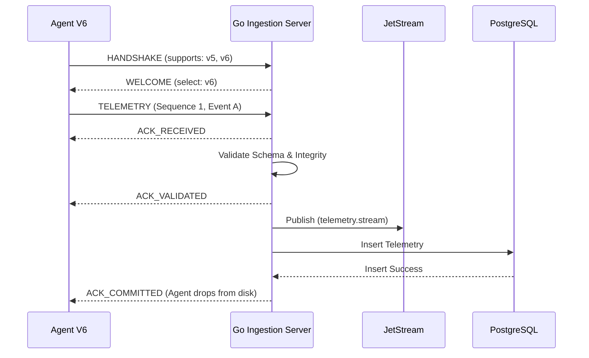

# V6 PROTOCOL RFC (Request for Comments)
**Version:** 6.1.0-DRAFT
**Status:** PROPOSED (Pre-Implementation)
**Target Layer:** Ingress & Ingestion Layer
**Integration Target:** LF-1 to LF-5 Continuous Learning Foundation

## 1. PHILOSOPHY & OBJECTIVE
Melengkapi Draf Kontrak sebelumnya, RFC ini menetapkan standar arsitektur transmisi data yang mendukung *Observability* berlapis, penelusuran asimtotik data (Lineage), serta jaminan mutlak integritas telemetri agar memenuhi standar Enterprise AIOps (Prediction Pack Ready). Protokol bukan lagi sekadar format JSON, melainkan **Mesin Status (State Machine)** yang ketat.

## 2. STATE MACHINE (LIFECYCLE KONEKSI AGENT)
Siklus hidup koneksi Agen ke Ingestion Server V6:
`HANDSHAKE` ➔ `AUTH` ➔ `STREAM` ➔ `ACK_WAIT` ➔ `COMMITTED` ➔ `RETRY/CLOSE`

*   **HANDSHAKE**: Negosiasi versi (V5/V6/V7) dan *capability* (eBPF, Dry Run).
*   **AUTH**: Validasi *Security Signature* (HMAC/SHA256).
*   **STREAM**: Pengiriman payload telemetri/insiden berprioritas.
*   **ACK_WAIT**: Agen menahan antrean log di disk (Retry Queue) hingga menerima konfirmasi.
*   **COMMITTED**: Server membalas `ACK_COMMITTED` (menandakan data masuk ke database persisten, bukan hanya RAM). Agen menghapus log dari *Retry Queue*.

## 3. ENVELOPE SEPARATION (5 LAYER ISOLASI)
Payload V6 diwajibkan memisahkan *concern* ke dalam blok independen agar parser (OpenTelemetry, NATS, PostgreSQL) tidak mencampur aduk data.

```json
{
  "header": {
    "protocol_version": "v6.1",
    "schema_registry": {
      "schema_id": "sch-telemetry-v1.1",
      "schema_hash": "sha256-abc...",
      "registry_url": "https://registry.noc.ai/schemas/telemetry"
    },
    "message_type": "TELEMETRY",
    "message_id": "uuid-v4-msg-001",
    "idempotency_key": "idemp-event-001-xyz"
  },
  "routing": {
    "tenant_id": "tenant-01",
    "device_id": "host-xyz",
    "site_id": "site-jkt-01",
    "cluster_id": "core-cluster",
    "classification": "CONFIDENTIAL"
  },
  "trace": {
    "traceparent": "00-4bf92f3577b34da6a3ce929d0e0e4736-00f067aa0ba902b7-01",
    "tracestate": "rojo=00f067aa0ba902b7,congo=t61rcWkgMzE",
    "correlation_id": "incident-12345",
    "event_id": "event-999-unique"
  },
  "security": {
    "signature": "hmac-sha256-hash",
    "key_id": "key-rotation-v2",
    "nonce": "random-salt"
  },
  "time": {
    "event_timestamp": "2026-07-22T14:30:00Z",
    "receive_timestamp": "2026-07-22T14:30:05Z",
    "timezone": "Asia/Jakarta",
    "clock_offset_ms": 15,
    "sequence_number": 42,
    "boot_session_id": "boot-20260722-001"
  },
  "payload": { ... }
}
```

## 4. MULTI-STAGE FEATURE HASHES & QUALITY BLOCK
Digunakan mutlak oleh **Feature Store (LF-2)**.

```json
"data_metadata": {
  "feature_engine_version": "v1.4",
  "extractor_version": "v2.0",
  "model_version": "v3.1",
  "hashes": {
    "raw_checksum": "hash1",
    "normalized_checksum": "hash2",
    "feature_checksum": "hash3"
  },
  "quality": {
    "completeness": 100,
    "freshness": 97,
    "integrity": 100,
    "confidence": 0.94
  },
  "sampling": {
    "sample_interval_ms": 1000
  }
}
```

## 5. CAPABILITY & FEATURE FLAGS NEGOTIATION
Sistem toleransi mundur (*Backward Compatibility*) dipadukan dengan kendali fitur modular (*Feature Flags*).
*   **Agent (HELLO)**: `"supports_protocol": ["v5", "v6"]`
*   **Server (WELCOME)**: 
```json
{
  "select_protocol": "v6",
  "feature_flags": {
    "learning.enabled": true,
    "prediction.enabled": false,
    "temporal.enabled": true
  }
}
```

## 6. COMMAND LIFECYCLE (APPROVAL STATE)
Command tidak lagi buta eksekusi. Harus melewati tata kelola (Governance).
`GENERATED` ➔ `VALIDATED` (Oleh AI Critic) ➔ `APPROVED` (Oleh HITL) ➔ `EXECUTED` ➔ `VERIFIED` ➔ `CLOSED`.

## 7. FEEDBACK & RESOURCE SNAPSHOT (LF-3 REMEDIATION LEARNING)
Umpan balik yang memverifikasi realitas pasca-tindakan.

```json
"feedback_payload": {
  "verification": {
    "service_before": "DOWN",
    "service_after": "RUNNING",
    "cpu_before": 98.5,
    "cpu_after": 18.2
  },
  "resource_snapshot": {
    "before": { "cpu": 98.5, "ram": 80, "disk": 40, "latency": 250 },
    "after": { "cpu": 18.2, "ram": 45, "disk": 40, "latency": 15 }
  }
}
```

## 8. PRIORITY-BASED RETRY QUEUE
Bukan FIFO. Pengiriman *buffer* paska-putus jaringan berdasar urutan:
1. `CRITICAL_INCIDENT`
2. `SECURITY_ALERT`
3. `INCIDENT_REPORT`
4. `TELEMETRY_LOG`
5. `METRICS_DUMP`

## 9. COMPRESSION METADATA & ACK PROTOCOL
```json
"compression": {
  "algorithm": "zstd",
  "original_size_bytes": 10240,
  "compressed_size_bytes": 2048
}
```
**ACK Protocol**:
`ACK_RECEIVED` (Tiba di TCP) ➔ `ACK_VALIDATED` (Lolos Pydantic Schema) ➔ `ACK_COMMITTED` (Masuk ke Postgres/NATS). Agen hanya menghapus disk *buffer* jika sudah `ACK_COMMITTED`.

## 10. ERROR CODE REGISTRY
*   `AUTH_FAILED` (401)
*   `SCHEMA_INVALID` (400)
*   `FEATURE_REJECTED` (406 - Quality Score terlalu rendah)
*   `TIME_SYNC_REQUIRED` (409 - Clock Drift melebihi ambang)
*   `PROTOCOL_MISMATCH` (426 - Downgrade ke V5 via Adapter)

## 11. DEPLOYMENT COMPATIBILITY (V5 ADAPTER)
Go Ingestion Server akan menjalankan **Protocol Adapter** secara pararel:
*   `Port 18800`: Mendengarkan skema JSON V5 lama. Server secara internal memutar (meng-*wrap*) V5 menjadi V6 sebelum diserahkan ke NATS.
*   `Port 18806`: Port khusus native V6 berkinerja tinggi (Zero-Copy).

## 12. SEQUENCE DIAGRAM

