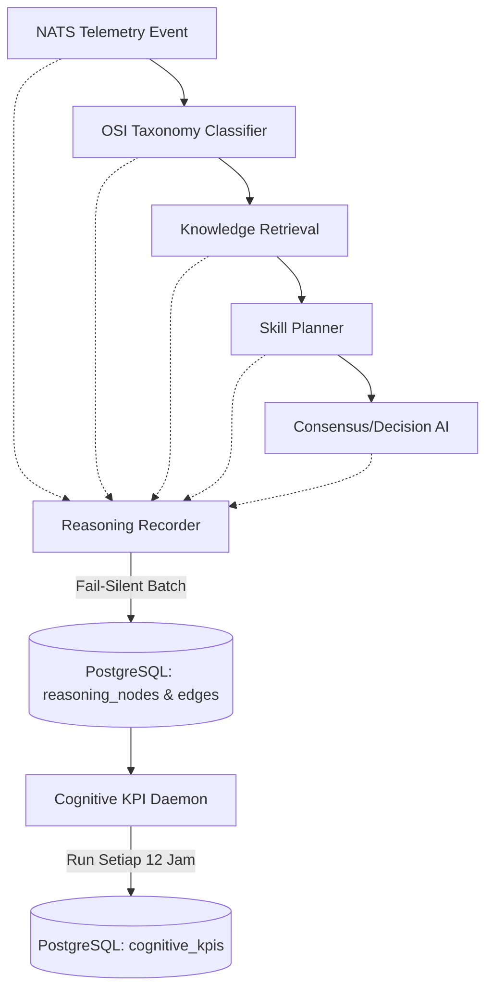

# Enterprise AI OS: Cognitive Validation Sprint (Phase 6.5)

## 1. Executive Summary
Sebelum berekspansi ke **Framework 7 (Cognitive Memory Graph)**, sistem AI perlu diuji stabilitas logikanya dan kemampuannya menyelesaikan masalah tanpa intervensi. **Validation Sprint** memvalidasi bahwa setiap modul (OSI Taxonomy, Knowledge Fabric, Skill Graph, Troubleshooting Planner, dan Decision Engine) berjalan secara harmonis dalam lingkungan operasional harian (*production-ready*).

Semua analisis *black-box* AI telah dikonversi menjadi *white-box* menggunakan **Evidence Reasoning Graph (ERG)**, dan kini dipantau terus-menerus oleh **Cognitive KPI Engine**.

---

## 2. Status Operasional: LIVE 🟢
Saat ini semua sistem **berjalan aktif di lingkungan live (real-time)**:
1. `osi-python-ai-core`: Engine otonom AI memantau *telemetry* secara asinkron dari berbagai agen Windows. Jika ada anomali, sistem akan membangkitkan grafik observasi otomatis ke tabel `reasoning_nodes` dan `reasoning_edges`.
2. `osi-ai-daemons`: Background service beroperasi mengeksekusi `cognitive_kpi_engine.py` setiap 12 jam, mengekstrak metrik kesehatan otak AI.

**Zero Logic Change:** 
Penyisipan *framework* observasi ini menggunakan pola arsitektur *Fail-Silent Event Sourcing*, yang berarti *reasoning graph* dan perhitungan *Cognitive KPI* **TIDAK AKAN** menghalangi atau memperlambat resolusi insiden. 

---
## 3. Enterprise AI Health Dashboard (8 Domains KPI)

Alih-alih sekadar tabel metrik sederhana, sistem berkembang menjadi **Enterprise AI Health Dashboard** dengan 8 domain evaluasi kritis yang hanya merekam data secara pasif:

### 3.1. Runtime KPI (Ketersediaan Otak AI)
- Worker Availability, Checkpoint Restore Success, Queue Backlog, Postgres/NATS/Redis Latency, LLM Timeout Rate.
- *Fokus:* Memastikan sistem *fail-safe* dan infrastruktur AI 99.9% tersedia.

### 3.2. Knowledge KPI (Manajemen Otak Jangka Pendek)
- Knowledge Recall, Precision, Freshness, Duplication, Conflict, Drift, Unused Knowledge.
- *Fokus:* Mengukur apakah AI dapat mengingat (*recall*) data yang ditarik, dan memastikan tidak ada *knowledge* yang kedaluwarsa atau saling tumpang tindih.

### 3.3. Reasoning KPI (Kedalaman Pemikiran AI)
- Average Nodes, Edges, Hypothesis, Evidence Precision, Reasoning Depth/Width, Dead-end Count, Backtracking Count.
- *Fokus:* Mengukur seberapa efisien AI berpikir (e.g., meminimalkan cabang pemikiran yang sia-sia).

### 3.4. Decision KPI (Kualitas Eksekusi)
- Decision Accuracy, Confidence vs Calibration (Apakah AI *overconfident*?), Decision Latency, Rollback Rate, Escalation Rate, False Escalation/Automation.
- *Fokus:* Akurasi pengambilan keputusan tanpa ilusi/halusinasi.

### 3.5. Skill & Tool KPI (Efektivitas Operasional)
- Skill Popularity, Latency, Rollback/Failure/Retry Rate, Promotion Speed, Tool Timeout Rate (e.g., SNMP Timeout).
- *Fokus:* Membedah kemampuan AI menggunakan modul spesifik secara andal.

### 3.6. World Model KPI (Akurasi Konteks)
- Topology Coverage, Dependency Accuracy, Blast Radius Accuracy, Unknown Vendor/Layer, Topology Freshness.
- *Fokus:* Mencegah salah diagnosis akibat data topologi (CMDB) yang usang.

### 3.7. Learning KPI (Kecepatan Adaptasi)
- Learning Queue, Accepted/Rejected, Simulation Success, Knowledge/Memory Promotion Time.
- *Fokus:* Memastikan rantai umpan balik belajar *closed-loop* berjalan cepat tanpa hambatan.

---

## 4. Mekanisme Kerja Internal (Data Pipeline)

### Penjelasan Flow:
1. Setiap tahap pengambilan keputusan di `ai_supervisor.py` (mulai dari klasifikasi layer OSI hingga penyusunan *troubleshooting plan*) dipantau pasif oleh `ReasoningRecorder`.
2. Hasil pantauan tidak langsung ditulis, tetapi disimpan sementara di dalam memori untuk menjaga latensi AI tetap < 50ms.
3. Di akhir *pipeline*, barulah data ditulis (di-*flush*) secara *batch* ke database `reasoning_nodes`.
4. Setiap 12 jam, kontainer `osi-ai-daemons` membaca database ini, mengalkulasi performa dan metrik kognitif sistem, dan menyimpan raport hariannya di tabel `cognitive_kpis`.

---

## 5. Roadmap Strategi Eksekusi (4 Tahapan Kematangan)

Mekanisme pengendalian (*Quality Gate*) tidak diaktifkan seketika. Untuk menjamin stabilitas *enterprise*, implementasi mengikuti strategi 4 tahap berikut:

### Tahap 1 — Observability (Active Sekarang) ✅
Implementasi modul pengumpulan data secara *fail-silent*. Sistem mengaktifkan seluruh alat ukur (Runtime, Knowledge, Reasoning, Skill, Decision, Tool, World Model, dan Learning KPI).
**Aturan:** Seluruh metrik hanya bertugas mengukur dan mencatat; tidak diperkenankan mengubah atau menghentikan keputusan AI.

### Tahap 2 — Validation Sprint (2-4 Minggu) ⏳
Sistem dibiarkan berjalan normal tanpa *framework* baru. Fokus utama adalah mengumpulkan data produksi harian untuk membentuk **Baseline Normal Sistem**, meliputi:
- Baseline latency, reasoning depth, rollback rate, HITL rate, knowledge usage, skill success, dan tool reliability.

### Tahap 3 — Baseline Analysis & Thresholding ⏳
Setelah terkumpul *pool of data* yang cukup (ribuan *reasoning paths*):
- Penetapan *threshold* objektif berdasarkan data operasional nyata (bukan asumsi statis).
- Mengintegrasikan **Drift Detection** (mendeteksi deviasi tren normal).
- Menambahkan **Correlation Analysis** (misal: "Penurunan *knowledge freshness* ternyata berkorelasi dengan kenaikan *rollback rate*").

### Tahap 4 — Automated Validation Gate ⏳
*Gate* otomatis diaktifkan setelah *threshold* divalidasi.
Bila terjadi deviasi drastis dari baseline (misal: *Decision Accuracy* anjlok atau *Rollback* menembus 2% di atas normal), sistem akan **menahan otomatis** (LOCKED) promosi *knowledge* dan pembukaan Framework 7. 

Hanya ketika operasional tervalidasi matang dan konsisten di tahap 4, **Framework 7 (Cognitive Memory Graph)** baru diizinkan beroperasi, menjamin bahwa pembelajaran masa lalu AI hanya diwariskan dari pemikiran yang benar-benar stabil.
