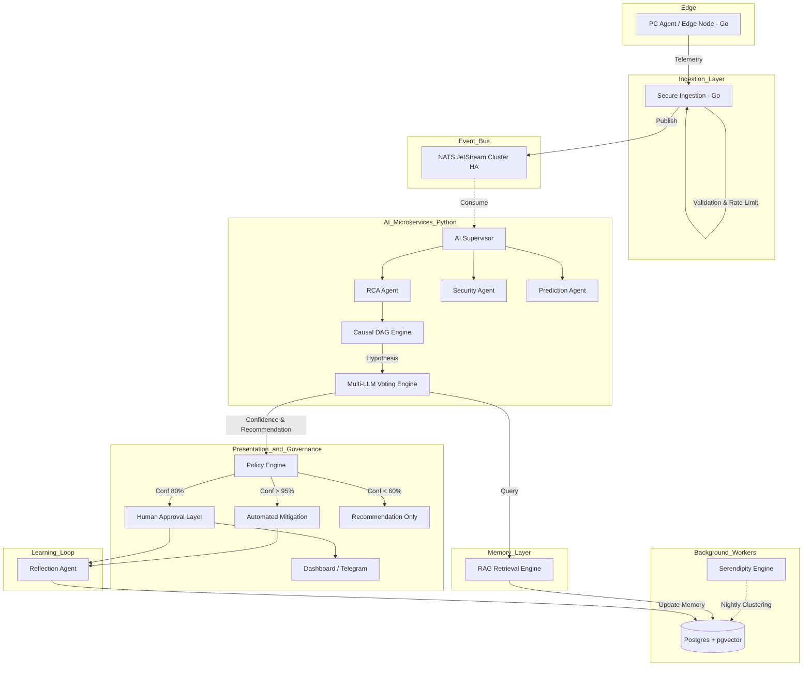

# Master Blueprint: SOTA AIOps Enterprise Architecture (v5.0)

Dokumen ini adalah cetak biru pamungkas hasil konsolidasi antara **Arsitektur Hibrida (Golang + Python)** dengan **10 Layer Kognitif Enterprise SOTA (State-of-the-Art)**. 

Cetak biru ini memastikan skalabilitas ekstrem, ketersediaan tinggi (*High Availability*), dan kecerdasan kognitif otonom pada level 5 (Predictive & Autonomic).

## 1. Arsitektur Inti (The Backbone)

- **Edge & Ingestion (Golang)**: Menjadi ujung tombak yang sangat cepat, *non-blocking*, dan menggunakan *goroutine* dengan *memory footprint* kecil.
- **Message Bus (NATS JetStream)**: Bertindak sebagai tulang punggung *asynchronous* yang memisahkan layanan secara bersih. Jika AI mati, *ingestion* tetap hidup.
- **AI Cognitive Engine (Python)**: Difokuskan murni untuk *Reasoning*, RAG, Causal DAG, dan *Machine Learning*.
- **Storage & Memory (PostgreSQL + pgvector / ClickHouse)**: Basis data transaksional dan memori semantik untuk agen AI.

## 2. Peta Alur Arsitektur Skala Enterprise

## 3. Eksekusi 10 Layer Kognitif AIOps

1. **Layer 1: Event Sourcing**: Seluruh telemetri mengalir melalui NATS ke *Event Store* sebelum di-*persist* ke Postgres oleh *Worker*. Data dijamin tidak pernah hilang (Zero Data Loss).
2. **Layer 2: AI Orchestrator**: AI dipecah menjadi layanan spesialis (*Microservices*): *Supervisor*, *RCA*, *Security*, *Prediction*, *Mitigation*, dan *Reflection Agent*.
3. **Layer 3: AI Vector Memory**: Ekspansi *knowledge_vectors* menjadi *Incident Memory*, *Reflection Memory*, *Solution Memory*, *Failure Memory*, dan *Operator Memory*.
4. **Layer 4: Advanced Confidence Engine**: Skor dihitung berdasarkan kalkulasi matematis: `LLM + RAG + History + Fleet Similarity + Feedback + Graph Weight`.
5. **Layer 5: AI Reflection Loop**: Evaluasi pasca-mitigasi wajib. Sukses = Promosi ke *Golden Solution*. Gagal = Penalti *Confidence* dan penciptaan *Reflection Log*.
6. **Layer 6: Multi-LLM Voting**: Redundansi kognitif menggunakan orkestrasi `Gemini -> OpenAI -> Claude -> Local Llama` untuk menghindari *downtime* inferensi.
7. **Layer 7: AI Workflow Pipeline**: Aliran terstruktur dari *Normalizer* -> *Threat/Incident Detector* -> *Priority Scoring* -> *RCA* -> *Mitigation* -> *Approval* -> *Reflection*.
8. **Layer 8: AI Digital Twin**: Visibilitas topologis (Virtual Enterprise Model). AI mengetahui rantai ketergantungan fisik: *Router -> Switch -> PC -> Server*.
9. **Layer 9: Predictive AI (Level 5 AIOps)**: Ekstrapolasi tren memori, CPU, dan IOPS untuk memprediksi *Out of Memory* (OOM) atau kegagalan perangkat keras *sebelum* terjadi.
10. **Layer 10: Policy Engine**: Eksekusi otonom berdasarkan *Threshold Confidence* mutlak (Autonomic Mitigation, Human-in-the-Loop, atau Advisory).

## 4. Mitigasi Risiko Kritis

Sistem harus mengatasi *bottleneck* level produksi dengan strategi berikut:
1. **HA NATS Cluster**: NATS harus berjalan minimal dalam klaster 3-node untuk menjamin ketersediaan *message broker*.
2. **PostgreSQL Failover & Analytics**: Menggunakan **Patroni** untuk replikasi *streaming* Postgres. Query analitik telemetri raksasa kelak akan dialihkan ke **ClickHouse**.
3. **Event Idempotency**: Penyertaan `event_id` unik pada setiap *message* untuk mencegah eksekusi ganda jika terjadi *redelivery* oleh NATS.
4. **Event Schema Versioning**: Penerapan kontrak skema (`schema_version`) untuk memastikan pembaruan kode agen Golang tidak memutus kompatibilitas *consumer* Python.
5. **End-to-End Observability**: Integrasi **OpenTelemetry** agar setiap perjalanan paket (dari agen kasir hingga respon AI) dapat dilacak jejak distribusinya (*Distributed Tracing*).
