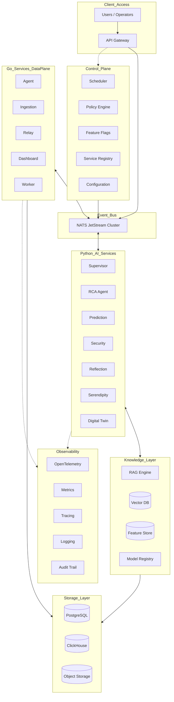

# Master Blueprint: SOTA AIOps Enterprise Architecture (v6.0)

Berdasarkan evaluasi mendalam terhadap skala *Enterprise*, arsitektur ini telah dievolusi ke **Versi 6.0**. Versi ini memperkenalkan pemisahan tegas antara *Control Plane*, *Data Plane*, dan *Knowledge Layer*, serta melengkapi *blind spots* pada orkestrasi AI tingkat lanjut.

## 1. Arsitektur Tumpukan Enterprise (Enterprise Stack v6)

## 2. Enam Komponen Pilar Baru (v6 Additions)

### A. Scheduler (Cron & Background Jobs)
Sistem tidak lagi bergantung hanya pada interaksi *real-time*. *Scheduler* tersentralisasi akan mengatur siklus hidup data dan model:
- **Daily**: *Cleanup* telemetri basi, *Backup* Postgres/ClickHouse.
- **Weekly**: *Reindex* Vector DB, *Embedding regeneration* untuk RAG.
- **Monthly**: *Retraining* model prediktif lokal dan audit kepatuhan (*Reflection* massal).

### B. Feature Store (Prediksi Real-Time Tanpa Overhead)
Menghilangkan *bottleneck* komputasi fitur berulang pada model AI.
- **Flow**: `Telemetry -> Feature Engineering (Worker) -> Feature Store -> Prediction AI`.
- Model AI Prediktif (seperti OOM Predictor) tinggal membaca *pre-computed features* (seperti rata-rata CPU 15 menit terakhir) secara instan dari *Feature Store* (contoh: Redis).

### C. Model Registry (Multi-LLM Management)
Mendukung ekosistem model jamak (Gemini, DeepSeek, Grok, Llama).
- **Flow**: `Model Registry -> Versioning -> Accuracy Scoring -> Latency Tracking -> Rollback`.
- Memastikan pergantian model dilakukan secara terukur (A/B Testing LLM). Jika satu LLM mengalami degradasi latensi atau halusinasi (*Accuracy drop*), sistem otomatis memutar ulang (*fallback*) ke versi stabil.

### D. Workflow Engine (Branching Terdistribusi)
Menggantikan *pipeline* RCA yang linear menjadi *Directed Acyclic Graph* (DAG) alur kerja kondisional.
- **Contoh**: Jika insiden terklasifikasi **CRITICAL**, *Workflow Engine* akan mencabangkan aliran (1) Notifikasi instan ke SOC (*Security Operations Center*), dan (2) Isolasi *Security Agent*. Jika insiden **NORMAL**, alur dilanjutkan ke *Normal RCA*.

### E. AI Audit Trail (Transparansi Kognitif Total)
Setiap "pemikiran" AI direkam sebagai jejak audit permanen (*Immutable Log*), mencegah perilaku sistem yang seperti "Kotak Hitam" (*Black Box*).
- **Jejak Audit**: `Incident -> Reasoning DAG -> RAG Vectors Retrieved -> Raw Prompt -> LLM Response -> Confidence Score -> Action Executed -> Operator Feedback`.
- Sangat esensial untuk ISO 27001 dan analisis forensik pasca-insiden.

### F. Governance Layer (Standar Enterprise B2B)
Membedakan sistem kelas *Enterprise* dari produk internal biasa dengan memastikan kepatuhan tata kelola.
- **Komponen**: `RBAC (Role-Based Access Control) -> Approval Tiers -> Compliance -> Audit -> Retention Policy -> Automation Policy`.
- **Contoh Praktis**: Keputusan AI dengan risiko *Downtime* harus di-*approve* oleh *Role: L3 Network Engineer*, sementara restart layanan printer dapat dilakukan otomatis atau oleh *Role: L1 Helpdesk*.

---
> [!NOTE]
> Arsitektur v6.0 ini merupakan cetak biru konseptual (*North Star Architecture*) yang siap diimplementasikan secara iteratif. Pemisahan *Control Plane* dan *Data Plane* adalah fondasi utama yang memungkinkan skalabilitas ini.
