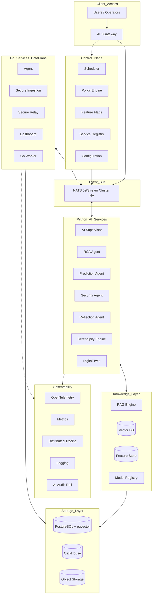

# Master Blueprint: SOTA AIOps Enterprise Architecture (v6.0 Final)

Dokumen ini adalah cetak biru pamungkas hasil konsolidasi utuh dari **Arsitektur Hibrida (Golang + Python)** dengan **10 Layer Kognitif Enterprise SOTA (v5)** dan **6 Pilar Orkestrasi Enterprise Baru (v6)**. 

Cetak biru ini memastikan skalabilitas ekstrem, tata kelola korporat yang ketat, serta kecerdasan kognitif otonom pada level 6.

## 1. Arsitektur Tumpukan Enterprise (Enterprise Stack v6)

Pemisahan tegas antara *Control Plane*, *Data Plane*, dan *Knowledge Layer*.

## 2. Eksekusi 10 Layer Kognitif AIOps (Fondasi v5)

1. **Layer 1: Event Sourcing**: Seluruh telemetri mengalir melalui NATS ke *Event Store* sebelum di-*persist* ke Postgres oleh *Worker*. Data dijamin tidak pernah hilang (Zero Data Loss).
2. **Layer 2: AI Orchestrator**: AI dipecah menjadi layanan spesialis (*Microservices*): *Supervisor*, *RCA*, *Security*, *Prediction*, *Mitigation*, dan *Reflection Agent*.
3. **Layer 3: AI Vector Memory**: Ekspansi `knowledge_vectors` menjadi *Incident Memory*, *Reflection Memory*, *Solution Memory*, *Failure Memory*, dan *Operator Memory*.
4. **Layer 4: Advanced Confidence Engine**: Skor dihitung berdasarkan kalkulasi matematis: `LLM + RAG + History + Fleet Similarity + Feedback + Graph Weight`.
5. **Layer 5: AI Reflection Loop**: Evaluasi pasca-mitigasi wajib. Sukses = Promosi ke *Golden Solution*. Gagal = Penalti *Confidence* dan penciptaan *Reflection Log*.
6. **Layer 6: Multi-LLM Voting**: Redundansi kognitif menggunakan orkestrasi `Gemini -> OpenAI -> Claude -> Local Llama` untuk menghindari *downtime* inferensi.
7. **Layer 7: AI Workflow Pipeline**: Aliran terstruktur dari *Normalizer* -> *Threat/Incident Detector* -> *Priority Scoring* -> *RCA* -> *Mitigation* -> *Approval* -> *Reflection*.
8. **Layer 8: AI Digital Twin**: Visibilitas topologis (Virtual Enterprise Model). AI mengetahui rantai ketergantungan fisik: *Router -> Switch -> PC -> Server*.
9. **Layer 9: Predictive AI (Level 5 AIOps)**: Ekstrapolasi tren memori, CPU, dan IOPS untuk memprediksi *Out of Memory* (OOM) atau kegagalan perangkat keras *sebelum* terjadi.
10. **Layer 10: Policy Engine**: Eksekusi otonom berdasarkan *Threshold Confidence* mutlak (Autonomic Mitigation, Human-in-the-Loop, atau Advisory).

## 3. Enam Komponen Pilar Tingkat Lanjut (Evolusi v6)

### A. Scheduler (Cron & Background Jobs)
Sistem tidak lagi bergantung hanya pada interaksi *real-time*. *Scheduler* tersentralisasi akan mengatur siklus hidup data dan model:
- **Daily**: *Cleanup* telemetri basi, *Backup* Postgres/ClickHouse.
- **Weekly**: *Reindex* Vector DB, *Embedding regeneration* untuk RAG.
- **Monthly**: *Retraining* model prediktif lokal dan audit kepatuhan (*Reflection* massal).

### B. Feature Store (Prediksi Real-Time Tanpa Overhead)
Menghilangkan *bottleneck* komputasi fitur berulang pada model AI.
- **Flow**: `Telemetry -> Feature Engineering (Worker) -> Feature Store -> Prediction AI`.
- Model AI Prediktif (seperti OOM Predictor) tinggal membaca *pre-computed features* (seperti rata-rata CPU 15 menit terakhir) secara instan dari *Feature Store* (contoh: Redis).

### C. Model Registry (Multi-LLM Management)
Mendukung ekosistem model jamak (Gemini, DeepSeek, Grok, Llama).
- **Flow**: `Model Registry -> Versioning -> Accuracy Scoring -> Latency Tracking -> Rollback`.
- Memastikan pergantian model dilakukan secara terukur (A/B Testing LLM). Jika satu LLM mengalami degradasi latensi atau halusinasi (*Accuracy drop*), sistem otomatis memutar ulang (*fallback*) ke versi stabil.

### D. Workflow Engine (Branching Terdistribusi)
Menggantikan *pipeline* RCA yang linear menjadi *Directed Acyclic Graph* (DAG) alur kerja kondisional.
- **Contoh**: Jika insiden terklasifikasi **CRITICAL**, *Workflow Engine* akan mencabangkan aliran (1) Notifikasi instan ke SOC (*Security Operations Center*), dan (2) Isolasi *Security Agent*. Jika insiden **NORMAL**, alur dilanjutkan ke *Normal RCA*.

### E. AI Audit Trail (Transparansi Kognitif Total)
Setiap "pemikiran" AI direkam sebagai jejak audit permanen (*Immutable Log*), mencegah perilaku sistem yang seperti "Kotak Hitam" (*Black Box*).
- **Jejak Audit**: `Incident -> Reasoning DAG -> RAG Vectors Retrieved -> Raw Prompt -> LLM Response -> Confidence Score -> Action Executed -> Operator Feedback`.
- Sangat esensial untuk ISO 27001 dan analisis forensik pasca-insiden.

### F. Governance Layer (Standar Enterprise B2B)
Membedakan sistem kelas *Enterprise* dari produk internal biasa dengan memastikan kepatuhan tata kelola.
- **Komponen**: `RBAC (Role-Based Access Control) -> Approval Tiers -> Compliance -> Audit -> Retention Policy -> Automation Policy`.
- **Contoh Praktis**: Keputusan AI dengan risiko *Downtime* harus di-*approve* oleh *Role: L3 Network Engineer*, sementara restart layanan printer dapat dilakukan otomatis atau oleh *Role: L1 Helpdesk*.

## 4. Mitigasi Risiko Kritis Produksi

Sistem harus mengatasi *bottleneck* level produksi dengan strategi berikut:
1. **HA NATS Cluster**: NATS harus berjalan minimal dalam klaster 3-node untuk menjamin ketersediaan *message broker*.
2. **PostgreSQL Failover & Analytics**: Menggunakan **Patroni** untuk replikasi *streaming* Postgres. Query analitik telemetri raksasa kelak akan dialihkan ke **ClickHouse**.
3. **Event Idempotency**: Penyertaan `event_id` unik pada setiap *message* untuk mencegah eksekusi ganda jika terjadi *redelivery* oleh NATS.
4. **Event Schema Versioning**: Penerapan kontrak skema (`schema_version`) untuk memastikan pembaruan kode agen Golang tidak memutus kompatibilitas *consumer* Python.
5. **End-to-End Observability**: Integrasi **OpenTelemetry** agar setiap perjalanan paket (dari agen kasir hingga respon AI) dapat dilacak jejak distribusinya (*Distributed Tracing*).
