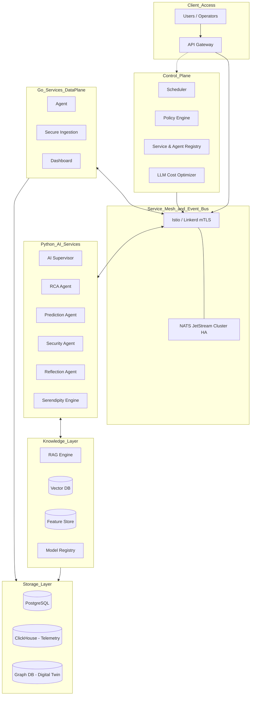
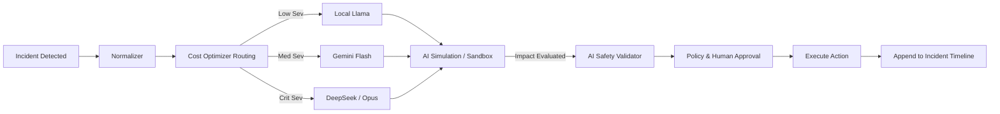

# Master Blueprint: SOTA AIOps Enterprise Architecture (v7.0 Ultimate)

Dokumen ini adalah cetak biru pamungkas (Ultimate Vision) hasil konsolidasi dari **Arsitektur Hibrida (Golang + Python)** dengan **10 Layer Kognitif Enterprise SOTA (v5)**, **6 Pilar Orkestrasi Enterprise (v6)**, dan **8 Komponen Ultra-Large Scale (v7)**. 

Sistem ini dirancang untuk beroperasi pada skala perusahaan raksasa, mengutamakan keamanan tingkat militer (*AI Safety*), efisiensi biaya (*Cost Optimizer*), dan ketersediaan ekstrem (*Service Mesh*).

## 1. Arsitektur Tumpukan Ultra-Enterprise (v7 Stack)

Pemisahan tegas antara *Control Plane*, *Data Plane*, dan *Knowledge Layer*, dibungkus oleh **Service Mesh** untuk ketahanan jaringan.

## 2. Peta Aliran Keputusan Ultra-Aman (v7 Safety & Execution Flow)

## 3. Eksekusi 10 Layer Kognitif AIOps (Fondasi v5)

1. **Layer 1: Event Sourcing**: Seluruh telemetri mengalir melalui NATS ke *Event Store* (Zero Data Loss).
2. **Layer 2: AI Orchestrator**: AI dipecah menjadi layanan spesialis (*Microservices*).
3. **Layer 3: AI Vector Memory**: Ekspansi ke *Incident, Reflection, Solution, Failure*, dan *Operator Memory*.
4. **Layer 4: Advanced Confidence Engine**: Skor: `LLM + RAG + History + Fleet + Feedback + Graph Weight`.
5. **Layer 5: AI Reflection Loop**: Sukses = *Golden Solution*, Gagal = Penalti & *Reflection Log*.
6. **Layer 6: Multi-LLM Voting**: Redundansi kognitif untuk menghindari *downtime* inferensi.
7. **Layer 7: AI Workflow Pipeline**: Aliran DAG RCA terstruktur, bukan sekadar *prompt-response* linear.
8. **Layer 8: AI Digital Twin**: Visibilitas topologis (Virtual Enterprise Model).
9. **Layer 9: Predictive AI**: Ekstrapolasi tren kegagalan secara proaktif sebelum sistem lumpuh.
10. **Layer 10: Policy Engine**: Eksekusi otonom berdasarkan *Threshold Confidence* mutlak.

## 4. Orkestrasi Enterprise B2B (Evolusi v6)

1. **Scheduler (Cron)**: Orkestrasi siklus hidup data (*Retraining, Cleanup, Reindex, Backup*).
2. **Feature Store**: Prediksi AI seketika membaca komputasi fitur statis (ex: Rata-rata CPU) tanpa menghitung ulang.
3. **Model Registry**: Manajemen versi LLM yang menjamin pengujian A/B (*Accuracy, Latency, Rollback*).
4. **Workflow Engine**: Pencabangan RCA (Incident -> *Critical?* -> Security SOC Flow vs Normal Flow).
5. **AI Audit Trail**: Jejak langkah AI permanen dari Prompt hingga Tindakan.
6. **Governance Layer**: Standarisasi *RBAC, Approval, Compliance, Audit, dan Retention*.

## 5. Kapasitas Skala Ultra-Besar (The Ultimate v7 Additions)

### A. Service Mesh (Istio / Linkerd)
Jika jumlah *microservices* terus bertambah (RCA Agent, Prediction Agent, dll), NATS saja tidak cukup. Service Mesh ditambahkan untuk mengatur:
- **mTLS**: Enkripsi mutlak antar-layanan.
- **Resilience**: *Automatic Retry*, *Circuit Breaker*, dan *Intelligent Load Balancing*.

### B. AI Agent Registry
Melengkapi *Model Registry*, sistem kini mencatat spesialisasi agen secara dinamis:
- *RCA Agent, Security Agent, Prediction Agent*.
- Sistem dapat mendistribusikan insiden berdasarkan beban kerja agen dan versi kemampuan (*capability versioning*).

### C. Digital Twin Graph Database
Menggantikan tabel relasional Postgres untuk model topologi dengan **Graph Database** (seperti Neo4j atau ArangoDB).
- **Struktur Alami**: `Router -> Switch -> Firewall -> Server -> App -> Client`.
- Pencarian *blast radius* dan perambatan kegagalan divisualisasikan dalam hitungan milidetik secara *native*.

### D. Incident Timeline Forensics
Menambahkan tabel forensik temporal murni untuk membangun garis waktu absolut:
- `09:00 CPU 70% -> 09:03 CPU 90% -> 09:05 RAM Full -> 09:06 Auto-Restart -> 09:07 Recovery`.
- Memberikan konteks runtutan kejadian yang sempurna bagi LLM saat menganalisis RCA.

### E. AI Simulation & Sandbox
Mencegah AI melakukan kesalahan destruktif.
- Sebelum mengeksekusi mitigasi, AI menjalankan simulasi tertutup: `Mitigation -> Simulation -> Risk Score -> Execute`.
- Mengkalkulasi kemungkinan *downtime* sebelum benar-benar terjadi (*Pre-flight check*).

### F. Knowledge Lifecycle Management
Basis pengetahuan (*Knowledge Base*) bukan lagi entitas yang hanya bertambah, melainkan organisme yang hidup:
- **Alur**: `New -> Validated -> Golden -> Deprecated -> Archived`.
- Mencegah memori RAG terpolusi oleh solusi yang sudah tidak relevan (misal: solusi untuk versi perangkat lunak usang).

### G. LLM Cost Optimizer
Peredam biaya operasional AI melalui *smart routing*:
- **Low Severity**: Llama 3 Lokal (Gratis).
- **Medium Severity**: Gemini Flash (Murah & Cepat).
- **Critical Severity**: Gemini 1.5 Pro / GPT-4o / Claude 3.5 Sonnet (Akurasi Tinggi).
- Mencegah kebangkrutan operasional akibat *spam* peringatan minor.

### H. AI Safety Layer (The Ultimate Guardrail)
Lapisan validasi otoriter (di luar AI) yang bertugas menjadi hakim terakhir:
- `Recommendation -> Safety Validator -> Policy -> Approval -> Execute`.
- Mencegah insiden *Rogue AI* yang mencoba mengeksekusi perintah sistem terlarang (`rm -rf`, ubah kata sandi massal).

---
> [!IMPORTANT]
> Arsitektur v7.0 ini adalah level tertinggi (Holy Grail) dari Sistem Operasi AIOps modern. Membangunnya membutuhkan fase *engineering* bertahun-tahun, tetapi cetak biru ini memastikan kita tidak akan pernah salah arah.
