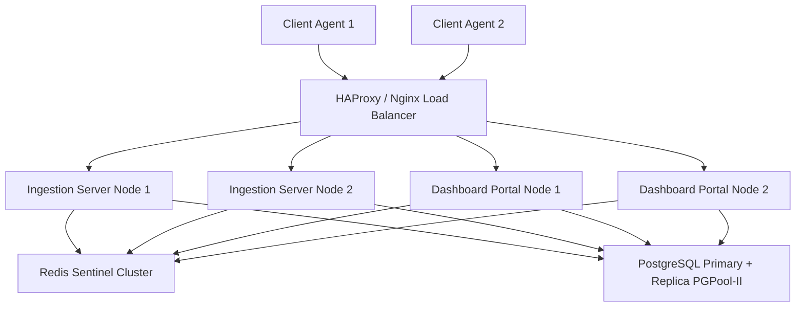

# High Availability (HA) Setup and Configuration Guide
This document details the production HA architecture for the migrated Go-based NOC Incident Analysis System.

## Architecture Topology



---

## 1. Load Balancer (Nginx / HAProxy)
To distribute ingress telemetry load and operator access, setup Nginx or HAProxy as a round-robin load balancer targeting multiple running Go server instances.

Refer to [nginx_ha.conf](file:///d:/AI-AGEN%20DRIVEN%20INTELLIGENT%20INCIDENT%20ANALIS/scripts/nginx_ha.conf) for Nginx configuration.

---

## 2. PostgreSQL Master-Slave Replication with pgpool-II

To achieve database redundancy and read-scaling:
1. **Primary Database Setup (`postgresql.conf`)**:
   ```ini
   listen_addresses = '*'
   wal_level = replica
   max_wal_senders = 10
   archive_mode = on
   archive_command = 'test ! -f /var/lib/postgresql/archive/%f && cp %p /var/lib/postgresql/archive/%f'
   ```
2. **Standby Database Setup**:
   Create a standby backup from the primary node:
   ```bash
   pg_basebackup -h <primary_ip> -D /var/lib/postgresql/data -U replicator -P -R -X stream
   ```
3. **pgpool-II Configuration**:
   Use `pgpool-II` to automatically direct write queries to the primary node and read queries (like historical telemetry lookups) to the standby nodes, while providing automatic failover if the primary fails.

---

## 3. Redis Sentinel Cluster
Redis Sentinel provides high availability for the telemetry pub/sub layer.

1. **Sentinel Setup (`sentinel.conf`)**:
   Deploy 3 sentinel instances on separate nodes:
   ```ini
   port 26379
   sentinel monitor mymaster <redis_primary_ip> 6379 2
   sentinel down-after-milliseconds mymaster 5000
   sentinel failover-timeout mymaster 60000
   sentinel parallel-syncs mymaster 1
   ```
2. **Go Driver Integration**:
   The Go Ingestion and Dashboard backends connect to Redis Sentinels, resolving the current master address dynamically:
   ```go
   rdb := redis.NewFailoverClient(&redis.FailoverOptions{
       MasterName:    "mymaster",
       SentinelAddrs: []string{"sentinel1:26379", "sentinel2:26379", "sentinel3:26379"},
   })
   ```

---

## 4. Multi-Instance Go Services Deployment
Deploy the dual core services as containerized daemon services behind load-balancers:
- **Ingestion Server (TCP 18800/18802/19999)**
- **Dashboard Server (HTTPS 9999)**

Ensure all service nodes run with dynamic environment configurations mapping to the active database cluster entry points.
