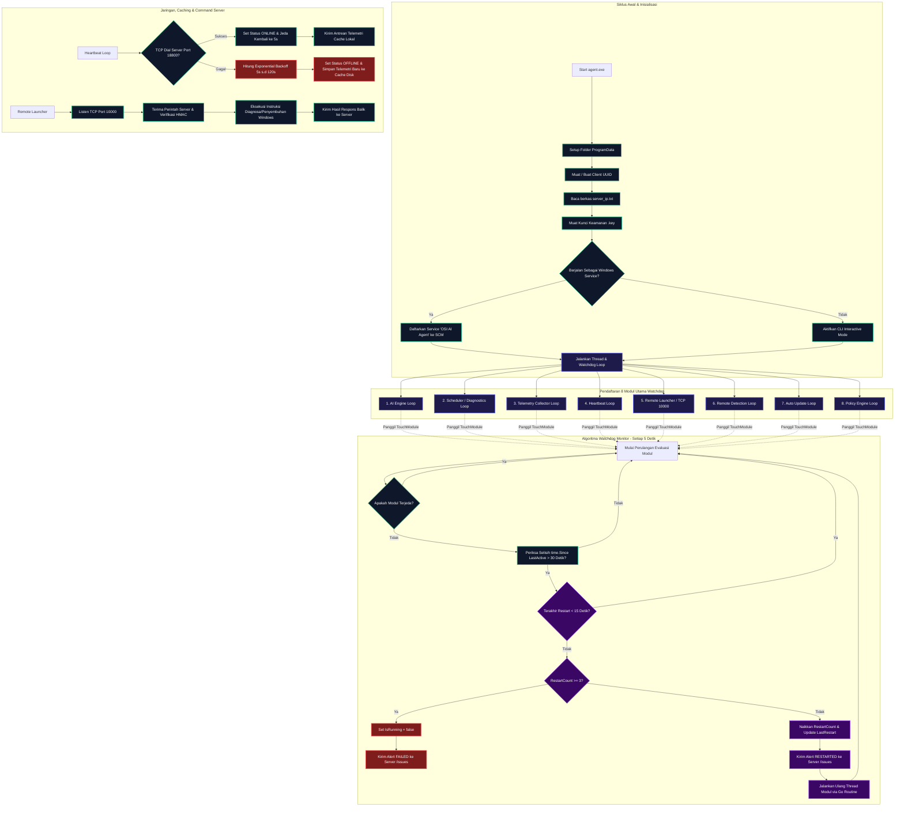
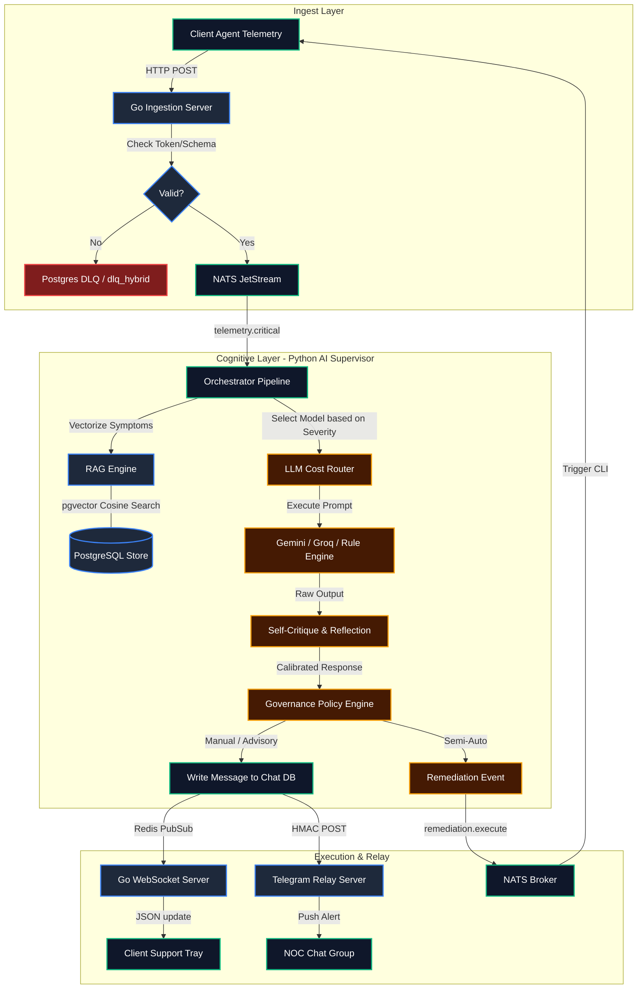
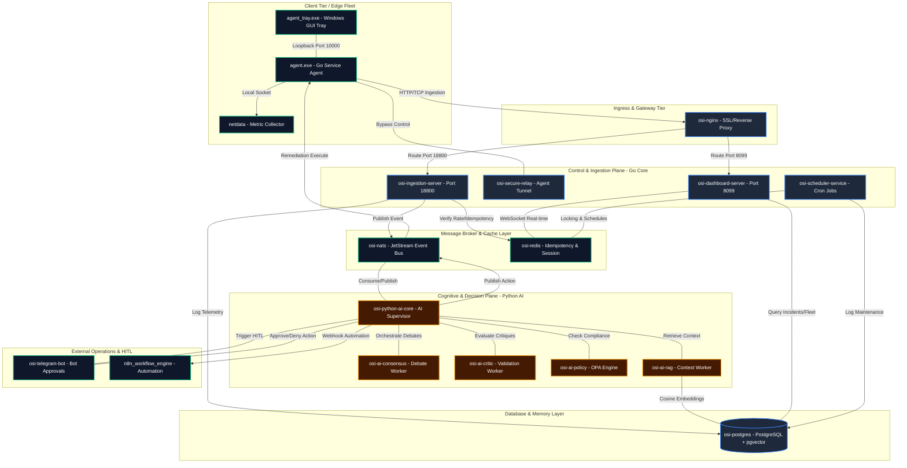

# UNIFIED SYSTEM ARCHITECTURE DEFINITION (SERVER + AGENT)

## 🎯 Definisi Inti & Tujuan
**Unified System Architecture Definition (USAD)** adalah spesifikasi arsitektur formal dan kontrak operasional yang mendefinisikan interaksi antara **Agent (PC Client)** dan **Server (Control Plane)**. Kontrak ini dirancang untuk memastikan pengumpulan telemetri, deteksi isu (incident detection), pemantauan aktivitas pengguna, serta pengeksekusian perintah remote berjalan secara **real-time**, **konsisten**, aman, dan **fault-tolerant** dalam lingkungan enterprise (NOC System).

Arsitektur ini didesain untuk mencegah kegagalan sistemik (seperti restart loop pada agent), mengoptimalkan beban server melalui pembatasan (load shedding), serta menjamin pemulihan mandiri (self-healing) pada sisi client tanpa mengorbankan stabilitas sistem operasi Windows tempat agent berjalan.

---

## 🖥️ 1. Arsitektur Core Server (Control Plane)
Server bertindak sebagai pusat penerima data (Ingestion), normalisasi, pemrosesan kecerdasan buatan (AI Reasoning), dan pengendali agent secara terpusat.

### A. Multiplexing Port 18800 (TCP & HTTP)
Server menggunakan mekanisme peeking byte pertama untuk mendeteksi jenis protokol koneksi pada Port 18800 secara real-time:
*   Jika koneksi diawali dengan prefix HTTP standard (`GET`, `POST`, `HEAD`, `PUT`, `DELE`, `OPTI`), koneksi dialihkan ke **HTTP Server Muxer** internal.
*   Jika koneksi diawali dengan payload JSON raw, koneksi diproses langsung sebagai **Raw TCP Connection Stream** untuk throughput tinggi.

Hal ini memungkinkan efisiensi resource port tunggal untuk melayani API internal dashboard (HTTP) sekaligus pengiriman telemetri bervolume tinggi (TCP).

### B. Pipeline Ingestion & Normalization Engine
1.  **Daftar Endpoint HTTP**:
    *   `/health`: Mengecek kesehatan server secara berkala.
    *   `/telemetry`: Endpoint telemetri terpusat untuk data performa dasar.
    *   `/activity`: Menerima log aktivitas aplikasi aktif di foreground client.
    *   `/browser-events`: Menerima log deteksi halaman web/URL browser (Chrome, Edge, Firefox).
    *   `/issues`: Menerima peringatan kegagalan/hang aplikasi, CPU/RAM spike, serta kegagalan sub-modul (Watchdog FAILED/RESTARTED).
    *   `/api/agent_version`: Menyediakan hash checksum `agent.exe` terbaru untuk autoupdate.
    *   `/download/PC_HEALTH_AGENT.py`: Menyediakan file binary `agent.exe` terdistribusi.
    *   `/api/approval`: Logging dan otorisasi persetujuan tindakan mitigasi oleh operator (L2, L3, Manager, Sysadmin) berbasis tingkat risiko.
2.  **Normalization Engine**:
    Menerjemahkan data telemetri mentah dari agent menjadi format standar dengan struktur timestamp terpadu dan metadata yang ter-indeks sebelum dimasukkan ke database PostgreSQL.
3.  **Schema Version Checks**:
    Semua payload diverifikasi versi skemanya. Hanya payload dari agent versi resmi (Agent 05 / 2.0.0-Go) yang diizinkan untuk diproses lebih lanjut, guna menghindari inkonsistensi struktur data database.

### C. Mekanisme Proteksi Server (Rate Limiting, Idempotency, Load Shedding)
*   **Rate Limiting (Redis-based)**: Menggunakan algoritma sliding window (ZSet) pada Redis untuk membatasi request per IP address (maksimal 60 request per menit). Koneksi yang melampaui limit akan segera diblokir dengan status `RATE_LIMIT_EXCEEDED` untuk mencegah serangan DoS.
*   **Idempotency Engine**: Server menghitung hash SHA-256 dari `Agent + Status + Timestamp` untuk mendeteksi event duplikat dalam kurun waktu 1 jam. Event duplikat yang sama tidak akan ditulis ulang ke database (`DUPLICATE_IGNORED`).
*   **Load Shedding (Backpressure)**:
    Jika antrean worker server penuh atau utilisasi resource kritis, load shedding diaktifkan melalui Redis key (`backpressure:load_shedding`). 
    *   *Level 1*: Drop data telemetri non-kritis (misalnya log biasa).
    *   *Level 2*: Mengaktifkan filter agregasi jendela waktu (10 detik) untuk data performa sejenis.
    *   *Level 3*: Menjatuhkan seluruh data metrik non-kritis dan hanya memproses alert berkategori `CRITICAL` atau event dari perangkat prioritas (Gateway, POS, dll.).
*   **Safe Mode**: Jika server diset dalam status aman (`system:safe_mode`), hanya payload penting dengan kategori kerusakan berat atau instruksi bypass yang diproses, sisanya akan langsung didrop.

### D. Worker Pools & Broker Failover
Server membagi tugas pemrosesan menggunakan Go Channels dan worker terpisah guna menjaga kehandalan penulisan database:
*   **metricProcessorWorker** (4 Workers): Menulis batch data metrik ke tabel `telemetry_logs`.
*   **logProcessorWorker** (2 Workers): Menulis batch logs performa ke PostgreSQL.
*   **eventProcessorWorker** (2 Workers): Menangani siklus pendaftaran perangkat (`devices`), pembaharuan status `last_seen`, serta pemetaan parameter Remote Access (`rustdesk_id`, `anydesk_id`, status running).
*   **Broker Failover**:
    Proses publikasi payload antrean mengikuti hirarki failover otomatis:
    1.  Publish ke **Redis Stream** (`telemetry_stream:low/normal/critical`) -> jika gagal:
    2.  Publish ke **NATS Broker** (`telemetry.low/normal/critical`) -> jika gagal:
    3.  Tulis ke **Redis List** lokal (`telemetry_queue`) -> jika gagal:
    4.  Tulis ke berkas lokal **DLQ (Dead Letter Queue)** di disk server sebagai opsi terakhir.

### E. Dead Man Switch
Sebuah loop internal berjalan setiap 10 detik di server. Loop ini memeriksa timestamp `last_seen` semua perangkat di database. Jika perangkat tidak melakukan check-in dalam kurun waktu lebih dari 120 detik, server secara otomatis memperbarui status perangkat menjadi `OFFLINE` di PostgreSQL.

---

## 📦 2. Arsitektur Agent 05 (Client - Siap Distribusi)
Agent dirancang sebagai sistem pemantau mandiri berbasis Windows Service yang stabil, hemat resource, dan terisolasi dari kegagalan sub-proses internal.

### A. Windows Service Runner & SCM Recovery Rules
*   **Windows Service Integration**: Berjalan secara native sebagai Windows Service dengan nama **OSI AI Agent** (Display Name: *OSI AI Incident Analysis Agent*). Service dikonfigurasi dengan tipe startup **Automatic (Delayed Start)** dan berjalan di bawah akun keamanan **LocalSystem**.
*   **SCM Recovery Rules**: Service terintegrasi dengan Service Control Manager (SCM) Recovery melalui konfigurasi installer Inno Setup:
    *   *First Failure*: Restart Service setelah 30 detik.
    *   *Second Failure*: Restart Service setelah 30 detik.
    *   *Subsequent Failures*: Restart Service setelah 30 detik.
    *   *Reset Failures Counter*: Counter kegagalan di-reset setiap 1 hari (86400 detik) untuk mencegah siklus reboot tak terbatas pada crash jangka panjang.

### B. System Tray GUI (`agent_tray.exe`)
Aplikasi System Tray ringan yang ditulis menggunakan C# WinForms (GDI+) tanpa dependensi runtime eksternal. Aplikasi ini:
1.  Melakukan polling status koneksi agent lokal via TCP Loopback Port 10000 (`GET_STATUS`).
2.  Menggambar ikon Tray dinamis secara real-time berdasarkan respons status:
    *   🟢 **Online**: Terhubung ke Server Ingestion.
    *   🟡 **Connecting**: Sedang mencoba menghubungkan diri ke Server.
    *   🔴 **Offline**: Gagal menghubungi Server / Host Ingestion down.
3.  Menyediakan Context Menu untuk:
    *   Membuka NOC Dashboard (`http://<SERVER_IP>:8099`) secara otomatis mendeteksi Server IP yang terinstal.
    *   Melakukan uji coba konektivitas (Test Connection).
    *   Melakukan Pause/Resume monitoring pada agent secara aman.
    *   Exit GUI (tidak menghentikan Windows Service utama).

### C. Internal Watchdog Produksi (Self-Healing Tanpa Restart Service)
Watchdog bertindak sebagai orkestrator sirkuit pengaman internal agent. Watchdog memantau **8 modul utama** secara real-time tanpa perlu me-restart keseluruhan Windows Service:
1.  **AI Engine** (Analisis anomali lokal)
2.  **Scheduler** (Pemrosesan snapshot diagnostik sistem berkala)
3.  **Telemetry Collector** (Pengumpul resource hardware & software)
4.  **Heartbeat** (Koneksi & uji jabat tangan server)
5.  **Remote Launcher** (Command Server di TCP Port 10000)
6.  **Remote Detection** (Deteksi keberadaan alat remote access)
7.  **Auto Update** (Pengecekan versi berkas)
8.  **Policy Engine** (Sinkronisasi kebijakan keamanan)

#### Mekanisme Deteksi & Healing:
*   **Registry Map**: Setiap modul didaftarkan dalam registry watchdog global:
    ```go
    type ModuleStatus struct {
        Name         string
        LastActive   time.Time
        RestartCount int
        IsRunning    bool
        LastRestart  time.Time
    }
    ```
*   **Touch Heartbeat**: Setiap kali modul berhasil menyelesaikan siklus tugasnya, ia wajib memanggil fungsi `TouchModule("Nama Modul")` untuk memperbarui timestamp `LastActive`.
*   **Watchdog Loop (5-10 detik)**: Watchdog mengevaluasi status modul. Jika selisih waktu `time.Since(m.LastActive) > 30 detik`, modul dianggap **hang/mati** dan fungsi `handleRestart(m)` dipicu.
*   **Restart Cooldown**: Jika modul baru saja di-restart kurang dari 15 detik yang lalu (`time.Since(m.LastRestart) < 15 detik`), watchdog memblokir aksi restart baru untuk menghindari restart loop yang tidak terkendali.
*   **Escalation & Unhealthy State**:
    *   Batas restart maksimum per modul adalah **3 kali** (`MaxRestart = 3`).
    *   Jika modul gagal pulih setelah 3 kali restart berturut-turut, watchdog akan menghentikan percobaan restart (`stop restart`), menandai modul tersebut sebagai tidak berjalan (`IsRunning = false`), dan mengirimkan alert bertipe **FAILED** ke server (`/issues`).
    *   Jika modul berhasil di-restart sebelum batas limit, counter tetap dicatat dan alert bertipe **RESTARTED** dikirimkan ke server untuk keperluan audit NOC.

### D. Offline Caching & Reconnect Delay (Exponential Backoff)
Ketika Server Ingestion mengalami gangguan atau jaringan offline:
1.  Modul **Heartbeat** mengaktifkan jeda reconnect berbasis **Exponential Backoff**:
    *   Delay bertahap: **5 detik ➡️ 10 detik ➡️ 30 detik ➡️ 60 detik ➡️ 120 detik** (maksimum jeda).
2.  Data telemetri yang gagal dikirim tidak dibuang, melainkan disimpan secara lokal pada direktori cache terproteksi:
    `C:\ProgramData\Company\PC Health Agent\cache\telemetry_queue\<timestamp>-<uuid>.json`
3.  Saat jaringan pulih (`connectionStatus` kembali menjadi `ONLINE`), agent secara bertahap mem-flush cache offline tersebut ke server secara kronologis dan menghapusnya dari disk setelah dikonfirmasi berhasil terkirim.

### E. Command Server (Port 10000) & Command Execution Bypass
Agent menjalankan TCP listener pada Port 10000 (dan failover ke 10001) yang hanya menerima koneksi loopback lokal (dari GUI tray) atau bypass langsung dari server.
*   **Keamanan**: Memverifikasi tanda tangan HMAC pada setiap paket untuk mencegah eksekusi ilegal.
*   **Perintah Terdukung**:
    *   `PING`: Tes koneksi dasar (PONG).
    *   `GET_STATUS`: Mengambil informasi status, versi, site ID, dan IP server.
    *   `PAUSE_MONITORING` / `RESUME_MONITORING`: Menunda/melanjutkan pemantauan modul.
    *   `CMD` / `POWERSHELL`: Menjalankan perintah command-line tersembunyi (`HideWindow = true`).
    *   `BITLOCKER_KEY`: Mengambil kunci pemulihan enkripsi disk BitLocker.
    *   `RESTART_SPOOLER` / `CLEAR_SPOOLER`: Melakukan self-healing pada spooler printer yang hang.
    *   `RECONNECT_PRINTER`: Memindai ulang bus PnP untuk printer offline.
    *   `DEFENDER`: Mengambil status proteksi antivirus Windows Defender atau memicu pemindaian kilat.
    *   `RESTART` / `SHUTDOWN`: Melakukan shutdown/reboot paksa pada PC Client.

---

## 📡 3. Kontrak Protokol & Skema Event (API Contract)

### A. Kontrak Payload Telemetri (Agent ➡️ Server Ingestion)
Dikirim secara berkala (default: 60 detik) melalui TCP Port 18800.

```json
{
  "type": "incident_report",
  "event_type": "incident_report",
  "status": "ONLINE",
  "description": "Periodic Telemetry Check",
  "layer": 7,
  "site_id": "Jakarta_Head_Office",
  "location": "Jakarta_Head_Office",
  "pc_name": "PC-NOC-DESKTOP",
  "agent": "PC-NOC-DESKTOP",
  "timestamp": "1719151200",
  "token": "4a7b8c9d0e1f2a3b...",
  "schema_version": "2.0.0-Go",
  "data": {
    "cpu": 24,
    "ram": 58,
    "disk": 42,
    "gpu": "NVIDIA GeForce RTX 4060",
    "os": "Microsoft Windows 11 Pro",
    "os_version": "10.0.22631",
    "printers": ["HP LaserJet Pro", "Epson L3110"],
    "anydesk": {
      "installed": true,
      "id": "123456789",
      "running": true
    },
    "rustdesk": {
      "installed": true,
      "id": "987654321",
      "running": false
    },
    "firewall": true,
    "bitlocker": "Protected",
    "processes": [
      {"pid": 4120, "name": "chrome.exe", "memory_mb": 420.5},
      {"pid": 10584, "name": "agent.exe", "memory_mb": 15.2}
    ],
    "agent_version": "2.0.0-Go",
    "agent_build": "05_SIAP_DISTRIBUSI"
  }
}
```

### B. Kontrak Payload Perintah Remote (Server ➡️ Agent Port 10000)
Dikirim secara real-time dari Server untuk meminta diagnosa atau penyembuhan mandiri pada Client.

```json
{
  "command": "CMD",
  "params": {
    "cmd": "ipconfig /release && ipconfig /renew"
  },
  "master": "INGESTION_SERVER"
}
```

**Respons dari Agent:**
```json
{
  "status": "success",
  "message": "Windows IP Configuration\n\nEthernet adapter Ethernet:\n   Connection-specific DNS Suffix  . : local\n   IPv4 Address. . . . . . . . . . . : 192.168.1.50..."
}
```

### C. Kontrak Payload Watchdog Alert (Agent ➡️ Server `/issues`)
Dikirim secara otomatis oleh modul watchdog jika terjadi malfungsi modul.

```json
{
  "pc_name": "PC-NOC-DESKTOP",
  "severity": "high",
  "type": "WATCHDOG_ALERT",
  "module": "AI Engine",
  "status": "RESTARTED",
  "restart_count": 2,
  "last_active": "2026-06-23T21:40:00Z",
  "details": "Watchdog Alert: Module AI Engine is RESTARTED. Restart count: 2.",
  "timestamp": 1719151205
}
```

---

## 📊 4. Flow Diagram Arsitektur

### A. Alur Pemrosesan Data Server (Server Ingestion Pipeline)
Diagram ini menjelaskan bagaimana Server memfilter koneksi raw TCP/HTTP, mengecek keamanan payload, melakukan verifikasi, dan memproses penulisan database melalui Worker Pools.

```mermaid
graph TD
    classDef serverFill fill:#1e293b,stroke:#3b82f6,stroke-width:2px,color:#fff;
    classDef processFill fill:#0f172a,stroke:#10b981,stroke-width:2px,color:#fff;
    classDef warningFill fill:#451a03,stroke:#f59e0b,stroke-width:2px,color:#fff;
    classDef errorFill fill:#7f1d1d,stroke:#ef4444,stroke-width:2px,color:#fff;

    %% Server Port Listener
    subgraph Multiplexer [ multiplexing TCP & HTTP Port 18800 ]
        A[Koneksi Masuk Port 18800] --> B{Pengecekan Rate Limit?}:::serverFill
        B -- Terlampaui --> B1[Kirim RATE_LIMIT_EXCEEDED & Tutup Koneksi]:::errorFill
        B -- OK --> C[Intip 8 Byte Pertama Payload]:::serverFill
        C --> D{Apakah Prefix HTTP?}:::serverFill
        D -- Ya --> E[Dispatch ke HTTP Muxer]:::processFill
        D -- Tidak --> F[Proses Sebagai Raw TCP JSON Stream]:::processFill
    end

    %% HTTP Endpoints Muxer
    subgraph HTTPEndpoints [ HTTP Serve Muxer ]
        E --> E1["/health (Cek Status Server)"]:::processFill
        E --> E2["/telemetry, /activity, or /browser-events"]:::processFill
        E --> E3["/issues (Menerima Alert & Watchdog)"]:::processFill
        E --> E4["/api/approval (Otorisasi Tindakan)"]:::processFill
    end

    %% TCP Processing & Validation
    subgraph ValidationPipeline [ Validasi Payload Telemetri ]
        F --> G{JSON Valid?}:::serverFill
        G -- Tidak --> G1[Kirim ke DLQ JSON_DECODE_ERROR]:::errorFill
        G -- Ya --> H{Versi Diizinkan (Agent 05)?}:::serverFill
        H -- Tidak --> H1[Kirim BLOCKED & Tutup Koneksi]:::errorFill
        H -- Ya --> I{Apakah Perintah Bypass?}:::serverFill
        I -- Ya --> I1[Dial Port Agent 10000/10001 & Teruskan]:::warningFill
        I -- Tidak --> J{Verifikasi Tanda Tangan HMAC?}:::serverFill
        J -- Tidak --> J1[Kirim ke DLQ UNAUTHORIZED]:::errorFill
        J -- Ya --> K{Idempotency (Cek Duplikat)?}:::serverFill
        K -- Ya --> K1[Abaikan koneksi DUPLICATE_IGNORED]:::warningFill
        K -- Tidak --> L{Load Shedding Aktif?}:::warningFill
    end

    %% Backpressure Handling
    subgraph Backpressure [ Penanganan Backpressure Server ]
        L -- Ya --> M{Filter Metrik Non-Kritis?}:::warningFill
        M -- Ya --> M1[Drop Payload / Agregasikan]:::errorFill
        M -- Tidak --> N[Normalisasi Format Data]:::processFill
        L -- Tidak --> N
    end

    %% Queue and Failover Broker
    subgraph BrokerQueue [ Antrean & Failover Publikasi ]
        N --> O[Publish ke Redis Stream]:::processFill
        O -- Gagal --> P[Publish ke NATS Broker]:::processFill
        P -- Gagal --> Q[Fallback: RPush Redis List]:::warningFill
        Q -- Gagal --> R[Tulis ke Berkas Lokal DLQ di Disk]:::errorFill
    end

    %% Database & Worker Pools
    subgraph BackendWorkers [ Worker Pools & Database Persistence ]
        O1[metricProcessorWorker] -->|Batch write 50/1s| DB1[(PostgreSQL: telemetry_logs)]:::serverFill
        O2[logProcessorWorker] -->|Batch write 50/1s| DB2[(PostgreSQL: logs)]:::serverFill
        O3[eventProcessorWorker] -->|Daftarkan & Update Status| DB3[(PostgreSQL: devices & fleet)]:::serverFill
    end

    %% Background Health Loops
    subgraph BackgroundServices [ Server Cron & Monitor System ]
        Cron1[Queue Monitor Loop - 5s] -->|Simpan Metrik| Red1[(Redis Cache: metrics)]:::serverFill
        Cron2[Dead Man Switch Checker - 10s] -->|Cek Timeout Device > 120s| DB3
    end

    %% Routing data to workers
    E2 --> F
    E3 --> F
    R1[Redis Stream] --> O1
    R1 --> O2
    R1 --> O3
    BrokerQueue --> R1
```

---

### B. Siklus Hidup Agent & Watchdog (Agent 05 Lifecycle & Watchdog Loop)
Diagram ini menjelaskan startup Windows Service agent, registrasi thread modul, siklus Touch, penanganan recovery internal watchdog, dan auto-reconnect menggunakan backoff exponential.



---

### C. Alur Interaksi Menyeluruh (Overall Unified System Interaction)
Diagram urutan (Sequence Diagram) ini mendokumentasikan interaksi real-time antara GUI System Tray, Windows Service Agent, Core Ingestion Server, PostgreSQL DB, Redis, dan Operator NOC.

```mermaid
sequenceDiagram
    autonumber
    participant C as agent_tray.exe (C# WinForms)
    participant A as agent.exe (Go Service Agent)
    participant S as Ingestion Server (Go Core)
    participant R as Redis Cache & Broker
    participant DB as PostgreSQL Database
    participant N as NOC Dashboard UI (Operator)

    %% Telemetry Stream Flow
    rect rgb(30, 41, 59)
        note over A, S: Siklus Pengiriman Telemetri & Event berkala
        A->>A: Kumpulkan spesifikasi CPU, RAM, Disk, Active Window & Browser URL
        A->>A: Buat tanda tangan HMAC SHA-256 (agentName + timestamp) menggunakan Security Key
        A->>S: Kirim Payload Telemetri via TCP (Port 18800)
        activate S
        S->>S: Periksa batas request (Rate Limit via Redis)
        S->>S: Dekode JSON & Validasi Skema Versi (Agent 05)
        S->>S: Validasi Keaslian Tanda Tangan HMAC dengan Security Key
        S->>S: Cek Duplikasi Paket (Idempotency Check via Redis)
        
        alt Jaringan & Server Normal
            S-->>A: TCP Response: {"status":"RECEIVED"}
            S->>R: Kirim Payload normal ke Redis Stream (telemetry_stream:low/normal/critical)
            S->>DB: Worker menulis batch data ke telemetry_logs, fleet_devices & fleet_processes
        else Load Shedding Aktif
            S->>R: Agregasikan event & batasi frekuensi penulisan
            S-->>A: TCP Response: {"status":"DROPPED"} / Aggregated
        else Gangguan Server / Jaringan Putus
            S-->>A: TCP Connection Timeout / Failed
            A->>A: Simpan berkas telemetri ke berkas cache lokal (.json)
            A->>A: Aktifkan Exponential Backoff Reconnect Loop (5s s.d 120s)
        end
        deactivate S
    end

    %% Real-Time Command Bypass Flow
    rect rgb(45, 55, 72)
        note over N, A: Pengeksekusian Perintah Remote (Bypass Real-Time Control)
        N->>S: Kirim instruksi POST HTTP ke endpoint (contoh: /api/remote/launch/rustdesk)
        activate S
        S->>DB: Query alamat IP target dari nama perangkat agent
        S->>A: Buat Koneksi TCP langsung ke Agent Port 10000 (Bypass Direct Command)
        activate A
        A->>A: Validasi payload perintah & parameter pendukung
        A->>A: Eksekusi program Windows (netsh/manage-bde/sc/powershell) dengan menyembunyikan GUI shell
        A-->>S: Kirim output eksekusi / error via koneksi TCP
        deactivate A
        S-->>N: Respons HTTP JSON berisi detail keluaran perintah lengkap
        deactivate S
    end

    %% Tray Polling
    rect rgb(17, 24, 39)
        note over C, A: Pemantauan Tray Ikon Lokal (Loopback Polling)
        C->>A: Kirim TCP loopback command "GET_STATUS" (Port 10000) setiap 2-5 detik
        A-->>C: Respons status {"state": "ONLINE", "device_name": "PC-NOC-01", "server_ip": "192.168.1.100"}
        C->>C: Perbarui warna ikon (Hijau/Kuning/Merah) di Taskbar Tray Windows
        C->>N: Double Click Tray -> Buka Browser NOC Dashboard di http://192.168.1.100:8099
    end

    %% Watchdog Escalation
    rect rgb(63, 29, 29)
        note over A, S: Eskalasi Internal Watchdog & Notifikasi Kegagalan
        A->>A: Modul AI Engine terhenti/hang (tidak Touch > 30 detik)
        A->>A: Watchdog mendeteksi hang, memicu penyembuhan mandiri (Self-Heal Restart)
        A->>S: Kirim data POST HTTP Watchdog Alert: {"module": "AI Engine", "status": "RESTARTED", "count": 1}
        A->>A: Modul dicoba dijalankan ulang, namun langsung crash lagi hingga 3 kali percobaan
        A->>A: Hentikan sirkuit restart mandiri & ubah modul ke status unhealthy (IsRunning = false)
        A->>S: Kirim eskalasi kritis POST HTTP Watchdog Alert: {"module": "AI Engine", "status": "FAILED", "count": 3}
        S->>DB: Simpan insiden kegagalan sistem ke fleet_incidents dengan tingkat keparahan CRITICAL
        S->>N: Papan Pemantau NOC (Dashboard) memicu alarm berkedip merah memberi tahu operator
    end
```



### D. Alur Kolaborasi Agen & Perpindahan Data (Agent Collaboration & Data Movement)

Diagram kolaborasi ini memetakan bagaimana agen klien mentransmisikan telemetri, berkolaborasi dengan server ingestion, memicu analisis kognitif di AI Supervisor (termasuk pencarian RAG di PostgreSQL dan pemilihan LLM), hingga orkestrasi remediasi otomatis serta sinkronisasi visual ke operator:



### E. Diagram Topologi Arsitektur Sistem Aktual (Actual System Architecture & Topology Diagram)

Diagram topologi ini menyajikan tata letak fisik, logikal, dan jaringan lengkap dari seluruh container dan service yang berjalan secara aktif pada lingkungan produksi sistem kita:



---

## 🛠️ 5. Rekomendasi Pemeliharaan & Operasional NOC

1.  **Rotasi Kunci Keamanan**:
    Demi keamanan enterprise, kunci `.key` pada agent (terletak di `C:\ProgramData\Company\PC Health Agent\config\.key`) harus dirotasi berkala secara tersinkronisasi dengan kunci enkripsi pada `SERVER/go_core/security` di control plane.
2.  **Pemantauan Dead Letter Queue (DLQ)**:
    Operator NOC disarankan memantau ukuran folder cache local agent (`C:\ProgramData\Company\PC Health Agent\cache\telemetry_queue\`) dan logs server secara terjadwal. Penumpukan file `.json` cache lokal menandakan ketidakstabilan jaringan dari client ke Ingestion Server.
3.  **Audit Watchdog Alerts**:
    Ketika modul memicu alert `RESTARTED` berulang kali (walaupun tidak mencapai limit `FAILED`), hal tersebut mengindikasikan adanya inkonsistensi resource hardware client (misal kehabisan RAM atau bentrok I/O device) yang perlu dianalisis secara manual oleh administrator sistem.
