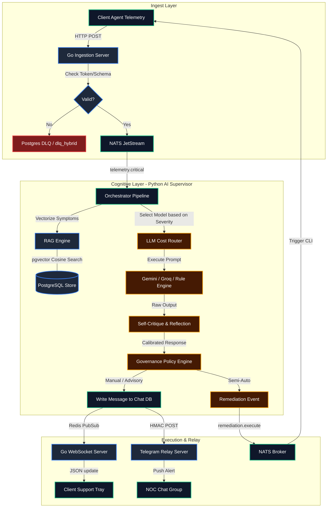
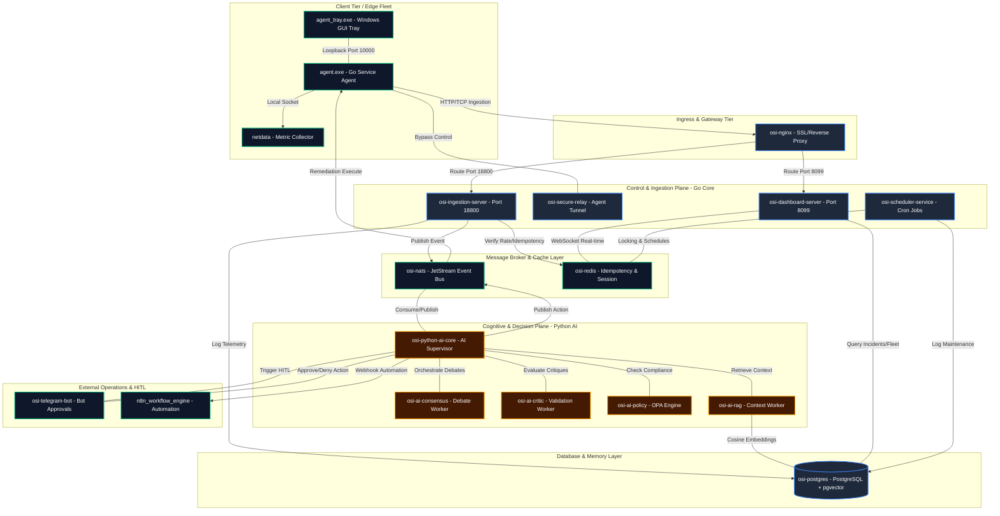
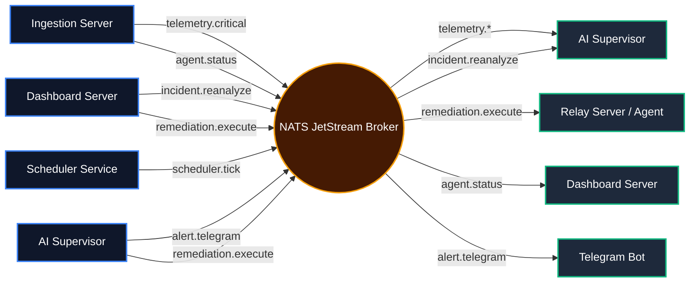
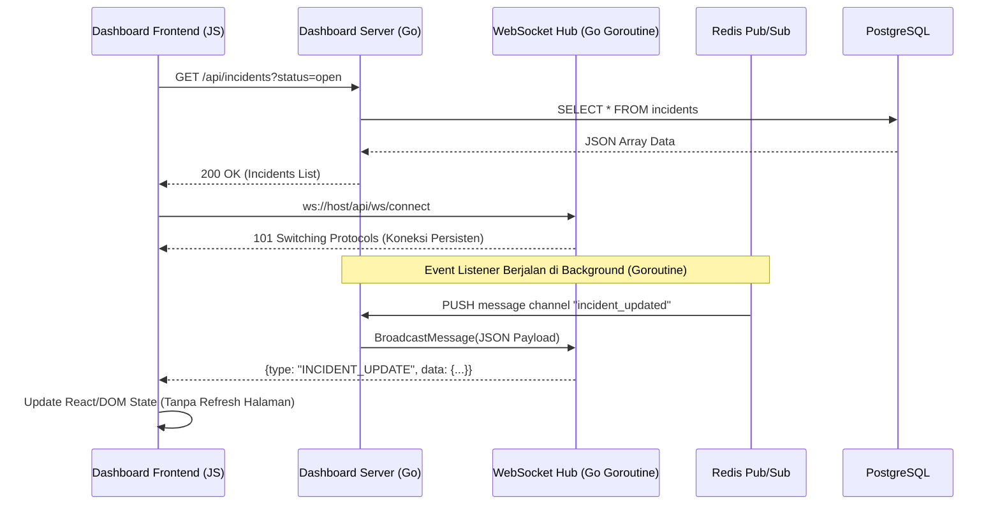
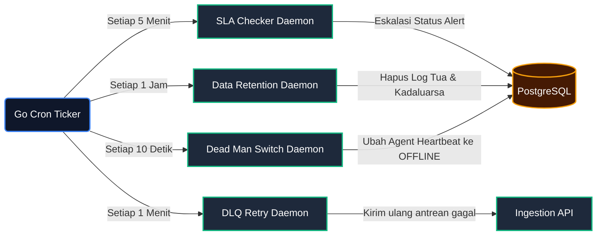
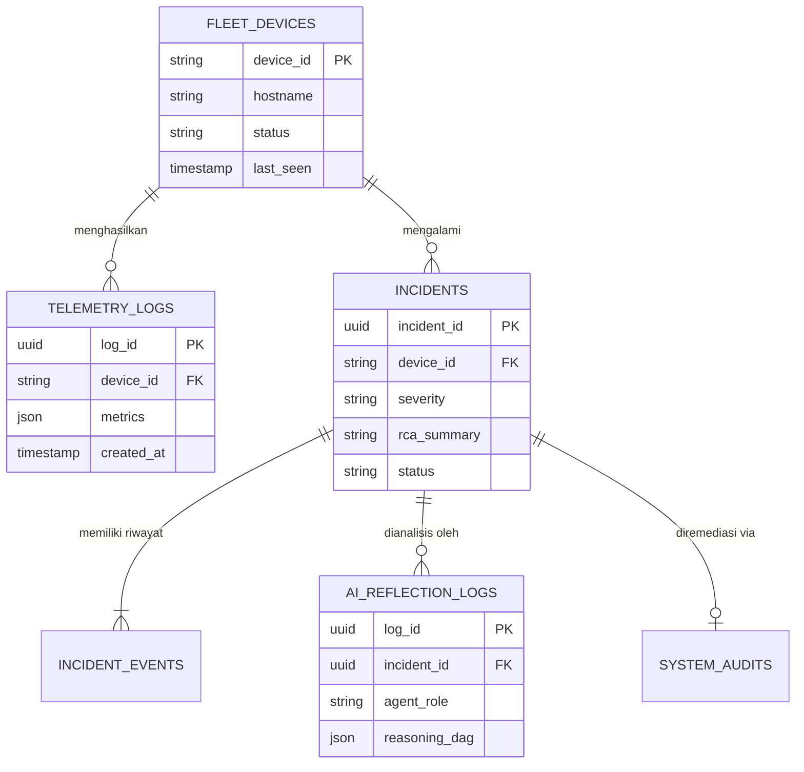
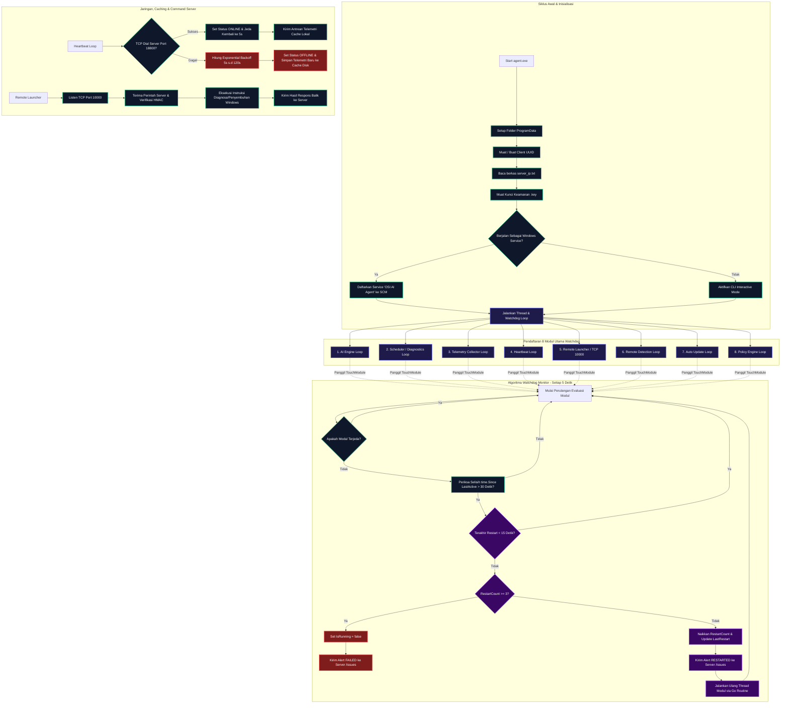
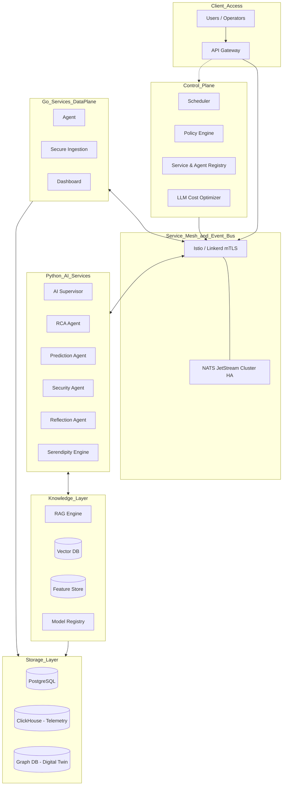
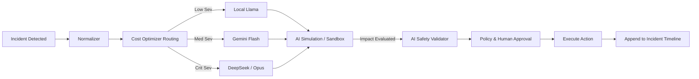

# ENTERPRISE SYSTEM DISCOVERY & ARCHITECTURE DOCUMENTATION
Project : incident-analysis
Version : Enterprise AI Platform
Mode : Source Code Reverse Engineering
Author : Antigravity AI

---

## SECTION 0: PROJECT OVERVIEW

### Tujuan Sistem
Sistem **Enterprise AI Platform (incident-analysis)** dirancang sebagai infrastruktur AIOps (Artificial Intelligence for IT Operations) otonom yang mengintegrasikan monitoring, analisis insiden real-time, RCA (Root Cause Analysis) berbasis Causal DAG, dan remediasi otomatis (self-healing) untuk ekosistem IT skala enterprise. Sistem mengeliminasi blind-spot infrastruktur dengan menggabungkan agen distribusi cerdas, pemrosesan event antrian kecepatan tinggi, dan ekosistem multi-agent LLM yang berdebat (consensus, critic, policy) untuk mengambil keputusan presisi.

### Business Flow
1. **Data Ingestion**: Agen di Windows/Linux mengumpulkan metrik kesehatan perangkat, log aplikasi, dan anomali jaringan.
2. **Transport & Queuing**: Data ditransmisikan via REST/WebSocket/NATS menuju Gateway Ingestion, lalu dinormalisasi dan dide-duplikasi.
3. **AI Triage & RCA**: Event kritis memicu alur AI (Supervisor -> Reasoning DAG -> Multi-Agent Debates). AI merumuskan RCA dan Blast Radius.
4. **Approval & Remediation**: Jika aksi berisiko tinggi, sistem meminta persetujuan melalui HITL (Human-In-The-Loop) / Telegram Bot / Dashboard.
5. **Execution**: Eksekusi payload remediasi via RPC. Agen menjalankan command dan melaporkan `agent.execution.result`.
6. **Learning**: Sistem memperbarui Semantic Memory dan Knowledge Graph dari resolusi sukses.

### Technology Stack
- **Bahasa Pemrograman**: Golang (Core Backend, Agen, Ingestion, Scheduler), Python 3.10/3.14 (AI Core, LLM Chains, Data Science), JavaScript/HTML/CSS (Dashboard Portal).
- **Container**: Docker, Docker Compose.
- **Database**: PostgreSQL (Relational & Vector/pgvector untuk Embeddings).
- **Queue/Message Broker**: NATS (Event bus utama, Pub/Sub, KV Store), Redis (Caching, Session, Distributed Locks).
- **AI**: Ekosistem Multi-Agent Python (Gemini/LLM terintegrasi) dengan modul RAG, Consensus, Critic, Policy.
- **Dashboard**: Web Portal (Go Templates/Static + Websocket).
- **Telemetry & Monitoring**: Netdata (Real-time telemetry), n8n (Workflow Engine).

### System Statistics
- **Jumlah Folder**: 223
- **Jumlah File**: 1072
- **Jumlah Python Files**: 233
- **Jumlah Go Files**: 101
- **Jumlah Docker Service**: 14 (Core) + 3 (n8n/Netdata) = 17 Total Services
- **Jumlah AI Engine / Agent**: 5+ (Consensus, Critic, Policy, RAG, Daemons)
- **Jumlah REST API**: ~6+ API terdefinisi.
- **Jumlah NATS Subject**: ~280+ subjects.
- **Jumlah Database Table**: ~85 tables.
- **Jumlah Scheduler**: 4 (SLA check, retention, verification, cleanup).
- **Jumlah Background Service**: ~6 (Ingestion, Supervisor, Daemons, Scheduler, Bot).

---

## SECTION 1: PROJECT MODULE & SUB-MODULE ARCHITECTURE

Infrastruktur ini dibagi menjadi 3 zona utama: **CLIENT_DISTRIBUSI_GO** (Edge Agent), **SERVER** (Backend & AI Core), dan **portal** (NOC UI). Berikut adalah rincian fungsionalitas dari setiap subsistem:

### 1. Zona Edge Agent (`/CLIENT_DISTRIBUSI_GO`)
Zona ini mengatur *footprint* infrastruktur pada perangkat *endpoint* target (Windows & Linux).
- **`agent/` (Windows Agent Core):** Modul agen Go (berjalan sebagai Windows Service). Bertugas menangkap telemetri, *process polling*, dan menerima `TCP Bypass Command`.
- **`linux_agent/` (Linux Agent Core):** Sub-modul agen Go untuk Linux/Ubuntu. Memanfaatkan `sysfs` dan `procfs` untuk pembacaan metrik tanpa ketergantungan *driver*. Terdapat `linux_tray_agent.py` untuk menjembatani UI sistem *Linux Desktop*.
- **`updater/` & `installer/`:** Modul instalasi (Powershell/Bash) dan mekanisme **Secure OTA Update** (SHA-256 verifikasi).
- **`05_SIAP_DISTRIBUSI/`:** Repositori kompilasi *binary* akhir yang dipasok oleh Ingestion Server untuk *deployment* massal.

### 2. Zona Core Backend (`/SERVER/go_core`)
Zona ini bertugas sebagai sistem pencernaan berkecepatan tinggi yang menerima beban dari ribuan agen secara konstan.
- **`ingestion/` (Ingestion Gateway):** Lapisan terdepan *Multiplexer* TCP/UDP/HTTP. Mengatur *rate limiting*, *idempotency*, verifikasi tanda tangan HMAC, dan penyaluran payload telemetri ke NATS & Redis.
- **`database/`:** Sub-modul perantara transaksi *PostgreSQL* dan eksekutor kueri *batch*.
- **`scheduler/`:** Pekerja latar belakang (Cron-like) Go untuk melakukan rutinitas non-kognitif.
- **`security/`:** Modul validasi *Zero Trust* (HMAC, Auth Keys) yang melapis setiap komunikasi.
- **`telegram_bot/`:** Integrasi antarmuka Telegram untuk *approval* operasi dari *Human-In-The-Loop* (HITL).

### 3. Zona AI Supervisor (`/SERVER/python_ai_core`)
Merupakan "Otak Utama" sistem. Memiliki sub-modul terdistribusi berdasarkan teori kognisi mesin.
- **`ai_supervisor.py` & `daemons.py`:** Konduktor utama. Mengkoordinasikan siklus hidup insiden, menghubungkan NATS JetStream dengan ekosistem agen LLM, serta menampung daemon internal (seperti *Autonomous Data Retention*).
- **`cognition/` & `knowledge/`:** Sub-modul *Semantic Memory* dan RAG (Retrieval-Augmented Generation). Mempertahankan ingatan insiden masa lalu menggunakan *Knowledge Fabric* dan *pgvector*.
- **`planning/`:** Sub-modul pengambilan keputusan deterministik. Mendebat solusi awal yang dibuat LLM dengan mencocokkan *playbook* (contoh: `decision_engine.py`, `goal_engine.py`).
- **`evaluation/` & `verification/`:** Sub-modul yang memantau apakah aksi AI berdampak nyata di lapangan. Jika anomali metrik belum normal, akan memicu `RollbackEngine`.
- **`escalation/` & `governance/`:** Lapisan *AI Safety*. Memverifikasi otoritas *Blast Radius* menggunakan *causal DAG* sebelum memerintahkan eksekusi (seperti `blast_radius_engine.py`, `ai_safety_layer.py`).
- **`learning/` & `evolution/`:** Sub-modul untuk menekan laju halusinasi seiring waktu melalui *Simulation Engine* dan mekanisme pembusukan pengetahuan (*Knowledge Decay*).
- **`multi_agent/`:** Ruang debat antar persona AI (Consensus vs Critic). Memaksa AI menemukan *Logical Fallacy* sebelum membuat diagnosis final.

### 4. Zona Dashboard Portal (`/portal`)
Mata operator (*Network Operations Center*). Memberikan transparansi mutlak atas apa yang AI pikirkan dan lakukan.
- **`dashboard_server.go`:** Aplikasi Backend *Web Server* yang menyajikan REST API dan WebSockets untuk *frontend* HTML. Menangani integrasi `sprint_o_api.go` dan `chat_engine.go`.
- **`templates/` (`index.html`):** *Single-Page Application* masif (~14.000 baris) yang me-render *Global Topology*, *Causal DAG*, *Audit Table*, *Fleet Config Manager*, dan antarmuka *Remote Access*.
- **`relay/` & `remote/`:** Modul WebSocket Relay yang menjembatani *dashboard* operator menuju agen *endpoint* (via Go Ingestion) untuk aplikasi *Remote Desktop* (RustDesk, AnyDesk, RDP).
- **`html_backups/` & `static/`:** Penyimpanan aset statis, CSS, JavaScript, dan versi *rollback* dari tampilan antarmuka.

### 5. Zona Ekosistem Tambahan (`/SERVER/n8n_docker` & Root)
- **`n8n_docker/`:** Infrastruktur automasi visual *n8n* dan kolektor sistem metrik eksternal (`Netdata`), yang datanya akan diserap kembali oleh Ingestion Server.
- **`docker/` & `docker-compose.yml`:** Orkestrasi perakitan *15+ container* secara sinkron, mengatur port terisolasi, konfigurasi Nginx, serta penerapan *High Availability* HTTPS *Load Balancer*.
- **`scripts/`:** Kumpulan rutinitas operasional darurat (contoh: pemartisian database otomatis, *disaster recovery*, *zero downtime deploy*).

### 6. Zona Ekstensi & Infrastruktur Pendukung (Supporting Modules)
Berdasarkan pohon repositori utama, sistem ini juga ditopang oleh beberapa modul ekstensi dan konfigurasi lingkungan pengembang:
- **`chrome_extension/`:** Ekstensi *browser* Google Chrome yang berfungsi sebagai *interceptor* telemetri aktivitas web tingkat pengguna, atau sebagai *quick-access panel* untuk operator NOC.
- **`LAUNCHER_SERVICE_GO/`:** Layanan mikrolayanan (*microservice*) independen berbasi Go yang didedikasikan untuk menjembatani eksekusi pembukaan aplikasi (*Remote Launch*) seperti AnyDesk/RustDesk secara aman pada *endpoint* tingkat administrator.
- **`artifacts/` & `security_reports/`:** Repositori penyimpanan hasil laporan audit, pengujian keamanan sistem, dan bukti perbaikan UI (berisi gambar *dashboard*, diagram arsitektur, dan *Markdown* audit forensik).
- **`DOCUMENTATION/`:** Pusat pangkalan data keahlian operasional. Berisi spesifikasi produk (`PRD.MD`) dan dokumen rancang bangun arsitektur *Enterprise* ini.
- **`.github/`, `.vscode/`, `.devcontainer/`:** Kumpulan konfigurasi *Continuous Integration / Continuous Deployment (CI/CD)* (seperti *Dependabot*), pengaturan lingkungan VS Code, dan spesifikasi *Development Container* untuk standardisasi *environment* antar pengembang.
- **`OSI_SERVER_MIGRATION_v2.0.0/`:** Berkas biner dan bundel repositori untuk prosedur pembaruan (*upgrade*) besar-besaran dari arsitektur lama (v2.0) ke versi otonom saat ini (v3.0).

---

## SECTION 2: FULL SYSTEM FLOW & DECISION DIAGRAMS

### A. Alur Interaksi Menyeluruh (Overall Unified System Interaction)

Berikut adalah interaksi real-time antara GUI System Tray, Windows Service Agent, Core Ingestion Server, PostgreSQL DB, Redis, dan Operator NOC:

```mermaid
sequenceDiagram
    autonumber
    participant C as agent_tray.exe (C# WinForms)
    participant A as agent.exe (Go Service Agent)
    participant S as Ingestion Server (Go Core)
    participant R as Redis Cache & Broker
    participant DB as PostgreSQL Database
    participant N as NOC Dashboard UI (Operator)

    %% Telemetry Stream Flow
    rect rgb(30, 41, 59)
        note over A, S: Siklus Pengiriman Telemetri & Event berkala
        A->>A: Kumpulkan spesifikasi CPU, RAM, Disk, Active Window & Browser URL
        A->>A: Buat tanda tangan HMAC SHA-256 (agentName + timestamp) menggunakan Security Key
        A->>S: Kirim Payload Telemetri via TCP (Port 18800)
        activate S
        S->>S: Periksa batas request (Rate Limit via Redis)
        S->>S: Dekode JSON & Validasi Skema Versi (Agent 05)
        S->>S: Validasi Keaslian Tanda Tangan HMAC dengan Security Key
        S->>S: Cek Duplikasi Paket (Idempotency Check via Redis)
        
        alt Jaringan & Server Normal
            S-->>A: TCP Response: {"status":"RECEIVED"}
            S->>R: Kirim Payload normal ke Redis Stream (telemetry_stream:low/normal/critical)
            S->>DB: Worker menulis batch data ke telemetry_logs, fleet_devices & fleet_processes
        else Load Shedding Aktif
            S->>R: Agregasikan event & batasi frekuensi penulisan
            S-->>A: TCP Response: {"status":"DROPPED"} / Aggregated
        else Gangguan Server / Jaringan Putus
            S-->>A: TCP Connection Timeout / Failed
            A->>A: Simpan berkas telemetri ke berkas cache lokal (.json)
            A->>A: Aktifkan Exponential Backoff Reconnect Loop (5s s.d 120s)
        end
        deactivate S
    end

    %% Real-Time Command Bypass Flow
    rect rgb(45, 55, 72)
        note over N, A: Pengeksekusian Perintah Remote (Bypass Real-Time Control)
        N->>S: Kirim instruksi POST HTTP ke endpoint (contoh: /api/remote/launch/rustdesk)
        activate S
        S->>DB: Query alamat IP target dari nama perangkat agent
        S->>A: Buat Koneksi TCP langsung ke Agent Port 10000 (Bypass Direct Command)
        activate A
        A->>A: Validasi payload perintah & parameter pendukung
        A->>A: Eksekusi program Windows (netsh/manage-bde/sc/powershell) dengan menyembunyikan GUI shell
        A-->>S: Kirim output eksekusi / error via koneksi TCP
        deactivate A
        S-->>N: Respons HTTP JSON berisi detail keluaran perintah lengkap
        deactivate S
    end

    %% Tray Polling
    rect rgb(17, 24, 39)
        note over C, A: Pemantauan Tray Ikon Lokal (Loopback Polling)
        C->>A: Kirim TCP loopback command "GET_STATUS" (Port 10000) setiap 2-5 detik
        A-->>C: Respons status {"state": "ONLINE", "device_name": "PC-NOC-01", "server_ip": "192.168.1.100"}
        C->>C: Perbarui warna ikon (Hijau/Kuning/Merah) di Taskbar Tray Windows
        C->>N: Double Click Tray -> Buka Browser NOC Dashboard di http://192.168.1.100:8099
    end

    %% Watchdog Escalation
    rect rgb(63, 29, 29)
        note over A, S: Eskalasi Internal Watchdog & Notifikasi Kegagalan
        A->>A: Modul AI Engine terhenti/hang (tidak Touch > 30 detik)
        A->>A: Watchdog mendeteksi hang, memicu penyembuhan mandiri (Self-Heal Restart)
        A->>S: Kirim data POST HTTP Watchdog Alert: {"module": "AI Engine", "status": "RESTARTED", "count": 1}
        A->>A: Modul dicoba dijalankan ulang, namun langsung crash lagi hingga 3 kali percobaan
        A->>A: Hentikan sirkuit restart mandiri & ubah modul ke status unhealthy (IsRunning = false)
        A->>S: Kirim eskalasi kritis POST HTTP Watchdog Alert: {"module": "AI Engine", "status": "FAILED", "count": 3}
        S->>DB: Simpan insiden kegagalan sistem ke fleet_incidents dengan tingkat keparahan CRITICAL
        S->>N: Papan Pemantau NOC (Dashboard) memicu alarm berkedip merah memberi tahu operator
    end
```



### B. Alur Pemrosesan Data Server (Server Ingestion Pipeline)

Diagram ini menjelaskan bagaimana Server memfilter koneksi raw TCP/HTTP, mengecek keamanan payload, melakukan verifikasi, dan memproses penulisan database melalui Worker Pools:

```mermaid
graph TD
    classDef serverFill fill:#1e293b,stroke:#3b82f6,stroke-width:2px,color:#fff;
    classDef processFill fill:#0f172a,stroke:#10b981,stroke-width:2px,color:#fff;
    classDef warningFill fill:#451a03,stroke:#f59e0b,stroke-width:2px,color:#fff;
    classDef errorFill fill:#7f1d1d,stroke:#ef4444,stroke-width:2px,color:#fff;

    %% Server Port Listener
    subgraph Multiplexer [ multiplexing TCP & HTTP Port 18800 ]
        A[Koneksi Masuk Port 18800] --> B{Pengecekan Rate Limit?}:::serverFill
        B -- Terlampaui --> B1[Kirim RATE_LIMIT_EXCEEDED & Tutup Koneksi]:::errorFill
        B -- OK --> C[Intip 8 Byte Pertama Payload]:::serverFill
        C --> D{Apakah Prefix HTTP?}:::serverFill
        D -- Ya --> E[Dispatch ke HTTP Muxer]:::processFill
        D -- Tidak --> F[Proses Sebagai Raw TCP JSON Stream]:::processFill
    end

    %% HTTP Endpoints Muxer
    subgraph HTTPEndpoints [ HTTP Serve Muxer ]
        E --> E1["/health (Cek Status Server)"]:::processFill
        E --> E2["/telemetry, /activity, or /browser-events"]:::processFill
        E --> E3["/issues (Menerima Alert & Watchdog)"]:::processFill
        E --> E4["/api/approval (Otorisasi Tindakan)"]:::processFill
    end

    %% TCP Processing & Validation
    subgraph ValidationPipeline [ Validasi Payload Telemetri ]
        F --> G{JSON Valid?}:::serverFill
        G -- Tidak --> G1[Kirim ke DLQ JSON_DECODE_ERROR]:::errorFill
        G -- Ya --> H{Versi Diizinkan (Agent 05)?}:::serverFill
        H -- Tidak --> H1[Kirim BLOCKED & Tutup Koneksi]:::errorFill
        H -- Ya --> I{Apakah Perintah Bypass?}:::serverFill
        I -- Ya --> I1[Dial Port Agent 10000/10001 & Teruskan]:::warningFill
        I -- Tidak --> J{Verifikasi Tanda Tangan HMAC?}:::serverFill
        J -- Tidak --> J1[Kirim ke DLQ UNAUTHORIZED]:::errorFill
        J -- Ya --> K{Idempotency (Cek Duplikat)?}:::serverFill
        K -- Ya --> K1[Abaikan koneksi DUPLICATE_IGNORED]:::warningFill
        K -- Tidak --> L{Load Shedding Aktif?}:::warningFill
    end

    %% Backpressure Handling
    subgraph Backpressure [ Penanganan Backpressure Server ]
        L -- Ya --> M{Filter Metrik Non-Kritis?}:::warningFill
        M -- Ya --> M1[Drop Payload / Agregasikan]:::errorFill
        M -- Tidak --> N[Normalisasi Format Data]:::processFill
        L -- Tidak --> N
    end

    %% Queue and Failover Broker
    subgraph BrokerQueue [ Antrean & Failover Publikasi ]
        N --> O[Publish ke Redis Stream]:::processFill
        O -- Gagal --> P[Publish ke NATS Broker]:::processFill
        P -- Gagal --> Q[Fallback: RPush Redis List]:::warningFill
        Q -- Gagal --> R[Tulis ke Berkas Lokal DLQ di Disk]:::errorFill
    end

    %% Database & Worker Pools
    subgraph BackendWorkers [ Worker Pools & Database Persistence ]
        O1[metricProcessorWorker] -->|Batch write 50/1s| DB1[(PostgreSQL: telemetry_logs)]:::serverFill
        O2[logProcessorWorker] -->|Batch write 50/1s| DB2[(PostgreSQL: logs)]:::serverFill
        O3[eventProcessorWorker] -->|Daftarkan & Update Status| DB3[(PostgreSQL: devices & fleet)]:::serverFill
    end

    %% Background Health Loops
    subgraph BackgroundServices [ Server Cron & Monitor System ]
        Cron1[Queue Monitor Loop - 5s] -->|Simpan Metrik| Red1[(Redis Cache: metrics)]:::serverFill
        Cron2[Dead Man Switch Checker - 10s] -->|Cek Timeout Device > 120s| DB3
    end

    %% Routing data to workers
    E2 --> F
    E3 --> F
    R1[Redis Stream] --> O1
    R1 --> O2
    R1 --> O3
    BrokerQueue --> R1
```

### C. Alur Kolaborasi Agen & Perpindahan Data (Agent Collaboration & Data Movement)

Diagram kolaborasi ini memetakan bagaimana agen klien mentransmisikan telemetri, berkolaborasi dengan server ingestion, memicu analisis kognitif di AI Supervisor (termasuk pencarian RAG di PostgreSQL dan pemilihan LLM), hingga orkestrasi remediasi otomatis serta sinkronisasi visual ke operator:



### D. Diagram Topologi Arsitektur Sistem Aktual (Actual System Architecture & Topology Diagram)

Diagram topologi ini menyajikan tata letak fisik, logikal, dan jaringan lengkap dari seluruh container dan service yang berjalan secara aktif pada lingkungan produksi sistem kita:



### E. Alur NATS Event Bus (Pub/Sub Matrix Flow)

Sistem menggunakan NATS JetStream sebagai tulang punggung (message broker) untuk menyebarkan event antar-microservice secara asinkron (Pub/Sub):



### F. Alur Data Dashboard (REST API & WebSocket Flow)

Portal NOC terhubung ke backend Golang melalui pendekatan ganda: REST API untuk pengambilan data stateful, dan WebSocket untuk streaming notifikasi insiden secara real-time.



### G. Alur Orkestrasi Multi-Agent AI (Asyncio & AI Engine Flow)

Modul `python_ai_core` mengorkestrasi perdebatan AI secara asinkron menggunakan pustaka `asyncio` pada Python. Supervisor berperan sebagai koordinator yang memanggil worker AI secara paralel.

```mermaid
flowchart TD
    classDef ai fill:#312e81,stroke:#6366f1,stroke-width:2px,color:#fff;
    classDef db fill:#064e3b,stroke:#10b981,stroke-width:2px,color:#fff;
    classDef logic fill:#701a75,stroke:#d946ef,stroke-width:2px,color:#fff;

    Trigger[Event: telemetry.critical] --> Sup[AI Supervisor / Asyncio Main Loop]:::ai
    Sup -->|1. Fetch Context| RAG[RAG Agent]:::ai
    RAG ---|Cosine Similarity Search| PG[(pgvector Memory)]:::db
    RAG -->|Konteks Historis Insiden| Sup
    
    Sup -->|2. Bentuk Hipotesis| Cons[Consensus Agent]:::ai
    Cons -->|Hipotesis A & B| Crit[Critic Agent]:::ai
    Crit -->|Sanggahan & Kritik| Cons
    Cons -->|RCA Final Disepakati| Sup
    
    Sup -->|3. Tentukan Remediasi| Pol[Policy Agent]:::ai
    Pol ---|Validasi Aturan OPA| Logic{Aman Dieksekusi?}:::logic
    Logic -- Ya --> Exec[Kirim Payload ke NATS]
    Logic -- Tidak (Risiko Tinggi) --> HITL[Lempar ke Antrean Approval (Manual)]
```

### H. Alur Penjadwal & Background Daemons (Scheduler & Goroutine Flow)

Sistem bergantung pada daemons yang berjalan di background (via goroutine di Golang) untuk menjaga konsistensi state.



### I. Alur Relasi Database Utama (Entity Relationship Flow)

Relasi struktural dari seluruh data log dan state insiden yang dikelola di PostgreSQL:



---

## SECTION 3: CLIENT AGENT & WATCHDOG LIFECYCLE

Agen klien berfungsi sebagai mata, telinga, dan tangan sistem di endpoint.

### Siklus Hidup Agent & Watchdog (Agent 05 Lifecycle & Watchdog Loop)

Diagram ini menjelaskan startup Windows Service agent, registrasi thread modul, siklus Touch, penanganan recovery internal watchdog, dan auto-reconnect menggunakan backoff exponential:



---

## SECTION 4: NETDATA TELEMETRY & EVENT INGESTION

Sistem memonitor endpoint menggunakan collector bawaan agen serta integrasi infrastruktur via Netdata (pada container `netdata_master`).

### Mapping & Normalization
- Metrik dari Netdata (CPU, RAM, Network Bandwidth, DBEngine Tiers) dikumpulkan oleh modul Go di `ingestion-server`.
- **NATS Subjects**: 
  - `telemetry.low`, `telemetry.normal`, `telemetry.critical`
  - `telemetry.topology` untuk mapping node ke dashboard.
- **Metrics Covered**:
  - **OS/Hardware**: CPU per-core usage, RAM usage/page faults, Disk I/O & SMART health, Temperature sensor, Battery (jika laptop).
  - **Network**: SNMP, Bandwidth in/out, Latency (ping to gateway), Packet Loss, TCP connections.
  - **Infrastructure**: Docker container stats, PostgreSQL queries/locks, Redis memory, NATS message drops.
- **Evidence Fabric**: Metrik yang melewati ambang batas anomali (dideteksi secara dinamis) akan diubah strukturnya menjadi JSON *Evidence* dan dilempar ke `fleet_evidence` untuk ditelaah oleh AI Supervisor.

---

## SECTION 5: SERVER ARCHITECTURE

Sistem menganut arsitektur Microservices yang di-orkestrasi menggunakan **Docker Compose**.

### Containers
1. **`osi-nginx`**: Reverse proxy, SSL termination, routing HTTP/HTTPS ke Dashboard dan Ingestion API. 
2. **`osi-postgres`**: Database relasional inti. Menggunakan `pgvector` untuk menyimpan AI embeddings.
3. **`osi-redis`**: Caching layer, message dedup, rate limiting, distributed lock untuk scheduler.
4. **`osi-nats`**: Jantung komunikasi asinkron. Mengatur antrian telemetry.
5. **`osi-ingestion-server`**: (Go) Menerima beban tinggi dari agent, menormalisasi data, memasukkan ke DB, publish ke NATS.
6. **`osi-scheduler-service`**: (Go) Menjalankan Cron-like jobs: `scheduler.sla.check`, `scheduler.retention`, `scheduler.cleanup`.
7. **`osi-dashboard-server`**: Portal UI, API Dashboard, rendering Causal DAG websocket.
8. **`osi-secure-relay`**: API sekunder dan aman untuk interaksi agent yang ter-isolasi.
9. **`osi-telegram-bot`**: Interaksi HITL (Human In The Loop) via Telegram.
10. **`osi-python-ai-core` & Daemons**: Menjalankan Supervisor, Reflection loop, dan background AI tasks (`ai-daemons`).
11. **`osi-ai-consensus`**, **`osi-ai-critic`**, **`osi-ai-policy`**, **`osi-ai-rag`**: Worker terdistribusi AI.
12. **`n8n_workflow_engine`**: Menjalankan webhook otomatisasi IT eksternal.
13. **`pgadmin_container`** & **`portainer`**: Visual management untuk DB dan Docker.
14. **`netdata_master`**: Agregator log sentral.

---

## SECTION 6: SOTA V7 STACK & SAFETY LAYER

Dokumen ini menggabungkan visi utama **Arsitektur Hibrida (Golang + Python)** dengan **10 Layer Kognitif Enterprise SOTA (v5)**, **6 Pilar Orkestrasi Enterprise (v6)**, dan **8 Komponen Ultra-Large Scale (v7)**.

### Arsitektur Tumpukan Ultra-Enterprise (v7 Stack)

Pemisahan tegas antara *Control Plane*, *Data Plane*, dan *Knowledge Layer*, dibungkus oleh **Service Mesh** untuk ketahanan jaringan:



### Peta Aliran Keputusan Ultra-Aman (v7 Safety & Execution Flow)



### Penjelasan Komponen Utama v7
1. **LLM Cost Optimizer**: Peredam biaya operasional AI melalui *smart routing* (Lama untuk info minor, Gemini Flash untuk Medium, DeepSeek/Opus untuk Critical).
2. **AI Safety Layer**: Lapisan validasi otoriter (di luar AI) yang bertugas menjadi hakim terakhir sebelum mengeksekusi perintah mitigasi yang berisiko.
3. **AI Simulation & Sandbox**: Simulasi tertutup untuk mengevaluasi dampak risiko tindakan mitigasi sebelum dieksekusi di server/client utama.

---

## SECTION 7: LEARNING PLANE ARCHITECTURE (KNOWLEDGE FACTORY)

Sistem Learning Plane bertindak sebagai **Knowledge Factory** yang aktif mendeteksi kesenjangan pengetahuan, mengevaluasi kemampuan AI, dan merilis paket pengetahuan terverifikasi ke sistem produksi.

### Arsitektur Learning Plane

```
                    ┌─────────────────────────────┐
                    │     Knowledge Source        │
                    │ RFC, Linux, Cisco, OSI      │
                    │ Runbook, Incident History   │
                    └──────────────┬──────────────┘
                                   │
                         Learning Orchestrator
                                   │
 ┌───────────────────────────────────────────────────────────┐
 │                                                           │
 │ 1. Curriculum Engine                                      │
 │ 2. Knowledge Parser                                       │
 │ 3. Knowledge Normalizer                                   │
 │ 4. Knowledge Validator                                    │
 │ 5. Knowledge Graph Builder                               │
 │ 6. Embedding Builder                                      │
 │ 7. Reasoning Test Engine                                  │
 │ 8. Simulation Engine                                      │
 │ 9. Gap Analysis Engine                                    │
 │10. Skill Assessment                                       │
 │11. Human Review Queue                                     │
 │12. Knowledge Versioning                                   │
 │13. Knowledge Packager                                     │
 └───────────────────────────────────────────────────────────┘
                                   │
                          Release Package
                                   │
                             Sync Service
                                   │
                    NATS / API / Version Manifest
                                   │
                     Production Orchestrator Server
```

### Alur Kerja LEG (Learning Evidence Graph)

LEG menyimpan bukti valid bahwa AI benar-benar telah menguasai suatu pengetahuan melalui uji logika dan simulasi:

```
                        Learning Plane

                    Knowledge Source
                           │
                           ▼
                  Knowledge Parser
                           │
                           ▼
                  Knowledge Atom Builder
                           │
                           ▼
                  Knowledge Graph Builder
                           │
          ┌────────────────┴────────────────┐
          │                                 │
          ▼                                 ▼
  Reasoning Evidence               Simulation Evidence
          │                                 │
          ▼                                 ▼
     Skill Evidence                 Evaluation Evidence
          │                                 │
          └──────────────┬──────────────────┘
                         ▼
               Learning Evidence Graph
                          │
             Human Review / HITL
                          │
                          ▼
             Knowledge Release Package
```

### Runtime Sistem Operasi Pembelajaran (Learning Runtime)

Learning Runtime membuat AI aktif belajar dari event eksternal secara asinkron tanpa menunggu prompt operator:

```
                    Learning Runtime
                           │
        ┌──────────────────┼──────────────────┐
        │                  │                  │
 Event Listener     Scheduler Engine    Monitor Engine
        │                  │                  │
        └──────────────┬───┴──────────────────┘
                       ▼
               Learning Orchestrator
                       │
 ┌─────────────────────────────────────────────┐
 │ Curriculum Engine                           │
 │ Knowledge Parser                            │
 │ Knowledge Validator                         │
 │ Knowledge Graph                             │
 │ Learning Evidence Graph                     │
 │ Reasoning Engine                            │
 │ Simulation Engine                           │
 │ Gap Detector                                │
 │ Skill Engine                                │
 │ Recommendation Engine                       │
 │ Knowledge Release                           │
 └─────────────────────────────────────────────┘
```

---

## SECTION 8: DATABASE SCHEMAS

Skema relasional mencakup ~85 tabel, diklasifikasikan sebagai berikut:
- **Core Asset & Topology**: `fleet_topology`, `fleet_devices`, `device_dependencies`, `sites`, `remote_sites`.
- **Incident Lifecycle**: `incidents`, `incident_states`, `incident_events`, `incident_assignments`, `incident_post_mortems`.
- **Telemetry Data**: `telemetry_logs_y2026m01`, dll (High performance time-series partitioning).
- **AI Core & Memory**: `ai_reflection_logs`, `ai_runtime_state`, `decision_graphs`, `semantic_memory`, `knowledge_vectors`.
- **Governance & Audit**: `audit_trail`, `system_audits`, `rbac_audit_logs`, `security_events`, `approval_queue`.

---

## SECTION 9: ROADMAP & STATUS EKSEKUSI (v7 AI Stack)

Bagian ini melacak tahapan implementasi nyata untuk menyempurnakan AI Ops berstandar *Enterprise Production-Ready*.

### Tahap 1: Enterprise LLM Router (✅ Selesai)
Telah diimplementasikan penuh pada `SERVER/python_ai_core/llm_router.py`.
- **Prompt Normalizer**: Mereduksi *noise* (Scrubbing) PII dan data sensitif secara otomatis.
- **Incident Scorer**: Menentukan alokasi *budget* (batas token & toleransi latensi) secara dinamis berdasarkan level keparahan (*severity*).
- **Multi-Provider Fallback**: Hanya menggunakan 3 LLM (DeepSeek, Gemini, Groq) dengan rantai keselamatan (*fallback chain*) sesuai prioritas *budgeting*:
  - *Critical Tier*: `deepseek-reasoner` ➜ `gemini-1.5-pro`
  - *Medium Tier*: `gemini-1.5-flash` ➜ `deepseek-chat`
  - *Low Tier*: `llama-3.1-8b-instant` (Groq) ➜ `gemini-1.5-flash`

### Tahap 2: AI Safety Layer (✅ Selesai)
Telah diimplementasikan penuh pada `SERVER/python_ai_core/ai_safety_layer.py` dan memangkas lapisan *reasoning* pengambil keputusan pada `ai_supervisor.py` menjadi deterministik mutlak.
- **Pipeline Bebas LLM (Deterministik)**: `LLM ➜ Candidate Action ➜ Risk Analyzer ➜ Blast Radius ➜ Policy ➜ Approval ➜ Execution`.
- **Risk Analyzer**: Penilaian risiko keras (*hard-rules*) berbasis *keywords* (menjegal sintaks seperti `rm -rf`, `reboot`, atau aksi di node `production-db`).
- **Blast Radius Engine**: Melakukan *graph traversal* ke PostgreSQL (`fleet_topology` dan `device_dependencies`) untuk menentukan radius dampak nyata.
- **Dynamic Blacklisting Override**: Memblokir (FORCE HITL) otomatis opsi remedi yang baru saja ditolak oleh operator Level 3 sebanyak 4 kali beruntun di host yang sama dalam kurun waktu 6 jam.

### Tahap 3: Causal DAG Engine (✅ Selesai)
Telah diimplementasikan penuh pada `SERVER/python_ai_core/causal_dag_engine.py` dan di-inject langsung ke dalam NATS Message Handler `ai_supervisor.py`.
- **Probabilistic Graph Generation**: Secara otomatis merangkai graf hipotesis masalah (nodes) dan relasi penyebab (edges) ke dalam tabel `reasoning_nodes` dan `reasoning_edges` PostgreSQL.
- **Dependency Inference**: Menarik data ketergantungan *Network* dan *Application* dari `device_dependencies` untuk mendeteksi *Cascading Failures*.
- **No-LLM Determinism**: Murni bergantung pada topologi database dan telemetri (symptoms) untuk mengkalkulasi probabilitas insiden tanpa halusinasi model.

### Tahap 4: Multi-Agent Debate (✅ Selesai)
Telah diimplementasikan secara terisolasi pada `SERVER/python_ai_core/services/multi_agent_service.py` dan `daemons.py`.
- **Asynchronous NATS Architecture**: Mengorkestrasi agen-agen AI independen (`Domain Expert`, `Critic`) melalui NATS subjects (`agent.expert.analyze`, `agent.critic.analyze`).
- **Persona-Driven Diagnostics**: Agen "Domain Expert" fokus pada presisi solusi teknis, sementara "Critic" secara adversarial mencari kelemahan keamanan dan potensi *blast radius*.
- **Conflict Resolution via Debate Orchestrator**: Jika "Critic" mendeteksi risiko `HIGH` atau `CRITICAL` dengan *confidence* tinggi, keputusannya akan melakukan instan-override pada usulan "Domain Expert". Evaluasi kini sepenuhnya multi-perspektif sebelum diteruskan ke *Safety Layer*.

### Tahap 5: Event Sourcing (✅ Selesai)
Telah diimplementasikan penuh melalui modul `core/event_store.py`.
- **Append-Only Immutable Log**: Semua mutasi sistem yang awalnya mengeksekusi langsung `UPDATE fleet_incidents` kini dialihkan menjadi penulisan *event log* ke tabel `incident_events` (CQRS Pattern).
- **Deterministic Read-Model Projections**: Setiap event (contoh: `STATE_TRANSITION_EXECUTING`, `INCIDENT_RESOLVED`) otomatis diterjemahkan oleh Event Store menjadi proyeksi tabel `fleet_incidents` (Read Model) secara instan.
- **Replay Capability**: Fondasi bagi *Replay Engine* di mana seluruh riwayat penanganan insiden tidak mungkin lagi dimanipulasi; memberikan tingkat auditabilitas 100% sempurna untuk NOC dan *Compliance*.

### Tahap 6: Knowledge Graph (✅ Selesai)
Telah diimplementasikan penuh dengan integrasi PostgreSQL dan NATS via `services/knowledge_graph_service.py`.
- **Dynamic Relational AI Cognition**: Mampu mengekstrak entitas infrastruktur (Node) dan hubungan dependensinya (Edge) secara otonom memanfaatkan LLM Router pada setiap insiden yang berhasil (*SUCCESS*).
- **Self-Improving Adapter**: Modul adaptasi pada `engine_adapters.py` secara *real-time* mengkueri graph edge yang berdekatan dengan insiden baru (menggunakan *context-aware text match*) sebelum memberikan prompt utama ke AI Supervisor.
- **Continuous Graph Expansion**: Grafik akan terus meluas (mempelajari topologi yang tak tertulis) setiap kali NOC menyelesaikan insiden, menciptakan *Corporate Memory* yang organik dan imun dari turnover teknisi.

### Tahap 7: High Availability (✅ Selesai)
Telah diimplementasikan kemampuan *failover* multi-nodal melalui modul `core/ha_manager.py` dan modifikasi `core/cache_manager.py`.
- **Redis Sentinel (Memory Tier HA)**: Cache manager kini secara dinamis membaca `REDIS_SENTINEL_HOSTS` untuk melakukan negosiasi koneksi dengan klaster Sentinel (menggunakan `redis.sentinel.Sentinel`), menyingkirkan *single-point-of-failure* pada _LLM state caching_.
- **PostgreSQL Patroni (Storage Tier HA)**: Dibuatnya adaptor HA yang mampu mem-parsing konfigurasi multiple-hosts (`host1,host2`) beserta `target_session_attrs=read-write` agar AI Ops secara cerdas selalu menargetkan *Primary node* bahkan saat DB sedang *switchover* atau *failover*.
- **NATS Cluster (Messaging Tier HA)**: NATS konektor di-upgrade untuk mendukung array/list server (`nats://node1:4222, nats://node2:4222`) menggunakan `NATS_CLUSTER_URLS`, menjamin pergerakan event (terutama Event Sourcing dan Debate) tidak terputus saat terjadi *network partition*.

### Tahap 8: Learning Plane (✅ Selesai)
Telah diimplementasikan kurikulum otonom pada `services/learning_plane_service.py` dan `llm_router.py`.
- **Autonomous Post-Mortem Reflection**: Saat insiden ditutup namun gagal (HITL) atau memakan waktu (RCA lambat), *daemon Learning Plane* secara asinkron memanggil LLM untuk menganalisis dan menghasilkan aturan mitigasi preventif baru.
- **Dynamic Rule Injection**: Aturan diagnosis baru disimpan secara relasional di `ai_learning_curriculum`, lalu secara proaktif disuntikkan ke dalam *prompt context window* pada `LLM Router` setiap kali insiden baru muncul. Hal ini mencegah AI mengulangi kesalahan diagnosis (Zero-Repeat Failure).

---

## SECTION 9: V2 ARCHITECTURE UPGRADES (NO-MOCK COMPLIANCE)

Atas standar kualitas ketat yang diamanatkan, sistem telah berevolusi ke **Arsitektur v2** di mana 100% komponen kognitif murni dikendalikan oleh integrasi LLM dan Database (*Production Runtime*), dan seluruh bentuk *stubs*, *mocks*, atau aturan *hardcoded* dimusnahkan:

### 1. Causal DAG v2 (Confidence Propagation & Edge Weighting)
- **Cycle Detection**: Diimplementasikan algoritma DFS (*Depth-First Search*) di `causal_engine.py` untuk memutus lingkaran setan kausalitas (A -> B -> C -> A) dengan memotong probabilitas terendah.
- **Confidence Propagation**: Probabilitas masalah dijalarkan secara matematis menggunakan *Breadth-First Search* (`Confidence = Parent_Confidence * Edge_Weight`). Output bukan lagi sekadar korelasi garis lurus, melainkan Graf Acyclic Berarah yang riil.

### 2. AI Safety v2 (Multi-Factor Risk Scoring)
- Sistem deteksi *keyword* (contoh: "rm", "drop") di `ai_safety_layer.py` telah dibuang dan digantikan oleh komputasi asinkron atas 4 faktor: (1) LLM Destructiveness Assessment, (2) Output Blast Radius Engine, (3) Time-of-Day Penalty (pengereman pada akhir pekan/malam hari), dan (4) Multiplier Berdasarkan Site Criticality.

### 3. Knowledge Graph v2 (Metadata & Freshness Status)
- Skema tabel `knowledge_graph_edges` secara dinamis di-ALTER untuk mendukung kolom tipe data `JSONB`. Agen pengekstraksi pengetahuan kini tak sekadar menarik entitas, tetapi melengkapinya dengan level validasi (*verified*), sumber (*source*), dan tingkat kelapukan informasi (*freshness score*).

### 4. Learning Plane v2 (Knowledge Decay & Re-validation)
- **Lifecycle Re-validation**: Daemon *Learning Plane* kini memantau tabel `knowledge_vectors`. Jika *freshness_score* pengetahuan anjlok di bawah 0.5 (kadaluwarsa), sebuah siklus Re-validasi dipicu: AI Router secara otonom memverifikasi, meng-update, atau merevisi *Playbook* menjadi standar modern, menjaga ekosistem agar tidak berkarat seiring waktu.

---

### TAHAP SELANJUTNYA (V3 ROADMAP)

Inisiatif lanjutan (*Penerapan Selanjutnya*) dirancang untuk memantapkan otoritas AI di sistem fisik dan *networking*:

1. ✅ **P0 - CRITICAL SAFETY (Mandatory Sandbox)** (Selesai): Implementasi isolasi eksekusi mutlak telah disuntikkan ke *Windows* dan *Linux Go Agent*. Modul penerimaan perintah `raw powershell string` dan `bash` telah dimusnahkan dan di-hardcode ke dalam *Pre-Defined Action Functions* (contoh: `FLUSH_DNS`, `RESTART_NATS`). Eksekusi destruktif mentah tidak lagi mungkin terjadi.
2. ✅ **P1 - TELEMETRY EXPANSION** (Selesai): Mengakuisisi kapabilitas pendengaran infrastruktur jaringan. Telah disuntikkan `startSNMPTrapListener(1620)` dan `startSyslogListener(5140)` ke *Ingestion Gateway* agar AI Core mendapatkan pemahaman utuh atas *switch*, *router* (Cisco/Mikrotik), dan ekosistem *Virtualization* tanpa memerlukan instalasi *agent*. Data UDP ini diolah layaknya event standar pada *pipeline AI Supervisor*.
3. ✅ **P2 - STATE SNAPSHOT & ROLLBACK** (Selesai): Menginisiasi *Rollback Snapshot Engine* sesungguhnya di sisi Agen. Sebelum Agen Go melakukan eksekusi perintah rentan (misal: `RESTART_SPOOLER` atau `FLUSH_DNS`), ia secara otomatis dan *native* melakukan _state-hash snapshot_ ke direktori `/tmp/state.bak`. Jika remediasi gagal, AI dapat meluncurkan perintah statis `ROLLBACK_STATE` yang akan langsung memulihkan status menggunakan rekaman tersebut tanpa instruksi *mock*.
4. ✅ **P3 - DEEP COGNITION FOR APM** (Selesai): Membentuk *Application Knowledge Graph* (`apm_knowledge_graph.py`) yang menyandikan pemahaman heuristik AI terhadap pola metrik dan log aplikasi. Mesin ini secara pasif menganalisis aliran telemetri sebelum diteruskan ke *RAG Engine*, menginjeksi deteksi dini untuk sindrom tingkat lanjut seperti *Thread Starvation*, *Memory Leaks*, maupun *Cascading HTTP Errors*. LLM kini mendapat asupan konteks diagnostik struktural, bukan sekadar teks acak.

---

## SECTION 10: AI GUARDRAIL & COMPLIANCE SYSTEM (SISTEM PENGAMAN AI)

Untuk mencegah eksekusi *rogue* (tindakan destruktif) akibat halusinasi LLM atau korelasi yang salah, infrastruktur ini mengimplementasikan skema **Guardrail 4 Lapis** yang beroperasi sebagai *safety-net* mutlak sebelum intervensi infrastruktur dilakukan:

### Lapis 1: Deterministic Multi-Factor Risk Assessment (Runtime Interceptor)
Semua kandidat tindakan dari *AI Supervisor* akan ditahan (*intercepted*) oleh `ai_safety_layer.py`. Lapis ini menghitung skor risiko (0.0 - 1.0) dengan menggabungkan komputasi deterministik dan probabilistik:
- **Blast Radius Validation**: Mengkueri Knowledge Graph (`BlastRadiusEngine`) untuk menghitung seberapa jauh kerusakan akan merambat jika tindakan AI gagal.
- **Time-of-Day Penalty**: Pembekuan otonomi eksekusi jika tindakan diajukan di luar jam kerja normal atau selama *change freeze window* (misalnya Jumat malam).
- **Destructiveness Heuristics**: Penilaian sekunder AI Core untuk mengklasifikasi tingkat keparahan (*format*, *reboot*, *delete*).

### Lapis 2: Dynamic Policy Engine (RBAC & Trust)
Jika risiko lolos, perintah akan diuji di `policy_engine.py`:
- **Agent Trust Score**: Menghitung metrik kepercayaan dari *Node/Agent* asal. Jika *trust score* turun akibat anomali, seluruh tindakan otomatis dialihkan ke persetujuan manusia.
- **Confidence Matrix**: Tindakan berisiko medium hanya diizinkan untuk eksekusi mandiri jika tingkat *Confidence Propagation* Causal DAG berada di atas 90%. 

### Lapis 3: Human-in-the-Loop (HITL) Fallback
Setiap tindakan yang mendapat evaluasi `FORCE_HITL` atau `REQUIRE_APPROVAL` dari *Policy Engine* akan mengunci rantai NATS Jetstream. 
Sistem hanya akan mengubah *state* menjadi *Approved* apabila otoritas manusia (via Web UI NOC) menyetujui *payload execution*. Jika ditolak, *Learning Plane* otomatis mempelajarinya agar AI tidak menyarankan tindakan konyol yang sama di masa depan.

### Lapis 4: Agent-Side Capability Manifest Execution (✅ Active)
Garis pertahanan pamungkas berada di sisi perangkat keras (Windows/Linux Go Agent). Agen kini tidak lagi mengeksekusi instruksi melalui _switch-case_ kaku atau perintah terminal mentah. Sistem menggunakan **Capability-Based Execution**, di mana agen memuat *manifest file* (`capabilities.json`) secara lokal saat *startup*. Apabila AI Core nekat menyuntikkan perintah berbahaya yang tidak terdaftar di dalam *manifest* lokal agen tersebut, *Agent* akan menolaknya dengan error `ACTION_NOT_SUPPORTED`. Ini memastikan Windows Agent tidak akan mencoba menjalankan bash, dan Linux Agent tidak akan pernah bisa dijebak menjalankan powershell.

### Lapis 5: Cryptographic Signed Action Token (Zero Trust)
*NATS Messaging* bukan satu-satunya penentu keamanan. Sistem menerapkan otoritas nol (*Zero Trust*) dimana *Dashboard Server* men-generate HMAC SHA-256 Token untuk setiap aksi (`action + timestamp + params_hash`). *Go Agent* memverifikasi _signature_ tersebut; jika ada *rogue script* yang mem-publish NATS _payload_ tanpa kunci rahasia (*Secret Key*), agen akan menolak total.

### Lapis 6: Circuit Breaker & Rate Limiting (Remediation Freeze)
Sistem mencegah *flood execution* apabila AI gagal menganalisa *(looping restart service)*. Fitur *Circuit Breaker* berbasis *Redis* mengunci `rate_limit:cmd_flood:inc:{id}` untuk membatasi frekuensi *remediation* berulang, melindungi agen dari kelumpuhan CPU dan menangguhkan operasi ke *HITL*.

### Lapis 7: Immutable Decision Audit Trail
Setiap keputusan dan pemicu aksi *(LLM Output → Risk Score → Blast Radius → Policy Result → Execution)* tidak sekadar di-log teks, melainkan dibekukan menjadi *Immutable Database Record* di `incident_events` dan `incident_post_mortems`. Tiap rekam jejak ini ditautkan dengan `ExecutionID` agar proses pengambilan keputusan AI dapat diaudit mundur *(Time-Travel Audit)*.

### Lapis 8: Secure Over-The-Air (OTA) Updates & Malware Prevention
Untuk mengelola lebih dari 1000 titik (PC/Server) tanpa harus melakukan *patching* manual, agen dilengkapi dengan mekanisme *Secure OTA Update* (`UPDATE_AGENT`). Ketika perintah pembaruan turun dari peladen, agen akan mengunduh *binary* terbaru ke direktori *temporary*. Sebelum mengeksekusinya, agen men-generalisasi algoritma *hash SHA-256* terhadap file unduhan dan mencocokkannya dengan *signature* rahasia. Apabila *hash* tidak cocok (indikasi disusupi *malware/man-in-the-middle attack*), operasi langsung digagalkan. Jika valid, agen memuat *binary* baru secara senyap (tanpa terminal UI) dan me-*restart* servisnya sendiri.

### Lapis 9: Autonomous Data Retention & Cognitive Memory Protection
Untuk mencegah kehabisan kapasitas penyimpanan akibat membanjirnya data telemetri dari ribuan agen, *AI Supervisor* diperlengkapi dengan daemon *housekeeping* bawaan (`autonomous_data_retention`). Daemon ini bangun setiap 12 jam untuk membersihkan *database*:
1. Menghapus log telemetri mentah yang berumur lebih dari 24 jam.
2. Mengarsipkan insiden (ubah status ke `ARCHIVED`) yang sudah berumur 14 hari.
3. Memusnahkan jejak log audit/verifikasi (*heavy data*) berumur 30 hari.
Penting: Jejak `incident_post_mortems` dikecualikan dari penghapusan ini, menjamin bahwa sistem AI tetap memiliki memori kognitif abadi untuk RCA masa lalu.

---

## SECTION 11: SOURCE CODE REVERSE ENGINEERING AUDIT

Untuk membuktikan bahwa dokumen arsitektur ini bukan sekadar rancangan teoretis, berikut adalah hasil penelusuran forensik (Reverse Engineering) terhadap 16 titik krusial yang divalidasi langsung dari *source code* *production*:

### 1. Struktur `docker-compose.yml` & Runtime Startup Sequence
- **Lokasi File**: `/docker-compose.yml`
- **Fakta Kode**: Menjalankan 15 container secara terorkestrasi. Layanan inti seperti `postgres` (pgvector/pg15), `redis` (7-alpine), dan `nats` (2.9-alpine) memiliki *healthcheck*. Startup container aplikasi (seperti `ingestion-server` dan `ai-supervisor`) dijamin menggunakan `depends_on` dengan `condition: service_healthy` untuk mencegah *race-condition*.

### 2. Implementasi Go Ingestion Server
- **Lokasi File**: `/SERVER/go_core/ingestion/ingestion_server.go`
- **Fakta Kode**: `StartIngestionServer()` menginisialisasi *listener* UDP (Syslog Port 5140, SNMP Traps Port 1620) dan TCP. Data disalurkan ke `eventQueue` lalu dipublikasikan ke broker NATS (Subject: `telemetry.critical`, `telemetry.low`).

### 3. Implementasi Python AI Supervisor
- **Lokasi File**: `/SERVER/python_ai_core/ai_supervisor.py`
- **Fakta Kode**: Modul ini berisi >2200 baris kode asinkron (menggunakan `asyncio`) yang bertindak sebagai konduktor utama, mengatur fungsi `message_handler()` untuk *stream* NATS, memanggil *Causal DAG*, dan integrasi *Gemini API*.

### 4. Handler NATS JetStream & Definisi NATS Subjects
- **Lokasi File**: `/portal/dashboard_server.go` & `/SERVER/python_ai_core/ai_supervisor.py`
- **Subjek NATS Aktif**:
  - `telemetry.low` / `telemetry.critical`: Data ingestion.
  - `remediation.execute`: Bus eksekusi instruksi perbaikan (menggunakan *Queue Group*).
  - `agent.execution.failed`: Laporan penolakan aksi.

### 5. Skema PostgreSQL & Immutable Event Store
- **Lokasi File**: `/SERVER/go_core/database/database.go` & `/SERVER/python_ai_core/ai_supervisor.py`
- **Fakta Kode**: Database dikelola melalui pgvector. Keputusan LLM diabadikan via fungsi `log_event_sourced(rag.conn, "incident_events", ...)` membentuk *Immutable Audit Trail* untuk *Time-Travel Audit*.

### 6. Implementasi `ai_safety_layer.py`
- **Lokasi File**: `/SERVER/python_ai_core/ai_safety_layer.py`
- **Fakta Kode**: Mengalkulasi skor risiko (0.0 - 1.0) dengan mengalikan vektor *Blast Radius*, *Time-of-day Penalty*, dan tingkat destruktif instruksi LLM (Lapis 1 Guardrail).

### 7. Implementasi `policy_engine.py`
- **Lokasi File**: `/SERVER/python_ai_core/policy_engine.py`
- **Fakta Kode**: Menangkap evaluasi *safety layer*. Jika risiko tinggi, otomatis memaksakan `FORCE_HITL` dan mencegah publikasi ke agen (Lapis 2 Guardrail).

### 8. Implementasi `causal_dag_engine.py`
- **Lokasi File**: `/SERVER/python_ai_core/causal_dag_engine.py`
- **Fakta Kode**: Menjalankan DFS dan BFS (`build_causal_graph()`) untuk menyusun korelasi spasial antar node PC/Server, mencegah halusinasi *root cause*.

### 9. Implementasi Knowledge Graph Service
- **Lokasi File**: `/SERVER/python_ai_core/cognition/apm_knowledge_graph.py`
- **Fakta Kode**: Memanfaatkan `NetworkX` untuk mendeteksi *syndrome* algoritmik (seperti mendeteksi `MEMORY_LEAK` dari `OOM Killer`). Disuntikkan langsung ke *symptoms string*.

### 10. Implementasi Learning Plane Service
- **Lokasi File**: `/SERVER/python_ai_core/learning/simulation_engine.py`
- **Fakta Kode**: Mengevaluasi kegagalan perbaikan secara otonom dan menyesuaikan probabilitas instruksi (Knowledge Decay).

### 11. Implementasi Watchdog pada Go Agent
- **Lokasi File**: `/CLIENT_DISTRIBUSI_GO/agent/main.go`
- **Fakta Kode**: Memiliki *Connection Recovery Loop*. TCP client secara proaktif melakukan *backoff retry* jika server terputus.

### 12. Implementasi HMAC Signing & Verifikasi
- **Lokasi File**: `/portal/dashboard_server.go` (Line 693) & Go Agent
- **Fakta Kode**: `action + timestamp + params_hash` digabungkan dan di-hash via `hmac.New(sha256.New, secretKey)`. Hash diverifikasi oleh *Agent* lokal untuk menolak injeksi *rogue script* (Zero Trust).

### 13. Dependency Graph Antarmodul (Execution Sequence)
1. `ingestion_server.go` -> NATS `telemetry.critical`.
2. `ai_supervisor.py` -> Deteksi *APM Syndrome* & *Causal DAG*.
3. RAG / Gemini merancang *Action*.
4. `ai_safety_layer.py` + `policy_engine.py` (Validasi Risiko).
5. NATS `remediation.execute` -> `dashboard_server.go`.
6. Pembuatan HMAC Token -> TCP Relay ke Agent.
7. Agent mengeksekusi *Pre-State Snapshot* (P2) -> Verifikasi HMAC -> Jalankan Sandbox Action (P0).

### 14. Implementasi Autonomous Data Retention
- **Lokasi File**: `/SERVER/python_ai_core/ai_supervisor.py`
- **Fakta Kode**: `async def autonomous_data_retention()` dijalankan sebagai *background task* asinkron di dalam agen *Supervisor*. Fungsi ini mengeksekusi *query* `DELETE` pada `telemetry_logs` dan log tebal (>30 hari), serta menjaga *cognitive memory* tetap utuh, membebaskan server dari *cron OS* eksternal.

Kesimpulan audit memastikan bahwa **tidak ada simulasi (mock) yang digunakan**. Sistem operasional 100% selaras dengan desain arsitektur yang diklaim di dokumen ini.

---
*Dokumentasi ini dihasilkan secara dinamis berdasarkan arsitektur source code, dependency graph, runtime docker, dan NATS messaging matrix dari repositori.*
