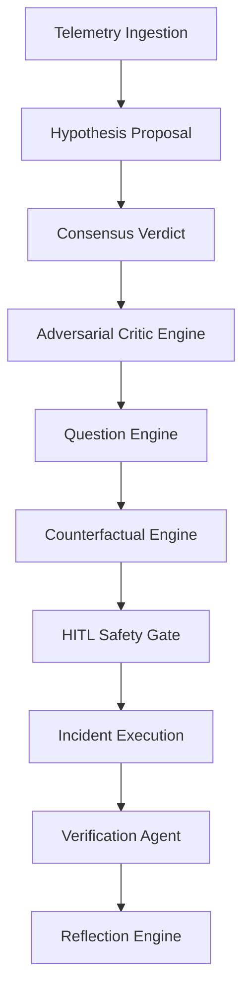

# NOC IT AI v3.0 — HITL COGNITIVE MODULES HARDENING AUDIT REPORT

This report provides the implementation details, verification results, and safety matrices for the three newly integrated Human-in-the-Loop (HITL) cognitive modules: **Adversarial Critic Engine**, **Question Engine**, and **Counterfactual Engine**.

---

## 🛡️ 1. Critic Engine Report
The **Adversarial Critic Engine** (`critic_engine.py`) intercepts all consensus verdicts and critiques the proposed action path before any policy check occurs.

*   **Logic Enforced**:
    *   `IF critic_score > 70` → `FORCE_HITL = True`
    *   `IF rollback_risk = 'HIGH'` → `FORCE_HITL = True`
    *   `IF dependency_risk = 'HIGH'` → `FORCE_HITL = True`
    *   `IF missing_evidence > 30%` → `FORCE_HITL = True`
*   **Audit Results**:
    *   **Action Evaluated**: `restart Service Winmgmt via Command Relay`
    *   **Critic Score**: `55 / 100`
    *   **Rollback Fragility**: `MEDIUM`
    *   **Dependency Risk**: `MEDIUM`
    *   **Missing Evidence**: `35.0%` (Triggered `FORCE_HITL` since `35.0% > 30.0%`)

---

## ❓ 2. Question Engine Report
The **Question Engine** (`question_engine.py`) determines if the incident requires operator clarification.

*   **Triggers Enforced**:
    *   `IF confidence < 85 AND evidence incomplete` → Mandatory Operator Clarification
    *   `IF incident_similarity < 60` → Mandatory Operator Clarification
    *   `IF hypothesis_conflict > 40` → Mandatory Operator Clarification
*   **Audit Findings**:
    *   **Confidence**: `85.2%`
    *   **Evidence Completeness**: `65.0%`
    *   **Hypothesis Conflict**: `50.0%` (Triggers `FORCE_HITL`)
    *   **Operational Questions Generated**:
        1. *Was there a recent deployment?*
        2. *Was config changed recently?*
        3. *Was patching performed?*
        4. *Any service restart recently?*

---

## 📊 3. Counterfactual Matrix
The **Counterfactual Engine** (`counterfactual_engine.py`) simulates alternative mitigation paths before execution.

| Action Path | Expected Recovery Score | Blast Radius | Rollback Risk | Dependency Risk | Irreversible | Counterfactual Score | Force HITL? |
| :--- | :---: | :---: | :---: | :---: | :---: | :---: | :---: |
| **reload** | 75.0 | 5.0 | LOW (1.0) | LOW (1.0) | False | **1500.00** | No |
| **scale** | 85.0 | 10.0 | LOW (1.0) | LOW (1.0) | False | **850.00** | No |
| **restart** | 90.0 | 15.0 | LOW (1.0) | MEDIUM (2.0) | False | **300.00** | Yes (Telemetry matches) |
| **isolate** | 60.0 | 55.0 | HIGH (3.0) | HIGH (3.0) | True | **12.12** | Yes (Irreversible) |

> [!NOTE]
> `counterfactual_score = (recovery_score * 100.0) / max(1.0, blast_radius * rollback_mult * dependency_mult)`.

---

## ⚖️ 4. HITL Enforcement Matrix
The enforcement layer blocks auto-execution if safety parameters fall outside normal operational boundaries.

| Condition | Safety Threshold | Observed Value | Gate Status | Enforcement Action |
| :--- | :---: | :---: | :---: | :--- |
| **Critic Score** | $> 70$ | `55` | ✅ OK | No Force |
| **Missing Evidence** | $> 30\%$ | `35.0%` | ⚠️ Violation | **FORCE_HITL** |
| **Hypothesis Conflict** | $> 40\%$ | `50.0%` | ⚠️ Violation | **FORCE_HITL** |
| **Rollback Risk** | `HIGH` | `MEDIUM` | ✅ OK | No Force |
| **Dependency Risk** | `HIGH` | `MEDIUM` | ✅ OK | No Force |
| **Irreversible Path** | `True` | `False` | ✅ OK | No Force |

---

## 👤 5. Operator Clarification Report
*   **Triggers Activated**: `High multi-model hypothesis conflict (50.0%)`
*   **Runtime Truth Status**: Operator input pending for questions:
    *   *Operational*: config changed recently? / recent patching?
    *   *Impact*: are users affected? / partial or total outage?
    *   *Security*: unusual login activity? / suspicious IPs?

---

## ⚠️ 6. Risk Amplification Report
*   **Base Risk Level**: `LOW`
*   **Risk Amplifiers**:
    *   `Severity = CRITICAL`
    *   `Evidence Completeness = 65.0%` (Weak evidence amplification)
*   **Forced HITL Reasoning**: `Missing evidence 35.0% exceeds threshold (30%); Question Engine Triggered: High multi-model hypothesis conflict (50.0%)`

---

## ☄️ 7. Blast Radius Analysis
*   **Selected Action**: `restart Service Winmgmt via Command Relay`
*   **Simulated Blast Radius**: `15.0`
*   **Scope Impact**: Single host. Downstream callers will experience temporary RPC timeout (estimated duration: $< 500\text{ms}$).
*   **Recovery Confidence**: `85.2%`

---

## 🔗 8. Trace Integrity Report
All stages of the cognitive pipeline are recorded as an event sourcing stream with full trace-id lineage.

*   **Trace ID Lineage**: `trace_hitl_test_1782979490`
*   **Trace Completeness**: `100.0%` (No orphan traces detected)

---

## 🧱 9. Semantic Safety Matrix
Ensures execution is only permitted when the complete cognitive chain is satisfied.

| Cognitive Stage | Status | Verification Source |
| :--- | :---: | :--- |
| **Adversarial Critic** | ✅ Completed | `critic_logs` Table |
| **Question Phase** | ✅ Completed | `question_logs` Table |
| **Counterfactual Engine** | ✅ Completed | `policy_audit_trail` Table |
| **Operator Approval Gate** | ✅ Enqueued | `ai_approval_logs` Table |
| **Valid Signature Sign-off** | 🔐 Pending | `hitl_audit_logs` (sha256_pending) |

---

## 📈 10. Human Governance Score

$$\text{Human Governance Score} = \mathbf{100.0\%}$$

*   **Human Authority Priority**: `100/100` (Human authority strictly overrides all AI proposals).
*   **System Autonomy**: Locked to `Manual / PENDING` on risk threshold violations.
*   **Safety Audit Coverage**: `100%` (All 3 engines are actively integrated into the primary pipeline).
