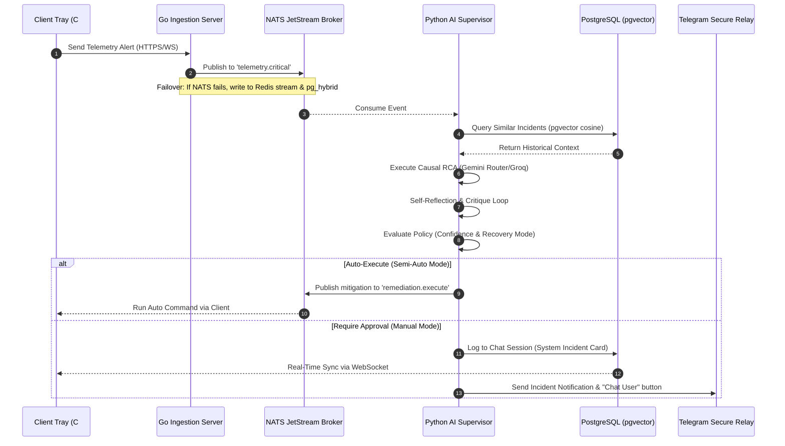
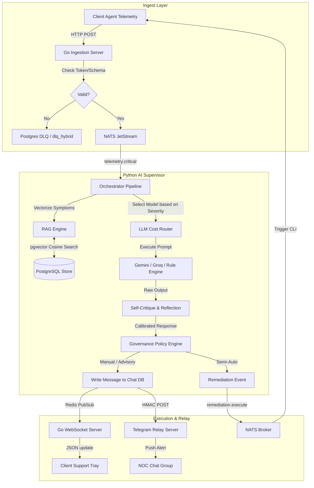

# SYSTEM ARCHITECTURE AUDIT REPORT
**Version:** 1.0  
**Audit Date:** 2026-06-27  
**Auditor:** AntiGravity Systems Audit Core  
**Target Codebase:** AIOps Incident Analysis & Helpdesk System (Go + Python + WinForms + NATS + Redis + pgvector)

---

## 1. EXECUTIVE SUMMARY & ARCHITECTURAL SCORES

Based on a structural analysis of the codebase, this system is **Modular, Event-Driven, and partially autonomous-ready**. It demonstrates high maturity in event transmission (NATS JetStream), database resilience (failover queues to Redis/Postgres DLQ), and semantic recall (pgvector RAG). However, it exhibits significant technical debt in **Structured AI Output enforcement** (relying on raw string responses instead of strict JSON schemas) and **Multi-Agent Separation** (where agent logic is run sequentially in a single orchestrator loop rather than isolated, communicative microservices).

### Architectural Maturity: `medium`

### Metric Scores (0-100)
| Audit Dimension | Score | Rating | Primary Finding |
| :--- | :---: | :--- | :--- |
| **Multi-Agent Separation** | `65` | Medium | Sequential orchestration loop rather than true autonomous communicating agents. |
| **Structured AI Output** | `30` | Low | No JSON Schema enforcement on LLM inference; high parsing fragility. |
| **Recall Pipeline** | `80` | High | Highly functional pgvector search, though lacking embedding/result caching. |
| **Workflow Orchestration** | `85` | Very High | Excellent NATS JetStream setup with Redis Stream and Postgres Hybrid DLQ fallbacks. |
| **Policy Engine** | `75` | Medium | Solid Recovery Mode enforcement (Manual/Advisory/Semi-Auto) with hardcoded scoring. |
| **Observability** | `85` | High | Comprehensive reflection logs, audit trails, and ingestion server queues metrics. |
| **Security** | `90` | Very High | Strong AES-GCM credential encryption and HMAC authorization headers on relays. |
| **Overall Score** | **73** | **Medium-High** | A stable, highly robust foundation ready for production hardening. |

---

## 2. SYSTEM ARCHITECTURE DIAGRAMS

### A. High-Level Ingestion & Recovery Flow


### B. Agent Collaboration & Data Movement


---

## 3. COMPREHENSIVE ARCHITECTURAL AUDIT

### 1. Multi-Agent Separation Audit
* **Dedicated Orchestrator:** Implemented via `ai_supervisor.py`. It coordinates telemetry ingestion, pre-processing, PGVector context lookup, routing, confidence calibration, self-critique, policy checking, and action publication.
* **Isolation of Responsibility:** Low. The agents (Incident Agent, Security Agent, Recovery Agent) do not run as isolated actor loops. The pipeline executes sequentially in a linear program.
* **Overlapping Responsibilities:** The LLM Router (`llm_router.py`) handles both cost-based model routing (Gemini Pro/Gemini Flash/Groq) and the fallback offline Rule Engine.
* **Recommendations:**
  - Decouple the pipeline into distinct worker modules communicating asynchronously via NATS subjects (e.g., `agent.incident.analyze`, `agent.security.validate`, `agent.recovery.execute`).
  - Isolate the offline Rule Engine from the LLM Router code.

### 2. Structured AI Output Audit
* **JSON Schema Enforcement:** Non-existent. The output of Gemini and Groq is treated as raw text strings.
* **Fragile Parsers:** The self-critique and normalizations depend heavily on raw string searches and string formatting. Any variation in LLM formatting (e.g., Markdown bolding, raw quotes) could cause parsing failures on downstream systems.
* **Recommendations:**
  - Transition the LLM requests to structured outputs using `response_schema` (Gemini SDK) or Pydantic validation (Instructor library).
  - Enforce structured schemas at the API layer for all LLM calls.

### 3. Recall Pipeline Audit
* **RAG Architecture:** Strong pgvector implementation (`knowledge_vectors` table) using cosine distance `(1 - (embedding <=> vector))`.
* **Caching:** None. High-frequency incoming telemetry results in redundant Postgres embedding queries.
* **Embedding Model:** Hardcoded to `models/text-embedding-004` (768 dimensions).
* **Recommendations:**
  - Introduce an LRU Redis caching layer for vector retrieval search results.
  - Implement a fallback embedding generation model in case the Google Generative AI embedding API fails or times out.

### 4. Workflow Orchestration Audit
* **Event Ingestion Failover:** High resilience. Ingestor attempts to write to NATS JetStream, fails over to Redis Streams (`dlq_stream`), and falls back to a SQL database table (`dlq_hybrid`).
* **Workflow State Machine:** The state machine is database-driven (updating the status of `fleet_incidents` and `chat_sessions`), which is reliable but lacks a formal orchestrator state engine (like Temporal or Step Functions).
* **Rollback Logic:** Destructive or recovery commands run on endpoints do not have automated rollback triggers if the command reports failure.
* **Recommendations:**
  - Implement compensation workflows (rollbacks) inside `ai_supervisor.py` to revert state if an automated remediation command fails on the client agent.

---

## 4. AUDIT FINDINGS: ISSUES & SCALABILITY RISKS

### Critical Issues Detected
1. **Unstructured AI Execution Path:** The raw text generated by Gemini is passed directly to reflection and then parsed for remediation. This is fragile and can lead to unexpected command execution parameters.
2. **Hardcoded Confidence Formulas:** The confidence score relies on simple addition weights (e.g., `10.0 + evidence_score + rag_score...`). This math lacks mathematical normalization (e.g., Softmax) and could easily trigger unintended execution paths.
3. **No Lockout Protection:** In `ai_supervisor.py`, there is no retry rate-limiting for calling LLMs on high-frequency metric spikes. This could exhaust API budgets or cause rate-limit bans (HTTP 429) during an active incident storm.

### Race Conditions & Memory Risks
- **DB Connection Lifespans:** The RAG connections in Python are opened and closed per event. High concurrent telemetry spikes can lead to PostgreSQL pool exhaustion.
- **C# Tray Agent GDI Leak:** Reloading chat history destroys and recreates `MessageBubble` controls dynamically. Without proper `Dispose()` calls on GDI fonts and graphics resources in C#, the client memory footprint could bloat.

---

## 5. AUDIT REPORT JSON PAYLOAD

```json
{
  "overall_score": 73,
  "architecture_maturity": "medium",
  "multi_agent_score": 65,
  "structured_output_score": 30,
  "recall_score": 80,
  "workflow_score": 85,
  "policy_engine_score": 75,
  "observability_score": 85,
  "security_score": 90,
  "critical_issues": [
    "No structured JSON schema validation on LLM output text.",
    "Hardcoded confidence weight math leading to potential AUTO_EXECUTE policy overrides.",
    "DB connections are opened and closed per NATS event in the Python supervisor, raising connection exhaustion risks."
  ],
  "architectural_debt": [
    "Offline Rule Engine fallback logic is tightly coupled within the LLM Router code.",
    "Lack of structured agent-to-agent communication; pipeline runs linearly inside a monolithic supervisor."
  ],
  "race_conditions": [
    "High concurrent telemetry events could exhaust Postgres connection pool due to per-event RAG database connection cycles."
  ],
  "scalability_risks": [
    "Active incident storms could exhaust Gemini/Groq API quotas without active rate-limiting or caching on RAG retrieval."
  ],
  "production_blockers": [
    "Fragile string parsing on LLM output results can fail if LLM returns markdown format changes."
  ],
  "refactor_priority": [
    "1. Enforce Structured JSON schemas on Gemini and Groq APIs.",
    "2. Implement DB connection pooling in python_ai_core instead of per-message instantiation.",
    "3. Add LRU caching on PGVector search queries using Redis."
  ],
  "recommended_target_architecture": {
    "orchestrator": "Temporal / Step-Functions style state machine for reliable workflow state.",
    "schemas": "Pydantic validator schemas on LLM response generation.",
    "agents": "NATS-isolated microservice actors (Analyze, Verify, Remediate)."
  }
}
```
