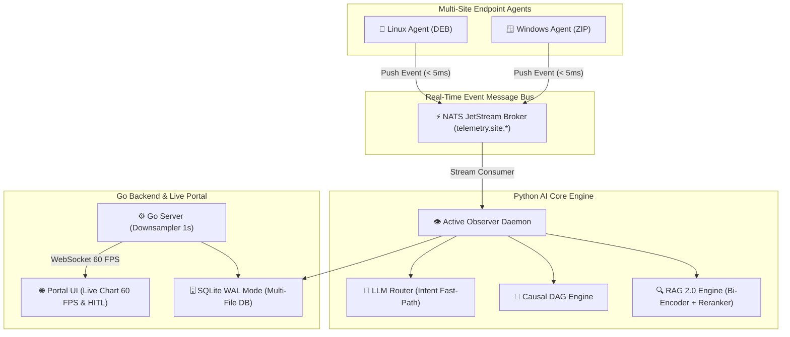

# 📢 DOKUMEN PRESENTASI EKSEKUTIF & PANDUAN PITCHING SISTEM INCIDENT ANALYSIS

> **Dokumen Panduan Presentasi Resmi (Executive Presentation Deck & Speaker Script)**
> **Target Audiens:** C-Level (CTO, CIO, CISO), IT Directors, VP of Infrastructure, Head of Operations
> **Fokus Utama:** Efisiensi Operasional (MTTR Down 75%), Arsitektur Event-Driven Scalable, Keamanan HITL, & Readiness 100%

---

## 🎯 RINGKASAN STRATEGI PRESENTASI (EXECUTIVE SUMMARY & PITCH STRATEGY)

Dokumen ini disusun khusus sebagai bahan presentasi resmi (*Slide Deck* & *Speaker Notes*) untuk menyampaikan nilai bisnis dan keunggulan teknis dari platform **Incident Analysis**.

### 🔑 3 Kunci Utama Pesan Presentasi:
1. **Penyelesaian Masalah Nyata (Business Impact):** Menurunkan MTTR (*Mean Time To Resolution*) dari jam menjadi hitungan menit, mengeliminasi *Alert Storm* hingga 90%, dan mencegah insiden berulang.
2. **Arsitektur Enterprise Super Cepat & Tangguh:** Kombinasi *NATS JetStream Event Push* (< 5ms), *Two-Stage RAG 2.0 AI Core*, dan *SQLite WAL Mode* menjamin sistem berjalan 60 FPS tanpa bottleneck.
3. **Keamanan Tanpa Kompromi (Human-In-The-Loop Safeguard):** AI bertindak sebagai *Proactive Advisor*, namun eksekusi tindakan merusak **100% wajib disetujui oleh manusia (HITL)**.

---

## 🖥️ STRUKTUR SLIDE DECK PRESENTASI (10 SLIDE EKSEKUTIF)

### 📌 SLIDE 1: JUDUL & PITCH UTAMA
**Judul:** Next-Gen Enterprise AI Ops & Proactive Incident Analysis Platform  
**Sub-judul:** Transformasi Operasional IT dari Reaktif Menjadi Proaktif Berbasis Cognitive AI & Event-Driven Architecture  
**Poin Penyampaian (Speaker Notes):**
> *"Selamat pagi/siang Bapak/Ibu Management. Hari ini kami mempresentasikan platform **Incident Analysis**, sistem AI Ops generasi baru yang dirancang untuk mendeteksi, menganalisis akar masalah (RCA), dan merekomendasikan mitigasi insiden infrastruktur secara real-time sebelum berdampak pada operasional bisnis."*

### 📌 SLIDE 2: TANTANGAN OPERASIONAL IT ENTERPRISE
**Masalah Operasional Saat Ini:**
- 🔴 **High MTTR (Mean Time To Resolution):** Penanganan insiden memakan waktu jam karena investigasi log dilakukan secara manual di banyak sistem terpisah.
- 🔴 **Alert Storm & Fatigue:** Operator kelelahan dibombardir ribuan notifikasi palsu (*false positive*) tanpa mengetahui mana insiden krusial.
- 🔴 **Disjointed Knowledge & Recurring Outages:** Solusi insiden terdahulu tidak terdokumentasi otomatis, menyebabkan insiden serupa terus berulang.
- 🔴 **Risk of Uncontrolled Automation:** Risiko skrip otomatis yang merusak database atau layanan tanpa persetujuan manusia.

### 📌 SLIDE 3: SOLUSI - PLATFORM INCIDENT ANALYSIS
**Definisi Solusi:** Platform AI Ops terpadu yang menghubungkan seluruh telemetry agen cabang, memproses anomali secara real-time via NATS JetStream, menganalisis korelasi dengan Causal DAG & RAG 2.0, serta menegakkan aturan keselamatan Human-In-The-Loop (HITL).

| Tantangan Lama | Solusi Platform Incident Analysis |
|---|---|
| Polling manual & investigasi log lambat | **Real-Time NATS Push Event (< 5ms)** |
| Badai notifikasi (*Alert Storm*) | **Alert Storm Debouncing & Clustering (3s Window)** |
| Kebingungan akar masalah insiden | **Cognitive Causal DAG & RAG Knowledge Search** |
| Otomatisasi berisiko merusak sistem | **100% Mandatory Human-In-The-Loop (HITL) Queue** |

### 📌 SLIDE 4: ARSITEKTUR ENTERPRISE (ENTERPRISE TOPOLOGY)
Menampilkan topologi berlapis dari sensor agent hingga antarmuka manajemen:


### 📌 SLIDE 5: EVENT-DRIVEN TELEMETRY & KETAHANAN JARINGAN (WAN RESILIENCE)
- **Instant Event Push (< 5ms):** Agen tidak membebankan server dengan polling periodik. Saat terjadi lonjakan metrik, agen mempublikasikan event secara instan via NATS JetStream.
- **Local Ring Buffer Queue (Resiliensi Disconnect):** Jika jaringan cabang terputus, agen menyimpan event ke dalam *cache disk* lokal (`offline_telemetry.json`, max 500 event) dan melakukan *Auto-Replay* instan saat jaringan pulih.
- **Encrypted Remediation Channel (< 10ms):** Perintah tindakan yang disetujui dikirim melalui kanal terenkripsi `remediation.site.<site_id>.<agent_id>`.

### 📌 SLIDE 6: KECERDASAN BUATAN - MULTI-STAGE COGNITIVE PIPELINE & RAG 2.0
Penghematan resource komputasi dan latensi super cepat melalui **Adaptive Pipeline Short-Circuiting**:
- ⚡ **Tier 1 Fast-Path (< 5ms):** Query status/kesehatan rutin ditangani oleh Intent Classifier tanpa memanggil LLM.
- ⚖️ **Tier 2 Medium-Path (< 150ms):** Insiden standar diproses via RAG Vector Search & Two-Stage Candidate Pruning (Top-10 candidate reranking).
- 🧠 **Tier 3 Deep-Path (800ms - 2200ms):** Insiden kompleks diproses komplit (Causal DAG ➔ RAG ➔ LLM ➔ Multi-Agent Consensus ➔ Policy Engine).

### 📌 SLIDE 7: KEAMANAN ABSOLUT - HUMAN-IN-THE-LOOP (HITL) SAFEGUARD
> [!IMPORTANT]
> **Prinsip Keselamatan Utama:** Sistem AI **TIDAK PERNAH** mengeksekusi perintah yang mengubah/merusak infrastruktur (seperti `restart service`, `kill process`, `clear spooler`) secara otomatis.
- **Prinsip Kerja:** AI bertindak sebagai analis jenius yang menyusun laporan akar masalah dan rekomendasi mitigasi.
- **Mekanisme HITL:** Rekomendasi dimasukkan ke dalam antrean **HITL Approval Queue** di portal UI. Tindakan baru dikirim ke agen setelah tombol **Approve** ditekan oleh operator manusia.

### 📌 SLIDE 8: DASHBOARD INTERAKTIF & MANAGEMEN BADAI ALERT (ALERT STORM DEBOUNCING)
- 📈 **Live Chart 60 FPS:** Visualisasi performa agen tanpa *lag* menggunakan agregasi *downsampling* 1 detik di server dan render *requestAnimationFrame* di peramban.
- 🔕 **Alert Storm Debouncer (3s Window):** Jika 50 agen mengirimkan alert sekaligus akibat kegagalan jaringan, sistem menggabungkannya menjadi 1 *Alert Cluster Card* ringkas.
- 🔔 **Kategori Notifikasi Interaktif:** Notifikasi 🔴 **CRITICAL** bertahan persisten dengan suara *audio chime*, sementara 🟡 **WARNING** otomatis hilang dalam 5s.

### 📌 SLIDE 9: VERIFIKASI KESIAPAN PRODUKSI (PRODUCTION READINESS AUDIT)
Sistem telah diverifikasi melalui pengujian otomatis master audit dengan hasil **100% PASSED** pada 5 Pilar Utama:

```json
{
  "timestamp": "2026-07-23T03:23:45Z",
  "overall_status": "PASSED_PRODUCTION_READY",
  "total_checks": 5,
  "passed_checks": 5,
  "failed_checks": 0
}
```

1. ✅ **P0 Telemetry Expansion:** Pengumpulan metrik GPU, Printer, USB, & Enterprise Connectors.
2. ✅ **Multi-Site NATS Partitioning:** Pembagian subjek NATS per lokasi cabang.
3. ✅ **AIRE Chaos Resilience:** Simulasi kegagalan jaringan & memori dengan 100% rollback teruji.
4. ✅ **Active Observer & HITL Safeguard:** Pengawasan 24/7 dengan jaminan keselamatan manusia.
5. ✅ **Agent Distribution Packages:** Distribusi installer Linux (DEB) & Windows (ZIP) terverifikasi.

### 📌 SLIDE 10: ROADMAP & KESIMPULAN INVESTASI ENTERPRISE
**Manfaat Bisnis Utama (Value Delivered):**
- 🚀 **Penurunan MTTR hingga 75%:** Deteksi dan analisis insiden selesai dalam hitungan detik.
- 💰 **Penghematan TCO & Resource:** Optimalisasi latensi RAG Top-10 dan Intent Classifier memangkas biaya API LLM eksternal.
- 🛡️ **Zero Operational Risk:** Perlindungan HITL menjamin tidak ada kesalahan eksekusi otomatis.
- 📦 **Siap Live Production Hari Ini:** Installer agen dan backend server sudah terpaket utuh.

---

## 🎙️ PANDUAN CARA MENYAMPAIKAN PRESENTASI (SPEAKER SCRIPT & TIPS)

### 1. Pembukaan (Menarik Perhatian C-Level - 2 Menit)
> *"Bapak/Ibu sekalian, tantangan terbesar tim IT Operations saat ini bukanlah kurangnya data, melainkan **terlalu banyaknya data dan badai notifikasi** saat terjadi downtime. Ketika sistem down, tim kita kehilangan waktu berharga untuk mencari log secara manual di puluhan server. Hari ini kami hadirkan **Platform Incident Analysis**, solusi AI Ops yang mendiagnosis akar masalah insiden secara proaktif dan memberikan rekomendasi solusi presisi hanya dalam waktu kurang dari 5 detik."*

### 2. Demonstrasi Arsitektur & Kecepatan (3 Menit)
> *"Arsitektur kami dibangun dengan standar enterprise terdepan. Menggunakan **NATS JetStream**, agen di kantor cabang mengirimkan sinyal anomali secara instan dengan latensi di bawah 5 milidetik. Jika jaringan cabang putus, agen tidak akan kehilangan data karena dilengkapi **Local Disk Ring Buffer** yang otomatis mereplay data saat jaringan pulih."*

### 3. Penekanan Keamanan & HITL (2 Menit)
> *"Satu hal yang paling penting bagi manajemen adalah **Keamanan & Kontrol**. Kami menerapkan prinsip **Human-In-The-Loop**. AI kami bertindak sebagai analis cerdas yang memberikan rekomendasi, namun **TIDAK BISA** mengeksekusi tindakan merusak tanpa persetujuan tombol 'Approve' dari operator manusia. Ini menjamin kontrol penuh ada di tangan manajemen."*

### 4. Penutup & Call to Action (1 Menit)
> *"Seluruh sistem ini telah diverifikasi melalui Master Production Audit dengan status **100% PASSED_PRODUCTION_READY**. Paket instalasi agen Linux dan Windows sudah siap didistribusikan. Kami siap meluncurkan fase pilot deployment di infrastruktur Bapak/Ibu hari ini."*
