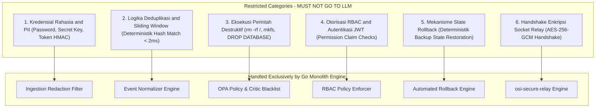
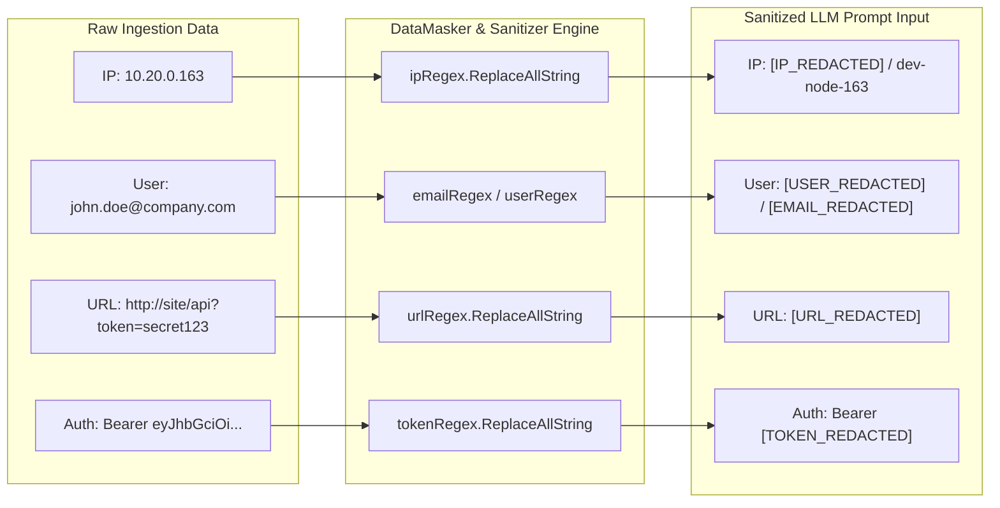
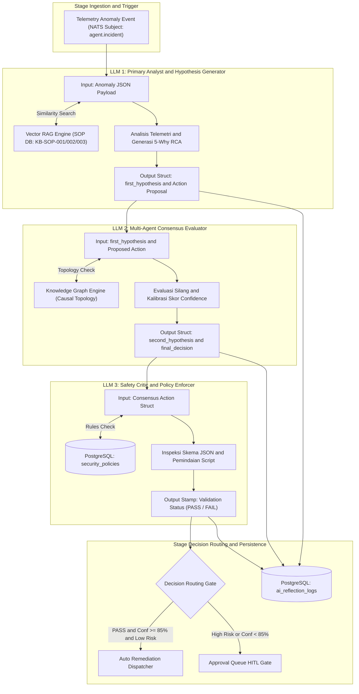
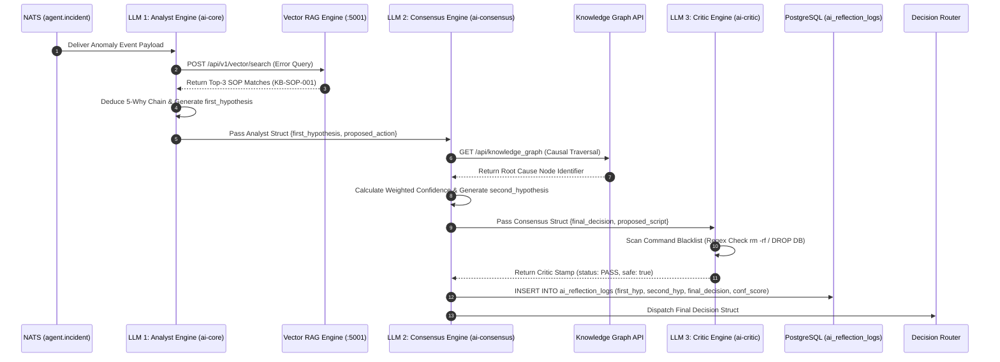
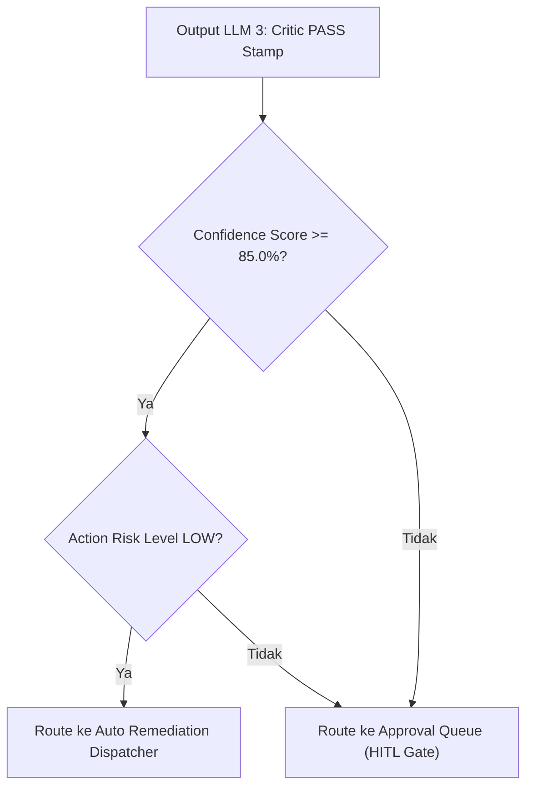

# 🧠 Spesifikasi Arsitektur 3 LLM Multi-Agent Consensus Engine

**Sistem**: NOC IT AI Command Center v3.0 (OSI Infrastructure)  
**Dokumen**: Standalone Dedicated Specification for 3-LLM Multi-Agent Reasoning, Consensus & Safety Enforcement  
**Tanggal**: 22 Juli 2026  
**Status**: Strictly Grounded on Codebase (`osi-python-ai-core`, `osi-ai-consensus`, `osi-ai-critic`)  

---

## 1. 📄 Ringkasan Eksekutif

Sistem **NOC IT AI Command Center v3.0** menerapkan arsitektur **3-LLM Multi-Agent Consensus Engine**. Pola ini membagi tugas penalaran kecerdasan buatan menjadi 3 peranan LLM yang terisolasi secara mandiri (*Decoupled AI Microservices*). 

Pendekatan ini menjamin **pencegahan halusinasi (*Hallucination Guardrail*)**, transparansi deduksi kausal (5-Why RCA), serta kepatuhan keamanan yang ketat sebelum suatu tindakan remediasi dieksekusi ke peranti target.

---

## 1.1 📦 Struktur Data Lengkap Pre-LLM (Sebelum Diolah 3 LLM)

Sebelum data telemetri diolah oleh **3 LLM Multi-Agent Consensus Engine**, data mentah melalui 3 tahapan pra-pemrosesan (*Harvest $\rightarrow$ Ingestion Normalization $\rightarrow$ Deduplication & Context Enrichment*).

Berikut adalah **Struktur JSON Lengkap Ter-Enrich (`Pre-LLM Struct Payload`)** yang dikirimkan melalui NATS Subject `agent.incident` untuk dikonsumsi oleh LLM 1:

```json
{
  "incident_metadata": {
    "incident_id": 412,
    "correlation_id": "corr-8f92a-20260722-00412",
    "trace_id": "4bf92f3577b34da6a3ce929d0e0e4736",
    "span_id": "0003",
    "parent_span_id": "0002",
    "created_at": "2026-07-22T11:45:00.124Z",
    "severity": "CRITICAL",
    "status": "OPEN",
    "ingestion_bridge_node": "osi-ingestion-server-01"
  },
  "device_context": {
    "device_id": "LINUX-PC-TMS",
    "hostname": "LINUX-PC-TMS",
    "ip_address": "10.20.0.163",
    "mac_address": "00:1A:2B:3C:4D:5E",
    "os_type": "linux",
    "os_distribution": "Ubuntu 22.04.4 LTS (Kernel 5.15.0-107-generic)",
    "site_location": "Jakarta-HQ-MKT",
    "agent_version": "v2.0.0",
    "agent_status": "ONLINE",
    "kg_node_id": "node-dev-linux-tms-163"
  },
  "telemetry_metrics": {
    "cpu_usage_percent": 98.4,
    "memory_usage_percent": 88.2,
    "disk_usage_percent": 42.1,
    "swap_usage_percent": 12.0,
    "load_average_1m": 14.85,
    "active_process_count": 312,
    "failed_services": [
      "nginx.service",
      "winmgmt-wmi-bridge.service"
    ],
    "monitored_ports": {
      "port_80": "CLOSED",
      "port_443": "OPEN",
      "port_4222": "CONNECTED"
    }
  },
  "raw_logs_snippet": [
    "2026-07-22 11:44:58 [error] 4120#0: *120 worker process deadlock detected on event loop",
    "2026-07-22 11:45:00 [alert] systemd[1]: nginx.service: Main process exited, code=exited, status=1/FAILURE",
    "2026-07-22 11:45:00 [crit] systemd[1]: winmgmt-wmi-bridge.service: Failed with result 'timeout'."
  ],
  "topology_neighbors": [
    {
      "neighbor_id": "GATEWAY-01",
      "relation": "CONNECTS_TO",
      "status": "HEALTHY"
    },
    {
      "neighbor_id": "POSTGRES-DB-01",
      "relation": "DEPENDS_ON",
      "status": "HEALTHY"
    }
  ],
  "deduplication_window": {
    "window_seconds": 60,
    "event_hash": "a8f9c2e1b4382094857201948571029485710294857102948571029485710294",
    "merged_event_count": 4
  }
}
```

---

## 1.2 📜 Kebijakan & Aturan Sistem (System Policies & Enforcement Rules)

Sebelum data olahan 3 LLM diizinkan untuk mengeksekusi aksi perbaikan atau menyusun keputusan, sistem memberlakukan **5 Lapisan Kebijakan Strik (*Strict System Policies*)**:

```mermaid
flowchart TD
    subgraph P1 ["Policy 1: System Operational Recovery Mode (system_config)"]
        P1_Check{"Mode Operational?"}
        P1_Check -- Full-Auto --> P1_Pass["Auto Exec Conf >= 85%"]
        P1_Check -- Advisory / Semi-Auto --> P1_HITL["Force HITL Approval Queue"]
        P1_Check -- Emergency Kill Switch --> P1_Block["Hentikan Seluruh Action"]
    end

    subgraph P2 ["Policy 2: Security & Command Blacklist (security_policies & OPA)"]
        P2_Scan{"Cek Blacklist Regex & DB Rules"}
        P2_Scan -- Lolos Scan --> P2_Pass["Critic Stamp: PASS"]
        P2_Scan -- Terdeteksi (rm -rf / DROP DB) --> P2_Fail["Critic Stamp: FAIL & Block Execution"]
    end

    subgraph P3 ["Policy 3: Calibrated Confidence Threshold Policy"]
        P3_Score{"Conf Score Calculator"}
        P3_Score -- Conf >= 85.0% --> P3_Auto["Memenuhi Syarat Auto Dispatched"]
        P3_Score -- Conf < 85.0% --> P3_HITL["Route ke Approval Queue (/approval_queue)"]
    end

    subgraph P4 ["Policy 4: Learning Gate Policy (learning_gate_policies)"]
        P4_Check{"Post-Check Pass Rate >= 95%?"}
        P4_Check -- Ya --> P4_Injest["Update RAG SOP Vector Weight"]
        P4_Check -- Tidak --> P4_Discard["Discard Learning & Trigger Rollback"]
    end

    subgraph P5 ["Policy 5: RBAC Role Authorization Policy (rbac_roles)"]
        P5_Check{"User Role Level"}
        P5_Check -- superadmin / admin / noc_engineering / operator --> P5_Allow["Izin Approve / Reject"]
        P5_Check -- viewer --> P5_Deny["Read-Only Access"]
    end
```



### 📋 Perincian 5 Kebijakan Utama:

1. **Policy 1 — System Operational Recovery Mode (`system_config`)**:
   - **Mode `Full-Auto`**: Jika confidence $\ge 85\%$ dan tingkat risiko `LOW`, AI diizinkan mengeksekusi remediasi secara otonom tanpa konfirmasi manusia.
   - **Mode `Advisory` / `Semi-Auto`**: Seluruh tindakan remediasi (tanpa terkecuali) wajib ditahan di **Approval Queue** (`/approval_queue`) untuk disetujui oleh Operator NOC.
   - **Mode `Emergency Kill Switch`**: Menghentikan seluruh pipeline eksekusi otonom jika terjadi kondisi darurat infrastruktur.

2. **Policy 2 — Security Policies & Command Blacklist (`security_policies` DB & OPA Rego)**:
   - Memeriksa skrip aksi terhadap **Regex Command Blacklist**:
     ```regex
     (?i)(rm\s+-rf|mkfs|dd\s+if=|shutdown|reboot|drop\s+database|truncate\s+table|chmod\s+777\s+/|curl.*\|.*sh|wget.*\|.*sh)
     ```
   - Apabila skrip terindikasi destruktif, `osi-ai-critic` langsung memberikan stempel `status: FAIL` dan memblokir eksekusi.

3. **Policy 3 — Calibrated Confidence Score Threshold**:
   - Ambang batas pembobotan confidence:
     - $\text{Confidence} \ge 85.0\%$: Memenuhi syarat eksekusi otomatis.
     - $\text{Confidence} < 85.0\%$: Wajib membutuhkan persetujuan manusia (*Human-in-the-Loop*).

4. **Policy 4 — Learning Gate Admission Policy (`learning_gate_policies`)**:
   - Mengharuskan tingkat keberhasilan verifikasi kesehatan pasca-tindakan $\ge 95\%$ sebelum draf SOP baru atau penyesuaian bobot di-ingest ke Vector RAG Database.

5. **Policy 5 — RBAC Role Authorization Policy (`rbac_roles`)**:
   - Hanya peran `superadmin`, `admin`, `noc_engineering`, dan `operator` yang diberi otorisasi untuk mengeksekusi persetujuan (*Approve*) atau penolakan (*Reject*) di antrean persetujuan HITL.

---

## 1.3 🚫 Restriksi Strik & Komponen yang TIDAK BOLEH Dilempar ke LLM (Zero-Trust Boundaries)

Dalam arsitektur enterprise **NOC IT AI Command Center v3.0**, memberlakukan prinsip **Zero-Trust AI Boundary**. Terdapat **6 Kategori Spesifik yang DIHARAMKAN TOTAL / TIDAK BOLEH dilempar atau diserahkan kepada LLM**:



### 📋 Perincian 6 Kategori Restriksi:

1. **🔒 Kredensial Rahasia, Key Cryptographic, & Data PII (Sensitive Secrets & PII Redaction)**:
   - **Data**: Password database (`DB_PASSWORD`), Private Key RSA, Token HMAC (`SHOW_CHAT` signature), Token NATS Auth, JWT Secret Key (`TELEGRAM_CHAT_ID`), Alamat IP mentah, User ID personal, dan URL mentah.
   - **Aturan**: **DIBERSIHKAN TOTAL (*Sanitized/Redacted*)** oleh `DataMasker` (`SERVER/go_core/security/security.go`) sebelum telemetri dikirim ke NATS atau dikonsumsi oleh LLM. LLM tidak pernah melihat kredensial atau identitas mentah.

---

## 1.4 🛡️ Penanganan Khusus User ID, IP Address, & URL Redaction (`DataMasker`)

Modul **`DataMasker` (`SERVER/go_core/security/security.go`)** dan **`LLM Router Sanitizer` (`SERVER/python_ai_core/llm_router.py`)** secara aktif memindai dan mengganti data identitas sensitif menjadi bentuk anonim/placeholder sebelum prompt disusun untuk 3 LLM:



### 📋 Tabel Aturan Penyamaran Data Sensitif:

| Tipe Data | Format Mentah | Format yang Diterima LLM | Kode Sumber Penanggung Jawab |
| :--- | :--- | :--- | :--- |
| **Alamat IP** | `10.20.0.163` / `192.168.1.1` | `[IP_REDACTED]` / `dev-node-163` | `SERVER/go_core/security/security.go:249` |
| **User ID & Email** | `john.doe@company.com` / `SID-1-5-21` | `[USER_REDACTED]` / `[EMAIL_REDACTED]` | `SERVER/go_core/security/security.go:250` |
| **URL Parameter** | `http://10.20.0.163/api?token=xyz` | `[URL_REDACTED]` | `SERVER/python_ai_core/llm_router.py:58` |
| **Password & Token** | `password: Secret123!`, `Bearer eyJ...` | `[PASSWORD_REDACTED]`, `Bearer [TOKEN_REDACTED]` | `SERVER/go_core/security/security.go:252` |

---

2. **⚡ Operasi Deterministik Berlatensi Tinggi & Deduplikasi Log (Sub-Millisecond Engine)**:
   - **Proses**: Deduplikasi log slide-window 60 detik, kalkulasi SHA-256 hash match, dan status *Fleet Ping Online/Offline*.
   - **Aturan**: Dikelola secara deterministik oleh **Go Engine (`Event Normalizer Engine`)** dan **Redis TTL** ($\mathcal{O}(1)$). Tidak dilempar ke LLM karena membutuhkan kepastian matematika 100% dan latensi $< 2\text{ms}$.

3. **🛑 Eksekusi Perintah Destruktif Mentah (Destructive Shell Execution)**:
   - **Perintah**: `rm -rf /`, `mkfs.ext4`, `dd if=/dev/zero`, `DROP DATABASE`, `TRUNCATE TABLE`, `chmod 777 /`, `shutdown -h now`.
   - **Aturan**: **DIHARAMKAN TOTAL**. LLM tidak diizinkan menyusun atau mengeksekusi shell command destruktif mentah. Seluruh tindakan remediasi wajib dipetakan ke **Playbook Terdaftar (`KB-SOP-xxx`)**.

4. **🔑 Otorisasi RBAC & Hak Akses Pengguna (User Access Control)**:
   - **Proses**: Evaluasi apakah seorang user berhak menyetujui insiden, membuka panel `/rbac`, atau mengubah `security_policies`.
   - **Aturan**: Dievaluasi secara **deterministik oleh Middleware Go (`RBAC Policy Enforcer`)** dengan mengecek klaim JWT Token. LLM tidak memiliki otoritas dalam menentukan hak akses pengguna.

5. **🔁 Mekanisme Backup & State Rollback (Deterministic State Restoration)**:
   - **Proses**: Pengembalian state konfigurasi peranti ke snapshot backup lama saat verifikasi pasca-tindakan gagal.
   - **Aturan**: Dijalankan secara **deterministik oleh `Automated Rollback Engine` (Go)**. LLM tidak diizinkan secara improvisasi membuat skrip rollback sendiri.

6. **📞 Enkripsi Socket & Protocol Handshake (`osi-secure-relay`)**:
   - **Proses**: Pembungkusan payload enkripsi AES-256-GCM dan negosiasi socket TCP dengan peranti agen.
   - **Aturan**: Ditangani 100% oleh **Go Secure Relay**. LLM hanya mengirimkan Playbook ID yang telah disetujui, tanpa menyentuh layer kriptografi.

---

## 2. 📐 Diagram Arsitektur & Pipeline 3 LLM

### 2.1 Diagram Flowchart Alur Konsensus 3 LLM



---

### 2.2 Sequence Diagram Interaksi 3 LLM Engine



---

## 3. 🔍 Perincian Rinci Peran & Spesifikasi 3 LLM

---

### 🤖 LLM 1 — Primary Analyst & Hypothesis Generator

* **Nama Service**: `osi-python-ai-core` (Port `5000`)
* **File Kode Sumber**: `SERVER/ai_core/cognitive_engine.py` & `SERVER/python_ai_core/ai_engine.py`
* **Peran Sistem**: *First Responder Analyst*
* **Tujuan**: Menganalisis telemetri mentah, mengonversi teks error menjadi vector embedding, mencari dokumen SOP dari Vector RAG (`KB-SOP-001/002/003`), dan memformulasi hipotesis awal (*First Hypothesis*).
* **Skema Input**:
  ```json
  {
    "incident_id": 370,
    "device_name": "PC-MKT-NUC",
    "raw_telemetry": "WINMGMT_DEADLOCK: High CPU 98.4% on pid 4120",
    "timestamp": "2026-07-22T11:45:00Z"
  }
  ```
* **Skema Output**:
  ```json
  {
    "first_hypothesis": "Terjadi deadlock pada layanan Winmgmt akibat penumpukan antrean spooler lokal.",
    "proposed_action": "EXECUTE_PLAYBOOK_RESTART_WINMGMT",
    "rag_sop_id": "KB-SOP-001",
    "rag_similarity_score": 0.94
  }
  ```

---

### 🧠 LLM 2 — Multi-Agent Consensus Evaluator

* **Nama Service**: `osi-ai-consensus` (Container: `osi-ai-consensus`)
* **File Kode Sumber**: `SERVER/python_ai_core/consensus_engine.py` & `SERVER/services/consensus_service.py`
* **Peran Sistem**: *Senior System Reviewer & Consensus Arbiter*
* **Tujuan**: Menguji draf hipotesis LLM 1 terhadap topologi dependensi Knowledge Graph (`/api/knowledge_graph`), menguji konsistensi lintas agen, mengkalkulasi skor confidence terkalibrasi, dan menghasilkan *Second Hypothesis*.
* **Formula Kalibrasi Skor Confidence**:
  $$\text{Confidence Score} = (S_{\text{RAG}} \times 0.40) + (S_{\text{Topology}} \times 0.40) + (S_{\text{Critic}} \times 0.20)$$
* **Skema Input**:
  ```json
  {
    "first_hypothesis": "Terjadi deadlock pada layanan Winmgmt...",
    "proposed_action": "EXECUTE_PLAYBOOK_RESTART_WINMGMT",
    "rag_score": 0.94
  }
  ```
* **Skema Output**:
  ```json
  {
    "second_hypothesis": "Konfirmasi Root Cause Node: PC-MKT-NUC. Nginx worker deadlock dipicu oleh Winmgmt WMI query stall.",
    "final_decision": "RECOMMENDED_ACTION: restart winmgmt && net start spooler",
    "confidence_score": 0.958,
    "consensus_pattern": "WEIGHTED_CONFIDENCE"
  }
  ```

---

### 🛡️ LLM 3 — Safety Critic & Policy Enforcer

* **Nama Service**: `osi-ai-critic` (Port `5002`) & `osi-ai-policy` (Port `5003`)
* **File Kode Sumber**: `SERVER/ai_critic/critic_engine.py` & `SERVER/ai_policy/policy_engine.py`
* **Peran Sistem**: *Security & Safety Compliance Officer*
* **Tujuan**: Memvalidasi skema JSON hasil konsensus LLM 2, memindai perintah terhadap *command blacklist* (mencegah `rm -rf /`, `DROP DATABASE`, `mkfs`), dan memverifikasi aturan tabel `security_policies`.
* **Daftar Hitam Perintah Destruktif (Command Blacklist Regex)**:
  - `(?i)(rm\s+-rf|mkfs|dd\s+if=|shutdown|reboot|drop\s+database|truncate\s+table)`
* **Skema Input**:
  ```json
  {
    "final_decision": "RECOMMENDED_ACTION: restart winmgmt && net start spooler",
    "proposed_script": "net stop winmgmt && net start winmgmt"
  }
  ```
* **Skema Output**:
  ```json
  {
    "status": "PASS",
    "safe": true,
    "critic_confidence_modifier": 1.0,
    "blocked_patterns_found": []
  }
  ```

---

## 4. 🔀 Decision Routing Gate & Handshake Keamanan

Setelah melalui tahapan evaluasi 3 LLM, keputusan dialirkan ke **Routing Decision Gate**:



| Kondisi Evaluasi | Status Keputusan | Kanal Tindakan | Action Result |
| :--- | :--- | :--- | :--- |
| **Conf $\ge 85.0\%$ & Risk LOW & Critic PASS** | `AUTO_APPROVED` | Command Relay (`osi-secure-relay`) | Eksekusi Otomatis (*Auto-Healed*) |
| **Conf $< 85.0\%$ ATAU Risk HIGH** | `WAITING_APPROVAL` | Approval Queue (`/approval_queue`) | Ditahan di Antrean Persetujuan Manusia |
| **Critic FAIL (Melanggar Blacklist)** | `REJECTED_SECURITY` | Log Audit Keamanan | Eksekusi Dibatalkan & Alert Keamanan |

---

## 💾 5. Persistensi Database PostgreSQL (`osi_system`)

Seluruh rekam jejak penalaran 3 LLM disimpan secara permanen di database PostgreSQL pada tabel `ai_reflection_logs`:

```sql
INSERT INTO public.ai_reflection_logs (
    incident_id,
    stage_version,
    first_hypothesis,    -- Dihasilkan oleh LLM 1 (Analyst Engine)
    second_hypothesis,   -- Dihasilkan oleh LLM 2 (Consensus Engine)
    final_decision,      -- Dihasilkan oleh LLM 2 (Final Consensus Output)
    confidence_score,    -- Calibrated Weighted Score (0.00 - 1.00)
    ai_models_used,      -- "multi-agent-consensus-v3 (LLM1+LLM2+LLM3)"
    decision_time_ms,    -- Latensi Total Penalaran (cth: 380 ms)
    trace_id,            -- OpenTelemetry TraceID
    span_id,             -- OpenTelemetry SpanID
    parent_span          -- Parent SpanID
) VALUES (
    370,
    'v3.0-consensus',
    'Terjadi deadlock pada layanan Winmgmt...',
    'Konfirmasi Root Cause Node: PC-MKT-NUC...',
    'RECOMMENDED_ACTION: restart winmgmt',
    0.958,
    'multi-agent-consensus-v3',
    380,
    '4bf92f3577b34da6a3ce929d0e0e4736',
    '0009',
    '0005'
);
```

---

## 🏛️ Kesimpulan

Arsitektur **3 LLM Multi-Agent Consensus Engine** pada NOC IT AI Command Center v3.0 menjamin bahwa setiap keputusan remediation otonom **tidak hanya berpatokan pada 1 LLM tunggal**, melainkan melalui proses **Analisis (LLM 1) $\rightarrow$ Konsensus & Topologi (LLM 2) $\rightarrow$ Verifikasi Keamanan (LLM 3)** secara terisolasi dan transparan.
