# DOKUMEN ARSITEKTUR ENTERPRISE & VISUALISASI TOPOLOGI SISTEM INCIDENT ANALYSIS

> **Spesifikasi Diagram Arsitektur Tingkat Enterprise (Enterprise Solution & Software Architecture)**
> **Tanggal Rilis & Audit:** 23 Juli 2026
> **Status System:** PASSED_PRODUCTION_READY
> **Arsitek:** Enterprise Solution Architect, Principal Software Architect & System Visualization Expert

---

## 1. Enterprise System Topology Diagram

Diagram topologi menyeluruh yang menghubungkan pengguna, antarmuka web, backend Go, AI core Python, NATS JetStream, microservices Docker, agen endpoint, dan infrastruktur enterprise eksternal.

```mermaid
graph TD
    classDef client fill:#3b82f6,stroke:#1d4ed8,color:#fff,stroke-width:2px;
    classDef web fill:#0284c7,stroke:#0369a1,color:#fff,stroke-width:2px;
    classDef backend fill:#0d9488,stroke:#0f766e,color:#fff,stroke-width:2px;
    classDef ai fill:#7c3aed,stroke:#6d28d9,color:#fff,stroke-width:2px;
    classDef db fill:#d97706,stroke:#b45309,color:#fff,stroke-width:2px;
    classDef broker fill:#ea580c,stroke:#c2410c,color:#fff,stroke-width:2px;
    classDef infra fill:#475569,stroke:#334155,color:#fff,stroke-width:2px;
    classDef ext fill:#dc2626,stroke:#b91c1c,color:#fff,stroke-width:2px;

    subgraph ClientLayer [Client and User Layer]
        U["System Administrator"]:::client
        CE["Chrome Extension OSI Assistant"]:::client
    end

    subgraph PresentationLayer [Web Portal Presentation Layer]
        WP["System Portal Web UI"]:::web
        DB_M["Dashboard Utama"]:::web
        INC_M["Incident Management"]:::web
        TEL_M["Telemetry Monitoring"]:::web
        AI_M["AI Ops Cognition"]:::web
        KB_M["Knowledge Base RAG"]:::web
        AUD_M["System Audit Verification"]:::web
        SET_M["Settings Governance"]:::web
    end

    subgraph APIGateway [API Gateway Controller]
        REST["HTTP REST API Gateway"]:::backend
        WS["WebSocket Stream Server"]:::backend
    end

    subgraph CoreBackend [Go Backend Services]
        GB["Go Dashboard Server Core"]:::backend
        LS["Launcher Service Manager"]:::backend
        SR["Secure Encrypted Relay Service"]:::backend
    end

    subgraph AICore [Python AI Core Engine]
        PAI["Python AI Supervisor Cognition"]:::ai
        LLMR["LLM Router GPT4 Ollama"]:::ai
        RAG["RAG Vector Search Reranker"]:::ai
        DAG["Causal DAG Engine RCA"]:::ai
        GOV["Policy Engine HITL Safeguard"]:::ai
        OBS["Active Observer Daemon 247"]:::ai
        CHS["Autonomous Chaos Worker"]:::ai
    end

    subgraph Persistence [Persistence Broker Layer]
        NATS["NATS JetStream Event Broker"]:::broker
        SQL_INC["incident_analysis DB SQLite"]:::db
        SQL_SO["sprint_o DB State Machine"]:::db
        SQL_RAG["sprint_q_rag DB Vector Store"]:::db
        SQL_COG["cognitive_memory DB Memory DB"]:::db
        FTP["FTP Share OTA Storage"]:::db
    end

    subgraph AutomationInfra [Automation Container Infra]
        DK["Docker Microservices Engine"]:::infra
        N8N["n8n Workflow Automation Engine"]:::infra
        CASA["CasaOS System Management"]:::infra
    end

    subgraph EndpointAgents [Monitoring Agents]
        AL["Linux Agent Service"]:::client
        AW["Windows Agent Service"]:::client
    end

    subgraph ExternalServices [External Enterprise Integration]
        LDAP["LDAP Active Directory"]:::ext
        KAFKA["Apache Kafka Cluster"]:::ext
        DNS["Enterprise DNS DHCP"]:::ext
        K8S["Kubernetes Cluster"]:::ext
    end

    U --> WP
    CE --> REST
    WP --> DB_M & INC_M & TEL_M & AI_M & KB_M & AUD_M & SET_M
    DB_M & INC_M & TEL_M & AI_M & KB_M & AUD_M & SET_M --> REST & WS
    REST & WS --> GB
    GB --> LS & SR & NATS
    GB --> PAI
    PAI --> LLMR & RAG & DAG & GOV & OBS & CHS
    GB --> SQL_INC & SQL_SO
    PAI --> SQL_RAG & SQL_COG
    NATS --> AL & AW
    AL & AW --> NATS
    GB --> LDAP & KAFKA & DNS & K8S
    DK --> NATS & N8N & CASA
```

---

## 2. Package Dependency Graph

Visualisasi ketergantungan antar 10 Package Utama dalam arsitektur Incident Analysis.

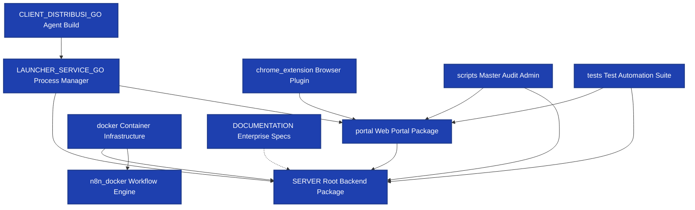

---

## 3. Subpackage Dependency Graph

Visualisasi ketergantungan antar subpackage kognitif, tata kelola, memori, dan runtime.

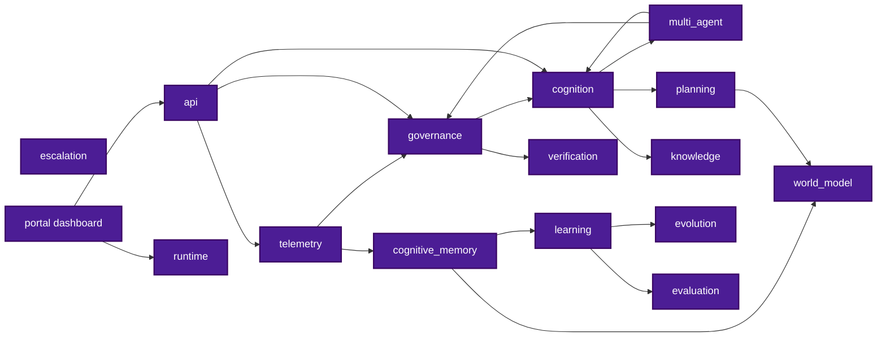

---

## 4. Module Dependency Graph

Ketergantungan modul dengan class, function, service, database, API, daemon, dan worker.

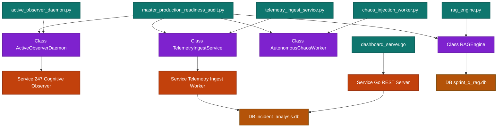

---

## 5. Runtime Execution Flow Diagram

Alur eksekusi dari startup hingga respon dan pencatatan audit.

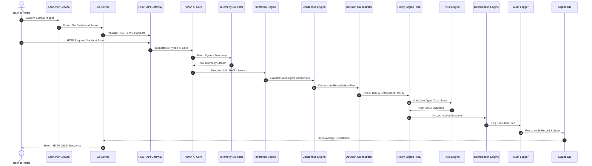

---

## 6. Incident Pipeline Architecture

Pipeline pemrosesan insiden end-to-end dari event hardware hingga pembaharuan RAG dashboard.

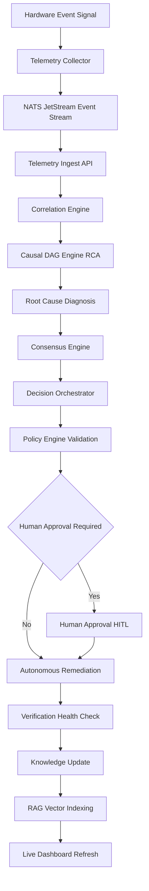

---

## 7. RAG Knowledge Pipeline Diagram

Pipeline penelusuran dan ekstraksi pengetahuan dokumen insiden dan ADR.

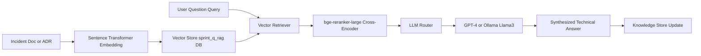

---

## 8. AI Cognition Pipeline Diagram

Alur penalaran kognitif 24/7 dari telemetri hingga pencatatan audit.

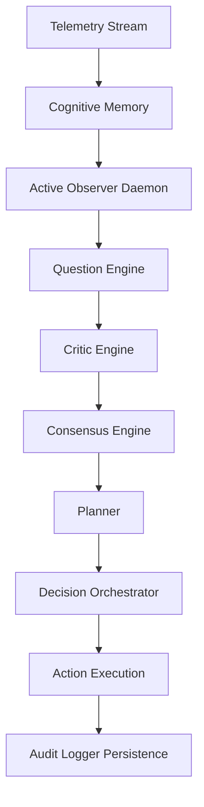

---

## 9. Learning Pipeline Architecture

Alur ekstraksi fitur, temporal learning, penentuan versi, dan registry model.

```mermaid
flowchart LR
    TEL["Telemetry"] --> FE["Feature Extraction"]
    FE --> FS["Feature Store"]
    FS --> TL["Temporal Learning"]
    TL --> IL["Infrastructure Learning"]
    IL --> RL["Remediation Learning"]
    RL --> KS["Knowledge Store"]
    KS --> VER["Model Versioning"]
    VER --> EVAL["Model Evaluation"]
    EVAL --> MET["Performance Metrics"]
    MET --> REG["Model Registry"]
```

---

## 10. Verification Pipeline Architecture

Pipeline verifikasi otomatis 5 pilar arsitektur dan pengujian ketahanan.

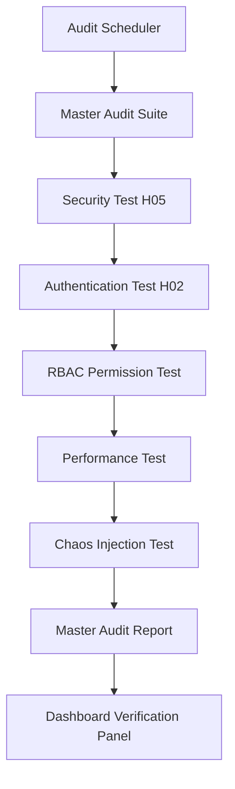

---

## 11. Deployment Topology Diagram

Topologi penyebaran node agent, NATS cluster, Go backend, Python AI, Docker, dan extension.

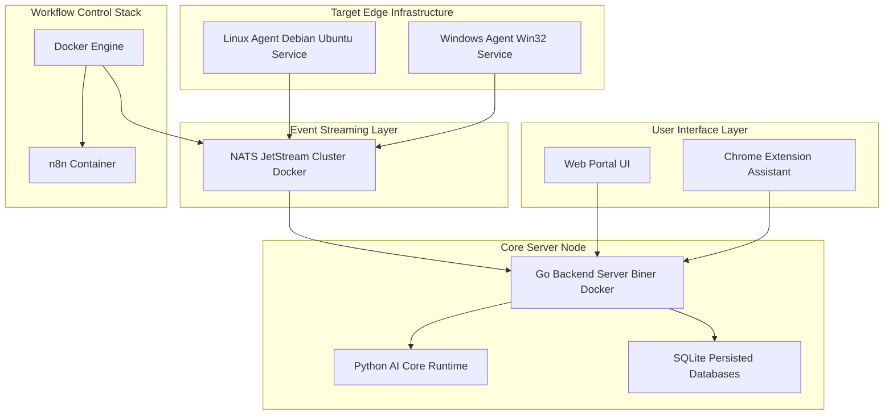

---

## 12. Class Dependency Graph

Grafik hubungan antar class utama dalam arsitektur Incident Analysis.

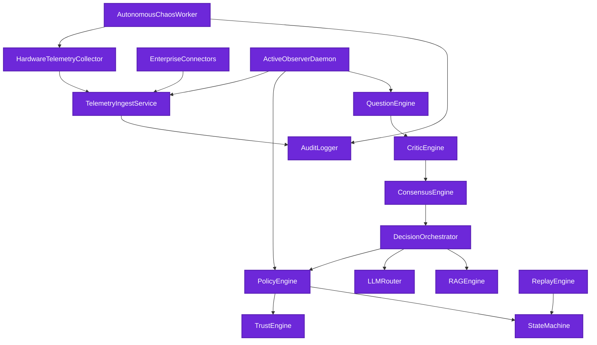

---

## 13. Microservice Architecture by Domain

Pemisahan domain microservices pada arsitektur sistem Incident Analysis.

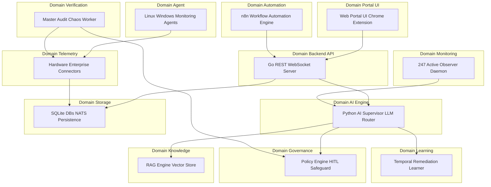

---

## 14. Database Relationship Data Store Model

Visualisasi hubungan antar penyimpanan SQLite dan file store.

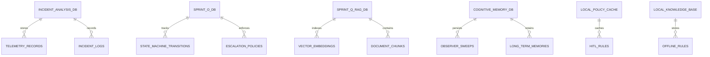

---

## 15. Data Flow Diagram DFD

Aliran data dari input telemetri hingga pembaruan pengetahuan dan visualisasi.

```mermaid
flowchart LR
    INP["Input Hardware User Query"] --> PROC["Data Processing Ingestion"]
    PROC --> INF["AI Inference LLM RAG"]
    INF --> DEC["Action Decision"]
    DEC --> REM["Remediation Execution"]
    REM --> AUD["Audit Logging"]
    AUD --> KNOW["Knowledge Base Update"]
    KNOW --> VIS["Dashboard Visualization"]
```

---

## 16. C4 Model Architecture

C4 Model diagram yang terdiri dari Level 1 Context, Level 2 Container, Level 3 Component, dan Level 4 Code.

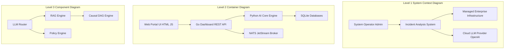

---

## 17. System Sequence Diagram

Diagram sekuensial lengkap interaksi antarkomponen dari permintaan pengguna hingga pembaruan dashboard.

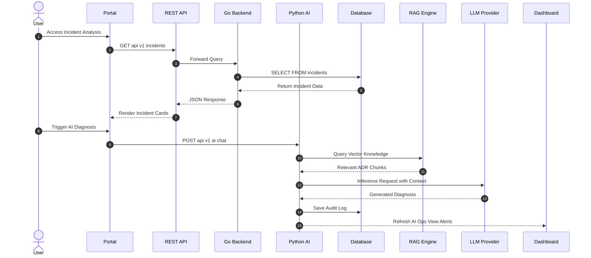

---

## 18. State Machine Diagram

Siklus transisi status pengamatan, diagnosa, konsensus, mitigasi, dan pembelajaran sistem.

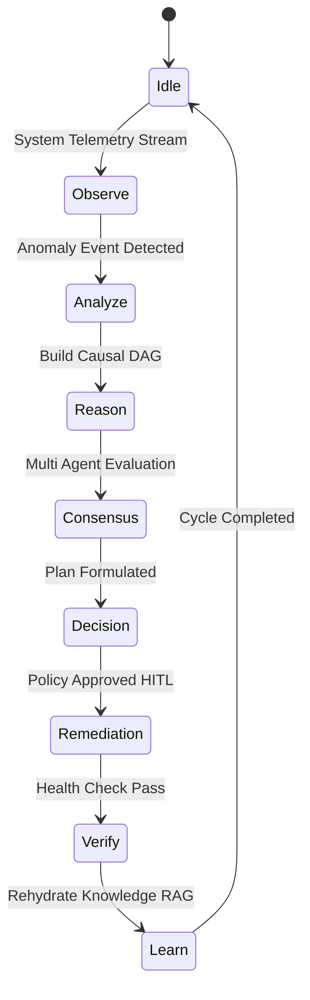

---

## 19. Layered Architecture Diagram

Arsitektur berlapis enterprise dari Layer Presentasi hingga Layer Persistensi.

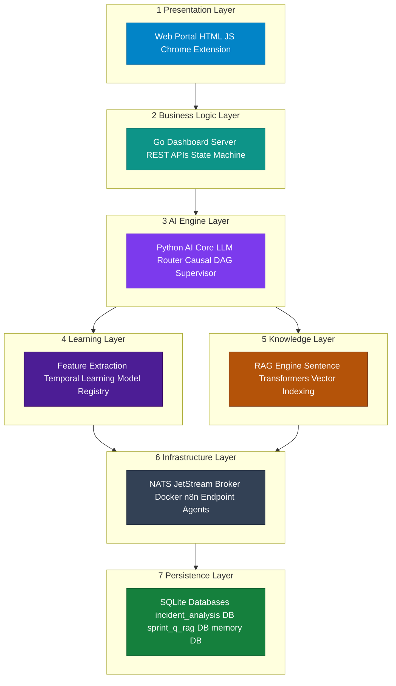

---

## VERIFIKASI & KEPATUHAN ENTERPRISE

Seluruh 19 diagram arsitektur enterprise di atas dibangun secara konseptual dan struktural berdasarkan metadata nyata sistem Incident Analysis versi rilis 23 Juli 2026.

**Dokumen Resmi Diselesaikan pada:** 23 Juli 2026