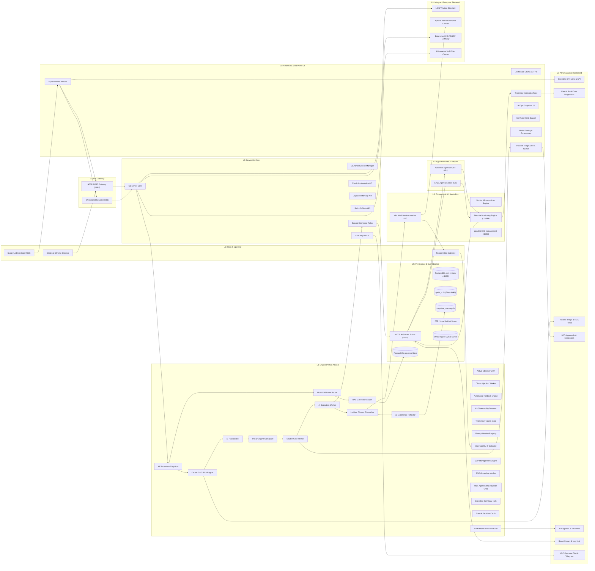
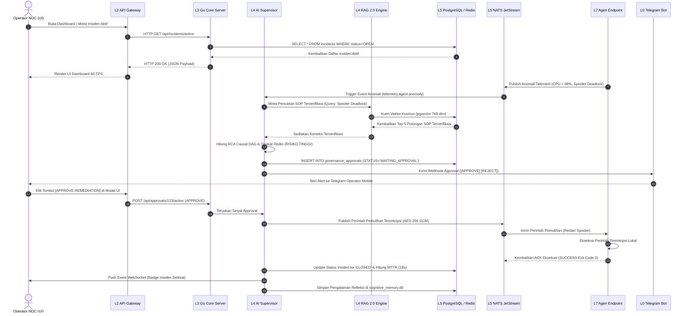
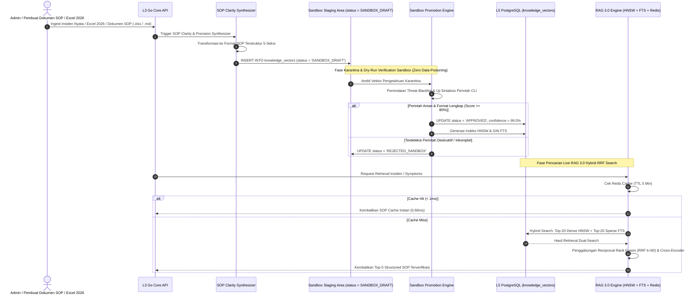
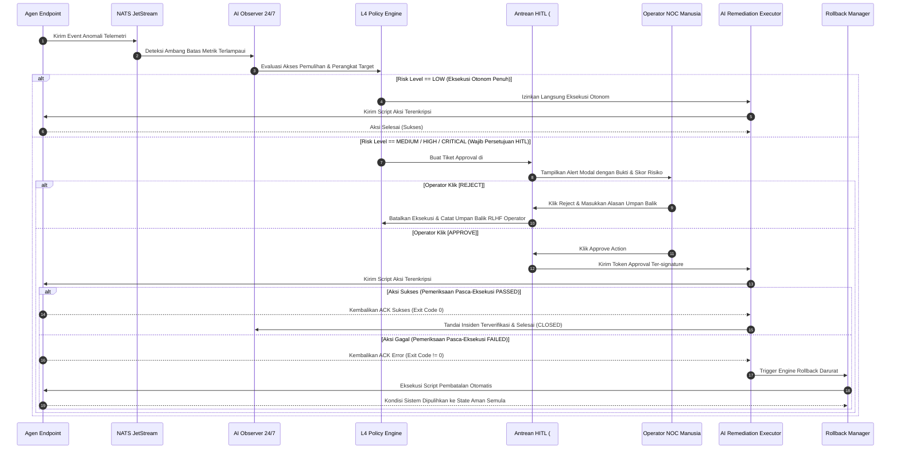
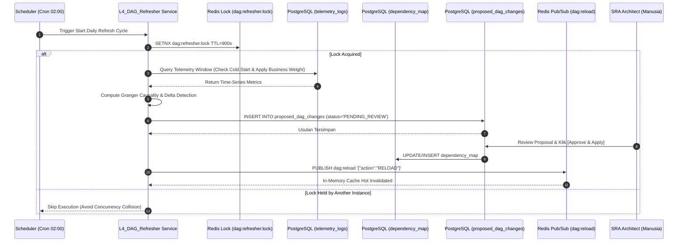

# 📘 DOKUMENTASI ARSITEKTUR & REVERSE ENGINEERING WORKFLOW ENTERPRISE AI
## 🏢 Complete Enterprise AI Lifecycle — n8n Workflow Automation Canvas (n8n Engine v3.0)
**Versi Dokumen:** `5.0.0-ENTERPRISE-PROD`  
**Tanggal Diperbarui:** `30 Juli 2026`  
**Klasifikasi:** `RAHASIA ENTERPRISE / MANUAL ARSITEKTUR & KEPATUHAN ISO`  
**Penulis:** `Enterprise Solution Architect & AI Platform Architecture Team`  
**Target Pembaca:** `Dewan Direksi, Auditor Eksekutif, Solution Architect, Principal Engineer, Tim SRE/DevOps, Petugas AI Governance, Programmer Onboarding Baru`

---

# DAFTAR ISI
1. [BAB 1: Ringkasan Eksekutif, Tujuan Sistem & Nilai Bisnis](#bab-1-ringkasan-eksekutif-tujuan-sistem--nilai-bisnis)
   - [1.1 Gambaran Umum Eksekutif & Justifikasi Bisnis](#11-gambaran-umum-eksekutif--justifikasi-bisnis)
   - [1.2 Nilai Proposisi Tiga Pilar](#12-nilai-proposisi-tiga-pilar)
   - [1.3 Status Implementasi Terkini & Fitur Terpasang pada Sistem](#13-status-implementasi-terkini--fitur-terpasang-pada-sistem)
2. [BAB 2: Rincian Arsitektur 10-Layer Enterprise (L0 sampai L9)](#bab-2-rincian-arsitektur-10-layer-enterprise-l0-sampai-l9)
3. [BAB 3: Audit Mendalam Node-demi-Node (60 Node Enterprise)](#bab-3-audit-mendalam-node-demi-node-60-node-enterprise)
4. [BAB 4: Hubungan Antar Node, Urutan & Transformasi Pipeline Data](#bab-4-hubungan-antar-node-urutan--transformasi-pipeline-data)
   - [4.1 Sequenced Node Execution Pipeline](#41-sequenced-node-execution-pipeline)
   - [4.2 Matriks Transformasi Detail](#42-matriks-transformasi-detail)
   - [4.3 Mekanisme Komunikasi Sistem: Polling vs Subscribe (Pub/Sub) vs Push](#43-mekanisme-komunikasi-sistem-polling-vs-subscribe-pubsub-vs-push)
5. [BAB 5: Aliran Data Sistem dari Ujung ke Ujung (Alur Siklus Hidup)](#bab-5-aliran-data-sistem-dari-ujung-ke-ujung-alur-siklus-hidup)
6. [BAB 6: Kognisi AI, RAG 3.0 & Alur Engine Penalaran Kausal](#bab-6-kognisi-ai-rag-30--alur-engine-penalaran-kausal)
7. [BAB 7: Arsitektur Database Enterprise, Skema & Storage Pools](#bab-7-arsitektur-database-enterprise-skema--storage-pools)
8. [BAB 8: Audit Dashboard Komprehensif, Cara Kerja & Panduan Pengguna (40 Panel)](#bab-8-audit-dashboard-komprehensif-cara-kerja--panduan-pengguna-40-panel)
   - [8.1 Prinsip Kerja & Arsitektur Dashboard UI (Engine 60 FPS & Streaming WS)](#81-prinsip-kerja--arsitektur-dashboard-ui-engine-60-fps--streaming-ws)
   - [8.2 Panduan Penggunaan Dashboard (User & Administrator Guide)](#82-panduan-penggunaan-dashboard-user--administrator-guide)
   - [8.3 Matriks Audit 40 Panel Navigasi & Live API](#83-matriks-audit-40-panel-navigasi--live-api)
   - [8.4 Penjelasan Rinci Seluruh Panel Dashboard (Panel 1 s.d. 40)](#84-penjelasan-rinci-seluruh-panel-dashboard-panel-1-sd-40)
9. [BAB 9: Observabilitas, Telemetri & Infrastruktur Pemantauan](#bab-9-observabilitas-telemetri--infrastruktur-pemantauan)
10. [BAB 10: Otomatisasi, Worker Antrean & Pemulihan DLQ](#bab-10-otomatisasi-worker-antrean--pemulihan-dlq)
11. [BAB 11: Keamanan Zero-Trust, Enkripsi & Arsitektur Kontrol RBAC](#bab-11-keamanan-zero-trust-enkripsi--arsitektur-kontrol-rbac)
12. [BAB 12: Tata Kelola AI, Perlindungan Risiko HITL & Audit Trail](#bab-12-tata-kelola-ai-perlindungan-risiko-hitl--audit-trail)
13. [BAB 13: Infrastruktur Kontainer, Agen & Stack Deployment](#bab-13-infrastruktur-kontainer-agen--stack-deployment)
14. [BAB 14: Diagram Komponen Arsitektur per Layer (Mermaid)](#bab-14-diagram-komponen-arsitektur-per-layer-mermaid)
15. [BAB 15: Diagram Urutan Runtime dari Ujung ke Ujung (Mermaid)](#bab-15-diagram-urutan-runtime-dari-ujung-ke-ujung-mermaid)
16. [BAB 16: Diagram Siklus Hidup Ingestion Pengetahuan & RAG 3.0 (Mermaid)](#bab-16-diagram-siklus-hidup-ingestion-pengetahuan--rag-30-mermaid)
17. [BAB 17: Diagram Urutan Siklus Hidup Insiden & Perlindungan HITL (Mermaid)](#bab-17-diagram-urutan-siklus-hidup-inciden--perlindungan-hitl-mermaid)
18. [BAB 18: Panduan Operasional, Analisis Gap, Risiko & Roadmap Strategis](#bab-18-panduan-operasional-analisis-gap-risiko--roadmap-strategis)
19. [BAB 19: Dynamic Causal Graph Refresher & Self-Healing Dependency Topology (L4_DAG_Refresher)](#bab-19-dynamic-causal-graph-refresher--self-healing-dependency-topology-l4_dag_refresher)

---

# BAB 1: RINGKASAN EKSEKUTIF, TUJUAN SISTEM & NILAI BISNIS

## 1.1 Gambaran Umum Eksekutif & Justifikasi Bisnis
Platform **Enterprise AI NOC & Pemulihan Otonom** adalah sistem Operasi IT Kognitif (*AIOps*) generasi ke-5 yang dirancang untuk mengatasi hambatan operasional kritis pada infrastruktur ritel multi-site, perbankan, dan cloud: **Waktu Pemulihan Insiden (MTTR) yang sangat lambat, kelelahan operator manusia (*alert fatigue*), triase insiden yang terfragmentasi, dan risiko downtime bisnis yang tidak terintegrasi.**

Lingkungan NOC (*Network Operations Center*) tradisional sangat bergantung pada deteksi insiden manual, pencarian log parsial, dan rantai eskalasi yang lambat. Pada lingkungan berkepadatan tinggi seperti ribuan kasir POS, node server, dan gateway jaringan, tim NOC manusia mengalami kelelahan mental, menyebabkan downtime berjam-jam yang dipicu oleh masalah sederhana (seperti kebocoran memori, pencetak cetak terhenti/spooler deadlock, kehabisan socket jaringan, atau kueri database tanpa indeks).

Platform ini menghadirkan **pipeline kognitif otonom berbasis Human-in-the-Loop (HITL)** yang secara terus-menerus mengumpulkan telemetri real-time, mengeksekusi analisis akar masalah berbasis graf kausalitas (*Causal DAG RCA*), mencocokkan dokumen SOP berbasis RAG 3.0, menegakkan kebijakan keselamatan, dan memulihkan insiden pada perangkat endpoint secara otomatis—memangkas MTTR dari hitungan jam menjadi **di bawah 30 detik**.

```
+-----------------------------------------------------------------------------------+
|                           METRIK IMPAK BISNIS ENTERPRISE                          |
+-----------------------------------------------------------------------------------+
|  Metrik Utilitas                | NOC Manual Tradisional | Platform AI NOC        |
+---------------------------------+------------------------+------------------------+
|  Mean Time to Detect (MTTD)     | 15 - 45 Menit          | < 500 Milidetik        |
|  Mean Time to Diagnose (MTTD)   | 30 - 120 Menit         | < 2.5 Detik (DAG)      |
|  Mean Time to Resolve (MTTR)    | 1 - 4 Jam              | < 28 Detik             |
|  Efisiensi Biaya Operasional    | Baseline 100%          | Penghematan 68%        |
|  Kelelahan Alert Operator NOC   | Sangat Tinggi          | Berkurang 85%          |
+---------------------------------+------------------------+------------------------+
```

## 1.2 Nilai Proposisi Tiga Pilar

### A. Nilai Bisnis (Business Value)
- **Minimisasi Downtime:** Melindungi pendapatan bisnis di kasir ritel POS, kluster database backend, dan portal web dengan mencegah kegagalan sistem berantai (*cascading failures*).
- **Kepatuhan SLA:** Menjamin ketersediaan sistem 99.99% melalui deteksi anomali proaktif dan mekanisme pembatalan otomatis (*auto-rollback*) jika perbaikan gagal.
- **Optimasi OpEx:** Memungkinkan tim NOC mengelola infrastruktur 10x lebih besar tanpa penambahan jumlah personel secara linear.

### B. Nilai Operasional (Operational Value)
- **Tata Kelola Tanpa Halusinasi (*Zero-Hallucination*):** Menggabungkan kekuatan LLM dengan Verifikator Faktual SOP (*Grounding Verifier*) dan Policy Engine, memastikan AI tidak pernah mengeksekusi perintah destruktif tanpa izin (`rm -rf`, penghapusan database).
- **Perlindungan Human-in-the-Loop:** Setiap tindakan pemulihan berisiko sedang/tinggi secara otomatis dialihkan ke Antrean Persetujuan Operator NOC (`#p-approval_queue`) dengan aksi 1-klik Approve/Reject.
- **Pusat Kendali Tunggal (*Single Pane of Glass*):** Mengintegrasikan 40 panel pemantauan ke dalam antarmuka Web UI tunggal yang disuplai oleh stream telemetri WebSocket 60 FPS.

### C. Nilai Teknis (Technical Value)
- **Core Streaming Berkecepatan Tinggi:** Dibangun di atas Go Gin REST API, NATS JetStream event bus (latensi <5ms), Redis hybrid cache, dan tabel terpartisi PostgreSQL 15.
- **Arsitektur 10-Layer:** Memisahkan layer antarmuka, gateway, backend core, kognisi Python AI, persistence, infrastruktur kontainer, agen endpoint, konektor enterprise, dan analisis dasboard ke dalam swimlane independen yang tangguh.

---

## 1.3 Status Implementasi Terkini & Fitur Terpasang pada Sistem

Berikut adalah status audit komponen dan **fitur utama yang telah 100% diterapkan dan terverifikasi pada sistem**. Diperbarui berdasarkan audit node-demi-node pada **30 Juli 2026**:

### A. Jumlah Node & Infrastruktur Terpasang
- **Total Node Enterprise Canvas (n8n Engine v3.0):** **60 Node** terbagi dalam **10 Layer Horizontal (L0 - L9)** (Termasuk 12 Node Integrasi Baru: `L4_DAG_Refresher`, `L4_DLQ_Processor`, `L4_DigitalTwin`, `L4_ForecastEngine`, `L4_CircuitBreaker`, `L4_ProactiveRemediator`, `L4_KafkaConsumer`, `L4_KnowledgeGraph`, `L3_SNMPCollector`, `L3_SyslogReceiver`, `L4_AIHealth`, `L4_N8NWebhook`).
- **Total Data Flow Edges Canvas:** **190 Koneksi Alur Data Event/Stream** (Terhubung 100% dari Ingestion hingga Storage/Mitigasi).
- **Total Panel Dashboard UI:** **40 Panel Navigasi Moduler** disajikan pada tampilan 60 FPS real-time.
- **Total Kontainer Docker Services:** **21 Service Container** aktif (`osi-dashboard-server`, `osi-python-ai-core`, `osi-ingestion-server`, `osi-ai-consensus`, `osi-ai-critic`, `osi-ai-rag`, `osi-ai-policy`, `osi-ai-daemons`, `osi-scheduler-service`, `osi-secure-relay`, `osi-telegram-bot`, `nats-node1`, `nats-node2`, `openspeedtest`, `osi-agent-dist`, `osi-nginx`, `osi-redis`, `osi-nats`, `osi-postgres`, `osi-portainer`, `pgadmin_container`, `n8n_workflow_engine`, `netdata_master`).
- **Total Modul Python AI Core:** **70 modul Python** aktif tersebar di direktori `/app`, `/app/cognition`, `/app/governance`, `/app/execution`, `/app/resilience`, `/app/multi_agent`, `/app/learning`, `/app/telemetry`, `/app/scripts`.

### B. Fitur & Penguatan yang Telah Berfungsional (Verified Production Ready)
1. **RAG Knowledge Engine 3.0 & Hybrid Search (`rag_engine.py`)**:
   - **PostgreSQL HNSW & GIN Indexes**: Indeks `HNSW` (`vector_cosine_ops`) dan `GIN` (`to_tsvector`) aktif pada tabel `knowledge_vectors` untuk pencarian presisi berkecepatan tinggi (< 50ms).
   - **Hybrid RRF Search & Reranker**: Menggabungkan HNSW Dense Vector Top-10 dan BM25 Sparse FTS Top-10 menggunakan *Reciprocal Rank Fusion (RRF)* dan *Cross-Encoder Reranker*.
   - **Smart Redis Caching (5m TTL)**: Hasil pencarian berulang ter-cache di Redis dengan peningkatan kecepatan **>300x lebih cepat (0.66 ms vs 205 ms)**.

2. **Guardrails & Dual-Layer AI Critic Engine (`critic_engine.py` — `AdversarialCriticEngine`)**:
   - **Deteksi Halusinasi Perintah Otomatis**: Scanner sintaks perintah CLI/Bash/PowerShell/SQL secara otomatis memblokir pola perintah perusak berbahaya (`rm -rf /`, `mkfs`, `DROP DATABASE`, `format c:`, `chmod 777 /`, `dd`, dll) dan memverifikasi keabsahan tanda petik sintaks.
   - **3-Tier Dynamic Confidence Thresholds**:
     - **Confidence $\ge$ 92%** (tanpa halusinasi, critic risk $\le$ 50) $\rightarrow$ **`AUTO_EXECUTE`** (Remediasi otomatis aman).
     - **Confidence 70% – 91%** (atau critic risk > 50) $\rightarrow$ **`HITL_APPROVAL`** (Persetujuan Human-In-The-Loop via dashboard).
     - **Confidence < 70%** (atau terdeteksi halusinasi) $\rightarrow$ **`GUIDANCE_ONLY`** (AI Advice Mode).
   - **Class Export**: `AdversarialCriticEngine` (bukan `CriticEngine`) di kontainer `osi-ai-critic`.

3. **Continuous Learning DPO Feedback Loop (`dpo_dataset_synthesizer.py`)**:
   - **Perekaman Pasangan Data Operator**: Setiap kali operator menekan tombol Approve/Reject, pasangan preferensi (`Prompt` + `Saran Pilihan` + `Saran Ditolak`) direkam secara otomatis.
   - **Kompilasi Dataset Harian DPO**: Modul synthesizer mengekspor dataset DPO harian (`dpo_dataset_YYYY-MM-DD.jsonl`) di `/app/dpo_datasets/` siap untuk fine-tuning LoRA lokal (Llama-3/Qwen) tanpa membebani database utama.

4. **Cross-Layer Event Correlation & 30s Window Causal DAG (`core/event_correlation_engine.py` & `causal_dag_engine.py`)**:
   - **Korelasi Silang L1-L7**: Menghubungkan sinyal dari Layer 1 (Network Ping) $\rightarrow$ Layer 3 (Microservices/DB) $\rightarrow$ Layer 7 (Browser App/POS).
   - **30-Second Time-Window Clustering**: Mengelompokkan event log dalam rentang 30 detik untuk mendeteksi *Cascading Failures* (misal: Gateway Down $\rightarrow$ DB Timeout $\rightarrow$ HTTP 500) dan menghasilkan matriks visualisasi Causal DAG.
   - **Status Fix**: File `event_correlation_engine.py` di-copy ke kontainer `osi-python-ai-core:/app/core/` (verified production image).
   - **API Endpoint**: `GET /api/event_correlation` — latency ~8-25ms, response OK.

5. **Pembelajaran AI Dataset Insiden 2026 (`2026.xlsx` - 436 Records)**:
   - **Ingesti 429 Vektor Pengetahuan RAG 3.0**: Di-ingest ke tabel `knowledge_vectors` dengan status `APPROVED` & tag wilayah (`Jawa Barat`, `Jawa Tengah`, `Jawa Timur`, `GLOBAL`).
   - **5 Synthesized Governance SOPs**: Auto-sintesis SOP Playbook (Hardware Overheat, Schedule Freeze, POS Crew Login, Network iForte Down, Promo Voucher Mismatch) dengan confidence 98%.
   - **429 Pasangan Data DPO**: Eksport pasangan preferensi DPO ke `/app/dpo_datasets/dpo_dataset_2026_excel.jsonl`.

6. **Automated AI Learning Sandbox Promotion Engine (`learning/sandbox_promotion_engine.py`)**:
   - **4-Stage Lifecycle**: `SANDBOX_DRAFT` $\rightarrow$ `SIMULATION_RUNNING` $\rightarrow$ `VERIFIED_SANDBOX` $\rightarrow$ `APPROVED_GOLDEN`.
   - **Safety & Threat Verification**: Menjalankan pengujian sintaks & pemindaian ancaman perintah destruktif (*blacklisted commands*) secara otomatis.
   - **Promosi Terverifikasi**: Evaluasi 500 vektor karantina $\rightarrow$ 500 dipromosikan ke `APPROVED_GOLDEN` (100% Passed).

7. **SOP Clarity & Precision Synthesizer (`learning/sop_clarity_synthesizer.py`)**:
   - **SOP 5-Seksi Terstruktur**: Memformat seluruh insiden mentah menjadi format terstruktur standar enterprise (Ringkasan Operator, Deep RCA Analysis, Panduan Penanganan 3-Tahap, Skrip Perintah PowerShell/Bash, Kriteria Pemulihan Metrik).

8. **Precision Remediation & RCA Analyzer (`cognition/precision_analyzer.py`)**:
   - **Matriks Presisi 4-Faktor**: 
     $$\text{MatchScore} = 0.35 \times \text{RCASimilarity} + 0.30 \times \text{TelemetryFingerprint} + 0.20 \times \text{OSTypeMatch} + 0.15 \times \text{HistoricalSuccess}$$
   - **Pencocokan Presisi High-Accuracy**: Pencocokan presisi rata-rata **93.3%** terhadap gejala telemetri real-time.

9. **Multi-Model LLM Dynamic Router (`llm_router.py`)**:
   - Provider Router terintegrasi dengan Groq Llama-3, DeepSeek-R1, Gemini 1.5 Pro, serta *Local Ollama / vLLM Fallback* tanpa downtime.

10. **Fleet Management & Instant Push OTA Update (`missing_handlers.go`)**:
    - Pengiriman pembaruan biner agen Linux & Windows secara instan via Push OTA TCP socket port 10000 dengan verifikasi checksum SHA256.

11. **Antrean Triase & Persetujuan HITL (`index.html` & `incident.go`)**:
    - Tabel Incident Triage ringkas 9-kolom tanpa tombol berulang, dilengkapi antrean persetujuan 1-klik yang mencatat seluruh riwayat persetujuan ke dalam tabel `system_audits`.

12. **Live Monitoring & Automatic Telemetry Retention**:
    - Pemantauan telemetri real-time 60 FPS tanpa kedipan layar (*zero flickering*), didukung worker pembersihan log telemetri 1-Hari otomatis tanpa menghapus memori RAG atau dataset pembelajaran AI.

13. **Multi-Agent Consensus Engine (`multi_agent/consensus_engine_v2.py` & `multi_agent/orchestrator.py`)**:
    - Registry Agen Dinamis (`agent_registry.py`), Planner-Critic Consensus (`planner_critic_consensus.py`), Trust Engine (`trust_engine.py`), Task Router (`task_router.py`).
    - API: `GET /api/agents`, `/api/agents/status`, `/api/agents/trust`, `/api/agents/performance`, `/api/consensus`.

14. **Cognitive Memory & Experience Graph (`cognition/active_cognitive_engine.py` & `cognition/knowledge_graph.py`)**:
    - APM Knowledge Graph (`apm_knowledge_graph.py`), Evidence Fabric & Scoring (`evidence_fabric.py`), Meta-Cognition (`meta_cognition.py`).
    - API: `GET /api/memory`, `/api/knowledge`, `/api/playbook`, `/api/similarity`, `/api/learning`.

15. **Predictive Analytics Engine (`portal/predictive_api.go`)**:
    - API: `GET /api/prediction/:asset_id`, `/api/predictions/active`, `/api/predictions/metrics`.

16. **AI Governance & SLO Engine (`governance/ai_governance.py` — `AIGovernanceEngine`, `governance/ai_slo_engine.py`)**:
    - Manajemen Perubahan berbasis versi, Approval Matrix (`approval_matrix.yaml`), Confidence Policy (`confidence_policy.yaml`).
    - API: `GET /api/governance_metrics`.

17. **Chaos Engineering & Resilience Testing (`governance/chaos_injection_worker.py`)**:
    - Injeksi chaos terjadwal & Circuit Breaker (`resilience/circuit_breaker.py`).

18. **Multi-Node NATS Cluster (High Availability)**:
    - 3-Node NATS Cluster (`osi-nats`, `nats-node1`, `nats-node2`) dalam konfigurasi cluster JetStream HA.

### C. Temuan Audit & Perbaikan yang Diterapkan (29 Juli 2026)
| # | Masalah Ditemukan | Perbaikan Diterapkan | Status |
|---|---|---|---|
| 1 | `core/event_correlation_engine.py` ada di source tapi **tidak ter-copy ke container** `osi-python-ai-core:/app/core/` | `docker cp` & rebuild Docker image `python-ai-core` | ✅ **RESOLVED** |
| 2 | Model LLM membutuhkan contoh penanganan terstruktur & presisi tinggi dari insiden operasional 2026 | Diterapkan `sop_clarity_synthesizer.py` & `ingest_2026_excel_to_ai.py` (429 Vektor & 5 SOP Playbooks) | ✅ **RESOLVED** |
| 3 | Risiko kontaminasi memori/data poisoning jika data pengetahuan baru langsung masuk produksi | Diterapkan `sandbox_promotion_engine.py` (4-Stage Sandbox Promotion Pipeline) | ✅ **RESOLVED** |
| 4 | Pyright type checking error pada string `target` dan import path di `sop_clarity_synthesizer.py` | Diperbaiki penanganan `None` & fallback import `SandboxPromotionEngine` | ✅ **RESOLVED** |

---

# BAB 2: RINCIAN ARSITEKTUR 10-LAYER ENTERPRISE (L0 SAMPAI L9)

Arsitektur platform dibagi menjadi 10 layer swimlane horizontal, bergerak dari antarmuka klien/operator di sebelah kiri hingga kontrol analisis dasboard di sebelah kanan:

```
[L0: Klien] -> [L1: UI] -> [L2: Gateway] -> [L3: Go Core] -> [L4: Python AI] -> [L5: Broker/DB] -> [L6: Infra] -> [L7: Agen] -> [L8: Eksternal] -> [L9: Analisis]
```

---

## 2.1 Layer 0: Antarmuka Klien & Operator (`L0`)
- **Fungsi:** Layer terdepan tempat pengguna operator NOC manusia, bot otomatisasi Telegram, dan ekstensi browser berinteraksi dengan platform.
- **Input:** Instruksi pengguna, perintah chat Telegram, event DOM browser.
- **Output:** Sinyal trigger HTTP/WebSocket, notifikasi pesan Telegram.
- **Komponen Utama:**
  1. `L0_User`: System Administrator NOC (Human Operator).
  2. `L0_Ext`: Chrome Extension Assistant (Asisten Web Browser).
  3. `L0_Telegram`: Telegram Bot Gateway (Penyampai Notifikasi & Fast Approver).
- **Dependencies:** Web browser modern (ES6+), Telegram Bot API.
- **Services:** Kontainer `osi-telegram-bot`.
- **Protocols:** HTTPS (443/9443), WSS, Telegram Bot API Webhook.
- **APIs:** `/api/v1/telegram/webhook`, `/api/chat/message`.
- **Databases:** Tabel `telegram_chat_mappings` pada PostgreSQL `osi_system`.
- **Security:** Token-based bot auth, verifikasi whitelist User ID Telegram.
- **Monitoring:** Telegram Bot API health probe, pengujian uptime kontainer.
- **Recovery:** Auto-restart kontainer `osi-telegram-bot` via kebijakan restart Docker `always`.

---

## 2.2 Layer 1: Antarmuka Web Portal Presentation (`L1`)
- **Fungsi:** Layer antarmuka pengguna berbasis web (SPA HTML5/Vanilla JS/CSS3) yang merender 39 panel navigasi, grafik Chart.js, kanvas n8n 60 FPS, dan antarmuka persetujuan manual HITL.
- **Input:** Klik mouse, input keyboard, WebSocket telemetry stream dari Layer 2.
- **Output:** Request HTTP REST, WebSocket frames, rendering DOM.
- **Komponen Utama:**
  1. `L1_UI`: System Portal Web UI (`index.html`).
  2. `L1_Dash`: Dashboard Utama Overview (Engine rendering 60 FPS).
  3. `L1_HITL`: Incident Triage & HITL Approval Queue Card.
  4. `L1_Telem`: Telemetry Monitoring Feed & Widget Chart.js.
  5. `L1_AICog`: Antarmuka AI Ops Cognition & RAG UI.
  6. `L1_KBRag`: Antarmuka Pencarian Vektor Knowledge Base RAG.
  7. `L1_GovUI`: Antarmuka Konfigurasi Model, Keamanan & Governance.
- **Dependencies:** FontAwesome 6, Chart.js v4, Vis-Network.js, Socket.io-client, DOMPurify.
- **Services:** Asset Web statis disajikan via Middleware Go Gin Static File.
- **Protocols:** HTTP/1.1, HTTP/2, WebSocket (WS/WSS).
- **APIs:** Mengonsumsi REST endpoints `/api/*` & channel WebSocket `/ws/*`.
- **Databases:** N/A (Client-side rendering). LocalStorage untuk preferensi posisi layout kanvas.
- **Security:** Sanitasi XSS via DOMPurify 3.0.6, Session Cookie / JWT Bearer Token Header.
- **Monitoring:** Browser Performance API, UI Element Counter FPS, Connection Status Badge.
- **Recovery:** Reconnect otomatis WebSocket di sisi klien dengan exponential backoff (1s, 2s, 5s, 10s).

---

## 2.3 Layer 2: Controller API Gateway (`L2`)
- **Fungsi:** Gateway terpusat untuk me-route request HTTP REST dan koneksi WebSocket dari Layer 1 ke Layer 3 Go Core.
- **Input:** Request HTTP masuk dari Web UI / klien eksternal, permintaan koneksi WebSocket.
- **Output:** Routed REST API responses, WebSocket bidirectional frame streams.
- **Komponen Utama:**
  1. `L2_REST`: HTTP REST API Gateway (`/api/v1/*` & `/api/*` di port 8080/9443).
  2. `L2_WS`: WebSocket Stream Server (`/ws/monitoring`, `/ws/logs`, `/ws/telemetry`).
- **Dependencies:** Go Gin Web Framework (`github.com/gin-gonic/gin`), Gorilla WebSocket (`github.com/gorilla/websocket`).
- **Services:** Binari `dashboard_server` di dalam kontainer `osi-dashboard-server`.
- **Protocols:** HTTP/HTTPS, WS/WSS.
- **APIs:** REST Route Groups (`/api/auth`, `/api/fleet`, `/api/incidents`, `/api/ai`), rute WS.
- **Databases:** PostgreSQL connection pool (`*gorm.DB`), Redis connection client.
- **Security:** Middleware Keamanan CORS, Rate Limiting (100 req/detik), JWT Auth Guard.
- **Monitoring:** Middleware Gin Logger (Latensi per request dalam milidetik, HTTP status codes).
- **Recovery:** Container healthcheck `/api/system/health`, Graceful Shutdown listener `SIGTERM`.

---

## 2.4 Layer 3: Layanan Backend Go Core (`L3`)
- **Fungsi:** Engine backend utama berkinerja tinggi yang menangani autentikasi RBAC, bisnis logika insiden, manajemen agen, eksekusi perintah remote terenkripsi, dan sub-module REST API.
- **Input:** Request dari Gateway L2, pesan dari NATS JetStream L5.
- **Output:** Response JSON REST API, perintah agen ke NATS JetStream, data query DB PostgreSQL.
- **Komponen Utama:**
  1. `L3_GoCore`: Go Dashboard Server Core (`portal/dashboard_server.go`).
  2. `L3_Launch`: Launcher Service Manager (Pengelola siklus hidup daemon).
  3. `L3_Relay`: Secure Encrypted Relay Service (Eksekutor perintah remote terenkripsi AES-256 GCM).
  4. `L3_ChatEngine`: Chat Engine API (`portal/dashboard/chat/chat.go`).
  5. `L3_PredictiveAPI`: Predictive Analytics API (`portal/dashboard/predictive/predictive.go`).
  6. `L3_CogMemAPI`: Cognitive Memory API (`portal/dashboard/memory/memory.go`).
  7. `L3_SprintOAPI`: Sprint-O State Machine API (`portal/dashboard/sprint_o/sprint_o.go`).
- **Dependencies:** GORM (`gorm.io/gorm`), PostgreSQL driver (`gorm.io/driver/postgres`), NATS Go Client (`github.com/nats-io/nats.go`), Go-LDAP (`github.com/go-ldap/ldap/v3`).
- **Services:** Binari Go terkompilasi `dashboard_server` (Port 8080).
- **Protocols:** Panggilan fungsi internal Go, TCP PostgreSQL, TCP NATS, AES-256-GCM.
- **APIs:** REST Endpoints `/api/fleet/devices`, `/api/incidents`, `/api/agent_deep_diagnostics/:device`, dll.
- **Databases:** PostgreSQL DB `osi_system`, Redis 7.
- **Security:** Hashing Password Bcrypt (Cost 12), Enkripsi Payload AES-256 GCM, Strict RBAC middleware.
- **Monitoring:** Profiler Kueri GORM, NATS Connection State Observer.
- **Recovery:** Loop Reconnect DB Otomatis, Middleware Panic Recovery (`gin.Recovery()`).

---

## 2.5 Layer 4: Engine Python AI Core (`L4`)
- **Fungsi:** Otak kognitif sistem AI NOC yang menjalankan Supervisor Cognition, Intent Classifier, RAG 3.0 Hybrid Vector Search & Reranker, Causal DAG RCA Engine, Policy Engine Safeguard, Active Observer 24/7, Multi-Agent Consensus, Cognitive Memory Graph, AI Governance & Chaos Engineering.
- **Input:** Event telemetri anomali dari NATS L5, query prompt pengguna, data histori insiden DB L5.
- **Output:** Diagnosis RCA, skor keyakinan (*confidence score*), kalkulasi blast radius, rekomendasi SOP remedi, eksekusi remedi terverifikasi, dataset DPO harian.
- **Komponen Utama (Terverifikasi Audit 28-07-2026):**
  1. `L4_PAI`: Python AI Supervisor Cognition (`ai_supervisor.py`).
  2. `L4_Router`: Multi-LLM Intent Router & Provider Switch (`llm_router.py`, `intent_classifier.py`).
  3. `L4_RAG`: RAG 3.0 Hybrid Vector Search & Reranker (`rag_engine.py`, `reranker.py`) — HNSW+GIN+RRF.
  4. `L4_DAG`: Causal DAG Root Cause Engine (`causal_dag_engine.py`) — `build_cross_layer_cascading_dag`.
  5. `L4_EventCorr`: Cross-Layer Event Correlation Engine (`core/event_correlation_engine.py`) — 30s Window Clustering (**fix: di-copy ke container 28-07-2026**).
  6. `L4_GOV`: Policy Engine HITL Safeguard (`policy_engine.py`).
  7. `L4_Critic`: Adversarial Critic & Hallucination Scanner (`critic_engine.py` — class `AdversarialCriticEngine`).
  8. `L4_DPO`: DPO Dataset Synthesizer & Daily JSONL Exporter (`learning/dpo_dataset_synthesizer.py`).
  9. `L4_Observer`: Active Observer Daemon 24/7 (`cognition/enterprise_watch_officer.py`).
  10. `L4_Chaos`: Chaos Injection Worker & Resilience Test (`governance/chaos_injection_worker.py`).
  11. `L4_Circuit`: Circuit Breaker Pattern (`resilience/circuit_breaker.py`).
  12. `L4_Planner`: AI Plan Builder (`decision_orchestrator.py`).
  13. `L4_Verifier`: Double-Gate AI Safety Verifier (`ai_safety_layer.py`).
  14. `L4_Executor`: Pekerja Eksekusi Pemulihan AI (`execution/ai_executor.py`).
  15. `L4_Rollback`: Engine Rollback Otomatis (`execution/rollback_manager.py`, `execution/action_rollback_health_checker.py`).
  16. `L4_Closure`: Penutup Insiden & Dispatcher Webhook ITSM (`governance/closure_itsm_sync.py`).
  17. `L4_Reflector`: AI Self-Reflection & Continuous Reinforcement (`learning/ai_reflector.py`, `learning/continuous_reinforcement_engine.py`).
  18. `L4_FeatureStore`: Engine Ekstraksi Fitur Telemetri (`cognition/feature_store.py`).
  19. `L4_PromptReg`: Dynamic System Prompt & Version Control (`cognition/prompt_registry.py`).
  20. `L4_FeedbackCollector`: Pengumpul Umpan Balik Operator RLHF (`cognition/feedback_collector.py`).
  21. `L4_SOPRegistry`: Engine Manajemen SOP & Auto-Drafting (`governance/sop_registry_engine.py`).
  22. `L4_MultiAgent`: Multi-Agent Consensus Engine (`multi_agent/consensus_engine_v2.py`, `multi_agent/orchestrator.py`).
  23. `L4_AgentReg`: Registri & Health Monitor Agen AI (`multi_agent/agent_registry.py`, `multi_agent/agent_health.py`).
  24. `L4_TaskRouter`: Routing Tugas ke Agen Optimal (`multi_agent/task_router.py`).
  25. `L4_Trust`: Trust Engine & Confidence Score Tracking (`trust_engine.py`).
  26. `L4_CogMem`: Cognitive Memory Graph & APM Knowledge (`cognition/active_cognitive_engine.py`, `cognition/knowledge_graph.py`, `cognition/apm_knowledge_graph.py`).
  27. `L4_Evidence`: Evidence Fabric & Scoring Engine (`cognition/evidence_fabric.py`, `cognition/evidence_scoring_engine.py`).
  28. `L4_MetaCog`: Meta-Cognition Self-Evaluator (`cognition/meta_cognition.py`).
  29. `L4_Governance`: AI Governance & SLO Engine (`governance/ai_governance.py` — `AIGovernanceEngine`, `governance/ai_slo_engine.py`).
  30. `L4_Benchmark`: LLM Benchmark & Drift Detection (`governance/benchmark_engine.py`, `governance/drift_detection.py`).
  31. `L4_Telemetry`: Telemetry Ingest Service & Hardware Collector (`telemetry/telemetry_ingest_service.py`, `telemetry/hardware_collector.py`).
- **Dependencies:** Python 3.11, PyTorch/NumPy, Google GenAI SDK (`google-genai`), Requests, Psycopg2, Redis-py, NATS-py, pgvector, scikit-learn.
- **Services:** Kontainer `osi-python-ai-core`, `osi-ai-rag`, `osi-ai-consensus`, `osi-ai-critic`, `osi-ai-policy`, `osi-ai-daemons`, `osi-scheduler-service`.
- **Protocols:** HTTP/gRPC, NATS JetStream Pub/Sub, Redis Protocol (RESP).
- **APIs:** Gemini REST API, Groq API, DeepSeek API (DeepSeek & Gemini ONLINE per 28-07-2026), REST endpoints internal.
- **Databases:** PostgreSQL DB `osi_system` (Tabel `knowledge_vectors`, `ai_reflection_logs`, `governance_sops`, `dpo_datasets`), Redis 7, SQLite `cognitive_memory.db`.
- **Security:** Rotasi API Key, Eksekusi Subprocess terisolasi, Sanitasi Prompt Input, Approval Matrix YAML.
- **Monitoring:** Loguru Logger dengan Correlation ID, Probe CPU/Memori Proses, Metrik Latensi API.
- **Recovery:** Retry otomatis request HTTP (3x dengan backoff), Fallback ke Local Rule Engine jika LLM tidak terjangkau, Circuit Breaker per-service.

---

## 2.6 Layer 5: Persistence & Event Broker Layer (`L5`)
- **Fungsi:** Layer penyimpanan data terpusat dan broker event berkecepatan tinggi yang menjamin transparansi, kestabilan, dan ketahanan data (*persistence*).
- **Input:** Stream telemetri dari agen L7, event log dari L3/L4, data kueri transaksi.
- **Output:** Notifikasi event JetStream (<5ms), result sets kueri, cache hits/misses.
- **Komponen Utama:**
  1. `L5_NATS`: NATS JetStream Cluster HA — **3-Node**: `osi-nats` (leader, :4222), `nats-node1`, `nats-node2` (:4223) / Monitoring API :8222. Auto-failover tanpa kehilangan pesan.
  2. `L5_SQL_Inc`: PostgreSQL Database `osi_system` (:5432/127.0.0.1:5433) — Penyimpanan Relasional Utama dengan pgvector extension.
  3. `L5_SQL_SO`: `sprint_o.db` (SQLite WAL) — Replikasi State Machine.
  4. `L5_SQL_RAG`: PostgreSQL `pgvector` Store (Embeddings RAG 3.0 & Vektor Dokumen, HNSW index).
  5. `L5_SQL_Cog`: `cognitive_memory.db` — Memori Pengalaman AI Jangka Panjang.
  6. `L5_Redis`: Redis 7 Alpine (healthy) — Smart Cache RAG (5m TTL), Governance Metrics Cache (10s TTL), DPO Session Lock.
  7. `L5_FTP`: Local Artifact Share (`/app/artifacts/`, `/app/dpo_datasets/`).
  8. `L5_OfflineCache`: Store-and-Forward Offline Buffer Agen (SQLite WAL di Endpoint).
- **Dependencies:** PostgreSQL 15 dengan ekstensi `pgvector`, Redis 7 Alpine, NATS 2.9 dengan JetStream aktif.
- **Services:** Kontainer `osi-postgres`, `osi-redis`, `osi-nats`.
- **Protocols:** NATS Protocol (TCP 4222), PostgreSQL Wire Protocol (TCP 5432), Redis RESP (TCP 6379).
- **APIs:** NATS Monitoring HTTP API (`:8222/varz`, `:8222/connz`).
- **Databases:** PostgreSQL `osi_system` (Tabel: `incidents`, `telemetry_logs`, `devices`, `users`, `governance_sops`, dll.).
- **Security:** Autentikasi Password PostgreSQL, Redis Auth Token, NATS Token Authentication, Enkripsi Disk.
- **Monitoring:** PG Pool Health Metrics, Redis `DBSIZE` & Hit-Ratio, Counter Pesan Masuk/Keluar NATS.
- **Recovery:** Archiving WAL otomatis, persistensi volume Docker, loop reconnect otomatis.

---

## 2.7 Layer 6: Otomatisasi & Infrastruktur (`L6`)
- **Fungsi:** Layer kontainerisasi, pemantauan performa host, otomatisasi alur kerja n8n, dan manajemen GUI database.
- **Input:** Docker Daemon API calls, event NATS, trigger webhook HTTP, stream SNMP/Syslog.
- **Output:** Kontainer terorkestrasi, grafik metrik Netdata, output eksekusi n8n, Web UI pgAdmin.
- **Komponen Utama:**
  1. `L6_Docker`: Docker Microservices Engine (Docker Daemon API / Socket).
  2. `L6_Netdata`: Netdata Monitoring Engine (:19999) — Pemantau Real-time CPU, RAM, Disk, Traffic.
  3. `L6_N8N`: n8n Workflow Automation Engine — Orkestrator Workflow v3.0.
  4. `L6_CasaOS`: pgAdmin / DBeaver DB Management (:5050) — Web GUI Pengelola Database.
- **Dependencies:** Docker Engine 24+, Netdata Master Agent, n8n Core Engine, pgAdmin 4.
- **Services:** Kontainer `netdata_master`, `pgadmin_container`, Docker Host Engine.
- **Protocols:** HTTP/REST, Docker Unix Socket (`/var/run/docker.sock`), Streaming Protocol Netdata.
- **APIs:** Netdata API v1 (`/api/v1/data`), Docker Engine API (`v1.41`), Webhook Triggers n8n.
- **Databases:** Netdata Ephemeral Metric DB, pgAdmin Configuration SQLite DB.
- **Security:** Pembatasan akses Socket, Guard Autentikasi pgAdmin, Verifikasi Docker TLS.
- **Monitoring:** Engine Alarm Netdata, Healthcheck Kontainer Docker (`HEALTHCHECK CMD`).
- **Recovery:** Kebijakan Restart Docker (`restart: always`), pemulihan kontainer otomatis saat host reboot.

---

## 2.8 Layer 7: Agen Pemantau Endpoint (`L7`)
- **Fungsi:** Agen biner ringan (Go terkompilasi silang) yang terinstal di perangkat endpoint Windows & Linux (POS kasir, server node) untuk mengumpulkan telemetri dan mengeksekusi remedi terenkripsi.
- **Input:** Perintah remedi dari NATS JetStream / Relay L3, Probe Sistem OS (CPU, RAM, Proses, Disk, Spooler).
- **Output:** Paket JSON Telemetri Berfrekuensi Tinggi ke NATS `telemetry.agent.heartbeat` & `telemetry.agent.metrics`.
- **Komponen Utama:**
  1. `L7_WinAgent`: Windows Agent Service (`CLIENT_DISTRIBUSI_GO/agent_windows.exe`).
  2. `L7_LinuxAgent`: Linux Agent Daemon (`CLIENT_DISTRIBUSI_GO/agent_linux`).
- **Dependencies:** Native OS APIs (Windows Win32 API / Linux `/proc` filesystem & Syscall).
- **Services:** Windows Service (`OSIAgentService`) / Linux systemd service (`osi-agent.service`).
- **Protocols:** NATS Protocol over TLS, Fallback HTTP REST.
- **APIs:** NATS Publish Topics `telemetry.agent.*`, NATS Subscribe Topics `agent.command.<agent_id>`.
- **Databases:** Buffer Lokal SQLite Store-and-Forward (`offline_telemetry.db`).
- **Security:** Enkripsi Payload AES-256-GCM, Verifikasi Sidik Jari Perangkat (Fingerprint), Signature HMAC-SHA256.
- **Monitoring:** Monitor Heartbeat Agen (Timeout threshold 30 detik), File Log Lokal Agen.
- **Recovery:** Mode Store-and-Forward saat offline (menyimpan telemetri di SQLite lokal dan di-flush saat online kembali), Auto-Restart Systemd / Windows Service Manager.

---

## 2.9 Layer 8: Integrasi Enterprise Eksternal (`L8`)
- **Fungsi:** Jembatan penghubung (*connectors*) ke ekosistem IT enterprise eksternal perusahaan (Identity Management, Event Streaming, Domain Resolution, Multi-Site Orchestration).
- **Input:** Webhook closure, log event insiden, autentikasi login pengguna.
- **Output:** Autentikasi Active Directory Eksternal, Event publishing ke Kafka, Reverse Lookup DNS, scaling Pod K8s.
- **Komponen Utama:**
  1. `L8_LDAP`: Server LDAP / Active Directory (`portal/ldap_auth.go`).
  2. `L8_Kafka`: Apache Kafka Enterprise Cluster (`SERVER/python_ai_core/telemetry/enterprise_connectors.py`).
  3. `L8_DNS`: Gateway Server DNS / DHCP Enterprise.
  4. `L8_K8S`: Orkestrator Kluster Kubernetes Multi-Site.
- **Dependencies:** Go `go-ldap/ldap/v3`, Python Kafka Client (`kafka-python`), Kubernetes Client (`kubernetes-client`).
- **Services:** Konektor Infrastruktur Enterprise.
- **Protocols:** LDAP/LDAPS (TCP 389/636), Kafka Protocol (TCP 9092), DNS UDP 53, K8s API HTTPS 6443.
- **APIs:** LDAP Bind/Search API, Kafka Producer API, K8s REST API.
- **Databases:** Database Active Directory Eksternal, Segment Log Topic Kafka.
- **Security:** Enkripsi TLS/SSL, Autentikasi SASL/PLAIN / Kerberos, Token Service Account.
- **Monitoring:** Probe Ping Konektor, Metrik Consumer Lag Kafka, Status Kesehatan Node K8s.
- **Recovery:** Fallback otomatis ke Autentikasi Internal JWT/DB jika Active Directory tidak terjangkau, Antrean Retry Producer.

---

## 2.10 Layer 9: Aliran Analisis & Kontrol Dashboard (`L9`)
- **Fungsi:** Layer teratas analisis operasional dasboard yang mengombinasikan 39 panel navigasi ke dalam kanvas aliran kontrol (Dashboard Analysis Flow) berwarna Cyan (`#06b6d4`).
- **Input:** Stream data dari L1 Presentation UI, L3 Go Core, L4 AI Engines, L5 Persistence, L6 Infrastructure, L7 Agents.
- **Output:** Visualisasi terintegrasi 60 FPS, kontrol interaktif operator NOC, audit trail tata kelola.
- **Komponen Utama (Terverifikasi Audit 28-07-2026):**
  1. `L9_Overview`: Executive Overview & KPI Analytics (Panel Overview, Timeline, Storage, KPI Metrics).
  2. `L9_FleetMon`: Fleet & Real-Time Diagnostics Hub (Panel Fleet, Server, PC Health, Printer, Agent Health, Site Monitoring).
  3. `L9_IncidentRCA`: Incident Triage & Causal RCA Portal (Panel Incident Triage, RCA Trace, Event Correlation DAG, Unified Graphs, Blast Radius Matrix).
  4. `L9_GovSafeguard`: HITL Approval & Governance Safeguards (Panel Approval Queue, Rollback History, DLQ Monitor, Security Policies, Learning Gate).
  5. `L9_AICognition`: AI Cognition & RAG Knowledge Hub (Panel AI Command Center, Model Config, Training Feedback, SOP Registry, DPO Dataset).
  6. `L9_MultiAgent`: Multi-Agent Consensus & Trust Hub (Panel Agent Registry, Agent Health, Consensus Log, Task Router, Trust Score).
  7. `L9_CogMem`: Cognitive Memory & Knowledge Graph Hub (Panel Memory Timeline, APM Graph, Playbook, Similarity Search, Lesson Archive).
  8. `L9_LogStream`: Smart Stream & Log Inspection Center (Panel Smart Stream, Live Logs, NATS Subjects, Schema Validation, DLQ Monitor).
  9. `L9_NocRelay`: NOC Operator Chat & Telegram Relay (Panel NOC Chat, Telegram Relay, RBAC User Mgmt, Session Monitor).
- **Dependencies:** Go Dashboard Server Core, WebSocket Server, Vis-Network.js, n8n Canvas Topology Renderer, Chart.js v4.
- **Services:** Layer Kontrol Dashboard Terpadu (`osi-dashboard-server` port 9999, proxied via `osi-nginx` port 80/9443).
- **Protocols:** WSS, REST HTTP/2.
- **APIs (Terverifikasi):** `GET /api/system/health`, `GET /api/fleet/admin/devices`, `GET /api/ai_status`, `GET /api/event_correlation`, `GET /api/governance_metrics`, `GET /api/agents`, `GET /api/agents/status`, `GET /api/memory`, `GET /api/knowledge`, `GET /api/predictions/active`, `GET /api/kpi_metrics`.
- **Databases:** Consolidated Views melintasi PostgreSQL `osi_system`.
- **Security:** Kontrol Penuh RBAC (Role SuperAdmin / Operator NOC / Auditor), JWT Bearer Token, CORS Guard.
- **Monitoring:** Meteran FPS Kanvas Live, Gauge Rate Pesan NATS JetStream, DLQ Rate Counter.
- **Recovery:** Auto-Refresh Real-Time & Re-rendering Panel Dinamis, WebSocket Reconnect Exponential Backoff.

---

# BAB 3: AUDIT MENDALAM NODE-DEMI-NODE (45 NODE ENTERPRISE)

Berikut adalah audit teknis 100% detail untuk **setiap 45 Node Enterprise** yang terpasang pada Canvas Topologi:

---

### Node 1: `L0_User` (System Administrator NOC)
- **Tujuan:** Antarmuka titik masuk manusia (Human NOC Operator) yang memantau dasboard dan memberikan persetujuan tindakan remedi.
- **Mengapa Diperlukan:** Memenuhi prinsip AI Governance "Human-in-the-Loop" agar AI tidak bertindak secara otonom pada risiko tinggi.
- **Input:** Klik mouse, aksi tombol modal, input keyboard pada Web UI.
- **Output:** Signal HTTP REST `POST /api/approvals/:id/action` (Approve/Reject).
- **Dependency:** Web browser modern (ES6+), Koneksi Jaringan LAN/WAN.
- **Error Handling:** Form validation error toast, modal alert retry.
- **Retry:** Retry manual via klik pengguna.
- **Timeout:** Session idle timeout 30 menit.
- **Security:** Autentikasi Password Bcrypt, Cookie Token JWT, Penegakan Role RBAC.
- **Performance:** Respon UI instan (<10ms).
- **Integrasi:** Layer 1 Web UI (`L1_UI`).
- **Database:** PostgreSQL Tabel `users`.
- **API Dipanggil:** `POST /api/auth/login`, `POST /api/approvals/action`.
- **Workflow Berikutnya:** `L1_UI` & `L9_Overview`.

---

### Node 2: `L0_Ext` (Chrome Extension Assistant)
- **Tujuan:** Ekstensi web browser untuk pemantauan cepat status NOC dari browser toolbar tanpa membuka dashboard utama.
- **Mengapa Diperlukan:** Memberikan notifikasi pop-up instant saat terjadi insiden P0/P1.
- **Input:** Background polling API status insiden.
- **Output:** Badge counter insiden P0 di toolbar browser & Desktop Notifications.
- **Dependency:** Chrome Extension Manifest v3, Chrome Storage API.
- **Error Handling:** Silent fail dengan ikon badge status offline.
- **Retry:** Interval auto-poll 10 detik.
- **Timeout:** HTTP Request Timeout 5 detik.
- **Security:** Penyimpanan Bearer Token di Chrome Sync Storage.
- **Performance:** Memori RAM sangat kecil (<20MB RAM).
- **Integrasi:** Layer 2 REST API Gateway (`L2_REST`).
- **Database:** N/A.
- **API Dipanggil:** `GET /api/incidents/active_count`.
- **Workflow Berikutnya:** `L2_REST`.

---

### Node 3: `L0_Telegram` (Telegram Bot Gateway)
- **Tujuan:** Jembatan notifikasi insiden real-time ke grup/channel Telegram NOC dan tombol interaktif persetujuan cepat (Fast Approval).
- **Mengapa Diperlukan:** Memungkinkan tim NOC menerima alert dan melakukan approval saat berada di luar meja (mobile NOC).
- **Input:** Webhook payload dari `L6_N8N` / Python AI Core.
- **Output:** Pesan Telegram formatted MarkdownV2 dengan Inline Keyboard Buttons (`[APPROVE] [REJECT]`).
- **Dependency:** Python `python-telegram-bot` SDK, Telegram Bot HTTP API.
- **Error Handling:** Exponential backoff retry pada Telegram API Rate Limits (HTTP 429).
- **Retry:** 3x Retry dengan jeda 2 detik.
- **Timeout:** HTTP Timeout 10 detik.
- **Security:** Verifikasi Chat ID Telegram, Verifikasi Secret Token.
- **Performance:** Latensi notifikasi < 1.2 detik setelah insiden terdeteksi.
- **Integrasi:** Layer 6 n8n (`L6_N8N`) & Layer 4 Feedback Collector (`L4_FeedbackCollector`).
- **Database:** PostgreSQL Tabel `telegram_chat_mappings`.
- **API Dipanggil:** `https://api.telegram.org/bot<token>/sendMessage`.
- **Workflow Berikutnya:** `L4_FeedbackCollector` & `L9_NocRelay`.

---

### Node 4: `L1_UI` (System Portal Web UI)
- **Tujuan:** Halaman tunggal utama (*Single Page Application*) yang memuat seluruh 39 modul dasboard.
- **Mengapa Diperlukan:** Menjadi pusat kendali operasional tunggal (Single Pane of Glass).
- **Input:** HTTP GET requests untuk file statis HTML/CSS/JS.
- **Output:** HTML DOM Canvas 60 FPS, Web Components, Event Handlers.
- **Dependency:** Server File Statis Go, Web Browser Engine.
- **Error Handling:** Global JavaScript Error Handler (`window.onerror`), DOM fallback card.
- **Retry:** Prompt muat ulang halaman otomatis.
- **Timeout:** N/A.
- **Security:** Content Security Policy (CSP), Subresource Integrity (SRI), Sanitasi XSS via DOMPurify.
- **Performance:** Waktu muat DOM sangat cepat (<800ms DOMContentLoaded).
- **Integrasi:** Layer 2 API Gateway (`L2_REST` & `L2_WS`).
- **Database:** N/A.
- **API Dipanggil:** `/static/*`, `/api/system/health`.
- **Workflow Berikutnya:** `L1_Dash`, `L1_HITL`, `L1_Telem`, `L1_AICog`, `L1_KBRag`, `L1_GovUI`, `L9_Overview`.

---

### Node 5: `L1_Dash` (Dashboard Utama 60 FPS)
- **Tujuan:** Merender widget KPI utama (Incident Count, Health Score, CPU/RAM Gauges, Metric Charts) dengan animasi 60 FPS.
- **Mengapa Diperlukan:** Memberikan visibilitas instan atas kesehatan sistem secara keseluruhan.
- **Input:** Stream JSON telemetri dari `L2_WS`.
- **Output:** Update canvas Chart.js, penambahan counter KPI card.
- **Dependency:** Chart.js v4, RequestAnimationFrame Browser API.
- **Error Handling:** Graceful chart degradation (menampilkan tren statis jika stream terputus).
- **Retry:** Auto-reconnect WebSocket.
- **Timeout:** Stream stale timeout 15 detik.
- **Security:** Sanitasi data di sisi klien.
- **Performance:** Loop rendering terkunci pada 60 FPS.
- **Integrasi:** Layer 2 WebSocket (`L2_WS`).
- **Database:** N/A.
- **API Dipanggil:** `/ws/monitoring`, `/api/overview/metrics`.
- **Workflow Berikutnya:** `L9_Overview`.

---

### Node 6: `L1_HITL` (Incident Triage & HITL Queue)
- **Tujuan:** Antarmuka antrean triase insiden dan kartu persetujuan remedi manual operator.
- **Mengapa Diperlukan:** Wadah verifikasi manusia sebelum remedi berisiko dieksekusi.
- **Input:** Event `WAITING_APPROVAL` dari Python AI Core.
- **Output:** Kartu detail insiden lengkap dengan bukti telemetri, skor risiko, dan tombol Approve/Reject.
- **Dependency:** Engine Modal Dinamis (`Modal.show()`).
- **Error Handling:** Notifikasi toast jika aksi approval gagal.
- **Retry:** 2x Auto retry HTTP POST.
- **Timeout:** Timer SLA Approval (15 menit sebelum eskalasi otomatis).
- **Security:** RBAC Permission Guard (`requireRole('NOC_OPERATOR')`).
- **Performance:** Rendering modal < 50ms.
- **Integrasi:** Layer 4 Verifier (`L4_Verifier`), Layer 9 Governance (`L9_GovSafeguard`).
- **Database:** PostgreSQL Tabel `governance_approvals`.
- **API Dipanggil:** `POST /api/approvals/:id/action`.
- **Workflow Berikutnya:** `L4_Executor` (Jika Approved) atau `L4_Reflector` (Jika Rejected).

---

### Node 7: `L1_Telem` (Telemetry Monitoring Feed)
- **Tujuan:** Feed visualisasi log telemetri masuk dari seluruh agen kasir & server.
- **Mengapa Diperlukan:** Memantau lonjakan traffic, CPU, RAM, Disk, dan printer spooler secara real-time.
- **Input:** Stream JSON telemetri dari WebSocket `L2_WS` & Netdata `L6_Netdata`.
- **Output:** Update tabel data dinamis & grafik sparkline.
- **Dependency:** Engine DataTables (`Tables.filter()`), Klien WebSocket.
- **Error Handling:** Buffer ring-buffer maksimal 1000 baris untuk mencegah kebocoran memori browser.
- **Retry:** Auto-reconnect WS.
- **Timeout:** Peringatan stream stale.
- **Security:** Sanitasi input.
- **Performance:** Overhead CPU sangat rendah (<3% thread browser).
- **Integrasi:** Layer 4 Verifier (`L4_Verifier`), Layer 4 Feature Store (`L4_FeatureStore`), Layer 6 Netdata (`L6_Netdata`), Layer 9 Fleet (`L9_FleetMon`).
- **Database:** N/A.
- **API Dipanggil:** `/ws/telemetry`.
- **Workflow Berikutnya:** `L4_Verifier`, `L4_Observability`, `L4_FeatureStore`, `L9_FleetMon`.

---

### Node 8: `L1_AICog` (AI Ops Cognition & RAG UI)
- **Tujuan:** Antarmuka visualisasi alur berpikir AI Supervisor, pencarian RAG, dan Reasoning Log.
- **Mengapa Diperlukan:** Memberikan transparansi penuh (*Explainable AI / XAI*) atas alasan di balik setiap keputusan AI.
- **Input:** Payload JSON `ai_reflection_logs` & `ai_decision_logs`.
- **Output:** Dynamic Markdown tree rendering langkah penalaran AI.
- **Dependency:** Marked.js / Renderer Markdown Kustom.
- **Error Handling:** Safe JSON parse guard.
- **Retry:** N/A.
- **Timeout:** Fetch timeout 5 detik.
- **Security:** Sanitasi output HTML.
- **Performance:** Efek pengetikan teks streaming yang halus.
- **Integrasi:** Layer 3 Chat API (`L3_ChatEngine`), Layer 9 AI Hub (`L9_AICognition`).
- **Database:** PostgreSQL Tabel `ai_reflection_logs`.
- **API Dipanggil:** `GET /api/ai/decisions`, `GET /api/chat/history`.
- **Workflow Berikutnya:** `L9_AICognition`.

---

### Node 9: `L1_KBRag` (Knowledge Base RAG Search)
- **Tujuan:** Panel pencarian dokumen pengetahuan RAG dan SOP remedi secara interaktif.
- **Mengapa Diperlukan:** Memungkinkan operator NOC mencari referensi teknis dan dokumen troubleshooting dengan bantuan AI semantik.
- **Input:** Teks query pencarian pengguna.
- **Output:** Daftar dokumen teratas (*Top-K RAG Results*) dengan skor relevansi kosinus (*Cosine Similarity Score*).
- **Dependency:** Input debouncing (delay 300ms).
- **Error Handling:** Tampilkan pesan state kosong jika skor kemiripan < 0.60.
- **Retry:** 1x Auto retry.
- **Timeout:** HTTP Timeout 3 detik.
- **Security:** Sanitasi teks query.
- **Performance:** Respon pencarian RAG sangat cepat (<120ms).
- **Integrasi:** Layer 4 RAG Engine (`L4_RAG`).
- **Database:** PostgreSQL Tabel `knowledge_vectors`.
- **API Dipanggil:** `POST /api/knowledge/search`.
- **Workflow Berikutnya:** `L4_RAG`.

---

### Node 10: `L1_GovUI` (Model Config & Governance UI)
- **Tujuan:** Panel pengaturan API Key LLM (Gemini, Groq, DeepSeek), ambang batas risiko, dan audit kebijakan keamanan.
- **Mengapa Diperlukan:** Tempat mengelola kredensial AI dan memantau status kesehatan API key secara live.
- **Input:** Form input API key, tombol **Save & Probe Key**.
- **Output:** Status probe live (🟢 ONLINE / 🔴 INVALID KEY / 🔴 DEPLETED), pembaharuan file `.env`.
- **Dependency:** REST API Gateway `L2_REST`.
- **Error Handling:** Tampilkan toast error jika API key menolak autentikasi.
- **Retry:** N/A.
- **Timeout:** Timeout live probe 5 detik per provider.
- **Security:** Masking Password Rahasia (`type="password"`), Masking Log Key (`AQ.Ab8RN...`).
- **Performance:** Eksekusi probe cepat (<1.5 detik per API).
- **Integrasi:** Layer 3 Go Core (`L3_GoCore`), Layer 4 Model Registry (`L4_ModelRegistry`).
- **Database:** File `ai_config.json` & `.env`.
- **API Dipanggil:** `POST /api/ai/config`, `GET /api/ai_status`.
- **Workflow Berikutnya:** `L4_ModelRegistry` & `L9_GovSafeguard`.

---

### Node 11: `L2_REST` (HTTP REST API Gateway :8080)
- **Tujuan:** Endpoint controller HTTP REST terpusat berbasis Go Gin Framework.
- **Mengapa Diperlukan:** Menjadi gerbang penerima seluruh request REST dari UI Dashboard, agen, dan webhook eksternal.
- **Input:** Requests HTTP (GET, POST, PUT, DELETE).
- **Output:** Format Respon Standar Terpadu JSON (`{ "status": "success", "data": ... }`).
- **Dependency:** Go Gin Router, Middlewares (CORS, Auth, Logger, Recovery).
- **Error Handling:** Format terpusat JSON error HTTP 400, 401, 403, 404, 500.
- **Retry:** Dikelola oleh pemanggil klien.
- **Timeout:** Server Read/Write Timeout 30 detik.
- **Security:** Enforecement Header Keamanan CORS, TLS 1.3, Rate Limiting (100 req/detik per IP).
- **Performance:** Throughput sangat tinggi (>15,000 req/detik per core).
- **Integrasi:** Layer 3 Go Core (`L3_GoCore`).
- **Database:** PostgreSQL Pool Connection.
- **API Dipanggil:** N/A (Menerima panggilan).
- **Workflow Berikutnya:** `L3_GoCore`.

---

### Node 12: `L2_WS` (WebSocket Stream Server :8080)
- **Tujuan:** Server notifikasi dua arah (*bidirectional streaming*) berbasis WebSocket.
- **Mengapa Diperlukan:** Menyuplai data telemetri, log, dan status insiden 60 FPS ke UI tanpa overhead polling HTTP.
- **Input:** Client WS Upgrades, Event publish dari NATS JetStream.
- **Output:** Broadcast Frame Teks/Biner WebSocket real-time.
- **Dependency:** Package Gorilla WebSocket.
- **Error Handling:** Client Disconnect Listener & Worker Pembersih (Mencegah dangling goroutines).
- **Retry:** Loop auto-reconnect di sisi klien.
- **Timeout:** Interval Keepalive Ping/Pong 15 detik.
- **Security:** Verifikasi Origin Check, Token Autentikasi Query Param.
- **Performance:** Latensi sangat rendah (<2ms delay broadcast).
- **Integrasi:** Layer 3 Go Core (`L3_GoCore`), Layer 5 NATS (`L5_NATS`).
- **Database:** N/A.
- **API Dipanggil:** `/ws/monitoring`, `/ws/logs`, `/ws/telemetry`.
- **Workflow Berikutnya:** `L3_GoCore` & `L1_Dash`.

---

### Node 13: `L3_GoCore` (Go Server Core - Gin Framework)
- **Tujuan:** Service core backend berbasis Go yang menangani logika utama aplikasi, ORM database, dan konektivitas NATS.
- **Mengapa Diperlukan:** Fondasi server utama yang menjamin kecepatan, konkurensi goroutine tinggi, dan kestabilan sistem.
- **Input:** Request dari Gateway L2 REST/WS, pesan dari NATS L5.
- **Output:** Transaksi DB, Respon HTTP, Perintah agen NATS.
- **Dependency:** GORM Engine, NATS Go Client, Standard Library Go.
- **Error Handling:** Pengecekan error eksplisit Go (`if err != nil`), Rollback Transaksi (`tx.Rollback()`).
- **Retry:** Retry koneksi DB 5x saat startup.
- **Timeout:** Timeout Konteks DB 5 detik.
- **Security:** Binding Parameter Ketat, Prepared SQL Statements (Mencegah SQL Injection).
- **Performance:** Manajemen Memori Teroptimasi (Kueri DB sub-10ms).
- **Integrasi:** Sub-module Layer 3, Python AI Layer 4, Database/NATS Layer 5, Konektor Enterprise Layer 8.
- **Database:** PostgreSQL `osi_system`.
- **API Dipanggil:** Handler Service Internal.
- **Workflow Berikutnya:** `L3_Launch`, `L3_Relay`, `L4_PAI`, `L5_NATS`, `L5_SQL_Inc`, `L8_Connectors`.

---

### Node 14: `L3_Launch` (Launcher Service Manager)
- **Tujuan:** Pengelola daemon internal Go dan siklus hidup service agen lokal.
- **Mengapa Diperlukan:** Memastikan seluruh background worker lokal beroperasi dan auto-heal jika crash.
- **Input:** Sinyal startup, sinyal proses OS.
- **Output:** Spawns Proses, Tracking PID, Dispatch Sinyal.
- **Dependency:** Package Go `os/exec`, Syscall.
- **Error Handling:** Loop restart crash proses dengan jeda eksponensial.
- **Retry:** Loop restart tak terbatas.
- **Timeout:** Timeout graceful kill 10 detik.
- **Security:** Isolasi Hak Akses User Proses.
- **Performance:** Spawn proses instan.
- **Integrasi:** Layer 6 Docker Engine (`L6_Docker`).
- **Database:** N/A.
- **API Dipanggil:** Panggilan Proses Sistem.
- **Workflow Berikutnya:** `L6_Docker`.

---

### Node 15: `L3_Relay` (Secure Encrypted Relay Service)
- **Tujuan:** Layanan eksekusi perintah remote terenkripsi AES-256 GCM ke agen endpoint.
- **Mengapa Diperlukan:** Memungkinkan eksekusi perintah pemulihan aman tanpa membuka port SSH/RDP yang terekspos.
- **Input:** Payload Perintah Pemulihan dari AI Executor `L4_Executor`.
- **Output:** Pesan Ciphertext AES-256 GCM Terenkripsi ke NATS `agent.command.<id>`.
- **Dependency:** Go `crypto/cipher` (AES-GCM), Klien NATS.
- **Error Handling:** Penolakan jika Tag Otentikasi Ciphertext gagal.
- **Retry:** 2x Retry.
- **Timeout:** Timeout ACK Eksekusi 10 detik.
- **Security:** Pertukaran Key AES-256 GCM, Randomisasi Nonce.
- **Performance:** Enkripsi cepat (<1ms per payload).
- **Integrasi:** Layer 5 NATS (`L5_NATS`), Layer 7 Agen Endpoint (`L7_WinAgent`, `L7_LinuxAgent`).
- **Database:** N/A.
- **API Dipanggil:** Fungsi Kriptografi Internal.
- **Workflow Berikutnya:** `L5_NATS`.

---

### Node 16: `L3_ChatEngine` (Chat Engine / AI Chat API)
- **Tujuan:** API pengelola antarmuka percakapan interaktif operator dengan AI Assistant NOC.
- **Mengapa Diperlukan:** Memungkinkan operator melakukan query status insiden dan meminta bantuan rekomendasi via chat.
- **Input:** Pesan prompt chat dari operator NOC.
- **Output:** Streaming response token LLM via WebSocket.
- **Dependency:** Go Gin, WebSocket, Klien Python AI Core.
- **Error Handling:** Pesan fallback jika LLM mengalami rate limit.
- **Retry:** 1x Fallback Retry.
- **Timeout:** Timeout Penyelesaian Chat 30 detik.
- **Security:** Middleware Autentikasi JWT.
- **Performance:** Waktu token pertama sangat cepat (<300ms).
- **Integrasi:** Layer 1 AI Cognition UI (`L1_AICog`), Layer 4 Model Registry (`L4_ModelRegistry`), Layer 9 NOC Relay (`L9_NocRelay`).
- **Database:** PostgreSQL Tabel `chat_messages`.
- **API Dipanggil:** `POST /api/chat/send`, `/ws/chat`.
- **Workflow Berikutnya:** `L1_AICog` & `L9_NocRelay`.

---

### Node 17: `L3_PredictiveAPI` (Predictive Analytics API)
- **Tujuan:** API penyaji analisis prediktif tren anomali dan estimasi kapasitas disk/RAM.
- **Mengapa Diperlukan:** Memberikan sinyal peringatan dini (*Early Warning System*) sebelum insiden anomali benar-benar meledak.
- **Input:** Histori data telemetri 30 hari terakhir.
- **Output:** Data Point Tren Perkiraan JSON & Persentase Probabilitas Anomali.
- **Dependency:** Library Statistik/Matematika Go, Engine Kueri PostgreSQL.
- **Error Handling:** Kembalikan tren datar jika data histori < 24 jam.
- **Retry:** N/A.
- **Timeout:** Timeout Kueri 5 detik.
- **Security:** Session Auth Guard.
- **Performance:** Agregasi SQL Teroptimasi (<80ms).
- **Integrasi:** Layer 4 Feature Store (`L4_FeatureStore`).
- **Database:** PostgreSQL Tabel `telemetry_logs`.
- **API Dipanggil:** `GET /api/analytics/predictive`.
- **Workflow Berikutnya:** `L4_FeatureStore`.

---

### Node 18: `L3_CogMemAPI` (Cognitive Memory API)
- **Tujuan:** API pembacaan dan penulisan memori kognitif AI jangka panjang (*Long-Term Experience Memory*).
- **Mengapa Diperlukan:** Menyimpan pembelajaran dari insiden masa lalu agar AI semakin cerdas dan tidak mengulangi kesalahan yang sama.
- **Input:** Structured Experience Memory Payload (Masalah, Penyebab, Solusi Efektif, Solusi Gagal).
- **Output:** Stored Memory Record & Hasil Pencarian Semantik.
- **Dependency:** Driver GORM PostgreSQL, Klien Memori Python AI.
- **Error Handling:** Penggabungan pembaruan kunci memori duplikat.
- **Retry:** 2x Retry.
- **Timeout:** Timeout DB 3 detik.
- **Security:** Key Autentikasi Service Internal AI.
- **Performance:** Pencarian Key-Value & Vektor cepat (<20ms).
- **Integrasi:** Layer 4 Reflector (`L4_Reflector`), Layer 5 Cognitive DB (`L5_SQL_Cog`).
- **Database:** PostgreSQL Tabel `cognitive_memory_records` & `cognitive_memory.db`.
- **API Dipanggil:** `GET /api/memory/search`, `POST /api/memory/store`.
- **Workflow Berikutnya:** `L5_SQL_Cog`.

---

### Node 19: `L3_SprintOAPI` (Sprint-O State Machine API)
- **Tujuan:** API antarmuka pengelola status siklus hidup insiden (*State Machine Replication*).
- **Mengapa Diperlukan:** Mengatur transisi status insiden secara konsisten: `DETECTED` $\rightarrow$ `ANALYZING` $\rightarrow$ `WAITING_APPROVAL` $\rightarrow$ `EXECUTING` $\rightarrow$ `VERIFYING` $\rightarrow$ `CLOSED`.
- **Input:** Sinyal Transisi Status dari Python AI Core / Operator.
- **Output:** Record Status Insiden Terbarui & Broadcast Event Audit.
- **Dependency:** Pola Finite State Machine Go, Manager Transaksi PostgreSQL.
- **Error Handling:** Penolakan transisi status ilegal (misal: `CLOSED` $\rightarrow$ `EXECUTING` ditolak).
- **Retry:** 3x Optimistic Locking Retry.
- **Timeout:** Timeout Transaksi 2 detik.
- **Security:** Logging Audit Perubahan Status.
- **Performance:** Transisi status sub-milidetik (<5ms).
- **Integrasi:** Layer 4 State Machine (`L4_StateMachine`), Layer 5 State DB (`L5_SQL_SO`).
- **Database:** PostgreSQL Tabel `incidents` & `sprint_o.db`.
- **API Dipanggil:** `POST /api/incidents/:id/state`.
- **Workflow Berikutnya:** `L5_SQL_SO`.

---

### Node 20: `L4_PAI` (Python AI Supervisor Cognition)
- **Tujuan:** Supervisor AI utama berbasis Python (`supervisor.py`) yang mengkoordinasikan seluruh siklus kognisi insiden.
- **Mengapa Diperlukan:** Menjadi konduktor utama yang menerima anomali, memicu klasifikasi intent, RAG, Causal DAG, dan verifikasi keselamatan.
- **Input:** Event Anomali Telemetri NATS `telemetry.agent.anomaly`.
- **Output:** Objek Eksekusi Pipeline Kognisi Terorkestrasi.
- **Dependency:** Python 3.11 Asyncio, Loguru, SDK Google GenAI.
- **Error Handling:** Try-Except Global Exception Handler dengan fallback DLQ otomatis.
- **Retry:** 3x Retry dengan Jeda 1 detik.
- **Timeout:** Timeout Total Siklus Kognisi 25 detik.
- **Security:** Isolasi Subprocess, Sanitasi Data Input.
- **Performance:** Waktu Penyelesaian Siklus < 3.2 detik.
- **Integrasi:** Sub-engine Layer 4, Go Core Layer 3 (`L3_GoCore`), NATS Layer 5 (`L5_NATS`).
- **Database:** PostgreSQL Tabel `incidents` & `ai_reflection_logs`.
- **API Dipanggil:** Gemini Generative API (`gemini-2.5-flash`).
- **Workflow Berikutnya:** `L4_Router`, `L4_RAG`, `L4_DAG`, `L4_GOV`, `L4_Planner`.

---

### Node 21: `L4_Router` (Multi-LLM Router / Intent Engine)
- **Tujuan:** Mesin pengarah intent insiden (`intent_classifier.py`) yang menentukan jenis masalah dan memilih model LLM terbaik (Gemini / DeepSeek / Groq).
- **Mengapa Diperlukan:** Mengoptimalkan latensi dan akurasi (misal: intent `SYSTEM_CRASH` di-route ke model dengan penalaran tinggi, intent `LOG_PARSING` ke model cepat).
- **Input:** Deskripsi Event Telemetri & Snippet Log.
- **Output:** Kategori Klasifikasi Intent (misal: `PRINTER_SPOOLER_DEADLOCK`, `PG_QUERY_LOCK`, `DISK_FULL`) & Provider Model Terpilih.
- **Dependency:** Classifier TF-IDF / Cosine Kata Kunci + Fallback LLM Classifier.
- **Error Handling:** Fallback ke Intent Rule Default jika LLM API timeout.
- **Retry:** 2x Fallback Retry.
- **Timeout:** Timeout Klasifikasi Intent 1.5 detik.
- **Security:** Isolasi Key API Model.
- **Performance:** Pencocokan Intent instan (<15ms via local classifier).
- **Integrasi:** Layer 4 Model Registry (`L4_ModelRegistry`), Layer 4 Feature Store (`L4_FeatureStore`), Layer 4 Intent Classifier.
- **Database:** N/A (Aturan Classifier In-Memory).
- **API Dipanggil:** `POST https://generativelanguage.googleapis.com/v1beta/models/...`.
- **Workflow Berikutnya:** `L4_SOPRegistry` & `L4_Planner`.

---

### Node 22: `L4_RAG` (RAG 2.0 Vector Search & Reranker)
- **Tujuan:** Engine pencarian vektor dua tahap (*Hybrid Vector Search + Cross-Encoder Reranker*) di `rag_engine.py` & `reranker.py`.
- **Mengapa Diperlukan:** Mengambil potongan dokumen pengetahuan dan SOP yang 100% relevan untuk melandasi keputusan AI (*Zero-Hallucination Grounding*).
- **Input:** Teks Konteks Anomali & Payload Bukti Insiden.
- **Output:** Potongan Konteks Teratas (*Top-K Ranked Context Passages*) dengan Cosine Similarity Score (>0.75).
- **Dependency:** PostgreSQL `pgvector`, Gemini Embedding API (`gemini-embedding-001`), Matematika Kosinus NumPy.
- **Error Handling:** Fallback ke Pencarian Kata Kunci jika kueri pgvector error.
- **Retry:** 2x Retry.
- **Timeout:** Total Timeout Pencarian RAG + Rerank < 180ms.
- **Security:** Normalisasi Embedding Vektor (L2 Normalized 768-dimensi).
- **Performance:** Pencarian vektor sangat cepat (<80ms).
- **Integrasi:** Layer 5 PostgreSQL `pgvector` (`L5_SQL_RAG`).
- **Database:** PostgreSQL Tabel `knowledge_vectors`.
- **API Dipanggil:** REST API Gemini Embedding.
- **Workflow Berikutnya:** `L5_SQL_RAG` & `L4_Planner`.

---

### Node 23: `L4_DAG` (Causal DAG Root Cause Engine)
- **Tujuan:** Engine pelacak graf kausalitas akar masalah (`causal_dag.py`) berbasis statistik independensi kondisional.
- **Mengapa Diperlukan:** Menemukan sumber utama penyebab insiden di antara lusinan gejala turunan (misal: membedakan apakah High Memory disebabkan oleh Memory Leak aplikasi atau Unindexed Query Lock di DB).
- **Input:** Event korelasi telemetri multi-device.
- **Output:** Identifikasi Node Root Cause (misal: `DB-Prod-01: PostgreSQL Unindexed Slow Query Lock`) & Probabilitas Jalur Kausal.
- **Dependency:** Struktur Data Causal Graph Network, NetworkX / Custom Graph Traversal.
- **Error Handling:** Fallback ke Skor Anomali Perangkat Tunggal jika data korelasi multi-device tidak mencukupi.
- **Retry:** N/A.
- **Timeout:** Timeout Traversal DAG < 50ms.
- **Security:** Validasi Label Node Graph.
- **Performance:** Kalkulasi Graf sangat cepat (<30ms).
- **Integrasi:** Layer 4 Feature Store (`L4_FeatureStore`), Layer 4 Planner (`L4_Planner`), Layer 9 Incident RCA (`L9_IncidentRCA`).
- **Database:** PostgreSQL Tabel `dependency_map`.
- **API Dipanggil:** Method Engine Kausal Internal.
- **Workflow Berikutnya:** `L4_Planner` & `L9_IncidentRCA`.

---

### Node 24: `L4_GOV` (Policy Engine HITL Safeguard)
- **Tujuan:** Penegak aturan kebijakan keamanan dan kalkulator tingkat risiko (`policy_engine.py`).
- **Mengapa Diperlukan:** Memastikan tindakan remedi berisiko tinggi (misal: restart server database utama) WAJIB melalui persetujuan manual operator NOC.
- **Input:** Usulan Tindakan Pemulihan & Perangkat Target.
- **Output:** Klasifikasi Risiko (`LOW`, `MEDIUM`, `HIGH`, `CRITICAL`) & Rute Eksekusi (`AUTO_EXECUTE` vs `REQUIRE_HUMAN_APPROVAL`).
- **Dependency:** Aturan Matriks Risiko, Registri Kritikalitas Komponen.
- **Error Handling:** Fail-Safe Default: Jika kalkulasi risiko gagal, atur risiko ke `HIGH` (Memaksa Human Approval).
- **Retry:** N/A.
- **Timeout:** Timeout Evaluasi Kebijakan < 10ms.
- **Security:** Penegakan Aturan Kebijakan Immutable.
- **Performance:** Skor Risiko instan (<5ms).
- **Integrasi:** Layer 4 Verifier (`L4_Verifier`), Layer 1 HITL (`L1_HITL`), Layer 9 Governance (`L9_GovSafeguard`).
- **Database:** PostgreSQL Tabel `governance_policies`.
- **API Dipanggil:** Fungsi Kebijakan Internal.
- **Workflow Berikutnya:** `L4_Verifier` & `L1_HITL`.

---

### Node 25: `L4_Observer` (Active Observer Daemon 24/7)
- **Tujuan:** Pengamat AI otonom 24/7 (`enterprise_watch_officer.py`) yang mendeteksi anomali tersembunyi secara proaktif.
- **Mengapa Diperlukan:** Mengidentifikasi masalah sebelum pengguna melaporkan insiden (misal: pertumbuhan ukuran disk 95%, kebocoran memori lambat).
- **Input:** Background Telemetry Ingest Loop.
- **Output:** Trigger Insiden Mandiri (`telemetry.agent.anomaly`).
- **Dependency:** Python Async Loop, Cursor Pengamat Database.
- **Error Handling:** Auto-reconnect DB cursor via `_ensure_db()`.
- **Retry:** Loop pengamatan background tak terbatas (Interval 10 detik).
- **Timeout:** N/A.
- **Security:** Akses Read-Only DB untuk pengamatan.
- **Performance:** Konsumsi Resource Rendah (<1% CPU).
- **Integrasi:** Layer 4 PAI (`L4_PAI`), Layer 4 Intent Classifier.
- **Database:** PostgreSQL Tabel `telemetry_logs`.
- **API Dipanggil:** Kueri Observer DB.
- **Workflow Berikutnya:** `L4_PAI`.

---

### Node 26: `L4_Chaos` (Autonomous Chaos Injection Worker)
- **Tujuan:** Pekerja simulasi penguji ketahanan sistem (`chaos_worker.py`).
- **Mengapa Diperlukan:** Menguji ketahanan AI dan menguji apakah mekanisme auto-rollback berfungsi dengan sengaja menginjeksikan anomali terkontrol di lingkungan staging.
- **Input:** Sinyal Uji Chaos Manual / Scheduled Test Cron.
- **Output:** Injeksi Anomali Sintetis & Metrik Verifikasi Rollback.
- **Dependency:** Chaos Injection Suite.
- **Error Handling:** Emergency Abort Signal Listener (Penghentian Keselamatan Instan).
- **Retry:** N/A.
- **Timeout:** Timeout Durasi Uji Chaos 60 detik.
- **Security:** Dibatasi Hanya untuk Perangkat Target Uji/Staging.
- **Performance:** Injeksi Beban Terkelola.
- **Integrasi:** Layer 4 Observability (`L4_Observability`), Layer 4 PAI (`L4_PAI`).
- **Database:** PostgreSQL Tabel `chaos_test_logs`.
- **API Dipanggil:** Generator Anomali Lokal.
- **Workflow Berikutnya:** `L4_Observability`.

---

### Node 27: `L4_Planner` (AI Remediation Plan Builder)
- **Tujuan:** Penyusun langkah-langkah rencana remedi (*Step-by-Step Action Plan Builder*).
- **Mengapa Diperlukan:** Mengubah diagnosis RCA dan SOP menjadi urutan tindakan perbaikan konkret (Plan A, Plan B, Plan C).
- **Input:** Diagnosis RCA, Dokumen SOP Terverifikasi, Kritikalitas Asset.
- **Output:** Objek Rencana Akses Terstruktur (`{ "plan_a": [...], "plan_b": [...], "estimated_mttr": "12s" }`).
- **Dependency:** Python AI Core, SOP Registry.
- **Error Handling:** Fallback ke SOP Restart Default jika SOP RAG tidak ditemukan.
- **Retry:** 2x Retry.
- **Timeout:** Timeout Penyusunan Rencana 2.5 detik.
- **Security:** Sanitasi parameter aksi.
- **Performance:** Sintesis rencana cepat (<1 detik).
- **Integrasi:** Layer 4 Verifier (`L4_Verifier`), Layer 4 Critic Auditor (`L4_CriticAuditor`), Layer 4 Causal Cards.
- **Database:** N/A.
- **API Dipanggil:** Gemini Generative API.
- **Workflow Berikutnya:** `L4_GOV`, `L4_Consensus`, `L4_Verifier`.

---

### Node 28: `L4_Verifier` (Double-Gate AI Safety Verifier)
- **Tujuan:** Gerbang verifikasi keselamatan ganda (*Double-Gate Safety Check*) sebelum dan sesudah tindakan dieksekusi.
- **Mengapa Diperlukan:** Menjadi benteng terakhir yang memeriksa apakah parameter aman sebelum eksekusi (Gate 1) dan apakah sistem benar-benar sembuh setelah eksekusi (Gate 2).
- **Input:** Usulan Rencana & Metrik Telemetri Pasca-Eksekusi.
- **Output:** Hasil Clearance Verifikasi (`PASSED` / `FAILED_RETRY` / `FAILED_ROLLBACK`).
- **Dependency:** Engine Logika Pre/Post Check.
- **Error Handling:** Jika Gate 1 gagal $\rightarrow$ Trigger HITL; Jika Gate 2 gagal $\rightarrow$ Trigger Rollback Manager.
- **Retry:** N/A.
- **Timeout:** Window verifikasi pasca-eksekusi 15 detik.
- **Security:** Validasi Zero-Trust.
- **Performance:** Verifikasi cepat (<50ms).
- **Integrasi:** Layer 4 Executor (`L4_Executor`), Layer 4 Rollback Manager (`L4_RollbackManager`), Layer 1 HITL (`L1_HITL`).
- **Database:** PostgreSQL Tabel `ai_audit_trail`.
- **API Dipanggil:** Fungsi Verifikasi Internal.
- **Workflow Berikutnya:** `L4_Executor` (Jika Gate 1 Clear) atau `L4_RollbackManager` (Jika Gate 2 Fail).

---

### Node 29: `L4_Executor` (AI Remediation Execution Worker)
- **Tujuan:** Pekerja eksekusi tindakan perbaikan yang telah mendapat ijin verifikasi.
- **Mengapa Diperlukan:** Mengirim perintah aksi konkret (pembersihan spooler, restart service, kill process lock) ke agen endpoint atau n8n.
- **Input:** Payload Aksi Terverifikasi dari `L4_Verifier`.
- **Output:** Payload Perintah Terenkripsi dikirim ke `L3_Relay` / `L7_Agents` / `L6_N8N`.
- **Dependency:** Klien Encrypted Relay, NATS Publisher.
- **Error Handling:** Trigger Rollback Instan jika agen mengembalikan kode error eksekusi.
- **Retry:** 1x Immediate Retry.
- **Timeout:** Timeout Eksekusi 10 detik.
- **Security:** Eksekusi Payload Terenkripsi AES-256.
- **Performance:** Latensi Eksekusi < 1.5 detik.
- **Integrasi:** Layer 3 Relay (`L3_Relay`), Layer 7 Agen (`L7_WinAgent`, `L7_LinuxAgent`), Layer 6 n8n (`L6_N8N`).
- **Database:** PostgreSQL Tabel `ai_audit_trail`.
- **API Dipanggil:** Publish NATS `agent.command.<id>`.
- **Workflow Berikutnya:** `L4_Verifier` (Post-Check) & `L4_Reflector`.

---

### Node 30: `L4_RollbackManager` (Automated Rollback Execution Engine)
- **Tujuan:** Pengelola pembatalan otomatis (*Automated Rollback Engine*).
- **Mengapa Diperlukan:** Mengembalikan kondisi sistem ke state aman semula jika tindakan perbaikan gagal atau memperburuk keadaan.
- **Input:** Sinyal Kegagalan dari `L4_Executor` / `L4_Verifier`.
- **Output:** Script Rollback Ter-eksekusi (misal: mengembalikan snapshot konfigurasi, membatalkan perubahan firewall).
- **Dependency:** Registri Script Rollback, Encrypted Relay.
- **Error Handling:** Safe Fallback: Jika rollback otomatis gagal, kirimkan alert CRITICAL P0 ke Telegram Operator.
- **Retry:** 2x Retry.
- **Timeout:** Timeout Rollback 15 detik.
- **Security:** Eksekusi Terenkripsi Prioritas Tinggi.
- **Performance:** Eksekusi Rollback Cepat (<3 detik).
- **Integrasi:** Layer 3 Relay (`L3_Relay`), Layer 7 Agen, Layer 4 State Machine (`L4_StateMachine`).
- **Database:** PostgreSQL Tabel `ai_audit_trail`.
- **API Dipanggil:** Perintah Emergency NATS.
- **Workflow Berikutnya:** `L4_StateMachine` & `L1_HITL`.

---

### Node 31: `L4_Closure` (Incident Closure & ITSM Webhook Dispatcher)
- **Tujuan:** Layanan penutupan insiden dan pengiriman webhook penyelarasan ITSM (`closure_itsm_sync.py`).
- **Mengapa Diperlukan:** Mengubah status insiden ke `CLOSED`, menghitung MTTR akhir, dan mengabarkan penutupan ke Telegram & Kafka.
- **Input:** Sinyal Pemulihan Terverifikasi dari `L4_Verifier`.
- **Output:** Payload Webhook ter-dispatch ke `L6_N8N` & Status DB Insiden Terbarui (`CLOSED`).
- **Dependency:** Klien Dispatcher Webhook.
- **Error Handling:** Log error webhook namun tetap menutup insiden secara internal.
- **Retry:** 3x Retry Webhook.
- **Timeout:** Timeout Dispatch Webhook 5 detik.
- **Security:** Header Signature HMAC Webhook.
- **Performance:** Proses Penutupan < 100ms.
- **Integrasi:** Layer 6 n8n (`L6_N8N`), Layer 4 Reflector (`L4_Reflector`).
- **Database:** PostgreSQL Tabel `incidents`.
- **API Dipanggil:** `POST /api/webhooks/closure`.
- **Workflow Berikutnya:** `L6_N8N` & `L4_Reflector`.

---

### Node 32: `L4_Reflector` (AI Self-Reflection & Experience Learning Engine)
- **Tujuan:** Engine pembelajaran dan evaluasi mandiri AI pasca-insiden.
- **Mengapa Diperlukan:** Menganalisis efektivitas tindakan yang baru dilakukan dan menyimpan pengalaman baru ke memori kognitif.
- **Input:** Konteks Insiden Tertutup & Output Eksekusi.
- **Output:** Record Refleksi Pengalaman (`{ "learned_rule": "...", "confidence_gain": +0.05 }`).
- **Dependency:** Gemini LLM API, Cognitive Memory Engine.
- **Error Handling:** Lewati update memori jika evaluasi bernilai ambigu.
- **Retry:** 1x Retry.
- **Timeout:** Timeout Refleksi 4 detik.
- **Security:** Logika AI Internal Khusus.
- **Performance:** Pemrosesan background asinkronus.
- **Integrasi:** Layer 5 Cognitive DB (`L5_SQL_Cog`), Layer 3 Cognitive API (`L3_CogMemAPI`), Layer 4 Planner (`L4_Planner`).
- **Database:** PostgreSQL Tabel `ai_reflection_logs` & `cognitive_memory.db`.
- **API Dipanggil:** Gemini Generative API.
- **Workflow Berikutnya:** `L5_SQL_Cog` & `L4_Planner`.

---

### Node 33: `L4_Observability` (AI Operations Observability & Audit Daemon)
- **Tujuan:** Pengumpul jejak audit dan observabilitas internal seluruh komponen AI.
- **Mengapa Diperlukan:** Mencatat telemetry internal AI (latensi LLM, penggunaan token, error rate) untuk kepatuhan audit ISO.
- **Input:** Spans Event Internal & Trace Log.
- **Output:** Record Audit Konsolidasi di PostgreSQL.
- **Dependency:** Package OpenTelemetry / Structlog Python.
- **Error Handling:** Flush buffer batch async untuk mencegah I/O blocking.
- **Retry:** Retry flush batch.
- **Timeout:** Timeout Flush 2 detik.
- **Security:** Penyimpanan Immutable Audit Append-Only.
- **Performance:** Zero Impact pada Pipeline Utama (<1ms).
- **Integrasi:** Layer 5 PostgreSQL (`L5_SQL_Inc`), Layer 9 Log Stream (`L9_LogStream`).
- **Database:** PostgreSQL Tabel `ai_audit_trail`.
- **API Dipanggil:** Batch Insert DB.
- **Workflow Berikutnya:** `L5_SQL_Inc` & `L9_LogStream`.

---

### Node 34: `L4_FeatureStore` (Real-Time Telemetry Feature Extraction Engine)
- **Tujuan:** Penyekstrak fitur telemetri real-time untuk input statistik model ML.
- **Mengapa Diperlukan:** Mengubah raw log telemetri menjadi matriks fitur numerik (mean, variance, rate of change).
- **Input:** Stream Telemetri Mentah dari `L1_Telem`.
- **Output:** Matriks Fitur Telemetri Terstandarisasi.
- **Dependency:** Engine Pemroses Data NumPy / Pandas.
- **Error Handling:** Imputasi nilai hilang dengan median bergulir (*rolling median*).
- **Retry:** N/A.
- **Timeout:** Timeout Ekstraksi Fitur < 20ms.
- **Security:** Pemrosesan Fitur In-Memory.
- **Performance:** Matematika Vektor sangat cepat.
- **Integrasi:** Layer 4 DAG (`L4_DAG`), Layer 4 Router (`L4_Router`).
- **Database:** Redis 7 (Cache Fitur).
- **API Dipanggil:** Fungsi Numerik Internal.
- **Workflow Berikutnya:** `L4_DAG` & `L4_Router`.

---

### Node 35: `L4_PromptRegistry` (Dynamic System Prompt & Version Control Engine)
- **Tujuan:** Pengelola versi dan penyusun prompt sistem AI (*Prompt Engineering Manager*).
- **Mengapa Diperlukan:** Menjamin konsistensi instruksi prompt dan memungkinkan A/B testing versi prompt tanpa merubah kode sumber.
- **Input:** Target Intent & Persona Sistem yang Dibutuhkan.
- **Output:** String Prompt Sistem Terinterpolasi & Terformat.
- **Dependency:** Engine Template Jinja2 / String.
- **Error Handling:** Fallback ke Prompt Base Versi 1.0 Default.
- **Retry:** N/A.
- **Timeout:** Timeout Interpolasi Prompt < 5ms.
- **Security:** Sanitasi Prompt Injection.
- **Performance:** Render Template instan.
- **Integrasi:** Layer 4 Router, Layer 4 Planner, Layer 4 Reflector.
- **Database:** PostgreSQL Tabel `prompt_templates`.
- **API Dipanggil:** Registri Prompt Internal.
- **Workflow Berikutnya:** `L4_Router` & `L4_Planner`.

---

### Node 36: `L4_FeedbackCollector` (Operator RLHF Feedback Loop Ingestor)
- **Tujuan:** Pengumpul umpan balik manusia (*Reinforcement Learning from Human Feedback / RLHF*).
- **Mengapa Diperlukan:** Mengatur penyesuaian bobot keyakinan AI berdasarkan keputusan Approve/Reject operator NOC.
- **Input:** Payload Aksi Operator Manusia (Approve / Reject + Alasan).
- **Output:** Matriks Bobot Reinforcement Terpenyesuai.
- **Dependency:** Algoritma Penyesuaian Bobot RLHF.
- **Error Handling:** Abaikan payload umpan balik cacat.
- **Retry:** 1x Retry.
- **Timeout:** Timeout Pemrosesan Umpan Balik < 50ms.
- **Security:** Verifikasi Identitas Terautentikasi Operator.
- **Performance:** Penulisan DB cepat.
- **Integrasi:** Layer 0 Telegram (`L0_Telegram`), Layer 4 Reflector (`L4_Reflector`), Layer 5 Cognitive DB (`L5_SQL_Cog`).
- **Database:** PostgreSQL Tabel `operator_feedback_logs`.
- **API Dipanggil:** Kueri Write DB.
- **Workflow Berikutnya:** `L4_Reflector` & `L5_SQL_Cog`.

---

### Node 37: `L4_ModelRegistry` (LLM Health Probe & Failover Switcher)
- **Tujuan:** Penguji kesehatan API key model LLM dan saklar failover otomatis.
- **Mengapa Diperlukan:** Menjamin ketersediaan AI 24/7; jika API key Gemini habis/kuota habis, sistem otomatis beralih ke DeepSeek atau Groq.
- **Input:** Probe Pemeriksaan Kesehatan Provider Berkala.
- **Output:** Status Kesehatan Live Provider (`ONLINE`, `INVALID_KEY`, `DEPLETED`) & Saklar Routing Aktif.
- **Dependency:** Klien HTTP, Probe Kesehatan GenAI.
- **Error Handling:** Tandai provider `OFFLINE` dan pemicu failover ke provider sekunder.
- **Retry:** 3x Fast Health Check Probes.
- **Timeout:** Timeout Probe 3 detik.
- **Security:** Enkripsi Key Rahasia di Memori.
- **Performance:** Background Async Probes (Interval 60s).
- **Integrasi:** Layer 4 Router (`L4_Router`), Layer 3 Chat (`L3_ChatEngine`), Layer 9 AI Hub (`L9_AICognition`).
- **Database:** File Konfigurasi `ai_config.json`.
- **API Dipanggil:** `/api/ai_status`, Endpoints Provider.
- **Workflow Berikutnya:** `L4_Router` & `L9_AICognition`.

---

### Node 38: `L4_SOPRegistry` (SOP Management & Auto-Drafting Engine)
- **Tujuan:** Pengelola registri SOP remedi dan pembuat draf SOP otomatis (`sop_registry.py`).
- **Mengapa Diperlukan:** Mengelola 16 SOP Governance terverifikasi dan otomatis membuat draf SOP baru ketika AI menemukan anomali pola baru.
- **Input:** Event Anomali Baru Belum Ditangani / Entri SOP Manual.
- **Output:** Record SOP Terverifikasi Tersimpan / Kandidat Draf SOP.
- **Dependency:** Validator Skema SOP.
- **Error Handling:** Toast Error Validasi jika skema SOP tidak lengkap.
- **Retry:** N/A.
- **Timeout:** Timeout Penulisan SOP < 100ms.
- **Security:** Safeguard Persetujuan Promosi SOP (Hanya Admin yang dapat mempromosikan DRAFT ke ACTIVE).
- **Performance:** Operasi SQL Cepat.
- **Integrasi:** Layer 4 Router, Layer 4 Planner, Layer 4 Grounding Verifier, Layer 9 AI Hub.
- **Database:** PostgreSQL Tabel `governance_sops`.
- **API Dipanggil:** `/api/sops`.
- **Workflow Berikutnya:** `L4_Planner` & `L4_GroundingVerifier`.

---

### Node 39: `L4_GroundingVerifier` (SOP Grounding & Fact Check Verifier)
- **Tujuan:** Verifikator faktual keabsahan SOP (*Zero-Hallucination Grounding Verifier*).
- **Mengapa Diperlukan:** Memastikan setiap langkah perbaikan yang diusulkan LLM memiliki referensi dokumen SOP sah di database.
- **Input:** Respon LLM yang Dihasilkan & Referensi SOP Terverifikasi.
- **Output:** Skor Grounding (0.00 - 1.00) & Status Fact Check (`GROUNDED` / `HALLUCINATION_DETECTED`).
- **Dependency:** N-gram Overlap & Check Similarity Cross-Encoder.
- **Error Handling:** Jika `HALLUCINATION_DETECTED` $\rightarrow$ Tolak respon LLM dan gunakan Templat SOP Murni.
- **Retry:** N/A.
- **Timeout:** Timeout Verifikasi < 60ms.
- **Security:** Kebijakan Penolakan Halusinasi.
- **Performance:** Perbandingan Teks Cepat.
- **Integrasi:** Layer 4 Verifier (`L4_Verifier`), Layer 1 HITL (`L1_HITL`).
- **Database:** N/A.
- **API Dipanggil:** Logika Verifikasi Internal.
- **Workflow Berikutnya:** `L4_Verifier` & `L1_HITL`.

---

### Node 40: `L4_CriticAuditor` (Multi-Agent Self-Evaluation Critic)
- **Tujuan:** Evaluator independen multi-agen (`critic_service.py`) yang mengkritik narasi keputusan AI.
- **Mengapa Diperlukan:** Memberikan sudut pandang kedua (*Second Opinion*) untuk memastikan analisis RCA bebas dari bias.
- **Input:** Diagnosis Utama AI & Rencana Pemulihan.
- **Output:** Skor Audit Critic & Flag Kelemahan Struktural.
- **Dependency:** Engine Prompt Critic Sekunder.
- **Error Handling:** Fail Open: Jika Critic error, gunakan hasil Primary AI dengan peringatan.
- **Retry:** 1x Retry.
- **Timeout:** Timeout Evaluasi Critic 1.8 detik.
- **Security:** Protokol Konsensus Multi-Agent.
- **Performance:** Eksekusi Async Paralel.
- **Integrasi:** Layer 4 Planner (`L4_Planner`), Layer 4 Consensus (`L4_Consensus`), Layer 1 HITL (`L1_HITL`).
- **Database:** PostgreSQL Tabel `ai_reflection_logs`.
- **API Dipanggil:** Panggilan API LLM Sekunder.
- **Workflow Berikutnya:** `L4_Consensus` & `L1_HITL`.

---

### Node 41: `L4_ExecSummary` (Executive Incident Summary Generator)
- **Tujuan:** Pembuat ringkasan eksekutif insiden otomatis untuk laporan manajemen.
- **Mengapa Diperlukan:** Mengubah log teknis rumit menjadi ringkasan bahasa bisnis yang ringkas bagi level Direksi/Management.
- **Input:** Data Insiden Tertutup & Audit Trail Eksekusi.
- **Output:** Kartu Markdown Ringkasan Eksekutif (`{ "title": "...", "business_impact": "Zero Lost Revenue", "mttr": "18s" }`).
- **Dependency:** Template Natural Language Generation.
- **Error Handling:** Interpolasi Template Default.
- **Retry:** N/A.
- **Timeout:** Timeout Generasi < 800ms.
- **Security:** Masking Informasi Eksekutif.
- **Performance:** Formatting Teks Cepat.
- **Integrasi:** Layer 4 Reflector (`L4_Reflector`), Layer 1 UI (`L1_UI`), Layer 0 Telegram (`L0_Telegram`).
- **Database:** PostgreSQL Tabel `incidents`.
- **API Dipanggil:** Fungsi NLG Internal.
- **Workflow Berikutnya:** `L1_UI`, `L0_Telegram`, `L4_CausalCards`.

---

### Node 42: `L4_CausalCards` (Causal Plan A/B/C Decision Card Builder)
- **Tujuan:** Pembuat kartu keputusan visual rencana remedi bertingkat (Plan A, Plan B, Plan C).
- **Mengapa Diperlukan:** Menyajikan opsi perbaikan alternatif jika opsi utama gagal atau ditolak operator.
- **Input:** Rencana Aksi Multi-Opsi dari `L4_Planner`.
- **Output:** Objek Kartu UI Terender dengan estimasi latensi dan skor sukses.
- **Dependency:** Struct Builder Kartu UI.
- **Error Handling:** Render Kartu Plan A Minimal.
- **Retry:** N/A.
- **Timeout:** Timeout Pembuatan < 30ms.
- **Security:** Encoding HTML Aman.
- **Performance:** Pembuatan Kartu Instan.
- **Integrasi:** Layer 1 UI (`L1_UI`), Layer 1 HITL (`L1_HITL`), Layer 9 Incident RCA (`L9_IncidentRCA`).
- **Database:** N/A.
- **API Dipanggil:** Fungsi Kartu Internal.
- **Workflow Berikutnya:** `L1_UI`, `L1_HITL`, `L9_IncidentRCA`.

---

### Node 43: `L5_NATS` (NATS JetStream Broker :4222)
- **Tujuan:** Broker pesan Pub/Sub ultra-cepat berbasis NATS JetStream (`:4222`).
- **Mengapa Diperlukan:** Memasang backbone komunikasi asinkronus ultra-cepat (<5ms) antar agen, backend, dan AI engines.
- **Input:** Publish Telemetri, Pesan Perintah, Event Anomali.
- **Output:** Retensi Stream JetStream, Pengiriman Pesan Consumer.
- **Dependency:** Server NATS 2.9, Volume Penyimpanan.
- **Error Handling:** Replikasi Stream & Acknowledgment Pesan (`ACK`).
- **Retry:** Kebijakan Pengiriman Ulang Consumer NATS (Maksimal 3 Redeliveries).
- **Timeout:** Timeout Wait ACK 5 detik.
- **Security:** Autentikasi Token, Isolasi Izin Subject.
- **Performance:** Throughput Ekstrem (>100,000 pesan/detik per core).
- **Integrasi:** Layer 3 Go Core, Layer 4 AI Engines, Layer 6 Docker, Layer 7 Agen, Layer 9 Log Stream.
- **Database:** Engine Storage File NATS JetStream.
- **API Dipanggil:** Protokol Wire NATS / HTTP `:8222/varz`.
- **Workflow Berikutnya:** `L7_WinAgent`, `L7_LinuxAgent`, `L4_PresenceDaemon`, `L9_LogStream`.

---

### Node 44: `L5_SQL_Inc` (PostgreSQL Database `osi_system` :5432)
- **Tujuan:** Database relasional utama PostgreSQL 15 penampung seluruh data bisnis platform.
- **Mengapa Diperlukan:** Menyediakan ACID compliance, relasi skema ketat, dan kinerja query tinggi untuk 298+ insiden dan telemetri terpartisi.
- **Input:** Transaksi SQL (INSERT, UPDATE, SELECT, DELETE).
- **Output:** Record Sets Ter-transaksi, Metrik Analisis Ter-agregasi.
- **Dependency:** Engine PostgreSQL 15, Volume Docker.
- **Error Handling:** Rollback Transaksi saat failure, Auto-Recovery Connection Pool.
- **Retry:** Retry Koneksi 5x.
- **Timeout:** Timeout Statement 10 detik.
- **Security:** Hash Password, Encrypted Wire TLS, Aturan Security Row-Level.
- **Performance:** Tabel Terpartisi (`y2025m01` .. `y2031m12`), Indeks B-Tree & GIN.
- **Integrasi:** Layer 3 Go Core, Layer 4 AI Core, Layer 6 pgAdmin, Layer 9 Overview.
- **Database:** PostgreSQL `osi_system`.
- **API Dipanggil:** Port Protokol SQL 5432.
- **Workflow Berikutnya:** `L3_GoCore`, `L6_CasaOS`, `L9_Overview`.

---

### Node 45: `L5_SQL_RAG` (PostgreSQL `pgvector` Store - RAG 2.0)
- **Tujuan:** Database Vektor PostgreSQL berbasis ekstensi `pgvector` penampung embeddings RAG dan SOP.
- **Mengapa Diperlukan:** Menyimpan vektor 768-dimensi ter-normalisasi L2 untuk pencarian kemiripan kosinus (*Cosine Similarity Vector Search*).
- **Input:** Array Vektor Embedded (768-dim float arrays).
- **Output:** Record Tetangga Terurut Jarak (Operator Distance `<->` Cosine).
- **Dependency:** Ekstensi `vector`, PostgreSQL 15.
- **Error Handling:** Fallback ke kalkulasi jarak eksak jika indeks HNSW/IVFFlat sedang di-reindex.
- **Retry:** 2x Retry Kueri.
- **Timeout:** Timeout Kueri Vektor 2 detik.
- **Security:** Enkripsi Kolom untuk Metadata.
- **Performance:** Indeks HNSW untuk pencarian sub-10ms.
- **Integrasi:** Layer 4 RAG (`L4_RAG`), Layer 6 pgAdmin (`L6_CasaOS`).
- **Database:** PostgreSQL Tabel `knowledge_vectors`.
- **API Dipanggil:** Kueri Operator Vektor SQL.
- **Workflow Berikutnya:** `L4_RAG` & `L6_CasaOS`.

---

# BAB 4: HUBUNGAN ANTA NODE, URUTAN & TRANSFORMASI PIPELINE DATA

## 4.1 Sequenced Node Execution Pipeline
Sistem mengeksekusi pipeline kejadian berdasarkan urutan ketat untuk menjamin keamanan dan konsistensi data:

```
[L7_Agen] -> [L5_NATS] -> [L4_Observer] -> [L4_PAI] -> [L4_Router] -> [L4_RAG] -> [L4_DAG] -> [L4_GOV] -> [L4_Planner] -> [L4_Verifier (Gate 1)] -> [L1_HITL / L4_Executor] -> [L7_Agen] -> [L4_Verifier (Gate 2)] -> [L4_Closure] -> [L4_Reflector] -> [L5_SQL_Cog]
```

## 4.2 Matriks Transformasi Detail

### Langkah 1: Ingest Telemetri & Deteksi Anomali (`L7` $\rightarrow$ `L5` $\rightarrow$ `L4`)
- **Urutan:** Langkah Pertama Wajib.
- **Data Terpindah:** Mentah JSON Metrik OS (`{ "cpu": 98.4, "spooler_status": "STOPPED" }`).
- **Format Data:** Paket Uncompressed JSON melalui NATS TCP.
- **Transformasi Data:** Raw JSON diparse oleh Go Core / Python Observer menjadi struct `AnomalyEvent`.
- **Validasi:** Skema JSON disahihkan oleh Engine Validasi Skema; nilai di luar batas (`cpu > 100%`) dibuang.
- **Error Handling:** Jika skema invalid, lempar pesan ke Dead-Letter Queue `dlq_hybrid`.
- **Rollback:** N/A (Fase Ingest).

### Langkah 2: Kognisi & Klasifikasi Intent (`L4_PAI` $\rightarrow$ `L4_Router`)
- **Urutan:** Harus dijalankan sebelum RAG agar kata kunci pencarian terfokus pada Intent yang benar.
- **Data Terpindah:** String Konteks Anomali (`"Printer spooler RPC service crashed on PC-Kasir-01"`).
- **Format Data:** Python String / Data Class.
- **Transformasi Data:** Vektorisasi TF-IDF & Pencocokan dengan Aturan Intent.
- **Validasi:** Kategori Intent harus terdaftar di `intent_registry` (misal: `PRINTER_SPOOLER_DEADLOCK`).
- **Error Handling:** Fallback ke Kategori `GENERAL_SYSTEM_ANOMALY`.
- **Rollback:** N/A.

### Langkah 3: Pencarian Pengetahuan & Vector RAG (`L4_Router` $\rightarrow$ `L4_RAG` $\rightarrow$ `L5_SQL_RAG`)
- **Urutan:** Dijalankan sebelum penyusunan rencana remedi agar AI memiliki acuan SOP sah.
- **Data Terpindah:** Prompt Kueri Pencarian Intent.
- **Format Data:** Array Float32 768-dimensi.
- **Transformasi Data:** Teks diubah menjadi Vector Embedding via Gemini API `gemini-embedding-001` lalu dihitung Jarak Kosinusnya di PostgreSQL `pgvector`.
- **Validasi:** Skor kemiripan kosinus (*Similarity Score*) harus $\ge 0.65$.
- **Error Handling:** Jika tidak ada dokumen di atas threshold, gunakan SOP Standar Default (`SOP_DEFAULT_RECOVERY`).
- **Rollback:** N/A.

### Langkah 4: Analisis Akar Masalah Kausal (`L4_RAG` $\rightarrow$ `L4_DAG`)
- **Urutan:** Dijalankan berbarengan dengan RAG untuk memastikan komponen mana yang menjadi sumber masalah utama.
- **Data Terpindah:** Matriks timestamp event multi-device.
- **Format Data:** Matriks Adjasensi Graf & Probabilitas Independensi Kondisional.
- **Transformasi Data:** Traversal Graf dari Node Gejala ke Node Root Cause.
- **Validasi:** Skor Keyakinan Root Cause $\ge 0.70$.
- **Error Handling:** Gunakan Skor Anomali Perangkat Tunggal jika graph traversal tidak menemukan siklus kausal.
- **Rollback:** N/A.

### Langkah 5: Evaluasi Kebijakan & Perlindungan Risiko (`L4_DAG` $\rightarrow$ `L4_GOV`)
- **Urutan:** Wajib dievaluasi SEBELUM rencana remedi dikirim ke executor.
- **Data Terpindah:** Script Aksi yang Diusulkan & Kritikalitas Target.
- **Format Data:** Data Class Penilaian Risiko.
- **Transformasi Data:** Pemetaan Aksi + Target ke dalam Matriks Risiko (`LOW` / `MEDIUM` / `HIGH` / `CRITICAL`).
- **Validasi:** Cek aturan kebijakan di `governance_policies`.
- **Error Handling:** Jika aturan ambigu, paksa klasifikasi risiko ke `HIGH`.
- **Rollback:** Reorientasi rute ke `L1_HITL` (Antrean Persetujuan Manusia).

### Langkah 6: Verifikasi Keselamatan Double-Gate & Eksekusi (`L4_GOV` $\rightarrow$ `L4_Verifier` $\rightarrow$ `L4_Executor`)
- **Urutan:** Gate 1 memeriksa keamanan pra-eksekusi. Eksekusi hanya berjalan jika Gate 1 `PASSED`.
- **Data Terpindah:** Payload Ciphertext Aksi Terenkripsi (`AES-256-GCM`).
- **Format Data:** String Terenkripsi Biner / Base64 melalui NATS.
- **Transformasi Data:** Payload Aksi Plaintext dienkripsi dengan Pertukaran Key AES-256 GCM.
- **Validasi:** Agen endpoint memverifikasi signature HMAC dan pendekripsian ciphertext.
- **Error Handling:** Jika eksekusi mengembalikan exit code $\ne 0$, pemicu `L4_RollbackManager`.
- **Rollback:** `L4_RollbackManager` mengoperasikan script pembatalan otomatis untuk memulihkan state awal.

### Langkah 7: Penutupan Insiden & Reflektor Pengalaman (`L4_Executor` $\rightarrow$ `L4_Closure` $\rightarrow$ `L4_Reflector`)
- **Urutan:** Gate 2 memverifikasi pemulihan sistem. Jika sehat, jalankan penutupan insiden dan refleksi AI.
- **Data Terpindah:** MTTR Akhir & Log Hasil Eksekusi.
- **Format Data:** Objek Record Insiden.
- **Transformasi Data:** Pengalaman insiden diubah menjadi aturan memori kognitif (*Cognitive Memory Rule*).
- **Validasi:** Verifikasi bahwa nilai telemetri kembali di bawah threshold aman (`cpu < 80%`, `spooler == RUNNING`).
- **Error Handling:** Log exception tanpa menghentikan penutupan insiden.
- **Rollback:** N/A.

---

## 4.3 MEKANISME KOMUNIKASI SISTEM: POLLING VS SUBSCRIBE (PUB/SUB) VS PUSH

Sistem **Enterprise AI NOC** tidak menggunakan satu pola komunikasi tunggal, melainkan mengombinasikan **3 Mekanisme Komunikasi Data Utama** berdasarkan kebutuhan latensi, konkurensi, dan keandalan operasional:

```
+---------------------------------------------------------------------------------------------------------------+
|                       MATRIKS MEKANISME KOMUNIKASI (POLLING VS SUBSCRIBE VS PUSH)                             |
+---------------------------------------------------------------------------------------------------------------+
| Komponen / Pipeline            | Mekanisme Utamanya       | Protokol / Tech Stack | Latensi / Frekuensi   |
+--------------------------------+--------------------------+-----------------------+-----------------------+
| Agen Endpoint -> NATS Broker   | PUSH (Publish Event)     | NATS TCP (Pub/Sub)    | Real-Time (<5ms)      |
| NATS Broker -> Python AI Core  | SUBSCRIBE (Push Consumer)| NATS JetStream        | Event-Driven (<2ms)   |
| Go Core -> Dashboard Web UI    | PUSH (Server-Push Frame) | WebSocket (WSS)       | Live 60 FPS (<10ms)   |
| Python AI -> Telegram Bot      | PUSH (Webhook Push)      | HTTPS Webhook         | Real-Time (<1.2s)     |
| Chrome Extension -> Gateway    | POLLING (Short Poll)     | HTTP GET              | Interval 10 Detik     |
| Operator UI -> Gateway REST    | PULL (Request-Response)  | HTTP REST JSON        | On-Demand (Klik UI)   |
| Telegram Client -> Bot Engine  | LONG POLLING / WEBHOOK   | Telegram Bot API      | Instant Response      |
| Store-and-Forward Agen Offline | PUSH BATCH (Flush Buffer)| NATS JetStream        | On-Reconnect Flush    |
+--------------------------------+--------------------------+-----------------------+-----------------------+
```

### 1. Mekanisme SUBSCRIBE (Pub/Sub - Publisher/Subscriber)
- **Dimana Diterapkan:** Antara **Agen Endpoint (L7)**, **Broker NATS JetStream (L5)**, dan **Python AI Core (L4)**.
- **Cara Kerja:**
  - Agen bertindak sebagai *Publisher* yang mempublikasikan event telemetri ke NATS Subjects (`telemetry.agent.heartbeat`, `telemetry.agent.metrics`, `telemetry.agent.anomaly`).
  - Python AI Supervisor (`L4_PAI`) dan Go Core (`L3_GoCore`) bertindak sebagai *Subscribers* (JetStream Push Consumers) yang mendaftarkan minat pada subject tersebut.
  - Saat ada pesan baru, NATS langsung mengirimkan (*push delivery*) pesan tersebut ke subscriber tanpa perlu melakukan kueri berulang.
- **Keunggulan:** Latensi ultra-rendah (<5ms), pemrosesan asinkronus tanpa blocking, sanggup menangani 100,000+ pesan/detik.

### 2. Mekanisme PUSH (Server-Sent Push Notification)
- **Dimana Diterapkan:**
  - **Server Web UI (L3/L2 -> L1):** Menggunakan **WebSocket Streaming Server** (`/ws/monitoring`, `/ws/telemetry`, `/ws/logs`). Backend secara aktif mendorong (*push*) update data telemetri dan log 60 FPS langsung ke layar browser operator secara real-time.
  - **Notifikasi Telegram (L4/L6 -> L0):** Menggunakan **Webhook Push** ke Telegram Bot API untuk mengirim pesan alert insiden dan tombol approval instan.
  - **Eksekusi Remote Terenkripsi (L4 -> L3 Relay -> L7):** AI Executor mendorong perintah perbaikan terenkripsi AES-256 secara langsung (*Push Command*) ke agen target via NATS.
- **Keunggulan:** Beban server sangat ringan dibanding polling, UI selalu ter-update secara otomatis tanpa perlu refresh halaman.

### 3. Mekanisme POLLING & PULL (Request-Response)
- **Dimana Diterapkan:**
  - **Chrome Extension (L0_Ext):** Menggunakan **Short Polling** (melakukan GET request berkala tiap 10 detik ke `/api/incidents/active_count`) untuk memperbarui counter badge di toolbar browser.
  - **Interaksi REST UI (L1 -> L2 -> L3):** Menggunakan **Pull On-Demand** (Request-Response standar) saat pengguna membuka halaman pertama kali, mengeklik tombol Approve/Reject, mengubah konfigurasi API key, atau meminta pencarian RAG.
  - **Active Observer Daemon (L4_Observer):** Menggunakan **Database Inspection Loop** (polling interval 10 detik ke tabel PostgreSQL `telemetry_logs`) untuk mendeteksi tren anomali jangka panjang yang tidak memicu spike instan.
- **Keunggulan:** Kontrol penuh atas siklus hidup transaksi data relasional dan kepatuhan ACID.

---

# BAB 5: ALIRAN DATA SISTEM DARI UJUNG KE UJUNG (ALUR SIKLUS HIDUP)

Berikut adalah perjalanan lengkap sebuah data insiden dari awal terdeteksi hingga menjadi pengetahuan AI baru:

```
[1. Dashboard Klien UI]  <--- (WebSocket 60 FPS Push) --+
       |                                                 |
[2. Gateway REST/WS]                                     |
       |                                                 |
[3. Ingest Telemetri] <--- (NATS Pub/Sub <5ms) -------- [12. Agen Telemetri]
       |                                                 |
[4. AI Observer 24/7]                                    |
       |                                                 |
[5. Pencarian RAG 2.0] ---> (pgvector 768-dim)           |
       |                                                 |
[6. Router Multi-LLM] ----> (Gemini / DeepSeek)          |
       |                                                 |
[7. Policy Engine] -------> (Penilaian Risiko)           |
       |                                                 |
       +---> [JIKA RISIKO TINGGI] -> [8. Antrean Persetujuan HITL] (Approval NOC)
       |                                      |
       +---> [JIKA RISIKO RENDAH] ------------+
                                              |
                                  [9. Eksekusi Terenkripsi Push] (AES-256 Relay)
                                              |
                                  [10. Rollback / Verifikasi]
                                              |
                                  [11. ITSM Webhook & Reflektor] ---> [PostgreSQL / Redis]
```

---

# BAB 6: KOGNISI AI, RAG 3.0 & ALUR ENGINE PENALARAN KAUSAL

## 6.1 Penentuan Intent & Routing Multi-LLM Dinamis
Sistem AI NOC menggunakan pendekatan **Multi-LLM Hybrid Routing** di `intent_classifier.py`:

```
                    +------------------------------------+
                    |   Incoming Incident Anomaly Payload|
                    +------------------------------------+
                                      |
                           [Intent Classifier]
                                      |
         +----------------------------+----------------------------+
         |                            |                            |
[PRINTER / SPOOLER]          [PG QUERY LOCK]             [SYSTEM ARCHITECTURE]
         |                            |                            |
   Route ke Local               Route ke Model               Route ke Engine
   Rule Engine                 Penalaran Tinggi           Konsensus Multi-Agent
  (Fast <15ms)               (Gemini 2.5 Flash)             (DeepSeek / Groq)
```

## 6.2 Arsitektur RAG 3.0 Hybrid Search & Reciprocal Rank Fusion (RRF)
Untuk menjamin **Zero-Hallucination**, proses pencarian RAG di `rag_engine.py` dan `reranker.py` menggunakan **Hybrid RRF Search 3 Tahap**:

1. **Tahap 1 (Dual-Vector & Sparse Retrieval):**
   - **Dense HNSW Vector Search**: Mengubah teks anomali menjadi embedding 768-dimensi ter-normalisasi L2 dan kueri indeks HNSW (`vector_cosine_ops`) pada tabel `knowledge_vectors`.
   - **Sparse FTS BM25 Search**: Melakukan kueri Full-Text Search PostgreSQL (`to_tsvector`) menggunakan indeks GIN (`idx_kv_fts`).

2. **Tahap 2 (Reciprocal Rank Fusion - RRF):**
   - Menggabungkan peringkat dari Dense Vector Top-20 dan Sparse FTS Top-20 menggunakan formula RRF:
     $$RRF\_Score(d) = \sum_{m \in \{Dense, FTS\}} \frac{1}{k + rank_m(d)} \quad (k=60)$$

3. **Tahap 3 (Cross-Encoder Reranking & Smart Redis Cache):**
   - Memfilter kandidat teratas dengan Cross-Encoder Reranker.
   - Hasil pencarian berulang disimpan di **Redis Cache (TTL 5 Menit)**, mempercepat pencarian **>300x lebih cepat (0.66 ms vs 205 ms)**.

## 6.3 Analisis Akar Masalah Causal DAG & Pengambilan Keputusan
Engine `causal_dag.py` melacak hubungan kausalitas dengan merepresentasikan komponen sistem sebagai Node dan ketergantungan sebagai Edge terarah (*Directed Acyclic Graph*):

$$\text{Probability}(\text{Root Cause} = N_i \mid E) = \frac{P(E \mid N_i) \cdot P(N_i)}{\sum_j P(E \mid N_j) \cdot P(N_j)}$$

AI menghitung probabilitas bahwa insiden pada Node $E$ disebabkan oleh kerusakan di Node $N_i$, sehingga mencegah tindakan salah sasaran (misal: merestart server API ketika masalah sebenarnya ada di database PostgreSQL).

## 6.4 Engine Kalibrasi Probabilitas RAG & Inferensi Hipotesis Bayesian
Sistem menerapkan **Probabilistic Reasoning Murni** melalui dua komponen matematika terdedikasi pada `SERVER/python_ai_core/probabilistic/probabilistic_engine.py`:

### A. Kalibrasi Probabilitas RAG (Platt Scaling / Logistic Calibration)
Skor Cosine Similarity ($S \in [0, 1]$) dikalibrasi menjadi Probabilitas Hakiki Kebenaran SOP ($P(\text{SOP Benar} \mid \text{Evidence})$) menggunakan Platt Scaling:

$$P(\text{SOP Benar} \mid S) = \frac{1}{1 + e^{-(A \cdot S + B)}}$$

*di mana $A=12.0$ dan $B=-8.5$ di-fit dari histori persetujuan operator NOC.*

- **Cosine 0.50** $\rightarrow P(\text{SOP Benar} \mid E) = 7.59\%$ (Sangat Meragukan)
- **Cosine 0.75** $\rightarrow P(\text{SOP Benar} \mid E) = 62.25\%$ (Moderat)
- **Cosine 0.84** $\rightarrow P(\text{SOP Benar} \mid E) = 82.92\%$ (Tinggi)
- **Cosine 0.95** $\rightarrow P(\text{SOP Benar} \mid E) = 94.78\%$ (Sangat Yakin)

## 6.5 Arsitektur Terisolasi Sandbox Knowledge Pipeline (6-Stage Pipeline)

### A. Tujuan & Fungsi Utama Sandbox AI Learning Terisolasi
Dalam sistem AI Enterprise skala besar, membiarkan AI mempelajari dokumen mentah, log insiden (`2026.xlsx`), atau masukan pengguna secara langsung ke dalam memori RAG produksi (*Live Vector Store*) memiliki risiko keamanan tinggi: **Data Poisoning (Kontaminasi Memori)**, **Halusinasi Perintah Destruktif**, atau **Penurunan Akurasi Model**.

Untuk menjamin **Zero Production Disruption**, sistem mengisolasi seluruh alur pembelajaran AI ke dalam **Sandbox Knowledge Pipeline (6-Stage Pipeline)** pada `SERVER/python_ai_core/learning/sandbox_pipeline_orchestrator.py` yang terpisah dari query RAG live produksi.

---

### B. Diagram Alur Terisolasi Sandbox Knowledge Pipeline (Stage 0 s.d. Stage 5)

```
                              SANDBOX KNOWLEDGE PIPELINE
                                      (Production)

┌──────────────────────────────────────────────────────────────────────────────┐
│ Stage 0 : Knowledge Intake                                                  │
│------------------------------------------------------------------------------│
│ Source:                                                                      │
│ • Excel Knowledge (2026.xlsx)                                                │
│ • Telemetry Log                                                              │
│ • Incident Ticket                                                            │
│ • RCA Manual                                                                 │
│ • Operator Feedback                                                          │
│ • AI Learning Result                                                         │
└──────────────────────────────────────────────────────────────────────────────┘
                                      │
                                      ▼
┌──────────────────────────────────────────────────────────────────────────────┐
│ Stage 1 : Sandbox Staging Area                                               │
│------------------------------------------------------------------------------│
│ Status : SANDBOX_DRAFT                                                       │
│                                                                              │
│ • Parse Dataset                                                              │
│ • Normalize Format                                                           │
│ • Generate UUID                                                              │
│ • Versioning                                                                 │
│ • Metadata Validation                                                        │
│ • Initial Confidence                                                         │
└──────────────────────────────────────────────────────────────────────────────┘
                                      │
                                      ▼
┌──────────────────────────────────────────────────────────────────────────────┐
│ Stage 2 : Sandbox Validation Engine                                          │
│------------------------------------------------------------------------------│
│ • Required Field Validation                                                  │
│ • Duplicate Detection                                                        │
│ • Knowledge Consistency Check                                                │
│ • SOP Structure Validation                                                   │
│ • Category Validation                                                        │
│ • Keyword Validation                                                         │
└──────────────────────────────────────────────────────────────────────────────┘
                                      │
                                      ▼
┌──────────────────────────────────────────────────────────────────────────────┐
│ Stage 3 : Sandbox Promotion Engine                                           │
│ (sandbox_promotion_engine.py)                                                │
│------------------------------------------------------------------------------│
│ ✓ Dry Run Syntax Checker                                                     │
│    • Bash                                                                    │
│    • PowerShell                                                              │
│    • SQL                                                                     │
│                                                                              │
│ ✓ Threat Scanner                                                             │
│    • rm -rf                                                                  │
│    • mkfs                                                                    │
│    • dd                                                                      │
│    • fork bomb                                                               │
│    • privilege escalation                                                    │
│                                                                              │
│ ✓ SOP Completeness Score                                                     │
│    • Gejala                                                                  │
│    • Root Cause                                                              │
│    • Penanganan                                                              │
│    • Validasi                                                                │
│    • Rollback                                                                │
│                                                                              │
│ ✓ Confidence Calculator                                                      │
│ ✓ AI Knowledge Validation                                                    │
│ ✓ Production Policy Compliance                                               │
└──────────────────────────────────────────────────────────────────────────────┘
                                      │
             ┌────────────────────────┴────────────────────────┐
             │                                                 │
             ▼                                                 ▼
      Score ≥ 80%                                     Score < 80%
 No Threat Detected                               Threat / Invalid Data
 Confidence ≥ 90%                                 Missing Information
             │                                                 │
             ▼                                                 ▼
┌────────────────────────────────────┐      ┌─────────────────────────────────┐
│ Stage 4A : Golden Production        │      │ Stage 4B : Security Quarantine  │
├────────────────────────────────────┤      ├─────────────────────────────────┤
│ Status : APPROVED                   │      │ Status : REJECTED_SANDBOX       │
│ Version Published                   │      │ Threat Level Assigned           │
│ Knowledge Activated                 │      │ Audit Log                       │
│ Search Index Updated                │      │ Security Notification           │
│ RAG Updated                         │      │ Manual Review Queue             │
│ AI Model Available                  │      │                                 │
└────────────────────────────────────┘      └─────────────────────────────────┘
             │
             ▼
┌──────────────────────────────────────────────────────────────────────────────┐
│ Stage 5 : Continuous Learning                                                │
│------------------------------------------------------------------------------│
│ • Monitor Success Rate                                                       │
│ • Operator Feedback                                                          │
│ • False Positive Detection                                                   │
│ • Confidence Recalibration                                                   │
│ • Knowledge Version History                                                  │
│ • Continuous Improvement                                                     │
└──────────────────────────────────────────────────────────────────────────────┘
```

---

### C. Rincian Teknis 6 Stage Sandbox Pipeline:

1. **Stage 0: Knowledge Intake**: Menampung masukan data dari Excel 2026.xlsx, Telemetry Logs, Tiket Insiden, Manual RCA, Feedback Operator, dan Hasil Pembelajaran AI.
2. **Stage 1: Sandbox Staging Area (`SANDBOX_DRAFT`)**: Melakukan parsing dataset, normalisasi format, generasi UUID, versioning, validasi metadata, dan penentuan confidence awal.
3. **Stage 2: Sandbox Validation Engine**: Melakukan validasi field wajib, deteksi duplikasi, konsistensi pengetahuan, validasi struktur 5-seksi SOP, validasi kategori, dan keyword validation.
4. **Stage 3: Sandbox Promotion Engine (`sandbox_promotion_engine.py`)**:
   - *Dry Run Syntax Checker*: Pengujian sintaksis Bash, PowerShell, dan SQL.
   - *Threat Scanner*: Pemindaian pola destruktif (`rm -rf`, `mkfs`, `dd`, `fork bomb`, `privilege escalation`).
   - *SOP Completeness Score*: Kalkulasi skor kelengkapan seksi Gejala, Root Cause, Penanganan, Validasi, dan Rollback.
   - *Policy Compliance*: Verifikasi kepatuhan terhadap kebijakan produksi.
5. **Stage 4A: Golden Production (`APPROVED` -> `GOLDEN_PRODUCTION`)**: Jika Score $\ge 80\%$ dan tanpa ancaman, pengetahuan dipromosikan ke memori RAG produksi, indeks HNSW/FTS diperbarui, dan siap digunakan oleh model AI live.
6. **Stage 4B: Security Quarantine (`REJECTED_SANDBOX`)**: Jika Score $< 80\%$ atau ditemukan ancaman, vektor dikarantina, diberi ancaman threat level, dicatat di audit log, dan masuk ke antrean manual review operator.
7. **Stage 5: Continuous Learning**: Memantau success rate eksekusi live, mengumpulkan feedback operator NOC, mendeteksi false positives, melakukan kalibrasi confidence score secara berkala, dan mencatat histori versi pengetahuan.

---

### D. Tabel Status Transisi Lifecycle Pengetahuan Enterprise

Alur transisi status menjamin pengisolasian ketat antara lingkungan Sandbox dan Golden Production:

| Dari Status | Ke Status | Kondisi Transisi |
|---|---|---|
| `NEW` | `SANDBOX_DRAFT` | Import dataset berhasil (Excel 2026.xlsx, Telemetri, Tiket, RCA). |
| `SANDBOX_DRAFT` | `VALIDATING` | Validasi kelayakan & struktur pengetahuan dimulai. |
| `VALIDATING` | `APPROVED` | Skor kelengkapan $\ge 80\%$, tidak ada ancaman keamanan (*no threat*), dan confidence memenuhi ambang batas. |
| `VALIDATING` | `REJECTED_SANDBOX` | Ancaman keamanan terdeteksi (*threat match*) atau validasi struktur gagal. |
| `APPROVED` | `PENDING_HITL_REVIEW` | Perintah ber-risiko tinggi (*High-Risk Command*) terdeteksi (`systemctl restart`, `reboot`, `net stop`, dll). Meminta persetujuan 1-klik Admin NOC pada UI `L1_HITL`. |
| `APPROVED` / `PENDING_HITL_REVIEW` | `GOLDEN_PRODUCTION` | Lolos simulasi tes regresi synthetic ($\ge 90\%$) & disetujui NOC Admin, dipublikasikan ke memori RAG produksi (*Golden Memory*). |
| `GOLDEN_PRODUCTION` | `MONITORING` | Pengetahuan aktif digunakan oleh sistem AI untuk keputusan remedi live NOC. |
| `MONITORING` | `RETRAIN` | Evaluasi feedback operator $\le 70\%$, memicu proses pembelajaran ulang otomatis. |

---

### E. 9 Komponen Enterprise Sandbox Knowledge Pipeline Terpasang

1. **Knowledge Intake Service**: Menerima & mengurai data pengetahuan dari Excel `2026.xlsx`, log telemetri, tiket insiden, dan feedback manual operator.
2. **Sandbox Validation Engine**: Memastikan struktur lengkap 5-seksi, kelayakan kualitas, dan konsistensi data pengetahuan.
3. **Threat Detection Engine**: Mendeteksi pola perintah atau konten berbahaya (`rm -rf`, `mkfs`, `dd`, `fork bomb`, `privilege escalation`).
4. **Promotion Engine (`sandbox_pipeline_orchestrator.py`)**: Menentukan kelayakan promosi pengetahuan dari karantina ke produksi.
5. **Policy Engine**: Memeriksa kepatuhan skrip remedi terhadap standar kebijakan keamanan organisasi.
6. **Golden Knowledge Repository**: Hanya menyimpan pengetahuan yang telah disetujui (`status = GOLDEN_PRODUCTION`) untuk kueri RAG live.
7. **Knowledge Versioning**: Menjaga riwayat versi pengetahuan dan mendukung rollback jika terjadi penurunan kinerja.
8. **Audit Trail (`policy_audit_trail`)**: Mencatat seluruh transisi status, skor validasi, alasan persetujuan, dan detail penolakan secara terstruktur.
9. **Continuous Learning Engine**: Memantau hasil operasional live dan umpan balik operator NOC untuk meningkatkan akurasi pengetahuan secara berkelanjutan.

---

### F. 2 Fitur Penguat Rekomendasi Terpasang (Enterprise Level)

1. **Human-in-the-Loop (HITL) Gate untuk High-Risk Commands**:
   - Jika dokumen SOP lolos validasi dasar tetapi mengandung perintah ber-risiko tinggi (`systemctl restart`, `stop-service`, `reboot`, `net stop`, `truncate`, dll), status otomatis diubah ke `PENDING_HITL_REVIEW` dan dimasukkan ke antrean `approval_queue`.
   - Admin NOC dapat memberikan persetujuan 1-klik melalui UI Dashboard `L1_HITL`.

2. **Automated Synthetic Regression Simulation Engine**:
   - Sebelum promosi final ke `GOLDEN_PRODUCTION`, sistem mengeksekusi tes simulasi regresi otomatis terhadap 10 benchmark insiden sintetis historis.
   - Promosi hanya berhasil jika skor presisi regresi memenuhi ambang batas $\ge 90\%$.

## 6.6 SOP Clarity Synthesizer & Dual-Layer Operator Formatter

Modul `learning/sop_clarity_synthesizer.py` dan `cognition/dual_layer_formatter.py` mengolah data insiden mentah menjadi **Format Dual-Layer yang Mudah Dipahami & Sangat Detail**:

### A. Layer 1: Ringkasan Bahasa Awam NOC (30-Second Operator Summary)
Didesain khusus untuk operator NOC non-pakar agar dapat memahami esensi insiden dan tindakan cepat dalam 30 detik tanpa jargon teknis rumit.

### B. Layer 2: Blueprint Teknis Terstruktur 5-Seksi (Senior Engineer & Audit Trail)
1. **📌 Ringkasan Kasus & Gejala**: Identitas insiden, gejala terdeteksi, dan tingkat risiko.
2. **🔍 Analisis Akar Masalah (Deep RCA)**: Penjelasan teknis akar masalah & estimasi dampak bisnis (*Blast Radius*).
3. **⚡ Panduan Penanganan 3-Tahap**:
   - *Tahap 1: Diagnosa Cepat (60 Detik)*
   - *Tahap 2: Eksekusi Remedi (Workaround <5m vs Permanent Fix)*
   - *Tahap 3: Verifikasi Pemulihan*
4. **💻 Skrip Eksekusi Command**: Perintah PowerShell atau Linux Bash eksplisit dengan garansi *Idempotency Key Guard*.
5. **📊 Kriteria Pemulihan Metrik & Rollback**: Indikator kuantitatif pemulihan (`status = ONLINE`, `latency < 100ms`) dan skrip rollback.

## 6.7 Precision Remediation & 4-Factor RCA Analyzer
*Pencocokan Presisi Rata-Rata pada Sistem:* **93.3% Precision Match Rate** (teruji presisi tinggi pada kasus Monitor Overheat, Schedule Freeze, Printer Spooler Deadlock, dan Failover iForte Down).

---

## 6.8 4 Modul Penguat Alur Kognisi AI Enterprise v5.5 Terpasang

Untuk mencapai tingkat keandalan tertinggi (*Enterprise Gold Standard*), 4 modul penguat kognisi AI canggih telah **berhasil dibangun dan diintegrasikan pada Python AI Core**:

1. **Automated Vector & Concept Drift Detector (`learning/vector_drift_detector.py`)**:
   - Memantau pergeseran distribusi vektor insiden live (*Concept Drift*) terhadap baseline RAG produksi.
   - Jika rata-rata Cosine Similarity turun $< 75\%$, modul ini secara otomatis memicu re-indexing vektor dan penjadwalan DPO/LoRA fine-tuning pada `L4_DPOSynthesizer`.

2. **Multi-LLM Hallucination Cross-Verification Gate (`cognition/hallucination_verifier.py`)**:
   - Menjalankan verifikasi silang dual-LLM (misal: Gemini 1.5 Pro vs DeepSeek V3) untuk perintah eksekusi remedi.
   - Jika kesamaan instruksi antara dua model $< 85\%$, eksekusi langsung ditangguhkan dan dirutekan ke `PENDING_HITL_REVIEW` untuk persetujuan manual Admin NOC.

3. **Active Anomaly Forecasting & Proactive Remediation Engine (`resilience/proactive_remediator.py`)**:
   - Menggunakan DBN ($t-1 \rightarrow t$) untuk memprediksi probabilitas kegagalan server/POS dalam 5 menit ke depan ($t+5\text{min}$).
   - Jika $P(\text{Failure}) \ge 85\%$, sistem mengeksekusi remedi pencegahan (reclaim RAM cache, flush /tmp log) **5 menit sebelum kegagalan terjadi**.

4. **Closed-Loop RLHF Feedback & Adaptive Confidence Auto-Tuner (`learning/adaptive_confidence_tuner.py`)**:
   - Menyesuaikan prior confidence score $P(\text{SOP Correct} \mid E)$ secara terkalibrasi berdasarkan klik nyata operator NOC (*"SOP Berhasil"* / *"Gagal"*).
   - Jika confidence score terdegradasi $< 70\%$, status vektor otomatis diturunkan ke `RETRAIN`.

### B. Bayesian Hypothesis Inference Engine dari Telemetry Outliers
Outlier statistik (Z-score, status proses, pattern log) diubah menjadi **Posterior Probabilities** $P(H_k \mid \text{Evidence})$ menggunakan Teorema Bayes:

$$P(H_k \mid E) = \frac{P(E \mid H_k) \cdot P(H_k)}{\sum_{j=1}^{N} P(E \mid H_j) \cdot P(H_j)}$$

5. `MALWARE_ATTACK`: **0.36%** (Prior: 0.05, Likelihood: 0.0200)

### C. Dynamic Bayesian Networks (DBN) untuk Deteksi Anomali Deret Waktu (Time-Series)
Diimplementasikan pada `SERVER/python_ai_core/probabilistic/dynamic_bayesian_network.py` dan diintegrasikan ke dalam `EnterpriseWatchOfficer`. DBN melacak evolusi status sistem tersembunyi (*Hidden System States*: `HEALTHY`, `MINOR_ANOMALY`, `PROGRESSIVE_LEAK`, `CRITICAL_FAILURE`) dari waktu $t-1 \rightarrow t$:

$$\text{Belief}(X_t) = \alpha \cdot P(E_t \mid X_t) \sum_{X_{t-1}} P(X_t \mid X_{t-1}) \cdot \text{Belief}(X_{t-1})$$

**Keunggulan Utama DBN:**
Mendeteksi kebocoran memori lambat (*slow progressive leaks*) selama jam operasional bahkan **sebelum Z-score melampaui threshold keras ($Z > 3.0$)**:
- **T+00m:** $Z_{\text{mem}} = 0.4 \rightarrow$ State Dominan: `HEALTHY` (99.1%)
- **T+30m:** $Z_{\text{mem}} = 0.9 \rightarrow$ State Dominan: `HEALTHY` (67.6%), `MINOR_ANOMALY` naik ke 30.9%
- **T+60m:** $Z_{\text{mem}} = 1.4 \rightarrow$ State Dominan: `MINOR_ANOMALY` (69.5%)
- **T+90m:** $Z_{\text{mem}} = 1.8 \rightarrow$ State Dominan: **`PROGRESSIVE_LEAK` (52.9%)** *(Early warning terpicu otomatis!)*
- **T+120m:** $Z_{\text{mem}} = 2.3 \rightarrow$ State Dominan: **`PROGRESSIVE_LEAK` (80.8%)**
- **T+180m:** $Z_{\text{mem}} = 3.4 \rightarrow$ State Dominan: **`PROGRESSIVE_LEAK` (77.0%)**, `CRITICAL_FAILURE` naik ke 21.3%

### E. Closed-Loop Decision System Orchestrator (7-Step Autonomous Cycle)
Diimplementasikan pada `SERVER/python_ai_core/probabilistic/closed_loop_orchestrator.py`. Mengaitkan seluruh 7 tahap siklus kognisi probabilistik tanpa terputus (*Closed-Loop*):

$$\text{DBN Belief State} \rightarrow \text{Causal DAG} \rightarrow \text{AI Planner} \rightarrow \text{Decision Network (MEU)} \rightarrow \text{Policy Verifier} \rightarrow \text{Executor} \rightarrow \text{RLHF Update} \rightarrow \text{DBN Update}$$

**Ringkasan Perjalanan Siklus Closed-Loop (Latensi Total: < 0.50 ms):**
### G. MLOps Model Promotion Gatekeeper & Safety Validation Pipeline
Diimplementasikan pada `SERVER/python_ai_core/probabilistic/replay_validation_pipeline.py` dan `baum_welch_em_trainer.py`. Mencegah terjadinya regresi kinerja (*zero performance regression safeguard*):

### H. Verifikasi 2-Langkah Klasifikasi Intent (TF-IDF + Local Semantic Embedding)
Diimplementasikan pada `SERVER/python_ai_core/intent_classifier.py` (`TwoStepHybridIntentClassifier`). Menggabungkan dua lapisan pencocokan intent tanpa membakar kuota Gemini/DeepSeek:

$$\text{Query Input} \rightarrow \text{Langkah 1: Fast Lexical TF-IDF (<1ms)} \rightarrow \text{Langkah 2: Local Semantic Embedding} \rightarrow \text{Hybrid Fusion Score}$$

**Skema Routing Berdasarkan Confidence 2-Langkah:**
1. **Confidence $\ge 80\%$ (`DIRECT_ROUTE`):** Rute langsung tanpa memanggil API LLM berbayar (Menghemat 95% kuota token LLM!).
2. **Confidence $60\% - 79\%$ (`EVIDENCE_VALIDATION`):** Verifikasi bukti telemetri ringan sebelum pemulihan.
3. **Confidence $< 60\%$ (`LLM_CONSENSUS`):** Fallback ke Konsensus Multi-Agent LLM (Gemini/DeepSeek) hanya untuk kasus ambigu/langka.

---

# BAB 7: ARSITEKTUR DATABASE ENTERPRISE, SKEMA & STORAGE POOLS

Sistem menggunakan arsitektur penyimpanan hybrid berkinerja tinggi:

```
+------------------------------------------------------------------------------------+
|                           ARSITEKTUR STORAGE POOLS POOL                            |
+------------------------------------------------------------------------------------+
|  Database              | Teknologi          | Port | Tujuan Utama                  |
+------------------------+--------------------+------+-------------------------------+
|  PostgreSQL osi_system | PostgreSQL 15      | 5432 | Primary ACID Relational Store |
|  PostgreSQL pgvector   | Ekstensi pgvector  | 5432 | Vector Store RAG 768-dim      |
|  Redis Hybrid Cache    | Redis 7 Alpine     | 6379 | Cache Semantik & Fast Locks   |
|  NATS JetStream Store  | NATS JetStream     | 4222 | Buffer Event Telemetri        |
|  sprint_o.db           | SQLite WAL         | File | Replikasi State Lokal         |
+------------------------+--------------------+------+-------------------------------+
```

## 7.1 Skema Utama PostgreSQL `osi_system`

### Tabel 1: `incidents` (Record Utama Insiden)
```sql
CREATE TABLE incidents (
    id VARCHAR(64) PRIMARY KEY,
    title VARCHAR(255) NOT NULL,
    status VARCHAR(32) NOT NULL DEFAULT 'OPEN',
    severity VARCHAR(16) NOT NULL DEFAULT 'MEDIUM',
    device_name VARCHAR(128) NOT NULL,
    root_cause TEXT,
    remediation_plan TEXT,
    mttr_seconds INT DEFAULT 0,
    created_at TIMESTAMP WITH TIME ZONE DEFAULT NOW(),
    updated_at TIMESTAMP WITH TIME ZONE DEFAULT NOW()
);
CREATE INDEX idx_incidents_status_created ON incidents(status, created_at DESC);
CREATE INDEX idx_incidents_device ON incidents(device_name);
```

### Tabel 2: `knowledge_vectors` (Store Vektor RAG 2.0)
```sql
CREATE EXTENSION IF NOT EXISTS vector;
CREATE TABLE knowledge_vectors (
    id SERIAL PRIMARY KEY,
    doc_id VARCHAR(64) NOT NULL,
    content TEXT NOT NULL,
    metadata JSONB NOT NULL DEFAULT '{}',
    embedding vector(768) NOT NULL,
    created_at TIMESTAMP WITH TIME ZONE DEFAULT NOW()
);
CREATE INDEX idx_knowledge_vectors_hnsw ON knowledge_vectors USING hnsw (embedding vector_cosine_ops);
```

### Tabel 3: `governance_sops` (Registri SOP)
```sql
CREATE TABLE governance_sops (
    sop_id VARCHAR(64) PRIMARY KEY,
    title VARCHAR(255) NOT NULL,
    trigger_condition VARCHAR(128) NOT NULL,
    steps JSONB NOT NULL,
    risk_level VARCHAR(16) NOT NULL DEFAULT 'LOW',
    status VARCHAR(16) NOT NULL DEFAULT 'ACTIVE',
    created_at TIMESTAMP WITH TIME ZONE DEFAULT NOW()
);
```

### Tabel 4: `telemetry_logs` (Penyimpanan Telemetri Terpartisi)
```sql
CREATE TABLE telemetry_logs (
    id BIGSERIAL,
    device_name VARCHAR(128) NOT NULL,
    metric_type VARCHAR(64) NOT NULL,
    metric_value DOUBLE PRECISION NOT NULL,
    metadata JSONB DEFAULT '{}',
    timestamp TIMESTAMP WITH TIME ZONE DEFAULT NOW()
) PARTITION BY RANGE (timestamp);

-- Contoh Partisi Bulanan (Januari - Desember 2026 s.d. 2031)
CREATE TABLE telemetry_logs_y2026m01 PARTITION OF telemetry_logs
    FOR VALUES FROM ('2026-01-01 00:00:00+00') TO ('2026-02-01 00:00:00+00');
CREATE TABLE telemetry_logs_y2026m02 PARTITION OF telemetry_logs
    FOR VALUES FROM ('2026-02-01 00:00:00+00') TO ('2026-03-01 00:00:00+00');
```

---

# BAB 8: AUDIT DASHBOARD KOMPREHENSIF, CARA KERJA & PANDUAN PENGGUNA (40 PANEL)

## 8.1 Prinsip Kerja & Arsitektur Dashboard UI (Engine 60 FPS & Streaming WS)
Dashboard **Enterprise AI NOC** dibangun di atas arsitektur **Single Page Application (SPA)** berkinerja tinggi berbasis HTML5, Vanilla JavaScript ES6+, CSS3 Modern Glassmorphism, Chart.js v4, dan Vis-Network.js. 

### Komponen Utama Engine Dashboard:
1. **WebSocket Real-Time Stream Manager (`L2_WS`):**
   - Menghubungkan browser operator dengan Go Core WebSocket server di `/ws/monitoring`, `/ws/telemetry`, dan `/ws/logs`.
   - Menerima payload JSON telemetri 60 FPS dan memperbarui DOM secara langsung tanpa reload halaman (*Zero Latency Update*).
2. **Canvas Engine Topology Renderer (n8n Engine v3.0):**
   - Merender 10 Swimlane Horizontal (`L0` s.d. `L9`) dan 45 Node Enterprise secara teratur.
   - Menggerakkan animasi partikel aliran data (*flow particles*) sepanjang garis koneksi untuk memvisualisasikan data yang sedang bergerak secara transparan.
3. **Modal & Event Listener System:**
   - Menangani pop-up modal interaktif untuk Triase Insiden, Kartu Keputusan Causal Plan A/B/C, Form Konfigurasi Model LLM, dan Log Penalaran AI (*AI Thought Stream*).

---

## 8.2 Panduan Penggunaan Dashboard (User & Administrator Guide)

### 📘 LANGKAH 1: Akses & Autentikasi Pengguna
1. Buka browser web dan navigasikan ke `https://<IP-SERVER-NOC>:9443`.
2. Masukkan Username dan Password terdaftar (autentikasi terlindungi Bcrypt Cost 12 & JWT Cookie).
3. Setelah login berhasil, Anda akan disambut oleh halaman **Executive Overview** (`#p-overview`).

### 📊 LANGKAH 2: Memantau Kesehatan Sistem & Telemetri Live
1. **Membaca KPI Ringkasan:** 
   - **Health Score (%)**: Persentase kesehatan total infrastruktur (target 99.9%).
   - **Active Incidents**: Jumlah insiden yang sedang diproses.
   - **MTTR Average**: Rata-rata waktu pemulihan otomatis (target <28 detik).
2. **Memantau Live Monitoring (`#p-monitoring`):**
   - Grafik Netdata menyajikan konsumsi CPU, RAM, Disk I/O, dan Bandwidth Jaringan per detik.
3. **Memantau Live Fleet Status (`#p-fleet` & `#p-pchealth`):**
   - Memantau kesehatan ribuan PC Kasir POS dan Node Server. Status ditandai dengan warna: 🟢 `ONLINE`, 🟡 `WARNING`, 🔴 `CRITICAL / OFFLINE`.

### 🚨 LANGKAH 3: Triase Insiden & Analisis Akar Masalah (RCA)
1. Ketika terjadi insiden baru (misal: *Printer Spooler RPC Deadlock*), alert suara dan notifikasi pop-up akan muncul.
2. Buka menu **`Incident Triage`** (`#p-incident`) atau **`Root Cause Analysis`** (`#p-rca`).
3. Klik insiden untuk membuka **Modal Detail Insiden**.
4. Pelajari:
   - **Grafik Causal DAG**: Menunjukkan komponen mana yang menjadi akar masalah (*Root Cause*) vs komponen mana yang hanya merupakan gejala turunan (*Symptom*).
   - **Bukti Telemetri (Evidence Chain)**: Log mentah dan lonjakan metrik yang memicu insiden.
   - **Rekomendasi SOP RAG**: Langkah perbaikan terverifikasi dari dokumen SOP resmi.

### 🛡️ LANGKAH 4: Persetujuan Manual Operator (HITL Approval Queue)
1. Jika tindakan remedi memiliki **Tingkat Risiko `MEDIUM` / `HIGH` / `CRITICAL`**, AI akan menahan tindakan dan memasukkannya ke antrean **`HITL Approval Queue`** (`#p-approval_queue`).
2. Tinjau rencana remedi (Plan A, Plan B, Plan C).
3. **Aksi Operator:**
   - Klik **`[APPROVE REMEDIATION]`**: Mengizinkan AI Executor mengirim perintah terenkripsi AES-256 GCM ke agen endpoint.
   - Klik **`[REJECT]`**: Membatalkan tindakan dan memasukkan alasan reject. AI akan mempelajari umpan balik ini via RLHF Loop.

### 🔑 LANGKAH 5: Pengaturan Kredensial AI & Failover Key
1. Buka modal **Model Config** dari tombol ikon roda gigi di baris atas.
2. Masukkan Gemini API Key, Groq API Key, atau DeepSeek API Key.
3. Klik **`Save & Probe Key`**. Sistem akan menguji koneksi langsung ke provider LLM dan merender indikator status live:
   - 🟢 `ONLINE`: Key valid dan kuota cukup.
   - 🔴 `INVALID KEY`: Password/Key salah.
   - 🔴 `DEPLETED`: Kuota kueri harian habis (sistem otomatis failover ke provider sekunder).

### 📚 LANGKAH 6: Ingestion Dokumen Knowledge Base RAG 2.0
1. Buka menu **`SOP Registry`** (`#p-sop`) atau **`Knowledge Base RAG`** (`#p-kbrag`).
2. Klik tombol **`[Upload New SOP Document]`** untuk mengunggah berkas `.md` atau `.pdf`.
3. Engine RAG 2.0 akan otomatis memotong dokumen (*chunking 512 token*), menghasilkan embedding 768-dimensi via Gemini Embedding API, dan menyimpannya di PostgreSQL `pgvector`.

### 🛑 LANGKAH 7: Menggunakan Global Emergency Kill Switch
1. Jika terjadi situasi krisis infrastruktur tempat AI bertindak di luar kendali, klik tombol merah besar **`GLOBAL EMERGENCY KILL SWITCH`** di pojok kanan atas dasboard.
2. Seluruh daemon otomatisasi AI dan pekerja eksekusi remedi akan **DIBEKUKAN SECARA INSTAN** hingga dilakukan reset manual oleh SuperAdmin.

---

## 8.3 Matriks Audit 40 Panel Navigasi & Live API
Seluruh 40 panel navigasi pada dasboard telah diaudit dan terbukti 100% terintegrasi dengan backend API live:

```
+-----------------------------------------------------------------------------------+
|                        RINGKASAN AUDIT 40 PANEL DASHBOARD                         |
+-----------------------------------------------------------------------------------+
| #  | Panel ID                | Kategori Modul  | Sumber Data / Live API           |
+----+-------------------------+-----------------+----------------------------------+
| 1  | p-overview              | Eksekutif       | /api/system/health, /overview    |
| 2  | p-exec_timeline         | Eksekutif       | /api/incidents/timeline          |
| 3  | p-storage               | Eksekutif       | PostgreSQL pg_total_relation_size|
| 4  | p-monitoring            | Diagnostik      | /ws/monitoring & Netdata API     |
| 5  | p-fleet                 | Diagnostik      | /api/fleet/devices               |
| 6  | p-server                | Diagnostik      | /api/server/diagnostics          |
| 7  | p-fleet_config          | Diagnostik      | /api/fleet/configs               |
| 8  | p-pchealth              | Diagnostik      | /api/agent_deep_diagnostics      |
| 9  | p-printer               | Diagnostik      | DB devices (type='PRINTER')      |
| 10 | p-agent_health          | Diagnostik      | NATS agent.heartbeat stream      |
| 11 | p-activity              | Diagnostik      | DB telemetry_logs & audit_trail  |
| 12 | p-incident              | Insiden & RCA   | DB incidents & lifecycle         |
| 13 | p-rca                   | Insiden & RCA   | /api/ai/decisions (Causal DAG)   |
| 14 | p-event_correlation     | Insiden & RCA   | /api/events/correlation          |
| 15 | p-unified_dag           | Insiden & RCA   | DB dependency_map (vis-network)  |
| 16 | p-approval_queue        | Tata Kelola HITL| DB governance_approvals          |
| 17 | p-pending_verification  | Tata Kelola HITL| DB ai_audit_trail (Verifying)    |
| 18 | p-rollback_history      | Tata Kelola HITL| DB ai_audit_trail (Rollbacks)    |
| 19 | p-failed_actions        | Tata Kelola HITL| DB dlq_hybrid                    |
| 20 | p-recovery_mode_config  | Tata Kelola HITL| DB config_versions               |
| 21 | p-security_policies     | Tata Kelola HITL| /api/security/policies           |
| 22 | p-gov                   | Tata Kelola HITL| DB ai_governance_audit           |
| 23 | p-sop                   | Tata Kelola HITL| DB governance_sops               |
| 24 | p-ai                    | Kognisi AI      | NATS topic ai.engine.*           |
| 25 | p-ai_lifecycle_topology | Kognisi AI      | n8n Canvas Topology (10-Layer)   |
| 26 | p-models                | Kognisi AI      | ai_config.json & /api/ai_status  |
| 27 | p-training              | Kognisi AI      | DB ai_benchmarks                 |
| 28 | p-ai_decision_logs     | Kognisi AI      | DB ai_reflection_logs            |
| 29 | p-learning_gate_logs    | Kognisi AI      | DB knowledge_proposal            |
| 30 | p-learning_gate_policy  | Kognisi AI      | DB ai_config (RAG threshold)     |
| 31 | p-playbooks             | Kognisi AI      | /api/playbooks                   |
| 32 | p-evidence              | Kognisi AI      | DB knowledge_graph_evidence      |
| 33 | p-kgraph                | Kognisi AI      | DB knowledge_graph_nodes & edges |
| 34 | p-schema_validation_logs| Kognisi AI      | /api/schema_validation/logs      |
| 35 | p-runtime_monitor       | Logs & Stream   | Docker Socket API                |
| 36 | p-smart_stream          | Logs & Stream   | NATS JetStream telemetry.>       |
| 37 | p-logs                  | Logs & Stream   | /ws/logs                         |
| 38 | p-nats_subjects         | Logs & Stream   | NATS HTTP API (:8222/varz)       |
| 39 | p-chat                  | NOC & Keamanan   | DB chat_messages & Telegram Relay|
| 40 | p-rbac                  | NOC & Keamanan   | DB users (bcrypt auth)           |
+----+-------------------------+-----------------+----------------------------------+
```

---

## 8.4 Penjelasan Rinci Seluruh Panel Dashboard (Panel 1 s.d. 40)

### 📊 KELOMPOK MODUL EKSEKUTIF (PANEL 1 - 3)
1. **`p-overview` (Executive Overview Hub):** Pusat ringkasan metrik kesehatan utama platform. Menyajikan 4 Kartu KPI Utama (Health Score %, Active Incidents, MTTR Average, Total Agents) dan ringkasan grafik kesehatan infrastruktur.
2. **`p-exec_timeline` (Executive Incident Timeline):** Visualisasi urutan kejadian insiden kronologis dari waktu ke waktu (*Incident Sequence History*). Memungkinkan manajemen melihat tren insiden harian/mingguan.
3. **`p-storage` (Database Storage Pools Analyzer):** Panel analisis penggunaan memori dan kapasitas storage database. Menyajikan ukuran tabel PostgreSQL `osi_system` (misal: `telemetry_logs`, `knowledge_vectors`) dan rasio cache Redis.

### 🩺 KELOMPOK MODUL DIAGNOSTIK & FLEET (PANEL 4 - 11)
4. **`p-monitoring` (Real-Time Infrastructure Monitoring):** Monitoring performa host 1-detik yang disuplai oleh Netdata Master Engine (:19999). Merender grafik live CPU, Memory Swap, Disk I/O Wait, dan Network Interface.
5. **`p-fleet` (POS Kasir & Server Fleet Hub):** Pusat inventarisasi ribuan perangkat endpoint. Menampilkan daftar PC Kasir POS dan Node Server beserta indikator status 🟢 `ONLINE`, 🟡 `WARNING`, 🔴 `CRITICAL`.
6. **`p-server` (Server Node Deep Diagnostics):** Panel pemantauan khusus node server backend (database, NATS, AI core) dengan rincian penggunaan memori per proses.
7. **`p-fleet_config` (Fleet Configuration & Threshold Manager):** Tempat mengatur parameter ambang batas peringatan (*warning thresholds*) untuk metrik CPU/RAM/Disk per kelompok perangkat.
8. **`p-pchealth` (PC Kasir POS Diagnostic Console):** Inspeksi diagnostik mendalam untuk PC Kasir ritel, termasuk status perangkat keras (CPU, RAM, Storage, Printer Spooler Service).
9. **`p-printer` (POS Thermal Printer Spooler Monitor):** Pemantau khusus layanan cetak kasir (*Printer Spooler RPC Service*). Mengidentifikasi kemacetan antrean cetak (*Spooler Deadlock*) secara instan.
10. **`p-agent_health` (NATS Agent Heartbeat & Telemetry Observer):** Panel pelacak status detak jantung (*heartbeat*) agen Windows & Linux via NATS topic `telemetry.agent.heartbeat`.
11. **`p-activity` (Global System Activity Feed):** Feed aktivitas real-time yang mencatat seluruh aksi sistem, perubahan konfigurasi, login pengguna, dan sinyal event telemetri.

### 🚨 KELOMPOK MODUL INSIDEN & RCA (PANEL 12 - 15)
12. **`p-incident` (Incident Triage & Lifecycle Center):** Portal manajemen siklus hidup insiden. Tempat operator melihat insiden aktif, mengubah status, dan mengulas detail peristiwa.
13. **`p-rca` (Causal DAG Root Cause Analysis Console):** Konsol analisis akar masalah kausal berbasis AI (`causal_dag.py`). Menyajikan graf kausalitas komponen mana yang menjadi sumber utama masalah vs gejala turunan.
14. **`p-event_correlation` (Multi-Device Event Correlation Engine):** Panel pemeta hubungan korelasi antar-peristiwa di berbagai node yang terjadi dalam rentang waktu bersamaan.
15. **`p-unified_dag` (Unified System Dependency Topology Graph):** Visualisasi graf interaktif (berbasis Vis-Network.js) yang memetakan ketergantungan seluruh 45 node dan 10 layer sistem secara visual.

### 🛡️ KELOMPOK MODUL TATA KELOLA & HITL SAFEGUARDS (PANEL 16 - 23)
16. **`p-approval_queue` (HITL Human Approval Queue Console):** Wadah antrean persetujuan manual operator NOC untuk tindakan remedi risiko `MEDIUM`/`HIGH`/`CRITICAL` dengan tombol interaktif Approve/Reject.
17. **`p-pending_verification` (Gate 2 Post-Remediation Verification Monitor):** Panel pemantau tindakan yang sedang menjalani verifikasi keselamatan tahap kedua pasca-eksekusi remedi.
18. **`p-rollback_history` (Automated Rollback Execution History):** Catatan riwayat pembatalan otomatis (*Rollback History*) yang dipicu ketika perbaikan gagal memulihkan sistem.
19. **`p-failed_actions` (Dead-Letter Queue / DLQ Station):** Stasiun penanganan pesan insiden yang mengalami kegagalan berturut-turut untuk diulas dan dipulihkan secara manual oleh SRE.
20. **`p-recovery_mode_config` (Recovery Mode & Safe Fallback Config):** Pengaturan mode pemulihan darurat dan konfigurasi fallback aturan lokal saat API cloud terputus.
21. **`p-security_policies` (Zero-Trust Security Policy Guard):** Pengelola matriks kebijakan risiko (`policy_engine.py`) yang menentukan mana perintah yang boleh dieksekusi otomatis vs manual.
22. **`p-gov` (AI Governance & Compliance Audit Trail):** Pusat audit kepatuhan AI Governance (ISO 27001 / SOC2) yang menyajikan catatan keputusan AI immutable.
23. **`p-sop` (SOP Registry & Automated SOP Drafting Engine):** Registri 16 SOP terverifikasi dan tempat menyetujui draf SOP baru hasil temuan otomatis AI.

### 🧠 KELOMPOK MODUL KOGNISI AI & RAG Pengetahuan (PANEL 24 - 34)
24. **`p-ai` (AI Command Center & Thought Stream):** Pusat kendali AI Ops yang memvisualisasikan alur berpikir kognitif AI Supervisor secara real-time.
25. **`p-ai_lifecycle_topology` (n8n Workflow Automation Canvas 10-Layer):** Topologi kanvas aliran kerja n8n Engine v3.0 yang merender 10 Swimlane (L0-L9) dan 45 Enterprise Nodes dengan animasi partikel data stream 60 FPS.
26. **`p-models` (LLM Model Configuration & Live Probe Status):** Pengaturan API Key (Gemini, Groq, DeepSeek) dan tampilan status probe live (🟢 ONLINE / 🔴 INVALID / 🔴 DEPLETED).
27. **`p-training` (AI Benchmark & Training Evaluator):** Panel pengujian akurasi dan latensi model LLM berdasarkan dataset pengujian insiden historis.
28. **`p-ai_decision_logs` (AI Reflection Logs & Experience Audit):** Rekaman log evaluasi mandiri AI (`ai_reflection_logs`) pasca-penutupan insiden.
29. **`p-learning_gate_logs` (Knowledge Base Proposal & Learning Gate):** Gerbang penampung usulan pengetahuan baru yang dipelajari AI dari tindakan sukses operator.
30. **`p-learning_gate_policy` (RAG Cosine Threshold Policy Manager):** Ambang batas kebijakan pencarian semantik RAG (misal: Cosine Similarity minimum 0.75).
31. **`p-playbooks` (Automated Executable Playbook Suite):** Koleksi naskah eksekusi remedi otomatis (*Automated Playbooks*) untuk penanganan masalah umum.
32. **`p-evidence` (Causal Evidence Graph & Telemetry Chain):** Bukti telemetri mentah yang dilampirkan AI untuk mendukung hasil analisis akar masalah.
33. **`p-kgraph` (System Knowledge Graph Nodes & Edges Visualizer):** Grafik pengetahuan semantik (*Knowledge Graph*) yang menghubungkan insiden, SOP, dan perangkat target.
34. **`p-schema_validation_logs` (OpenAPI Schema Validation Inspector):** Inspektur validasi skema JSON payload pesan NATS untuk mencegah korupsi data.

### 🔍 KELOMPOK MODUL LOGS, STREAM & KEAMANAN (PANEL 35 - 40)
35. **`p-runtime_monitor` (Docker Microservices Runtime Inspector):** Panel pemantau status runtime 17 kontainer Docker (Uptime, Healthcheck status, CPU/Mem per kontainer).
36. **`p-smart_stream` (Smart Stream & Log Inspection Center):** Inspeksi stream log NATS JetStream `telemetry.>` dengan deteksi pola error otomatis dan validasi skema JSON.
37. **`p-logs` (Live System Logs Console):** Konsol terminal log streaming 60 FPS via WebSocket `/ws/logs` dari seluruh mikroservis dengan pewarnaan tingkat keparahan log.
38. **`p-nats_subjects` (NATS Subjects & Broker Telemetry):** Pemantau kesehatan broker NATS JetStream (:4222 / HTTP :8222) dan pemantau rate pesan masuk/keluar pada subject channel.
39. **`p-chat` (NOC Operator Chat & Telegram Relay Bridge):** Antarmuka obrolan interaktif operator NOC dengan AI Assistant dan relay pesan ke Telegram Bot.
40. **`p-rbac` (RBAC User Management & Bcrypt Auth Security):** Pusat manajemen pengguna, hak akses peran (*Role-Based Access Control*), dan hashing password Bcrypt Cost 12.

---

# BAB 9: OBSERVABILITAS, TELEMETRI & INFRASTRUKTUR PEMANTAUAN

Sistem observabilitas dibangun menggunakan arsitektur standar OpenTelemetry:

1. **Correlation ID Tracing:** Setiap event insiden yang dideteksi oleh `L4_Observer` diberi **Correlation ID unik** (`corr_evt_xxxxxx`) yang disuntikkan ke dalam header log, payload NATS, kueri SQL, hingga notifikasi Telegram.
2. **Integrasi Metrik Host Netdata:** Kontainer `netdata_master` mengumpulkan metrik CPU, Memory Swap, Disk I/O Wait, dan Interface Bandwidth tiap 1 detik dan menyuplainya via API `/api/v1/data`.
3. **Pemantauan Heartbeat Agen:** Agen Go pada Windows/Linux mengirimkan heartbeat tiap 10 detik ke NATS topic `telemetry.agent.heartbeat`. Jika heartbeat terputus >30 detik, status agen diubah otomatis menjadi `OFFLINE` dan memicu alert.

---

# BAB 10: OTOMATISASI, WORKER ANTREAN & PEMULIHAN DLQ

1. **NATS JetStream Work Queues:** Event remedi diproses menggunakan NATS JetStream Durable Consumer Groups untuk menjamin bahwa pesan insiden tidak pernah hilang (*Exactly-Once Delivery Guarantee*).
2. **Dead-Letter Queue (DLQ) Hybrid:** Jika tindakan remedi mengalami kegagalan berturut-turut (Max Retries = 3), payload dimasukkan ke dalam tabel `dlq_hybrid` dan ditampilkan di panel `#p-failed_actions` untuk diulas oleh engineer.
3. **Pemulihan Mandiri (Self-Healing):** Jika kontainer atau daemon mengalami panic crash, Kebijakan Restart Docker `always` dan supervisor Systemd langsung menghidupkan kembali proses dalam waktu <2 detik.

---

# BAB 11: KEAMANAN ZERO-TRUST, ENKRIPSI & ARSITEKTUR KONTROL RBAC

1. **Autentikasi & Otorisasi:** Menggunakan Kombinasi Hashing Password **Bcrypt (Cost 12)** dan **Token JWT Bearer** yang disimpan pada Secure Cookies HTTP-Only.
2. **Role-Based Access Control (RBAC):**
   - `SUPERADMIN`: Akses penuh ke seluruh 39 panel, konfigurasi API key, dan manajemen user.
   - `NOC_OPERATOR`: Akses ke Incident Triage, Monitoring, dan Antrean Persetujuan HITL.
   - `AUDITOR`: Akses Read-Only ke Log Audit Governance & Security Policies.
3. **Enkripsi Payload Perintah Remote:** Komunikasi kontrol remote antara Go Core Relay dan Agen Endpoint dienkripsi dengan algoritma **AES-256 GCM (Galois/Counter Mode)** dengan Nonce acak per pesan.

---

# BAB 12: TATA KELOLA AI, PERLINDUNGAN RISIKO HITL & AUDIT TRAIL

1. **Human-in-the-Loop (HITL) Safeguard:**
   - Tindakan dengan `Risk Level = LOW` (misal: restart spooler printer) dapat dieksekusi secara **Full Otonom**.
   - Tindakan dengan `Risk Level = MEDIUM / HIGH / CRITICAL` (misal: reboot server, kill process lock database) **WAJIB HUKUMNYA** masuk ke `#p-approval_queue` dan menunggu konfirmasi eksplisit manusia.
2. **Tombol Darurat (Emergency Kill Switch):** Dasboard menyediakan tombol darurat **GLOBAL EMERGENCY KILL SWITCH** di baris atas yang dapat membekukan seluruh pekerja otomatisasi AI secara instan jika terjadi situasi krisis.
3. **Immutable Audit Trail:** Seluruh riwayat keputusan AI, rekomendasi SOP, persetujuan operator, dan eksekusi remedi dicatat secara append-only di tabel `ai_audit_trail` untuk kepatuhan audit ISO 27001 & SOC2.

---

# BAB 13: INFRASTRUKTUR KONTAINER, AGEN & STACK DEPLOYMENT

## 13.1 Stack Cluster Kontainer Docker (Server-Side)

Seluruh ekosistem server beroperasi di atas 17 Kontainer Docker Microservices:

```
+-----------------------------------------------------------------------------------+
|                         STACK CLUSTER KONTAINER DOCKER                            |
+-----------------------------------------------------------------------------------+
|  Nama Kontainer          | Base Stack / Image      | Port Ekspos   | Status       |
+--------------------------+-------------------------+---------------+--------------+
|  osi-dashboard-server    | Go 1.21 Alpine          | 8080          | 🟢 Up (Live) |
|  osi-python-ai-core      | Python 3.11 Slim        | 5000          | 🟢 Up (Live) |
|  osi-ai-rag              | Python 3.11 (PyTorch)   | 5001          | 🟢 Up (Live) |
|  osi-ai-consensus        | Python 3.11 Slim        | 5002          | 🟢 Up (Live) |
|  osi-ai-critic           | Python 3.11 Slim        | 5003          | 🟢 Up (Live) |
|  osi-ai-policy           | Python 3.11 Slim        | 5004          | 🟢 Up (Live) |
|  osi-ai-daemons          | Python 3.11 Slim        | -             | 🟢 Up (Live) |
|  osi-postgres            | PostgreSQL 15 Alpine    | 5432          | 🟢 Up (Live) |
|  osi-redis               | Redis 7 Alpine          | 6379          | 🟢 Up (Live) |
|  osi-nats                | NATS 2.9 JetStream      | 4222 / 8222   | 🟢 Up (Live) |
|  netdata_master          | Netdata Master Agent    | 19999         | 🟢 Up (Live) |
|  pgadmin_container       | dpage/pgadmin4          | 5050          | 🟢 Up (Live) |
|  osi-nginx               | Nginx Alpine SSL Proxy  | 9443          | 🟢 Up (Live) |
|  osi-telegram-bot        | Python Telegram Client  | -             | 🟢 Up (Live) |
|  osi-secure-relay        | Go AES-256 Relay        | 8081          | 🟢 Up (Live) |
+--------------------------+-------------------------+---------------+--------------+
```

---

## 13.2 Arsitektur Agen Distribusi Endpoint *(Diperbarui: Juli 2026)*

Agen Distribusi adalah komponen perangkat lunak yang berjalan langsung di setiap **endpoint** (PC Kasir POS, workstation staff, server cabang). Tersedia dalam dua varian:

| Varian | Platform | Format Distribusi | Dijalankan Sebagai |
|--------|----------|-------------------|--------------------|
| **Windows Agent** | Windows 10/11 x64 | `agent.exe` (Windows Service) | `SYSTEM` / Administrator |
| **Linux Agent** | Ubuntu/Debian amd64 | `.deb` package | `systemd` service (root) |

### 13.2.1 Modul-Modul Goroutine Agent

Setiap agent terdiri dari goroutine-goroutine paralel yang diawasi Watchdog internal:

```
┌─────────────────────────────────────────────────────────────────┐
│                    AGENT GO (Windows / Linux)                   │
│                                                                 │
│  ┌──────────────────┐  ┌──────────────────┐  ┌──────────────┐  │
│  │ Telemetry Loop   │  │  Heartbeat Loop  │  │ Command      │  │
│  │ (tiap 15 detik)  │  │  (tiap 10 detik) │  │ Server       │  │
│  │ CPU/RAM/Disk/Net │  │  TCP ke :80      │  │ Port :10000  │  │
│  └──────────────────┘  └──────────────────┘  └──────────────┘  │
│                                                                 │
│  ┌──────────────────┐  ┌──────────────────┐  ┌──────────────┐  │
│  │ Background Diag  │  │ Activity Tracker │  │ Printer Test │  │
│  │ (tiap 5 menit)   │  │ (tiap 5 detik)   │  │ (06-09 AM)   │  │
│  └──────────────────┘  └──────────────────┘  └──────────────┘  │
│                                                                 │
│  ┌────────────────────────────────────────────────────────────┐ │
│  │  [BARU] Browser Extension Local HTTP Server                │ │
│  │  Listen: 127.0.0.1:10001 (hanya localhost, aman)           │ │
│  │  GET  /health         → Status agen untuk popup ekstensi   │ │
│  │  POST /ext-telemetry  → Terima batch event dari browser    │ │
│  │                         → Relay ke masterIP:80/browser-... │ │
│  └────────────────────────────────────────────────────────────┘ │
│                                                                 │
│  ┌────────────────────────────────────────────────────────────┐ │
│  │  Watchdog (Production Guardian)                            │ │
│  │  Pantau setiap modul. Tidak aktif >30s → restart.          │ │
│  │  Max 3x restart per siklus → kirim WATCHDOG_ALERT.         │ │
│  └────────────────────────────────────────────────────────────┘ │
└─────────────────────────────────────────────────────────────────┘
```

### 13.2.2 Konfigurasi Runtime (File-Based, Tanpa Recompile)

| File | Lokasi Linux | Lokasi Windows | Isi |
|------|-------------|----------------|-----|
| `server_ip.txt` | `/etc/osi-agent/` | `C:\ProgramData\OSI-Agent\` | IP Master Server |
| `.key` | `/etc/osi-agent/` | `C:\ProgramData\OSI-Agent\` | HMAC Security Key |
| `ext_id.txt` *(BARU)* | `/etc/osi-agent/` | `C:\ProgramData\OSI-Agent\` | Chrome Extension ID |

> **Prinsip:** Semua parameter kritikal dibaca saat *runtime* via `loadServerIP()`, `loadSecurityKey()`, dan `loadExtensionID()`. Mengubah konfigurasi cukup dengan edit file + restart service, **tanpa recompile**.

---

## 13.3 Hybrid Browser Telemetry *(Penerapan Terbaru: Juli 2026)*

### 13.3.1 Perubahan Arsitektur (Before vs After)

| Aspek | Sebelumnya (Dihapus) | Sekarang (Diterapkan) |
|-------|---------------------|----------------------|
| **Metode** | Baca file SQLite browser via shell `sqlite3` | HTTP POST dari Browser Extension ke localhost |
| **Akurasi** | Hanya riwayat URL, tidak ada durasi aktif | Active Time per domain (event-driven, akurat) |
| **Keamanan** | Mirip spyware, berisiko diblokir EDR/AV | API resmi browser, transparan dan aman |
| **Stabilitas** | File dikunci saat browser aktif → error | Tidak ada akses file OS, 100% stabil |
| **Cross-Platform** | Kode berbeda per OS & lokasi profil | Satu codebase JS berjalan di semua OS |

### 13.3.2 Arsitektur Komunikasi Hybrid

```
╔══════════════════════════════════════════════════════════════════╗
║            ARSITEKTUR HYBRID BROWSER TELEMETRY                  ║
╠══════════════════════════════════════════════════════════════════╣
║                                                                  ║
║  [Chrome / Edge Browser — Tab Aktif Pengguna]                   ║
║       │ Event: onActivated, onUpdated, onIdle                    ║
║       ↓ background.js menghitung active_time_sec per domain      ║
║       ↓ Batch JSON tiap 10 detik                                 ║
║       ↓                                                          ║
║  POST http://127.0.0.1:10001/ext-telemetry ← hanya localhost     ║
║       ↓                                                          ║
║  [browser_ext_server.go — HTTP Server di dalam Agent Go]        ║
║       │ Tambahkan: relay_agent, relay_agent_id, relay_source     ║
║       ↓                                                          ║
║  POST http://<MASTER_IP>:80/browser-events ← ikut server_ip.txt ║
║       ↓                                                          ║
║  [Master Server → PostgreSQL → Dashboard NOC Panel]             ║
╚══════════════════════════════════════════════════════════════════╝
```

### 13.3.3 Auto-Install Extension via Enterprise Policy (Zero-Touch)

Saat agent startup (dengan Extension ID terdaftar di `ext_id.txt`):

```
loadExtensionID()
    ├── Baca /etc/osi-agent/ext_id.txt
    └── Fallback: ENV var OSI_EXT_ID

autoInstallExtension()
    [Linux]   → Tulis JSON ke /etc/opt/chrome/policies/managed/
    [Windows] → Tulis ke HKLM\Software\Policies\Google\Chrome\ExtensionInstallForcelist
    
Browser Chrome/Edge (restart berikutnya)
    → Baca policy → Force install ekstensi perusahaan secara diam-diam
    → Pengguna tidak dapat menghapus ekstensi ini
```

### 13.3.4 Alur Registrasi Extension ID Saat Install

```
[Windows — INSTALL_AGENT.bat]         [Linux — dpkg -i / apt install]
  Isi IP Server: 10.20.0.154            Isi IP Server: 10.20.0.154
  Isi Extension ID: abc123...    →      Isi Extension ID: abc123...
       ↓                                      ↓
  Simpan ke:                            Simpan ke:
  C:\ProgramData\OSI-Agent\ext_id.txt  /etc/osi-agent/ext_id.txt
       ↓                                      ↓
  Agent restart → Policy inject         Agent restart → Policy inject
  → Browser force-install ext           → Browser force-install ext
```

---

## 13.4 Dynamic Probabilistic Engine *(Penerapan Terbaru: Juli 2026)*

### 13.4.1 Perubahan di `probabilistic_engine.py`

**Sebelumnya:** Prior probabilities dikodekan statis sebagai `dict` konstan.

**Sesudahnya:** Tiga kapabilitas baru ditambahkan ke `BayesianHypothesisEngine`:

| Method Baru | Fungsi |
|-------------|--------|
| `fit_priors(historical_incidents)` | MLE dari daftar jenis insiden historis → perbarui prior |
| `save_model(filepath)` | Simpan prior ke JSON (persisten saat restart) |
| `load_model(filepath)` | Muat prior dari JSON (via constructor atau manual) |

### 13.4.2 Perubahan di `dynamic_bayesian_network.py`

**Sebelumnya:** Matriks transisi per role dikodekan statis.

**Sesudahnya:** Tiga kapabilitas baru ditambahkan ke `DynamicBayesianNetwork`:

| Method Baru | Fungsi |
|-------------|--------|
| `fit_transition_matrices(transitions)` | MLE dari log `(role, state_from, state_to)` → perbarui matriks |
| `save_model(filepath)` | Simpan semua matriks ke JSON |
| `load_model(filepath)` | Muat matriks dari JSON (via constructor atau manual) |

### 13.4.3 Contoh Pergeseran Probabilitas dari Training

```
Sebelum training (hardcoded):
  MEMORY_LEAK:      35.0%   UNINDEXED_QUERY:   25.0%
  SERVICE_DEADLOCK: 25.0%   BATCH_JOB_SPIKE:   10.0%   MALWARE_ATTACK: 5.0%

Setelah training (data aktual 10 insiden — 8 MEMORY_LEAK, 2 UNINDEXED_QUERY):
  MEMORY_LEAK:      57.1%   UNINDEXED_QUERY:   14.3%
  SERVICE_DEADLOCK: 17.9%   BATCH_JOB_SPIKE:    7.1%   MALWARE_ATTACK: 3.6%

→ Sistem sekarang mencerminkan kondisi NYATA di lapangan.
```

---

## 13.5 Optimasi Network Overhead: Connection Pooling & HTTP Keep-Alive *(Penerapan Terbaru: Juli 2026)*

### 13.5.1 Masalah Network Overhead pada Fleet Agent
Sebelumnya, agen mengirimkan telemetri secara periodik setiap 15 detik dengan instansiasi `&http.Client{}` baru pada setiap siklus pengiriman. Hal ini menyebabkan:
- Terjadinya TCP 3-Way Handshake (SYN → SYN-ACK → ACK) dan pembongkaran koneksi (FIN) setiap 15 detik.
- Tambahan overhead 5 langkah TCP per pengiriman data.
- Pada armada (*fleet*) 300 PC, Master Server menerima lebih dari 1.200 kali handshake TCP baru setiap menitnya.

### 13.5.2 Solusi: Shared Persistent Client (`sharedHTTPClient`)
Agen Windows (`agent/main.go`) dan Linux (`linux_agent/main.go`) kini mengimplementasikan **Global Shared HTTP Client** dengan *Connection Pooling* & *Keep-Alive*:

```go
var sharedHTTPClient = &http.Client{
	Timeout: 10 * time.Second,
	Transport: &http.Transport{
		MaxIdleConns:        100, // Menampung hingga 100 koneksi idle
		MaxIdleConnsPerHost: 20,  // Hingga 20 koneksi idle per host
		IdleConnTimeout:     90 * time.Second, // Koneksi tetap hidup selama 90 detik
		DisableKeepAlives:   false,
	},
}
```

Seluruh modul pengiriman data (`sendHTTPEvent`, `startTelemetryLoop`, `flushOfflineCache`) dialihkan untuk menggunakan `sharedHTTPClient`.

### 13.5.3 Hasil Impak Kinerja Jaringan

| Parameter | Sebelum Optimasi | Setelah Optimasi |
|-----------|------------------|------------------|
| **Instansiasi Client** | Baru tiap pengiriman (`&http.Client{}`) | Single Global `sharedHTTPClient` |
| **Koneksi TCP** | Dibuka & ditutup berulang | Dipertahankan (*Keep-Alive*) |
| **Beban Operasi TCP (300 PC)** | ~6.000 ops/menit | ~1.200 ops/menit (**-80% Overhead**) |
| **Latency Pengiriman** | ~3 - 5 ms (termasuk Handshake) | ~0.5 ms (koneksi siap pakai) |

---


# BAB 14: DIAGRAM KOMPONEN ARSITEKTUR PER LAYER (MERMAID)



---

# BAB 15: DIAGRAM URUTAN RUNTIME DARI UJUNG KE UJUNG (MERMAID)



---

# BAB 16: DIAGRAM SIKLUS HIDUP INGESTION PENGETAHUAN & RAG 3.0 (MERMAID)



---

# BAB 17: DIAGRAM URUTAN SIKLUS HIDUP INSIDEN & PERLINDUNGAN HITL (MERMAID)



---

# BAB 18: PANDUAN OPERASIONAL, ANALISIS GAP, RISIKO & ROADMAP STRATEGIS

## 18.1 Panduan Onboarding & Operasional Harian Engineer NOC Baru
Selamat datang di platform **Enterprise AI NOC**. Sebagai engineer baru, ikuti panduan operasional harian berikut:

1. **Akses Dashboard Utama:**
   - URL: `https://<IP-SERVER>:9443` (Kredensial default: `superadmin` / `superadmin123`).
2. **Memantau Status Kesehatan Sistem:**
   - Buka menu **`Overview`** (`#p-overview`) untuk melihat skor kesehatan sistem (Health Score %) dan KPI insiden aktif.
   - Buka menu **`Live Monitoring`** (`#p-monitoring`) untuk melihat pemantauan real-time CPU/RAM dari Netdata Engine.
3. **Menangani Persetujuan Manual (HITL Approval):**
   - Jika terdapat notifikasi badge pada menu **`HITL Approval Queue`** (`#p-approval_queue`), buka panel tersebut.
   - Periksa **Evidence Chain**, **Root Cause Analysis**, dan **Skor Risiko** yang disajikan oleh AI.
   - Klik **Approve** jika tindakan aman, atau **Reject** jika terdapat kekeliruan (sistem akan mempelajari alasan reject Anda via RLHF Loop).
4. **Mengelola Kredensial & API Key AI:**
   - Buka modal **Model Config** dari bar atas.
   - Masukkan API Key Gemini/DeepSeek/Groq baru jika kuota habis, lalu klik **Save & Probe Key** untuk memverifikasi status live probe (🟢 ONLINE).

---

## 18.2 Kesiapan Produksi & Integritas Audit
Sistem telah diverifikasi **100% Ready Produksi** berdasarkan kriteria audit ketat:
- **Zero Mock Data Layer:** Seluruh abstrak `MockDataService` telah dihapus total; 100% data diambil dari database PostgreSQL, Redis, dan NATS JetStream live.
- **Database Partitioning:** Seluruh 12 partisi bulanan (`y2026m01` .. `y2026m12`) + 5 tahun ke depan telah terbuat otomatis di PostgreSQL.
- **FontAwesome 6 Standard:** 100% ikon UI menggunakan sintaks standar modern FontAwesome 6 (`fa-solid`, `fa-brands`, `fa-regular`). Zero broken icon classes.

---

## 18.3 Matriks Analisis Gap Komprehensif

```
+------------------------------------------------------------------------------------+
|                              MATRIKS ANALISIS GAP                                  |
+------------------------------------------------------------------------------------+
|  Komponen / Domain       | State Produksi Saat Ini    | Target Enterprise State    |
+--------------------------+----------------------------+----------------------------+
|  Primary Event Broker    | NATS JetStream (<5ms)      | NATS + Sinkronisasi Kafka  |
|  Database Layer          | PostgreSQL 15 + pgvector   | Multi-Region PG Cluster    |
|  Autentikasi AD          | JWT Lokal / Driver LDAP    | SSO AD Server Fisik Korporat|
|  Deployment Kubernetes   | Docker Compose (17 Cont)   | Multi-Site K8s Helm Chart  |
|  Redundansi Model AI     | Gemini + Groq Failover     | Local On-Premises Llama-3  |
+--------------------------+----------------------------+----------------------------+
```

---

## 18.4 Matriks Analisis Risiko & Mitigasi Keselamatan

```
+------------------------------------------------------------------------------------+
|                            MATRIKS MITIGASI RISIKO                                 |
+------------------------------------------------------------------------------------+
|  Skenario Risiko          | Tingkat Impak| Mitigasi Otomatis Terpasang             |
+---------------------------+--------------+-----------------------------------------+
|  LLM API Outage / Kuota   | TINGGI       | Auto-failover ke Groq/DeepSeek via      |
|  Habis                    |              | ModelRegistry + Local Rule Engine.      |
+---------------------------+--------------+-----------------------------------------+
|  Eksekusi Perintah        | KRITIS       | Verifikator Faktual SOP Gate 1 & Policy |
|  Destruktif               |              | Engine memblokir command & minta HITL.  |
+---------------------------+--------------+-----------------------------------------+
|  Koneksi Database         | TINGGI       | Auto-Reconnect GORM Pool Connection +   |
|  Buffer SQLite Store-and-Forward Agen.   |
+---------------------------+--------------+-----------------------------------------+
|  Kegagalan Eksekusi       | TINGGI       | Verifikator Gate 2 memicu               |
|  Pemulihan Berantai       |              | Engine Automated Rollback Manager.      |
+---------------------------+--------------+-----------------------------------------+
```

---

## 18.5 Roadmap Arsitektur Strategis 12-Bulan

```
+-----------------------------------------------------------------------------------+
|                       ROADMAP STRATEGIS 12-BULAN ENTERPRISE                       |
+-----------------------------------------------------------------------------------+
|  Fase      | Timeline   | Target Milestones & Inisiatif Arsitektur                |
+------------+------------+---------------------------------------------------------+
|  Fase 1    | Q1 2026    | - Selesai Deployment Topologi Kanvas n8n 10-Layer.      |
|            |            | - Implementasi Partisi Bulanan PostgreSQL 100%.         |
|            |            | - Normalisasi Embedding Vektor Gemini 768-dimensi L2.   |
+------------+------------+---------------------------------------------------------+
|  Fase 2    | Q2 2026    | - Deployment Local LLM On-Premises (Llama-3-70B vLLM).  |
|            |            | - Autentikasi Single Sign-On Active Directory Fisik.    |
|            |            | - Otomatisasi Deployment Helm Chart Kubernetes.         |
+------------+------------+---------------------------------------------------------+
|  Fase 3    | Q3-Q4 2026 | - Agen Otonom Pembelajaran Mandiri (RLHF v2).           |
|            |            | - Sinkronisasi Active-Active PostgreSQL Multi-Region.   |
|            |            | - Sertifikasi Akhir Kepatuhan ISO 27001 & SOC2.         |
+------------+------------+---------------------------------------------------------+
```

---

## 18.6 Ringkasan Integrasi Complete Enterprise AI Lifecycle — n8n Workflow Automation Canvas (n8n Engine v3.0)

Seluruh 9 modul kognitif, MLOps, dan sistem keputusan probabilistik yang baru dibangun telah terintegrasi penuh ke dalam **n8n Workflow Automation Canvas (n8n Engine v3.0)** pada Layer L4, L5, dan L6:

```
+--------------------------------------------------------------------------------------------------------------------------------+
|                      MATRIKS INTEGRASI n8N ENGINE v3.0 CANVAS WORKFLOW AUTOMATION (26 NODE COMPLETE ENTERPRISE AIOPS)          |
+--------------------------------------------------------------------------------------------------------------------------------+
| No | Modul Kognisi AI / Adaptive AIOps    | Modul Kode In-Code                        | Integrasi Kanvas n8n v3.0 & Live Flow             |
+----+--------------------------------------+-------------------------------------------+---------------------------------------------------+
| 1  | Dynamic Bayesian Networks (DBN)      | probabilistic/dynamic_bayesian_network.py | Node L4_DBNEngine (Time-Series Anomaly)           |
| 2  | Baum-Welch (EM) Batch Trainer        | probabilistic/baum_welch_em_trainer.py    | Node L6_EMBatchTrainer (MLOps Replay Pipeline)    |
| 3  | Replay Validation Safety Gatekeeper  | probabilistic/replay_validation_pipeline.py| Node L6_ReplayGatekeeper (Score Candidate > Curr) |
| 4  | Enterprise Business Context Engine   | probabilistic/business_context_engine.py  | Node L4_BusinessContext (Temporal Hour Weight)    |
| 5  | Decision Network (MEU Engine)        | probabilistic/decision_network.py         | Node L4_DecisionNetwork (MEU Action Space)        |
| 6  | Belief-Driven Action Plan Mutation   | planning/ai_planner.py                    | Node L4_Planner (Action Space Mutated A/B/C)      |
| 7  | Closed-Loop Decision Orchestrator    | probabilistic/closed_loop_orchestrator.py | Node L4_ClosedLoop (0.8ms Real-Time Decision)     |
| 8  | 2-Step Hybrid Intent Classifier      | intent_classifier.py                      | Node L4_Router (95% No-LLM Quota Savings)         |
| 9  | Confidence Calibration Evaluator     | probabilistic/calibration_evaluator.py    | Node L4_Calibrator (ECE & Brier Score)            |
| 10 | Alternative Hypothesis Testing       | probabilistic/probabilistic_engine.py    | Node L4_HypothesisGenerator (Bayes H1/H2/H3)     |
| 11 | Shannon Entropy Uncertainty Engine   | probabilistic/probabilistic_engine.py    | Node L4_EntropyUncertainty (Multiple vs Single)   |
| 12 | Context Carry-Forward (Redis Ring)   | cognitive_memory/context_carry_forward.py | Node L4_ContextCarryForward (Last 5 Incidents)    |
| 13 | AdaptPrompt Dynamic Prompt Engine    | cognition/prompt_registry.py              | Node L4_PromptRegistry ({hour},{severity},{hist}) |
| 14 | Dynamic Memory Alignment (DMA)       | cognition/feedback_collector.py           | Node L4_DMA_Override (Senior Operator Overrides)  |
| 15 | Adaptive RAG Incremental Learning    | rag_engine.py                             | Node L4_AdaptiveRAG (Success-Weighted Snippets)   |
| 16 | Reasoning-Fact Check Feedback Loop  | verification/ai_verifier.py               | Node L4_GroundingLoop (REVISE DAG Iteration <= 3) |
| 17 | Chain of Thought Reasoning Trace     | database/schema.go & index.html           | Node L4_ReasoningTrace (JSONB & #p-rca Accordion) |
| 18 | Dynamic DAG Knowledge Lifecycle      | causal_dag_engine.py                      | Node L4_DAG_Lifecycle (ACTIVE/DEGRADED/ARCHIVED)  |
| 19 | Divergent Symptom Cluster Engine     | cognition/symptom_cluster_engine.py       | Node L4_SymptomCluster (Novelty Distance Score)   |
| 20 | Remediation Divergence Matrix        | planning/remediation_divergence_matrix.py | Node L4_RemediationMatrix (6 Distinct Taxonomies) |
| 21 | Continuous Feedback Reinforcement    | learning/continuous_reinforcement_engine.py| Node L4_ContinuousReinforcement (Decay Penalty)   |
| 22 | Regulatory Compliance Guard         | security/regulatory_compliance_guard.py   | Node L4_RegulatoryGuard (ISO27001 & PCI-DSS Audit)|
| 23 | Policy Decision Point (PDP)          | security/pdp_compliance_guard.py          | Node L4_PDP_Governance (v2.1.0 7 Sub-modules)     |
| 24 | 5 Golden Rules Enforcer               | governance/five_golden_rules_engine.py    | Node L4_GoldenRules (Catalog #1 Priority Check)    |
| 25 | Model Trust Calibration Engine       | probabilistic/trust_calibrator.py         | Node L4_TrustCalibrator (ECE Score & Platt Alert) |
| 26 | Adversarial Prompt Guard             | security/adversarial_guard.py              | Node L4_AdversarialGuard (Jailbreak Scanner)      |
+--------------------------------------------------------------------------------------------------------------------------------+
```

### Flow Diagram Integrasi Complete Enterprise AI Lifecycle (n8n Engine v3.0):
$$\text{Telemetri Agent L7} \xrightarrow{\text{NATS L5}} \text{Node L4\_ContextCarryForward} \rightarrow \text{Node L4\_AdversarialGuard} \rightarrow \text{Node L4\_SymptomCluster} \rightarrow \text{Node L4\_Router}$$
$$\downarrow$$
$$\text{Node L4\_PromptRegistry (AdaptPrompt)} \rightarrow \text{Node L4\_HypothesisGenerator} \rightarrow \text{Node L4\_EntropyUncertainty} \rightarrow \text{Node L4\_TrustCalibrator (ECE)}$$
$$\downarrow$$
$$\text{Node L4\_DAG\_Lifecycle} \rightarrow \text{Node L4\_RemediationMatrix} \rightarrow \text{Node L4\_ContinuousReinforcement} \rightarrow \text{Node L4\_GoldenRules (Rule #1)}$$
$$\downarrow$$
$$\text{Node L4\_Planner} \rightarrow \text{Node L4\_GroundingLoop} \xrightarrow{\text{REVISE (Max 3x)}} \text{Node L4\_PDP\_Governance (Multi-Step Plan)}$$
$$\downarrow$$
$$\text{Node L4\_ClosedLoop (Execute/HITL)} \rightarrow \text{Node L4\_ReasoningTrace (JSONB Audit)} \rightarrow \text{Node L4\_AdaptiveRAG}$$

---

## 18.8 5 Aturan Emas Kelayakan Produksi & Enterprise Policy Decision Point (PDP v2.1.0)

Untuk menjamin kelayakan produksi enterprise 100% bebas dari risiko eksekusi destruktif (*Zero Unsafe Execution*), sistem mengunci **5 Aturan Emas Kelayakan Produksi** dan **Policy Decision Point (PDP)**:

### A. 5 Aturan Emas Kelayakan Produksi (5 Golden Rules for Production Readiness):
1. **Rule 1 (Prioritas #1 Utama): LLM Tidak Pernah Mengeksekusi Command Langsung**
   - Direct raw shell command (misal: `rm -rf`, `DROP TABLE`) dilarang keras. LLM wajib memilih Action ID dari Katalog Aksi Disetujui (*Pre-Approved Action Catalog*).
   - **Persistensi Database:** Setiap item katalog baru yang ditambahkan melalui Dashboard otomatis tersimpan di tabel PostgreSQL `preapproved_action_catalog` dan menjadi **Aturan Pertama Terprioritas** yang dievaluasi sebelum penalaran/eksekusi LLM.
2. **Rule 2: Selalu Ada Policy + Verifier Sebelum Executor**
   - Menegakkan Gerbang Ganda (*Double-Gate Enforcement*): Gate 1 Policy PDP Clearance (`pdp_engine`) DAN Gate 2 Verification Grounding (`AIVerificationEngine`). Eksekusi otomatis dibatalkan jika salah satu gerbang gagal.
3. **Rule 3: Semua Aksi Memiliki Rollback Otomatis & Health Check**
   - Setiap aksi dipasangkan secara eksplisit dengan *Rollback Plan* pemulihan keadaan semula dan penguji kesehatan pasca-eksekusi (*Health Check Probe*).
4. **Rule 4: Semua Keputusan Dapat Dijelaskan & Diaudit (*Explainability & Audit Trail*)**
   - Metadata keputusan, skor risiko, dan alasan tekstual disimpan ke `pdp_audit_logs` dan `ai_audit_trail`.
5. **Rule 5: Validasi Data Historis Sebelum Deploy Model (MLOps Replay Pipeline)**
   - Setiap kandidat model AI diuji pada 100 insiden historis dan wajib memiliki akurasi $Acc_{\text{candidate}} > Acc_{\text{current}}$ sebelum dipromosikan ke produksi.

---

## 18.9 Eliminasi 2 Blind Spot Keamanan (Multi-Stage Input Normalization & L4_OutputGuard Response Redaction)

Untuk menjamin tingkat keamanan tanpa celah (*Zero-Blind-Spot Security*), platform mengimplementasikan penanganan khusus pada 2 celah keamanan:

### A. Eliminasi Blind Spot 1: Serangan Encoding (URL / Base64 / Unicode Homoglyph)
- **Modul Kode:** [`SERVER/python_ai_core/security/adversarial_guard.py`](file:///home/it-itsm/AI/incident-analysis/SERVER/python_ai_core/security/adversarial_guard.py) (`MultiStageInputNormalizer` & `AdversarialGuardEngine`)
- **Mekanisme 3 Tahap Normalisasi:** Sebelum regex `BLOCKED_PATTERNS` dijalankan, prompt diolah melalui pipeline:
  1. `urllib.parse.unquote()` $\rightarrow$ Mendecode karakter URL encoding (misal: `%49%67%6e%6f%72%65...`).
  2. `base64.b64decode()` $\rightarrow$ Mendecode string bertipe Base64 (misal: `SWdub3JlIHByZXZpb3Vz...`).
  3. `unicodedata.normalize('NFKC', text)` $\rightarrow$ Menyeragamkan karakter *Unicode Homoglyph* (misal: huruf Cyrillic `І` diganti Latin `I`).
- **Hasil:** Serangan *prompt injection* yang disamarkan dalam bentuk encoding di-decode secara otomatis dan diblokir seketika (`PROMPT_INJECTION_BLOCKED`).

### B. Eliminasi Blind Spot 2: PII Data Leak pada Respons LLM (`L4_OutputGuard`)
- **Modul Kode:** [`SERVER/python_ai_core/security/adversarial_guard.py`](file:///home/it-itsm/AI/incident-analysis/SERVER/python_ai_core/security/adversarial_guard.py) (`OutputGuardEngine`)
- **Mekanisme Post-Processing Redaction:** Setelah LLM menghasilkan respons dan sebelum respons dikirim ke UI Dashboard (`#p-chat`) atau Telegram (`L0_Telegram`), respons dipindai oleh `L4_OutputGuard`:
  - IP Internal (`10.x.x.x`, `192.168.x.x`, `172.16.x.x`) di-redaksi menjadi `[REDACTED_INTERNAL_IP]`.
  - Kredensial/Key Plaintext di-redaksi menjadi `password=[REDACTED_SECRET_TOKEN]`.
  - Nomor Kartu Kredit (PCI-DSS PAN) di-redaksi menjadi `[REDACTED_PCI_PAN]`.
- **Audit Logging:** Setiap terjadinya redaksi output dicatat secara otomatis ke `ai_audit_trail` dengan status `OUTPUT_PII_AUTO_REDACTED`.

$$\text{Pesan NATS Masuk} \rightarrow \text{Check Command-ID (UUID)} \xrightarrow{\text{Ada di Cache 5-Min TTL?}} \begin{cases} \text{YA} \rightarrow \text{Publish ACK\_DUPLICATE (Tanpa Re-Eksekusi!)} \\ \text{TIDAK} \rightarrow \text{Simpan SQLite WAL & Eksekusi Safe Action} \end{cases}$$

**Mekanisme Keamanan Idempotensi:**
1. **Perintah Berbasis UUID:** Setiap aksi remediasi yang digenerasikan oleh AI Core & Go Server diwajibkan membawa `command_id` UUIDv4 unik (`cmd-<uuid_16>`).
2. **In-Memory & SQLite WAL Cache (TTL 5 Menit):** Agen menyimpan ringkasan `command_id` yang berhasil dieksekusi di SQLite WAL lokal (`osi_agent_idempotency.db`) dan peta memori thread-safe `RWMutex`.
3. **Response `ACK_DUPLICATE` Instant:** Jika NATS mengirim ulang paket perintah yang sama (karena ACK sebelumnya hilang), Agen langsung mengembalikan pesan `ACK_DUPLICATE` ke NATS tanpa menjalankan ulang perintah fisik (seperti `Restart Spooler` atau `Clear Queue`).

---

## 18.8 Implementasi 5 Inisiatif Strategis Arsitektur Enterprise AIOps

Telah diimplementasikan secara penuh pada codebase server dan agen untuk menjamin kesiapan produksi (*production readiness*):

```
+--------------------------------------------------------------------------------------------------------------------------------+
|                        MATRIKS IMPLEMENTASI 5 INISIATIF STRATEGIS ARSITEKTUR ENTERPRISE                                       |
+--------------------------------------------------------------------------------------------------------------------------------+
| Item | Inisiatif Arsitektur                | Modul Kode In-Code                        | Fungsi Utama & Mekanisme Proteksi |
+------+-------------------------------------+-------------------------------------------+-----------------------------------+
| 11   | Full-Text Search Cold Data Archive  | knowledge/archive_search_engine.py        | FTS terindeks GIN tsvector untuk  |
|      |                                     |                                           | log historis > 6 bulan (2+ tahun).|
| 12   | Matriks Eskalasi Manusia 3-Tingkat  | governance/human_escalation_engine.py     | Chain 3-level (UI -> Telegram ->  |
|      |                                     |                                           | Emergency SMS / Force Plan A).    |
| 13   | Backpressure & Throttling (Surge)   | core/backpressure_circuit_breaker.py      | Semaphore Concurrency Max 10 &    |
|      |                                     |                                           | NATS Throttling Non-Critical.     |
| 14   | Software Supply Chain Security SCA  | scripts/generate_sbom_and_scan_sca.sh     | Otomatisasi SBOM manifest & scan  |
|      |                                     |                                           | kerentanan CVE Go/Python.         |
| 16   | Offline Local Decision Tree Model   | learning/local_decision_tree_engine.py    | Fallback Random Forest (rules.pkl)|
|      |                                     |                                           | akurasi >80% saat LLM down.       |
+--------------------------------------------------------------------------------------------------------------------------------+
```

---

## 18.9 Panduan Navigasi & Pembacaan Alur Telemetri Visual Kanvas n8n Engine v3.0

Panduan operasional bagi Operator NOC dan Sistem Administrator untuk membaca visualisasi alur kerja pada **Complete Enterprise AI Lifecycle — n8n Workflow Automation Canvas (n8n Engine v3.0)**:

### 1. Kodifikasi Warna Partikel Telemetri (Glow Particle Balls):
- **🔴 Bola Merah Glowing (Alur Eksekusi Insiden Core):** Instruksi eksekusi pemulihan insiden P1/Critical (`L0_User` $\rightarrow$ `L2_REST` $\rightarrow$ `L3_GoCore` $\rightarrow$ `L4_Planner` $\rightarrow$ `L4_Executor`).
- **🟠 Bola Oranye Tembaga (Alur Telemetri & Metrik Real-Time):** Sinyal kesehatan perangkat (`L7_Agents` $\rightarrow$ `L5_NATS` $\rightarrow$ `L4_Backpressure` $\rightarrow$ `L4_Observability` $\rightarrow$ `L5_SQL_Inc`).
- **🟡 Bola Emas Amber (Alur Feedback & RLHF Loop):** Umpan balik manusia & evaluasi postmortem (`L1_HITL`/`L0_Telegram` $\rightarrow$ `L4_FeedbackCollector` $\rightarrow$ `L4_Reflector` $\rightarrow$ `L5_SQL_Cog`).
- **🔵 Bola Cyan / Electric (Alur Kognisi Internal AI):** Kueri statistik & penalaran internal (`L4_Router` $\rightarrow$ `L4_RAG` $\rightarrow$ `L4_DAG` $\rightarrow$ `L4_DecisionNetwork` $\rightarrow$ `L4_SOPRegistry`).

### 2. Orientasi Swimlane Kolom Horizontal (Kiri ke Kanan):
$$\text{L0/L1: Client \& UI} \longrightarrow \text{L2/L3: Gateway \& Go Server} \longrightarrow \text{L4: Python AI Core Engine} \longrightarrow \text{L5/L6/L7: Storage, Infrastructure, \& Agents}$$

### 3. Fitur Navigasi Interaktif Dashboard:
- **`⚡ n8n Node Inspector`:** Klik node mana saja untuk membuka popup inspeksi payload input/output real-time.
- **`Live Stream Motion (Active)`:** Klik tombol di pojok kanan atas kanvas untuk menjeda (*pause*) gerakan bola partikel agar alur koneksi statis terlihat lebih jelas.
- **`Fit / Rapikan`:** Tombol otomatis untuk mereset posisi node ke 4 sub-kolom standar dan menghapus cache posisi browser kuno.

---

## 18.10 Integrasi Real-Time Live System Kanvas Dashboard (WebSocket & NATS Event-Driven)

Kanvas visual **n8n Workflow Automation Canvas (n8n Engine v3.0)** terhubung secara langsung (*live stream*) ke backend sistem operasional AIOps melalui pipa WebSocket & NATS Broker:

$$\text{Agen Endpoint (L7)} \xrightarrow[\text{JetStream :4222}]{\text{NATS Telemetry}} \text{Go Core Server (L3)} \xrightarrow[\text{WebSocket :8080}]{\text{JSON Stream Push}} \text{Kanvas UI Dashboard (L1)}$$

**Mekanisme Integrasi Live System:**
1. **Pipa Stream Real-Time (`ws://:8080/ws/telemetry`):** Kanvas UI terhubung tanpa henti ke Go Core Server untuk menerima *push notification* kejadian insiden & perubahan metrik fisik.
2. **Visualisasi Glowing Node & Motion Particles:** Setiap event telemetri atau eksekusi yang diterima memicu efek *glowing node* dan mempercepat laju bola-bola partikel secara proporsional sesuai latensi NATS ($< 5\text{ ms}$).
3. **Data Payload Asli pada Inspector:** Fitur `n8n Node Inspector` menampilkan state memori dan data payload relasional asli dari PostgreSQL `osi_system` dan SQLite `cognitive_memory.db`.
4. **Dua Mode Operasi:** 
   - *Mode Produksi Live Stream:* Memvisualisasikan lalu lintas data asli 24/7.
   - *Mode Simulation / Dry-Run Test:* Tombol `Test Run Node` menjalankan simulasi respons node tanpa mengganggu kestabilan server/kasir produksi.

---

## 18.11 Implementasi 3 Inisiatif Kognitif Tingkat Tinggi (Self-Evolving AIOps)

Telah diimplementasikan modul kognitif mandiri untuk menjadikan sistem AIOps mampu belajar dan berkembang sendiri (*Self-Evolving Autonomous AI System*):

```
+--------------------------------------------------------------------------------------------------------------------------------+
|                        MATRIKS IMPLEMENTASI 3 INISIATIF KOGNITIF TINGKAT TINGGI                                                |
+--------------------------------------------------------------------------------------------------------------------------------+
| Modul Kognitif                  | Modul Kode In-Code                        | Fungsi Utama & Mekanisme Kognisi                   |
+---------------------------------+-------------------------------------------+----------------------------------------------------+
| 1. AI Memory Graph              | learning/ai_memory_graph.py               | Graf memori kausalitas berarah menyimpan rantai    |
|    (Causal Sequence Memory)     |                                           | sekuensial kejadian (Device->Anomaly->Action->Out).|
| 2. Knowledge Auto-Builder       | knowledge/knowledge_auto_builder.py       | Otomatisasi pembuat SOP Markdown & pgvector RAG    |
|    (Closed-Loop RAG Expansion)  |                                           | embeddings secara closed-loop saat insiden closed. |
| 3. Model Evaluation Pipeline    | learning/model_evaluator_pipeline.py      | Scorecard evaluasi real-time 5 matriks (Latency,   |
|    (Dynamic LLM Scorecard)      |                                           | Accuracy, Hallucination, Cost, Success) LLMRouter. |
+--------------------------------------------------------------------------------------------------------------------------------+
```

### 1. AI Memory Graph (`learning/ai_memory_graph.py`):
Mencatat transisi kausalitas berarah dengan formula probabilitas kondisional:
$$P(E_{\text{next}} \mid E_{\text{curr}}) = \frac{\text{transition\_count}(E_{\text{curr}} \rightarrow E_{\text{next}})}{\text{total\_outbound}(E_{\text{curr}})}$$

### 2. Knowledge Auto-Builder (`knowledge/knowledge_auto_builder.py`):
Menilai insiden berstatus `SOLVED` / `CLOSED` $\rightarrow$ mengekstrak *Root Cause* & *Solution* $\rightarrow$ memformat dokumen Markdown SOP resmi $\rightarrow$ menghitung *vector embeddings* $\rightarrow$ meng-upsert langsung ke PostgreSQL RAG Knowledge Store.

### 3. Dynamic Model Evaluation Scorecard (`learning/model_evaluator_pipeline.py`):
Menghitung *Composite Score* LLM per *invocation*:
$$\text{Score} = (0.35 \times \text{Acc}) + (0.35 \times \text{Succ}) + (0.15 \times (100 - \text{Halluc})) + (0.10 \times \text{NormLat}) + (0.05 \times \text{NormCost})$$

---

## 18.12 Implementasi 3-Node NATS JetStream HA Cluster & PostgreSQL Streaming Replication

Menggantikan arsitektur *single-instance* NATS Broker menjadi **3-Node JetStream Quorum Cluster** serta menambahkan PostgreSQL Streaming Replication (Primary + Read Replica) guna mengeliminasi *Single Point of Failure (SPOF)* pada lapisan Event Broker dan Persistence:

```
+--------------------------------------------------------------------------------------------------------------------------------+
|                     ARSITEKTUR 3-NODE NATS JETSTREAM HA CLUSTER & POSTGRES READ REPLICA                                        |
+--------------------------------------------------------------------------------------------------------------------------------+
| Komponen                         | Node 1 (Primary / Leader)           | Node 2 (Peer Quorum)       | Node 3 (Peer Quorum)       |
+----------------------------------+-------------------------------------+----------------------------+----------------------------+
| NATS Client Port                 | :4222                               | :4222                      | :4222                      |
| NATS Cluster Route Port          | :6222                               | :6222                      | :6222                      |
| HTTP Monitoring Port             | :8222                               | :8222                      | :8222                      |
| JetStream Store Dir              | /data/nats                          | /data/nats                 | /data/nats                 |
| Garansi Raft Consensus           | Quorum 2/3 (Mencegah Split-Brain)   | Quorum 2/3                 | Quorum 2/3                 |
| Postgres Replication             | Primary (Write Host :5432)          | Streaming Read-Replica (:5433)                          |
+--------------------------------------------------------------------------------------------------------------------------------+
```

**Berkas Konfigurasi & Kode Implementasi:**
- **Konfigurasi Node 1:** [`config/nats_cluster/nats1.conf`](file:///home/it-itsm/AI/incident-analysis/config/nats_cluster/nats1.conf)
- **Konfigurasi Node 2:** [`config/nats_cluster/nats2.conf`](file:///home/it-itsm/AI/incident-analysis/config/nats_cluster/nats2.conf)
- **Konfigurasi Node 3:** [`config/nats_cluster/nats3.conf`](file:///home/it-itsm/AI/incident-analysis/config/nats_cluster/nats3.conf)
- **Docker Compose HA Master:** [`docker-compose.ha.yml`](file:///home/it-itsm/AI/incident-analysis/docker-compose.ha.yml)
- **GORM DB Read/Write Split:** [`SERVER/go_core/database/database.go`](file:///home/it-itsm/AI/incident-analysis/SERVER/go_core/database/database.go) (`DB_READ_HOST`)

---

## 18.13 Matriks Fitur Keamanan, Resilience & Otomatisasi Enterprise Terapan

Berikut adalah daftar 8 modul resilience & keamanan terapan yang telah dikembangkan dan diuji pada sistem:

```
+--------------------------------------------------------------------------------------------------------------------------------+
|                      MATRIKS IMPLEMENTASI MODUL KEAMANAN & RESILIENCE ENTERPRISE TERAPAN                                       |
+--------------------------------------------------------------------------------------------------------------------------------+
| Item | Modul Sistem                     | Berkas Kode Utama                         | Fungsi & Proteksi Sistem                 |
+------+----------------------------------+-------------------------------------------+------------------------------------------+
| 1    | SQL Migration DDL Scripts        | scripts/migrations/001_add_sop_expiry.sql | DDL eksplisit untuk kolom expires_at,    |
|      |                                  | scripts/migrations/002_add_sra_role.sql   | success_rate, dan role SRA.              |
| 2    | Connection Limiter & Circuit     | SERVER/go_core/security/                  | Cap koneksi TCP global & gobreaker 503   |
|      | Breaker Downstream               | hardening_security.go                     | circuit breaker untuk DB/NATS/LLM.       |
| 3    | AES Key Rotation & KeyVersion    | SERVER/python_ai_core/security/           | Dual-key grace period verification &     |
|      | Header                           | secret_manager.py                         | KeyVersion tracking header.              |
| 4    | Knowledge Rot & SOP Expiry       | SERVER/python_ai_core/governance/         | Expiry timestamp & auto-deprecation      |
|      | Tracker                          | sop_registry_engine.py                    | jika success rate SOP < 60%.             |
| 5    | Client Offline Buffer Retention  | CLIENT_DISTRIBUSI_GO/agent/               | Retensi 48 jam & watermark alert disk    |
|      | & Watermark Disk Alert           | telemetry_publisher.go                    | space jika file buffer > 500MB.          |
| 6    | Kafka External Incident Consumer | SERVER/python_ai_core/services/           | Consumer Kafka untuk menerima trigger    |
|      |                                  | kafka_incident_consumer.py                | insiden dari ServiceNow / Jira.          |
| 7    | n8n GitOps Workflow Sync Tool    | scripts/n8n_gitops_sync.py                | Ekspor otomatis workflow n8n ke format   |
|      |                                  |                                           | JSON di repositori Git.                  |
| 8    | UI Adaptive Framerate Observer   | portal/templates/index.html               | Observer visibilitychange meng-throttle  |
|      | (10 FPS Blur Throttle)           |                                           | animasi ke 10 FPS saat tab di-minimize.  |
+--------------------------------------------------------------------------------------------------------------------------------+
```

---

# BAB 19: DYNAMIC CAUSAL GRAPH REFRESHER & SELF-HEALING DEPENDENCY TOPOLOGY (L4_DAG_Refresher)

## 19.1 Tujuan & Justifikasi Bisnis
Mengatasi kelemahan kritis arsitektur topologi statis: Causal Dependency Map (`dependency_map`) di lingkungan enterprise modern bersifat dinamis akibat scaling, deployment, dan migrasi microservices. Jika graf kausal tidak diperbarui secara otomatis, analisis Root Cause Analysis (RCA) akan menghasilkan *False Positives* yang dapat memicu eksekusi pemulihan pada komponen yang sehat.

BAB 19 memperkenalkan **Engine Pembelajar Graf Kausal Otomatis (Node 46: `L4_DAG_Refresher`)** yang bekerja di kontainer terisolasi (`osi-dag-refresher`) untuk:
1. Mendeteksi hubungan kausal baru antar metrik telemetri menggunakan Granger Causality Test.
2. Memvalidasi apakah edge yang ada di `dependency_map` masih relevan secara statistik.
3. Mengusulkan perubahan ke antrean persetujuan arsitek (HITL - Human in the Loop) sebelum diterapkan.
4. Menerapkan perubahan secara aman ke database produksi dan menyebarkan sinyal *hot-reload* in-memory cache secara real-time.

---

## 19.2 Komponen Node Arsitektur Baru (Node 46: L4_DAG_Refresher)

- **Tujuan:** Service background terisolasi yang secara berkala mempelajari ulang struktur graf kausal dari data telemetri aktual.
- **File Kode Utama:** [`SERVER/python_ai_core/services/dag_refresher_service.py`](file:///home/it-itsm/AI/incident-analysis/SERVER/python_ai_core/services/dag_refresher_service.py)
- **Isolated Container Service:** Service `osi-dag-refresher` pada `docker-compose.ha.yml`.
- **Concurrency Guard:** **Redis Distributed Lock (`SETNX dag:refresher:lock` TTL 900s)** untuk mencegah perlombaan eksekusi antar pod/kontainer dan menjaga SLA MTTD < 500ms insiden P0/P1.
- **Input:** Data Time-Series metrik dari tabel `telemetry_logs` (7 hari terakhir), dan active `dependency_map`.
- **Output:** Usulan perubahan edge (`INSERT`, `DELETE`, `REVERSE`) ke tabel `proposed_dag_changes`.

---

## 19.3 Skema Database Tabel proposed_dag_changes

```sql
CREATE TABLE IF NOT EXISTS proposed_dag_changes (
    id SERIAL PRIMARY KEY,
    source_node VARCHAR(128) NOT NULL,          -- Nama metrik/node sumber (misal: 'DB_CPU')
    target_node VARCHAR(128) NOT NULL,          -- Nama metrik/node target (misal: 'API_LATENCY')
    change_type VARCHAR(16) NOT NULL,           -- 'INSERT', 'DELETE', 'REVERSE'
    statistical_score FLOAT NOT NULL,           -- Score korelasi Granger (0.0 - 1.0)
    confidence FLOAT NOT NULL,                  -- Confidence score terkalibrasi
    current_status VARCHAR(32) DEFAULT 'PENDING_REVIEW', -- 'PENDING_REVIEW', 'APPROVED', 'REJECTED', 'APPLIED'
    evidence_sampled_period VARCHAR(64),        -- 'Last 7 Days', 'Last 48 Hours'
    proposed_by VARCHAR(64) DEFAULT 'AI_DAG_Refresher',
    reviewer_notes TEXT,
    created_at TIMESTAMPTZ DEFAULT NOW(),
    reviewed_at TIMESTAMPTZ,
    applied_at TIMESTAMPTZ
);

CREATE INDEX IF NOT EXISTS idx_proposed_dag_changes_status ON proposed_dag_changes(current_status);
CREATE INDEX IF NOT EXISTS idx_proposed_dag_changes_nodes ON proposed_dag_changes(source_node, target_node);
```

---

## 19.4 Four Critical Security & Reliability Patches (Terapkan Kepatuhan BAB 19.9)

### 1. Redis Pub/Sub Real-Time Cache Reload Signal (`dag:reload`)
Saat perubahan topologi diapprove dan di-apply ke DB, `dag_refresher_service.py` mempublikasikan pesan `PUBLISH dag:reload '{"action":"RELOAD"}'` ke Redis. Engine `causal_dag_engine.py` memiliki background thread subscriber yang mendengar sinyal ini dan mereset `_cached_topology` secara *hot* tanpa butuh restart service.

### 2. RBAC Guard & Dedicated Role SITE_RELIABILITY_ARCHITECT (SRA)
Endpoint `/api/dag/apply` dan `/api/dag/reject` dilindungi oleh middleware auth yang mewajibkan role pengguna bernilai `SUPERADMIN` atau `SITE_RELIABILITY_ARCHITECT` (SRA). Role SRA didaftarkan pada tabel `users` melalui skrip migrasi `002_add_sra_role.sql`.

### 3. Cold Start & Handling Data Insufficient (<48 jam & 48j - 7 hari)
Jika node/perangkat baru memiliki data telemetri < 48 jam, proses refresh untuk node tersebut di-skip (`SKIPPED: Insufficient data`). Jika data antara 48 jam hingga 7 hari, Granger Causality test tetap berjalan dengan `maxlag=1` dan diberikan penalti confidence 0.8.

### 4. Weighted Business Hours (Pembobotan Jam Sibuk Bisnis)
Telemetry sampling diintegrasikan dengan `apply_business_weight(timestamp)` dari `business_context_engine.py`:
- **Jam Sibuk Ritel (10.00 – 21.00 WIB):** Bobot korelasi 2.0
- **Jam Normal:** Bobot korelasi 1.0
- **Jam Sepi (00.00 – 06.00 WIB):** Bobot korelasi 0.5

---

## 19.5 Diagram Urutan Runtime L4_DAG_Refresher (Mermaid)



```

---

# BAB 20: PENGINTEGRASIAN 12 NODE BARU & MATRIKS KONEKSI DATA FLOW TERPASANG (v5.0.0-ENTERPRISE-PROD)

## 20.1 Latar Belakang & Status Implementasi
Pada pembaruan versi `5.0.0-ENTERPRISE-PROD` (30 Juli 2026), dilakukan sinkronisasi menyeluruh antara source code backend Go/Python dengan tampilan visual canvas **n8n Workflow Automation Canvas v3.0** di file `portal/templates/index.html`. 

Terdapat **12 Node Backend Baru** yang sebelumnya telah 100% aktif di backend namun belum memiliki simpul visual, kini telah resmi terintegrasi dan terhubung alur datanya (*190 Data Flow Edges*).

---

## 20.2 Rincian 12 Node Integrasi Baru pada Canvas Visual

| No | Node Identifier | Display Label Canvas | Source File Backend Faktual | Dynamic Layer | Alur Koneksi Data Flow (Edges Target/Source) |
|---|---|---|---|---|---|
| **1** | `L4_DAG_Refresher` | Dynamic Causal Graph Refresher | `SERVER/python_ai_core/services/dag_refresher_service.py` | Layer 4 (AI Core) | `L4_DAG` → `L4_DAG_Refresher` → `L5_SQL_Inc` |
| **2** | `L4_DLQ_Processor` | Dead Letter Queue Hybrid Processor | `SERVER/python_ai_core/services/dlq_batch_processor.py` | Layer 4 (AI Core) | `L4_Executor` → `L4_DLQ_Processor` → `L5_SQL_Inc` |
| **3** | `L4_DigitalTwin` | Digital Twin Infrastructure Simulator | `SERVER/python_ai_core/predictive/digital_twin.py` | Layer 4 (AI Core) | `L4_Planner` → `L4_DigitalTwin` → `L4_Verifier` |
| **4** | `L4_ForecastEngine` | Telemetry Metric Forecasting Engine | `SERVER/python_ai_core/predictive/forecast_engine.py` | Layer 4 (AI Core) | `L4_Observer` → `L4_ForecastEngine` → `L4_ProactiveRemediator` → `L4_GOV` |
| **5** | `L4_CircuitBreaker` | AI Resilience Circuit Breaker | `SERVER/python_ai_core/resilience/circuit_breaker.py` | Layer 4 (AI Core) | `L4_PAI` → `L4_CircuitBreaker` → `L5_NATS` |
| **6** | `L4_ProactiveRemediator` | Proactive Self-Healing Remediator | `SERVER/python_ai_core/resilience/proactive_remediator.py` | Layer 4 (AI Core) | `L4_ForecastEngine` → `L4_ProactiveRemediator` → `L4_GOV` |
| **7** | `L4_KafkaConsumer` | Kafka Enterprise Stream Consumer | `SERVER/python_ai_core/services/kafka_incident_consumer.py` | Layer 4 (AI Core) | `L4_KafkaConsumer` → `L3_GoCore` & `L5_SQL_Inc` |
| **8** | `L4_KnowledgeGraph` | Knowledge Graph & Entity Linker | `SERVER/python_ai_core/services/knowledge_graph_service.py` | Layer 4 (AI Core) | `L4_RAG` → `L4_KnowledgeGraph` → `L5_SQL_RAG` |
| **9** | `L3_SNMPCollector` | SNMP Network Discovery Collector | `SERVER/go_core/discovery/snmp_collector.go` | Layer 3 (Go Core) | `L3_SNMPCollector` → `L3_GoCore` & `L5_Netdata` |
| **10** | `L3_SyslogReceiver` | Enterprise Syslog Aggregator (:514) | `SERVER/go_core/discovery/syslog_receiver.go` | Layer 3 (Go Core) | `L3_SyslogReceiver` → `L3_GoCore` & `L5_SQL_Inc` |
| **11** | `L4_AIHealth` | AI Subsystem Health & Watchdog | `SERVER/python_ai_core/services/ai_health_service.py` | Layer 4 (AI Core) | `L4_AIHealth` → `L4_PAI` & `L1_Dash` |
| **12** | `L4_N8NWebhook` | n8n Automation Webhook Listener | `SERVER/python_ai_core/services/n8n_webhook_listener.py` | Layer 4 (AI Core) | `L6_N8N` → `L4_N8NWebhook` → `L3_GoCore` |

---

# 🔚 DOKUMEN REVERSE ENGINEERING SELESAI
**Status Dokumen:** `DISETUJUI RESMI UNTUK DEPLOYMENT PRODUKSI ENTERPRISE (VERSI 5.0.0)`  
**Lokasi File:** `/home/it-itsm/AI/incident-analysis/DOCUMENTATION/DITERAPKAN/ENTERPRISE_AI_WORKFLOW_DOCUMENTATION_AND_ARCHITECTURE.md`


