# 🗺️ GAMBARAN CONCEPT & BLUEPRINT PENERAPAN FLOWCHART SIKLUS HIDUP AI & TOPOLOGI MODERN
> **Target Lokasi:** Dashboard Overview & Panel Topologi (`portal/templates/index.html`)  
> **Inspirasi Visual:** `DOCUMENTATION/DIAGRAM_ARSITEKTUR_VISUAL_ENTERPRISE.html`  
> **Tujuan:** Memvisualisasikan **6 Tahapan Siklus Hidup AI Ops Keseluruhan (*Full AI Lifecycle*)** secara interaktif, berdesain modern (Dark Glassmorphism), dan mudah dipahami.

---

## 🎯 1. KONSEP PENEMPATAN KANVAS VISUAL DI DASHBOARD

Diagram siklus hidup AI akan ditempatkan di halaman **Overview** (atau Tab **Topology Map**) dalam bentuk **Kartu Kanvas Interaktif Modern (*Interactive AI Lifecycle & Topology Viewer*)**:

```
┌───────────────────────────────────────────────────────────────────────────────────┐
│ 🌐 ENTERPRISE TOPOLOGY & COMPLETE AI LIFECYCLE FLOWCHART                          │
├───────────────────────────────────────────────────────────────────────────────────┤
│ [📊 Live Stream: ACTIVE]  [⚡ NATS: < 5ms]  [🧠 RAG 2.0: < 120ms]  [🛡️ HITL: ENFORCED] │
├───────────────────────────────────────────────────────────────────────────────────┤
│                                                                                   │
│  ┌──────────────┐     ┌──────────────┐     ┌──────────────┐     ┌──────────────┐  │
│  │ 1. TELEMETRY │ ──► │  2. ACTIVE   │ ──► │  3. COGNITIVE│ ──► │  4. MULTI-   │  │
│  │   INGEST     │     │   OBSERVER   │     │   DAG & RAG  │     │   LLM ROUTE  │  │
│  └──────────────┘     └──────────────┘     └──────────────┘     └──────────────┘  │
│                                                                        │          │
│                                                                        ▼          │
│                       ┌──────────────┐     ┌──────────────┐     ┌──────────────┐  │
│                       │ 6. KNOWLEDGE │ ◄── │ 5. REMEDIATE │ ◄── │  HUMAN HITL  │  │
│                       │   LEARNING   │     │   EXECUTION  │     │   APPROVAL   │  │
│                       └──────────────┘     └──────────────┘     └──────────────┘  │
│                                                                                   │
└───────────────────────────────────────────────────────────────────────────────────┘
```

---

## 🔄 2. RINCIAN 6 TAHAPAN SIKLUS HIDUP AI KESELURUHAN (FULL AI LIFECYCLE)

```mermaid
graph LR
    classDef agent fill:#3b82f6,stroke:#1d4ed8,color:#fff,stroke-width:2px;
    classDef nats fill:#ea580c,stroke:#c2410c,color:#fff,stroke-width:2px;
    classDef observer fill:#06b6d4,stroke:#0891b2,color:#fff,stroke-width:2px;
    classDef ai fill:#8b5cf6,stroke:#6d28d9,color:#fff,stroke-width:2px;
    classDef hitl fill:#22c55e,stroke:#15803d,color:#fff,stroke-width:2px;
    classDef learn fill:#ec4899,stroke:#be185d,color:#fff,stroke-width:2px;

    subgraph Stage1 [Tahap 1: Ingest Telemetri]
        A["Agent Endpoint"]:::agent -->|Push < 5ms| B["NATS JetStream Bus"]:::nats
    end

    subgraph Stage2 [Tahap 2: Pengamatan Proaktif]
        B -->|Stream Data| C["Active Observer 24/7"]:::observer
        C -->|Deteksi Anomali| D["Curiosity Engine"]:::observer
    end

    subgraph Stage3 [Tahap 3: Analisis Akar Masalah]
        D --> E["Causal DAG Inference"]:::ai
        E --> F["Two-Stage RAG 2.0 Vector"]:::ai
    end

    subgraph Stage4 [Tahap 4: Orchestrator AI & Intent]
        F --> G["Multi-LLM Router"]:::ai
        G -->|Fast-Path| H["Rules Engine"]:::ai
        G -->|Deep Analysis| I["DeepSeek / Gemini / Groq"]:::ai
    end

    subgraph Stage5 [Tahap 5: Keamanan & Eksekusi]
        H & I --> J["HITL Approval Queue"]:::hitl
        J -->|Operator Approve| K["Remediation Subscriber"]:::hitl
    end

    subgraph Stage6 [Tahap 6: Pembelajaran Mandiri]
        K --> L["Feedback Synthesis"]:::learn
        L -->|Auto-SOP Update| M["RAG Knowledge Vector Base"]:::learn
        M -.->|Kembali Berpengalaman| F
    end
```



---

## 🎨 3. STYLING & ESTETIKA VISUAL MODERN (DESAIN DARK GLASSMORPHISM)

Kanvas ini akan menggunakan estetika **Modern Enterprise Cyberpunk / Dark Glassmorphism**:

1. **Efek Glowing Lines & Pulsing Nodes:**
   - Garis penghubung diagram akan bernyawa dengan efek garis *glowing animated dash*.
   - Setiap kali peristiwa telemetri atau eksekusi terjadi, node terkait akan menyala (*pulse glow*).

2. **Lencana Status Real-Time:**
   - **NATS Bus:** `⚡ < 5ms Push`
   - **Active Observer:** `👁️ 24/7 Monitoring`
   - **Causal DAG:** `📊 Graph Inferred`
   - **RAG Engine:** `🧠 Vector Top-10`
   - **HITL Safeguard:** `🛡️ 100% Enforced`
   - **Learning Gate:** `🔄 Auto-Evolving`

3. **Fitur Interaktif Saat Diklik (Interactive Node Modal):**
   - Ketika pengguna mengeklik salah satu box di diagram (misal: *Active Observer* atau *HITL Approval*), modal detail akan muncul memperlihatkan **Log Aktivitas & Status Real-Time** dari komponen tersebut!

---

## 📋 4. RENCANA IMPLEMENTASI KODE DI PORTAL (`portal/templates/index.html`)

1. **Menambahkan Rendering Mermaid.js / SVG Engine:**
   - Memuat library Mermaid `mermaid.min.js` di portal atau menggambar SVG Flowchart modern kustom yang ringan.
2. **Menambahkan Widget Kanvas di Tab Overview (`#p-overview`):**
   - Menempatkan kanvas diagram di atas grafik telemetri atau pada tab khusus **Topologi & Lifecycle**.
3. **Mengintegrasikan WebSocket Streaming:**
   - Saat insiden diproses oleh AI, node pada diagram akan **menyala (*highlight active stage*)** sesuai tahapan siklus hidup AI yang sedang berjalan!

---

## ❓ PERTANYAAN UNTUK KONFIRMASI PENGGUNA

Apakah gambaran alur 6 Tahap Siklus Hidup AI dan gaya visual diagram modern di atas **sudah sesuai dengan keinginan Anda**?  
Jika disetujui, kami akan langsung menerapkannya pada kode Portal UI Dashboard (`portal/templates/index.html`)!
