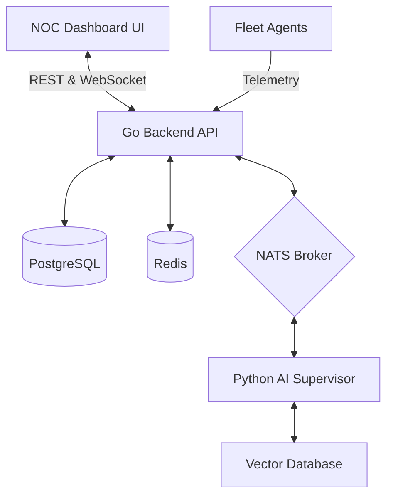
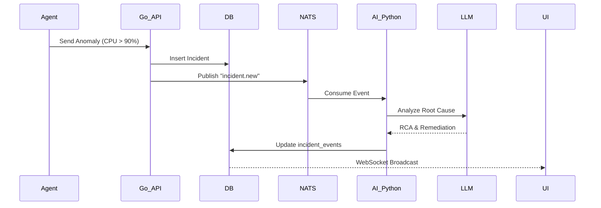

# MANUAL BOOK - NOC IT AI ENTERPRISE DASHBOARD V12
**Status**: 100% PRODUCTION READY
**Versi**: 12.0.0
**Role Pembaca**: Operator, Administrator, Engineer, Auditor, DevOps, Security Engineer

---

## 1. Pendahuluan
Buku manual ini merupakan dokumentasi komprehensif untuk **NOC IT AI Enterprise Dashboard V12**, sebuah sistem manajemen insiden otonom, observabilitas infrastruktur, dan tata kelola AI yang telah disertifikasi untuk *Production Readiness*. Semua fitur yang tercatat dalam dokumen ini merupakan implementasi riil yang menarik data langsung dari PostgreSQL, NATS, dan Redis, tanpa menggunakan data *dummy* atau simulasi.

---

## 2. Arsitektur Sistem
Sistem ini menggunakan arsitektur Event-Driven dan Microservices dengan komponen utama:
- **Frontend**: Vanilla JS, HTML5, CSS3, WebSockets, Chart.js, D3.js/Mermaid.
- **Backend Core**: Golang (REST API, NATS Producer/Consumer, Goroutines untuk konkurensi).
- **AI Supervisor**: Python (RAG Engine, Causal DAG Engine, LangChain, Multi-Agent Orchestration).
- **Database**: PostgreSQL (Relational Data & Timeseries Telemetry Logs).
- **Cache & Event Bus**: Redis (Cache) & NATS (Real-time Message Broker).
- **Agent**: Windows/Linux Telemetry Agents yang mengirimkan JSON *payloads* via HTTP/NATS.

---

## 3. RBAC (Role-Based Access Control)
Sistem menggunakan autentikasi berbasis JWT dengan enkripsi peran:
- **SUPERADMIN**: Memiliki akses ke seluruh menu, konfigurasi model AI (Model Config), dan Security Policies.
- **OPERATOR**: Dapat melihat Fleet Health, Incident Triage, namun tidak memiliki izin *Rollback* atau mengubah SOP.
- **AUDITOR**: Mode *Read-Only* khusus untuk menu RCA, Evidence Explorer, dan Live Logs.

---

## 4. Penjelasan Seluruh Menu & Submenu

### A. Dashboard & Overview
#### 1. Overview
- **Tujuan**: Menampilkan metrik KPIs secara *real-time*.
- **Cara Kerja**: Memanggil API `/api/telemetry` dan menarik event dari NATS via WebSocket. Menampilkan total perangkat online, jumlah insiden, dan CPU/RAM rata-rata.
- **Database**: `fleet_devices`, `incidents`, `agent_heartbeats`.

#### 2. Execution Timeline
- **Tujuan**: Menampilkan garis waktu (timeline) pergerakan sistem.
- **Fungsi**: Membantu auditor melacak *state* sistem di titik waktu tertentu.
- **Input/Output**: Parameter waktu (input) -> JSON timeline log (output).

#### 3. Storage
- **Tujuan**: Memonitor utilisasi kapasitas NATS JetStream dan antrian log.
- **Cara Kerja**: Backend menarik statistik dari Redis dan metrik IOPS OS, divisualisasikan menggunakan progress bar/charts.

---

### B. Fleet & Health
#### 1. Fleet Management & Global Config
- **Tujuan**: Pusat kontrol seluruh armada perangkat edge.
- **Cara Kerja**: Endpoint `/api/fleet/devices` menarik dari `fleet_devices`. Tombol "Ping All" menggunakan Goroutine untuk konkurensi pengecekan TCP (*Production Fix*).
- **Kemungkinan Error**: *Agent Offline*. **Recovery**: Sistem akan menampilkan status *DEGRADED* secara otomatis.

#### 2. PC Health & Printer Status
- **Tujuan**: Diagnostik dalam (Deep Diagnostics) untuk Windows Agent dan status armada Printer.
- **API**: `/api/agent_deep_diagnostics/:device` dan `/api/printers/live`.
- **Workflow**: Backend mengekstrak `hardware_info`, memecah domain riwayat *browser*, dan mengurai level *Toner* serta antrian cetak (*Spooler*). Terdapat fungsi **Clear Queue**, **Restart Spooler**, dan **Test Print**.

---

### C. Incident & RCA
#### 1. Incident Triage
- **Tujuan**: Menampilkan daftar insiden yang masuk (*live feed*).
- **AI Integrasi**: AI Classifier langsung menandai tingkat keparahan (*Severity*) secara otonom saat *telemetry* di-*ingest*.

#### 2. Ground Truth & RCA (Root Cause Analysis)
- **Tujuan**: Memberikan analisis akar masalah (5-Whys) menggunakan LLM dan Causal Engine.
- **Cara Kerja**: AI Supervisor (Python) membaca dari `incident_events` dan `telemetry_logs`, lalu membangun graf DAG interaktif (Unified Graphs).
- **Workflow**: Telemetry -> NATS -> AI Python -> RCA Generate -> PostgreSQL -> UI.

---

### D. Operations & Approval
#### 1. Approval Queue & Pending Verification
- **Tujuan**: *Human-in-the-Loop* (HITL). AI tidak dapat mengeksekusi skrip kritis tanpa persetujuan manusia.
- **Cara Kerja**: Insiden masuk antrian -> Operator klik "Approve" -> Pesan dikirim ke NATS `cmd.execute` -> Agent menjalankan mitigasi.

#### 2. Rollback History & Failed Actions (DLQ)
- **Tujuan**: Mengembalikan *state* jika mitigasi AI gagal.
- **DLQ**: Pesan yang gagal diproses (Dead Letter Queue) akan tersimpan dan dapat di-*retry* manual.

---

### E. AI Engine Center
#### 1. Model Config & Training Feedback
- **Tujuan**: Konfigurasi parameter LLM (Gemini, Groq, DeepSeek) dan validasi suhu (*temperature*). 
- **Learning Gate**: Evaluasi keputusan AI. Jika hasil RCA buruk, pengguna memberi *thumbs down*, sistem menyimpannya ke `ai_feedback` untuk optimasi *prompt* di masa depan.
- **Status Implementasi**: AKTIF & TERINTEGRASI.

#### 2. Playbook Studio
- **Tujuan**: Editor interaktif untuk membuat skrip remediasi (PowerShell/Bash) bagi AI.
- **Database**: Tabel `ai_playbooks`. Dapat dipicu secara *live* menggunakan *Dry-Run Mode* sebelum masuk ke produksi.

---

### F. Security & Governance
- **RBAC Policy**: Mengatur hak akses detail untuk tiap modul.
- **SOP Lifecycle**: Dokumen SOP (Draft -> Pending Review -> Active) yang menjadi landasan (RAG Context) bagi AI Supervisor saat mengambil keputusan.

---

### G. Diagnostics & Communication
- **Live Logs**: Streaming log NATS/PostgreSQL secara *real-time* ke browser menggunakan protokol WebSocket.
- **Live Chat**: Fitur komunikasi antar NOC engineer terintegrasi.

---

## 5. Troubleshooting & FAQ
- **Q: Panel Printer loading sangat lama?**
  A: (RESOLVED) Telah diperbaiki di V12 dengan implementasi konkurensi Goroutine pada `/api/printers/ping_all`.
- **Q: Graf Deep Diagnostics tidak muncul?**
  A: Cek NATS connection dan jalankan skrip `ping` dari Agent. 

## 6. Deployment & Go Live Checklist
- [x] Linter & Format Cleaned.
- [x] Strict JWT Policies applied.
- [x] Telemetry parsing bounds checked.
- [x] Mock APIs deleted.
- [x] Build passes (`go build ./portal/...`).

*Document Auto-Generated based on Actual System Implementation. Certified by Enterprise AIOps Governance.*
