# 🛡️ BLUEPRINT TOPOLOGI LENGKAP SIKLUS HIDUP AI ENTERPRISE (9-LAYER FULL CYCLE)
> **Sistem:** Incident Analysis Platform — Autonomous AI Ops & Proactive Root Cause Analysis  
> **Inspirasi Visual:** `DOCUMENTATION/DIAGRAM_ARSITEKTUR_VISUAL_ENTERPRISE.html` (Diagram #1)  
> **Tujuan:** Memvisualisasikan **Topologi Alur Komponen & Siklus Hidup AI 9-Layer Komprehensif** secara interaktif di Portal UI Dashboard.

---

## 📐 1. DIAGRAM MERMAID TOPOLOGI LENGKAP SIKLUS HIDUP AI (FULL 9-LAYER)

```mermaid
graph TD
    classDef client fill:#3b82f6,stroke:#1d4ed8,color:#fff,stroke-width:2px;
    classDef web fill:#0284c7,stroke:#0369a1,color:#fff,stroke-width:2px;
    classDef backend fill:#0d9488,stroke:#0f766e,color:#fff,stroke-width:2px;
    classDef ai fill:#7c3aed,stroke:#6d28d9,color:#fff,stroke-width:2px;
    classDef db fill:#d97706,stroke:#b45309,color:#fff,stroke-width:2px;
    classDef broker fill:#ea580c,stroke:#c2410c,color:#fff,stroke-width:2px;
    classDef infra fill:#475569,stroke:#334155,color:#fff,stroke-width:2px;
    classDef ext fill:#dc2626,stroke:#b91c1c,color:#fff,stroke-width:2px;

    subgraph Layer1 [1. Client & User Layer]
        U["System Administrator / Operator NOC"]:::client
        CE["Chrome Extension OSI Assistant"]:::client
    end

    subgraph Layer2 [2. Web Portal Presentation Layer]
        WP["System Portal Web UI"]:::web
        DB_M["Dashboard Utama (60 FPS Chart)"]:::web
        INC_M["Incident Triage & HITL Queue"]:::web
        TEL_M["Telemetry Monitoring Feed"]:::web
        AI_M["AI Ops Cognition & RAG UI"]:::web
        KB_M["Knowledge Base RAG Search"]:::web
        AUD_M["System Audit & Production Readiness"]:::web
        SET_M["Model Config & RBAC Governance"]:::web
    end

    subgraph Layer3 [3. API Gateway Controller]
        REST["HTTP REST API Gateway (:8080)"]:::backend
        WS["WebSocket Stream Server (:8080)"]:::backend
    end

    subgraph Layer4 [4. Go Core Backend Services]
        GB["Go Dashboard Server Core (Gin)"]:::backend
        LS["Launcher Service Manager"]:::backend
        SR["Secure Encrypted Relay Service"]:::backend
    end

    subgraph Layer5 [5. Python AI Core Engine - Autonomous Cognition]
        PAI["Python AI Supervisor Cognition"]:::ai
        LLMR["LLM Router (DeepSeek / Gemini / Groq)"]:::ai
        RAG["RAG 2.0 Vector Search & Reranker"]:::ai
        DAG["Causal DAG Root Cause Engine"]:::ai
        GOV["Policy Engine HITL Safeguard"]:::ai
        OBS["Active Observer Daemon 24/7"]:::ai
        CHS["Autonomous Chaos Injection Worker"]:::ai
    end

    subgraph Layer6 [6. Persistence & Event Broker Layer]
        NATS["NATS JetStream Event Broker (:4222)"]:::broker
        SQL_INC["incident_analysis.db (SQLite WAL)"]:::db
        SQL_SO["sprint_o.db (State Machine)"]:::db
        SQL_RAG["sprint_q_rag.db (Vector Store)"]:::db
        SQL_COG["cognitive_memory.db (Memory DB)"]:::db
        FTP["FTP Storage / Local Artifact Share"]:::db
    end

    subgraph Layer7 [7. Automation Container Infrastructure]
        DK["Docker Microservices Engine"]:::infra
        N8N["n8n Workflow Automation Engine"]:::infra
        CASA["CasaOS System Management"]:::infra
    end

    subgraph Layer8 [8. Monitoring Endpoint Agents]
        AL["Linux Agent Service (Go Publisher)"]:::client
        AW["Windows Agent Service (Go Publisher)"]:::client
    end

    subgraph Layer9 [9. External Enterprise Integration]
        LDAP["LDAP / Active Directory Integration"]:::ext
        KAFKA["Apache Kafka Enterprise Cluster"]:::ext
        DNS["Enterprise DNS / DHCP Server"]:::ext
        K8S["Kubernetes Multi-Site Cluster"]:::ext
    end

    %% Hubungan dan Alur Data (Data Flow & AI Lifecycle Connections)
    U --> WP
    CE --> REST
    WP --> DB_M & INC_M & TEL_M & AI_M & KB_M & AUD_M & SET_M
    DB_M & INC_M & TEL_M & AI_M & KB_M & AUD_M & SET_M --> REST & WS
    REST & WS --> GB
    GB --> LS & SR & NATS
    GB --> PAI
    PAI --> LLMR & RAG & DAG & GOV & OBS & CHS
    GB --> SQL_INC & SQL_SO
    PAI --> SQL_RAG & SQL_COG
    NATS -->|Event Stream| AL & AW
    AL & AW -->|Telemetri Push < 5ms| NATS
    GB --> LDAP & KAFKA & DNS & K8S
    DK --> NATS & N8N & CASA
```

---

## 🔍 2. INTERAKSI SIKLUS HIDUP DATA PADA TOPOLOGI LENGKAP

1. **Aliran Telemetri Masuk (Push Flow `< 5ms`):**  
   `Agent Endpoint (Layer 8)` ➔ `NATS JetStream Broker (Layer 6)` ➔ `Active Observer Daemon (Layer 5)` & `Go Core Server (Layer 4)`.

2. **Aliran Pemrosesan AI Ops & Diagnostik (`< 150ms`):**  
   `Active Observer` ➔ `Causal DAG Engine` ➔ `RAG 2.0 Vector Store` ➔ `LLM Router (DeepSeek/Gemini/Groq)`.

3. **Aliran Penegakan Keamanan & Eksekusi HITL:**  
   `Policy Engine HITL Safeguard` ➔ `Web Portal HITL Queue (Layer 2)` ➔ `Persetujuan Operator` ➔ `Remediation Subscriber (Layer 8)`.

4. **Aliran Pembelajaran Mandiri (Continuous Self-Learning Loop):**  
   `Feedback Reviewer` ➔ `Cognitive Memory DB (Layer 6)` ➔ `Knowledge Vector RAG Update` ➔ `Evaluasi ulang oleh AI Supervisor`.

---

## 🚀 3. RENCANA PENERAPAN DI PORTAL UI (`portal/templates/index.html`)

Pada kartu **Global Service Topology Map** di Dashboard:
1. Menambahkan tombol mode toggle:
   - `[ 🌐 Device Fleet Topology ]`
   - `[ 🧠 Enterprise AI Lifecycle Topology ]`
2. Saat mode **Enterprise AI Lifecycle Topology** dipilih:
   - Dashboard menampilkan visualisasi diagram topologi 9-Layer lengkap dengan simpul (*nodes*) berwarna-warni sesuai kategori layer.
   - Dilengkapi *glowing animation* pada jalur yang sedang aktif dilewati aliran telemetri/AI Ops.
