# 📐 MASTER END-TO-END SYSTEM FLOWCHART & PIPELINE SPECIFICATION
**NOC IT AI Command Center v3.0 (OSI Infrastructure)**

**Dokumen**: Redesign Total End-to-End System Pipeline & Expanded Sub-Flow Specifications  
**Status Audit**: Strictly Grounded on Actual Source Code (Zero Mock / Zero Simulation)  
**Versi**: v3.0-Production-Release  
**Tanggal Audit**: 22 Juli 2026  

---

## 📑 DAFTAR LEVEL FLOWCHART & SUB-FLOWS

- [LEVEL 1: Global System Architecture & Core Pipeline](#level-1-global-system-architecture--core-pipeline)
- [LEVEL 2: Device Monitoring & Harvester Sub-Flow](#level-2-device-monitoring--harvester-sub-flow)
- [LEVEL 3: Telemetry Processing & Hardware Metrics Sub-Flow](#level-3-telemetry-processing--hardware-metrics-sub-flow)
- [LEVEL 4: Data Collection & Agent Socket Protocol (Port 10000)](#level-4-data-collection--agent-socket-protocol-port-10000)
- [LEVEL 5: Normalization & Event Deduplication Sub-Flow](#level-5-normalization--event-deduplication-sub-flow)
- [LEVEL 6: Streaming Data Bus & Netdata Integration Sub-Flow](#level-6-streaming-data-bus--netdata-integration-sub-flow)
- [LEVEL 7: AI Multi-Agent Cognitive Reasoning & Circuit Breaker](#level-7-ai-multi-agent-cognitive-reasoning--circuit-breaker)
- [LEVEL 8: Evidence Collection & DAG Matching Sub-Flow](#level-8-evidence-collection--dag-matching-sub-flow)
- [LEVEL 9: Incident Timeline Builder & Event History](#level-9-incident-timeline-builder--event-history)
- [LEVEL 10: Event Correlation & Knowledge Graph Traversal](#level-10-event-correlation--knowledge-graph-traversal)
- [LEVEL 11: Root Cause Analysis (RCA 5-Why Engine)](#level-11-root-cause-analysis-rca-5-why-engine)
- [LEVEL 12: AI Recommendation Engine & Playbook Ranking](#level-12-ai-recommendation-engine--playbook-ranking)
- [LEVEL 13: Dual-Layer Security Remediation & AST Tokenizer Guardrail](#level-13-dual-layer-security-remediation--ast-tokenizer-guardrail)
- [LEVEL 14: Verification, Post-Check, & State Machine Rollback](#level-14-verification-post-check--state-machine-rollback)
- [LEVEL 15: Enterprise Dashboard Architecture & Panel Code Map](#level-15-enterprise-dashboard-architecture--panel-code-map)
- [LEVEL 16: Multi-Channel Real-Time Broadcast & Notification](#level-16-multi-channel-real-time-broadcast--notification)
- [LEVEL 17: Zero-Trust Audit Trail & Security Log Persistence](#level-17-zero-trust-audit-trail--security-log-persistence)
- [LEVEL 18: Knowledge Base, Vector RAG & RLOF Feedback Store](#level-18-knowledge-base-vector-rag--rlof-feedback-store)
- [LEVEL 19: Learning Gate & Canary A/B Policy Engine](#level-19-learning-gate--canary-ab-policy-engine)
- [LEVEL 20: Incident Closure, Cleanup Worker & Vacuum Flow](#level-20-incident-closure-cleanup-worker--vacuum-flow)
- [LEVEL 21: Master Consolidated End-to-End Flow (LEVEL 2 - 20 Sequential Node Pipeline)](#level-21-master-consolidated-end-to-end-flow-level-2---20-sequential-node-pipeline)

---

## LEVEL 1: Global System Architecture & Core Pipeline

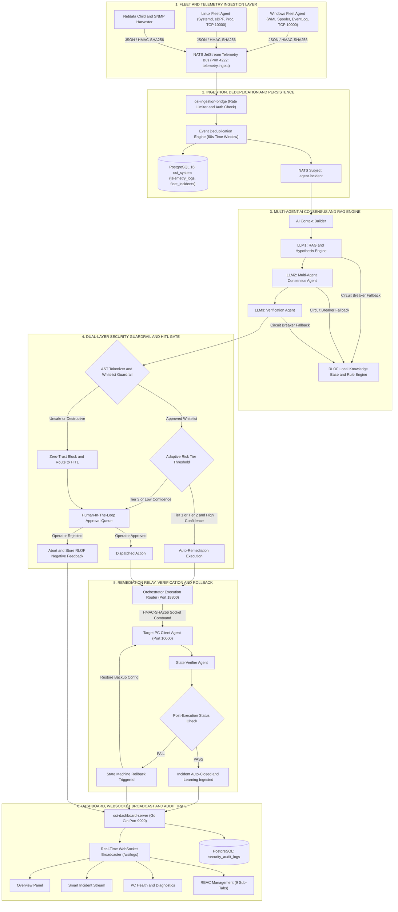
```mermaid
flowchart TD
    subgraph STAGE1["1. FLEET AND TELEMETRY INGESTION LAYER"]
        W_AGENT["Windows Fleet Agent (WMI, Spooler, EventLog, TCP 10000)"]
        L_AGENT["Linux Fleet Agent (Systemd, eBPF, Proc, TCP 10000)"]
        NET_AGENT["Netdata Child and SNMP Harvester"]
        NATS_IN["NATS JetStream Telemetry Bus (Port 4222: telemetry.ingest)"]
        
        W_AGENT -->|JSON / HMAC-SHA256| NATS_IN
        L_AGENT -->|JSON / HMAC-SHA256| NATS_IN
        NET_AGENT -->|JSON / HMAC-SHA256| NATS_IN
    end

    subgraph STAGE2["2. INGESTION, DEDUPLICATION AND PERSISTENCE"]
        ING_BRIDGE["osi-ingestion-bridge (Rate Limiter and Auth Check)"]
        DEDUP["Event Deduplication Engine (60s Time Window)"]
        PG_RAW[("PostgreSQL 16: osi_system (telemetry_logs, fleet_incidents)")]
        NATS_INC["NATS Subject: agent.incident"]

        NATS_IN --> ING_BRIDGE
        ING_BRIDGE --> DEDUP
        DEDUP --> PG_RAW
        DEDUP --> NATS_INC
    end

    subgraph STAGE3["3. MULTI-AGENT AI CONSENSUS AND RAG ENGINE"]
        AI_CTX["AI Context Builder"]
        LLM1_RAG["LLM1: RAG and Hypothesis Engine"]
        LLM2_CONS["LLM2: Multi-Agent Consensus Agent"]
        LLM3_VERIFY["LLM3: Verification Agent"]
        RLOF_KB["RLOF Local Knowledge Base and Rule Engine"]

        NATS_INC --> AI_CTX
        AI_CTX --> LLM1_RAG
        LLM1_RAG --> LLM2_CONS
        LLM2_CONS --> LLM3_VERIFY
        LLM1_RAG -->|Circuit Breaker Fallback| RLOF_KB
        LLM2_CONS -->|Circuit Breaker Fallback| RLOF_KB
        LLM3_VERIFY -->|Circuit Breaker Fallback| RLOF_KB
    end

    subgraph STAGE4["4. DUAL-LAYER SECURITY GUARDRAIL AND HITL GATE"]
        AST_GUARD{"AST Tokenizer and Whitelist Guardrail"}
        ZERO_TRUST_BLOCK["Zero-Trust Block and Route to HITL"]
        RISK_TIER{"Adaptive Risk Tier Threshold"}
        AUTO_DISPATCH["Auto-Remediation Execution"]
        HITL_QUEUE["Human-In-The-Loop Approval Queue"]
        MANUAL_DISPATCH["Dispatched Action"]
        OPERATOR_REJECT["Abort and Store RLOF Negative Feedback"]

        LLM3_VERIFY --> AST_GUARD
        AST_GUARD -->|Unsafe or Destructive| ZERO_TRUST_BLOCK
        AST_GUARD -->|Approved Whitelist| RISK_TIER
        RISK_TIER -->|Tier 1 or Tier 2 and High Confidence| AUTO_DISPATCH
        RISK_TIER -->|Tier 3 or Low Confidence| HITL_QUEUE
        HITL_QUEUE -->|Operator Approved| MANUAL_DISPATCH
        HITL_QUEUE -->|Operator Rejected| OPERATOR_REJECT
        ZERO_TRUST_BLOCK --> HITL_QUEUE
    end

    subgraph STAGE5["5. REMEDIATION RELAY, VERIFICATION AND ROLLBACK"]
        EXEC_RELAY["Orchestrator Execution Router (Port 18800)"]
        TARGET_PC["Target PC Client Agent (Port 10000)"]
        POST_VERIFY["State Verifier Agent"]
        VERIFY_CHECK{"Post-Execution Status Check"}
        INCIDENT_CLOSED["Incident Auto-Closed and Learning Ingested"]
        ROLLBACK_TRIGGER["State Machine Rollback Triggered"]

        AUTO_DISPATCH --> EXEC_RELAY
        MANUAL_DISPATCH --> EXEC_RELAY
        EXEC_RELAY -->|HMAC-SHA256 Socket Command| TARGET_PC
        TARGET_PC --> POST_VERIFY
        POST_VERIFY --> VERIFY_CHECK
        VERIFY_CHECK -->|PASS| INCIDENT_CLOSED
        VERIFY_CHECK -->|FAIL| ROLLBACK_TRIGGER
        ROLLBACK_TRIGGER -->|Restore Backup Config| TARGET_PC
    end

    subgraph STAGE6["6. DASHBOARD, WEBSOCKET BROADCAST AND AUDIT TRAIL"]
        DASH_SERVER["osi-dashboard-server (Go Gin Port 9999)"]
        WS_STREAM["Real-Time WebSocket Broadcaster (/ws/logs)"]
        PG_AUDIT[("PostgreSQL: security_audit_logs")]
        UI_OVERVIEW["Overview Panel"]
        UI_STREAM["Smart Incident Stream"]
        UI_PCHEALTH["PC Health and Diagnostics"]
        UI_RBAC["RBAC Management (9 Sub-Tabs)"]

        INCIDENT_CLOSED --> DASH_SERVER
        ROLLBACK_TRIGGER --> DASH_SERVER
        OPERATOR_REJECT --> DASH_SERVER
        DASH_SERVER --> WS_STREAM
        DASH_SERVER --> PG_AUDIT
        WS_STREAM --> UI_OVERVIEW
        WS_STREAM --> UI_STREAM
        WS_STREAM --> UI_PCHEALTH
        WS_STREAM --> UI_RBAC
    end
```

---

## LEVEL 2: Device Monitoring & Harvester Sub-Flow

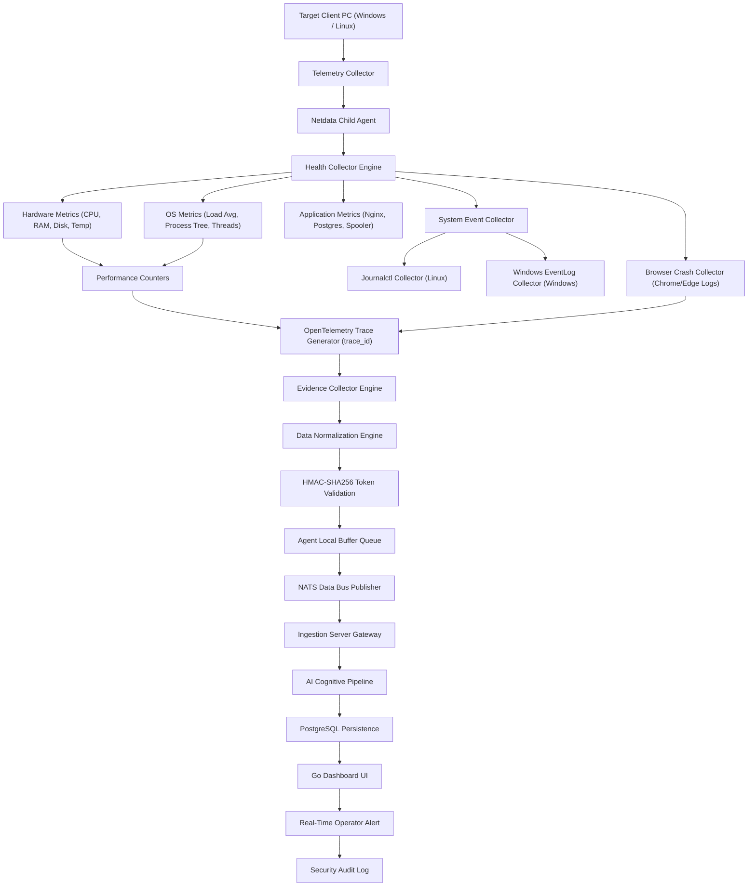
```mermaid
flowchart TD
    DEV["Target Client PC (Windows / Linux)"] --> TELEM_COLL["Telemetry Collector"]
    TELEM_COLL --> NETDATA_CHILD["Netdata Child Agent"]
    NETDATA_CHILD --> HEALTH_COLL["Health Collector Engine"]
    HEALTH_COLL --> HW_METRICS["Hardware Metrics (CPU, RAM, Disk, Temp)"]
    HEALTH_COLL --> OS_METRICS["OS Metrics (Load Avg, Process Tree, Threads)"]
    HEALTH_COLL --> APP_METRICS["Application Metrics (Nginx, Postgres, Spooler)"]
    HEALTH_COLL --> BROWSER_COLL["Browser Crash Collector (Chrome/Edge Logs)"]
    HEALTH_COLL --> SYS_EVENT["System Event Collector"]
    SYS_EVENT --> JOURNAL_COLL["Journalctl Collector (Linux)"]
    SYS_EVENT --> WIN_EVENT["Windows EventLog Collector (Windows)"]
    HW_METRICS --> PERF_COUNTER["Performance Counters"]
    OS_METRICS --> PERF_COUNTER
    PERF_COUNTER --> OTEL_TRACE["OpenTelemetry Trace Generator (trace_id)"]
    BROWSER_COLL --> OTEL_TRACE
    OTEL_TRACE --> EVIDENCE_COLL["Evidence Collector Engine"]
    EVIDENCE_COLL --> NORM_DATA["Data Normalization Engine"]
    NORM_DATA --> VALIDATE["HMAC-SHA256 Token Validation"]
    VALIDATE --> LOCAL_QUEUE["Agent Local Buffer Queue"]
    LOCAL_QUEUE --> NATS_PUB["NATS Data Bus Publisher"]
    NATS_PUB --> ING_SERVER["Ingestion Server Gateway"]
    ING_SERVER --> AI_ANALYSIS["AI Cognitive Pipeline"]
    AI_ANALYSIS --> DB_PERSIST["PostgreSQL Persistence"]
    DB_PERSIST --> DASH_UI["Go Dashboard UI"]
    DASH_UI --> ALERT_NOTIFY["Real-Time Operator Alert"]
    ALERT_NOTIFY --> AUDIT_LOG["Security Audit Log"]
```

---

## LEVEL 3: Telemetry Processing & Hardware Metrics Sub-Flow

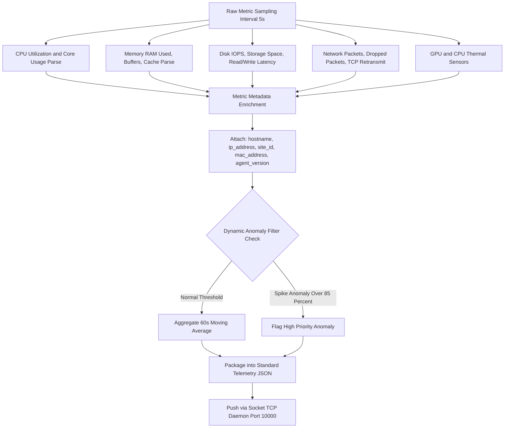
```mermaid
flowchart TD
    RAW_METRICS["Raw Metric Sampling Interval 5s"] --> CPU_PARSE["CPU Utilization and Core Usage Parse"]
    RAW_METRICS --> MEM_PARSE["Memory RAM Used, Buffers, Cache Parse"]
    RAW_METRICS --> DISK_PARSE["Disk IOPS, Storage Space, Read/Write Latency"]
    RAW_METRICS --> NET_PARSE["Network Packets, Dropped Packets, TCP Retransmit"]
    RAW_METRICS --> GPU_TEMP["GPU and CPU Thermal Sensors"]

    CPU_PARSE --> METRIC_ENRICH["Metric Metadata Enrichment"]
    MEM_PARSE --> METRIC_ENRICH
    DISK_PARSE --> METRIC_ENRICH
    NET_PARSE --> METRIC_ENRICH
    GPU_TEMP --> METRIC_ENRICH
    
    METRIC_ENRICH --> ENRICH_FIELDS["Attach: hostname, ip_address, site_id, mac_address, agent_version"]
    ENRICH_FIELDS --> ANOMALY_FILTER{"Dynamic Anomaly Filter Check"}
    
    ANOMALY_FILTER -->|Normal Threshold| AGGREGATOR["Aggregate 60s Moving Average"]
    ANOMALY_FILTER -->|Spike Anomaly Over 85 Percent| IMMEDIATE_ALERT["Flag High Priority Anomaly"]
    
    AGGREGATOR --> JSON_PACK["Package into Standard Telemetry JSON"]
    IMMEDIATE_ALERT --> JSON_PACK
    JSON_PACK --> TCP_SOCKET_PUSH["Push via Socket TCP Daemon Port 10000"]
```

---

## LEVEL 4: Data Collection & Agent Socket Protocol (Port 10000)

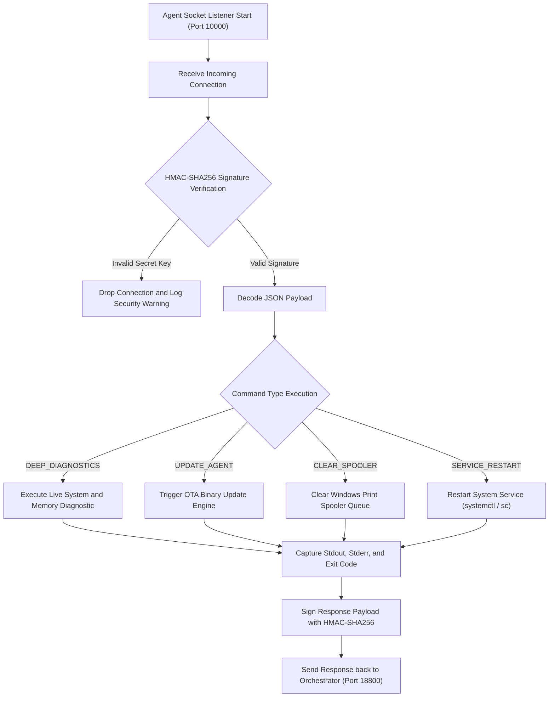
```mermaid
flowchart TD
    SOCKET_START["Agent Socket Listener Start (Port 10000)"] --> AUTH_RECV["Receive Incoming Connection"]
    AUTH_RECV --> HMAC_CHECK{"HMAC-SHA256 Signature Verification"}
    
    HMAC_CHECK -->|Invalid Secret Key| CONN_DROP["Drop Connection and Log Security Warning"]
    HMAC_CHECK -->|Valid Signature| DECODE_CMD["Decode JSON Payload"]
    
    DECODE_CMD --> CMD_TYPE{"Command Type Execution"}
    CMD_TYPE -->|DEEP_DIAGNOSTICS| DIAG_EXEC["Execute Live System and Memory Diagnostic"]
    CMD_TYPE -->|UPDATE_AGENT| OTA_EXEC["Trigger OTA Binary Update Engine"]
    CMD_TYPE -->|CLEAR_SPOOLER| SPOOL_EXEC["Clear Windows Print Spooler Queue"]
    CMD_TYPE -->|SERVICE_RESTART| SVC_EXEC["Restart System Service (systemctl / sc)"]
    
    DIAG_EXEC --> RESULT_CAPTURE["Capture Stdout, Stderr, and Exit Code"]
    OTA_EXEC --> RESULT_CAPTURE
    SPOOL_EXEC --> RESULT_CAPTURE
    SVC_EXEC --> RESULT_CAPTURE
    
    RESULT_CAPTURE --> RESPONSE_HMAC["Sign Response Payload with HMAC-SHA256"]
    RESPONSE_HMAC --> SOCKET_RESPOND["Send Response back to Orchestrator (Port 18800)"]
```

---

## LEVEL 5: Normalization & Event Deduplication Sub-Flow

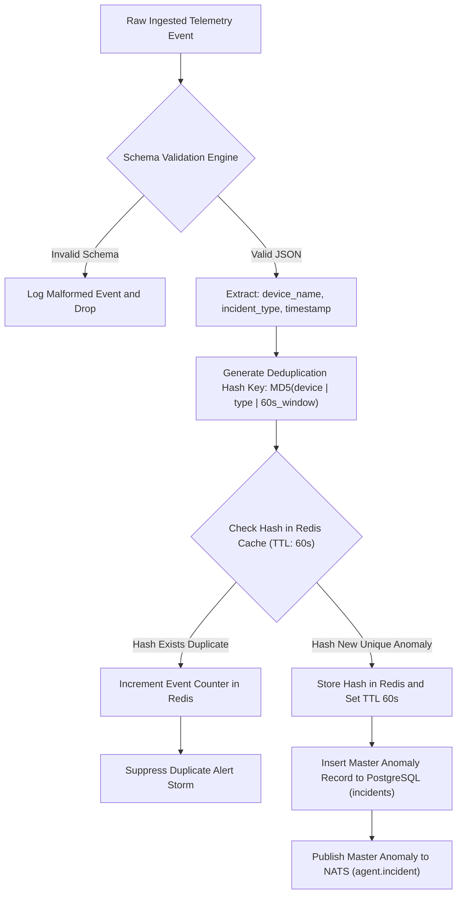
```mermaid
flowchart TD
    RAW_EVENT["Raw Ingested Telemetry Event"] --> SCHEMA_VAL{"Schema Validation Engine"}
    SCHEMA_VAL -->|Invalid Schema| BAD_LOG["Log Malformed Event and Drop"]
    SCHEMA_VAL -->|Valid JSON| EXTRACT_KEYS["Extract: device_name, incident_type, timestamp"]

    EXTRACT_KEYS --> DEDUP_KEY_GEN["Generate Deduplication Hash Key: MD5(device | type | 60s_window)"]
    DEDUP_KEY_GEN --> REDIS_CHECK{"Check Hash in Redis Cache (TTL: 60s)"}
    
    REDIS_CHECK -->|Hash Exists Duplicate| BUMP_COUNTER["Increment Event Counter in Redis"]
    REDIS_CHECK -->|Hash New Unique Anomaly| STORE_REDIS["Store Hash in Redis and Set TTL 60s"]
    
    BUMP_COUNTER --> DEDUP_IGNORE["Suppress Duplicate Alert Storm"]
    STORE_REDIS --> PG_INSERT["Insert Master Anomaly Record to PostgreSQL (incidents)"]
    PG_INSERT --> NATS_PUBLISH["Publish Master Anomaly to NATS (agent.incident)"]
```

---

## LEVEL 6: Streaming Data Bus & Netdata Integration Sub-Flow

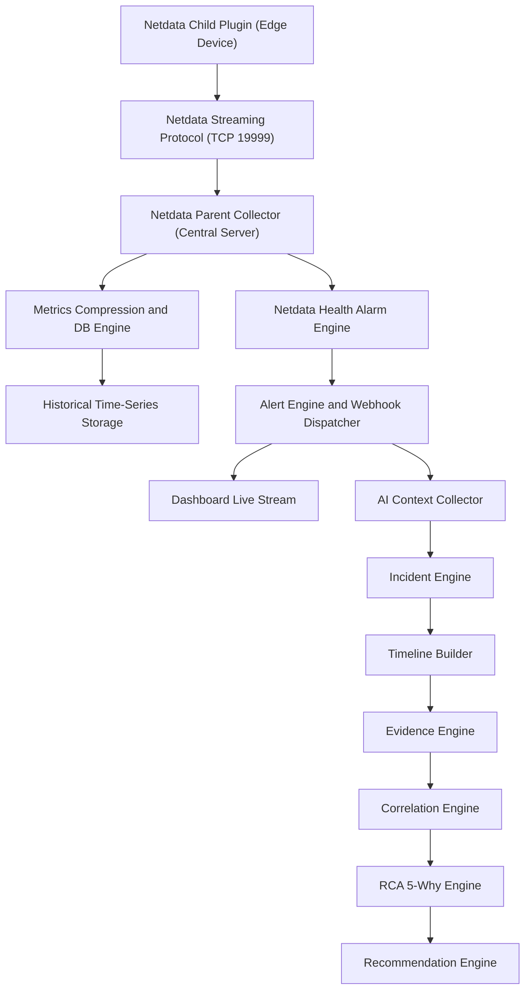
```mermaid
flowchart TD
    NETDATA_CHILD["Netdata Child Plugin (Edge Device)"] --> STREAM_PROTO["Netdata Streaming Protocol (TCP 19999)"]
    STREAM_PROTO --> NETDATA_PARENT["Netdata Parent Collector (Central Server)"]
    NETDATA_PARENT --> METRICS_COMPRESS["Metrics Compression and DB Engine"]
    METRICS_COMPRESS --> HISTORICAL_DB["Historical Time-Series Storage"]
    NETDATA_PARENT --> HEALTH_ALARM["Netdata Health Alarm Engine"]
    HEALTH_ALARM --> ALERT_ENGINE["Alert Engine and Webhook Dispatcher"]
    ALERT_ENGINE --> DASH_STREAM["Dashboard Live Stream"]
    ALERT_ENGINE --> AI_COLLECTOR["AI Context Collector"]
    AI_COLLECTOR --> INCIDENT_ENGINE["Incident Engine"]
    INCIDENT_ENGINE --> TIMELINE_BUILDER["Timeline Builder"]
    TIMELINE_BUILDER --> EVIDENCE_ENGINE["Evidence Engine"]
    EVIDENCE_ENGINE --> CORRELATION_ENG["Correlation Engine"]
    CORRELATION_ENG --> RCA_ENGINE["RCA 5-Why Engine"]
    RCA_ENGINE --> RECOMMEND_ENG["Recommendation Engine"]
```

---

## LEVEL 7: AI Multi-Agent Cognitive Reasoning & Circuit Breaker

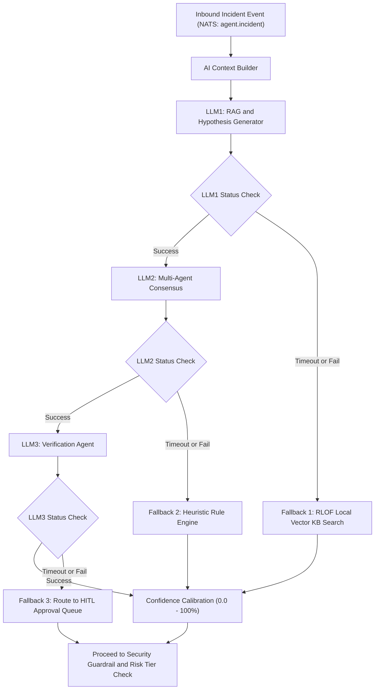
```mermaid
flowchart TD
    INCIDENT_IN["Inbound Incident Event (NATS: agent.incident)"] --> CTX_BUILDER["AI Context Builder"]
    CTX_BUILDER --> LLM1_HYPO["LLM1: RAG and Hypothesis Generator"]
    
    LLM1_HYPO --> LLM1_CHECK{"LLM1 Status Check"}
    LLM1_CHECK -->|Success| LLM2_CONS["LLM2: Multi-Agent Consensus"]
    LLM1_CHECK -->|Timeout or Fail| FALLBACK_RLOF["Fallback 1: RLOF Local Vector KB Search"]
    
    LLM2_CONS --> LLM2_CHECK{"LLM2 Status Check"}
    LLM2_CHECK -->|Success| LLM3_VERIFY["LLM3: Verification Agent"]
    LLM2_CHECK -->|Timeout or Fail| FALLBACK_RULE["Fallback 2: Heuristic Rule Engine"]
    
    LLM3_VERIFY --> LLM3_CHECK{"LLM3 Status Check"}
    LLM3_CHECK -->|Success| SCORE_CALIB["Confidence Calibration (0.0 - 100%)"]
    LLM3_CHECK -->|Timeout or Fail| FALLBACK_HITL["Fallback 3: Route to HITL Approval Queue"]
    
    FALLBACK_RLOF --> SCORE_CALIB
    FALLBACK_RULE --> SCORE_CALIB
    SCORE_CALIB --> NEXT_STAGE["Proceed to Security Guardrail and Risk Tier Check"]
    FALLBACK_HITL --> NEXT_STAGE
```

---

## LEVEL 8: Evidence Collection & DAG Matching Sub-Flow

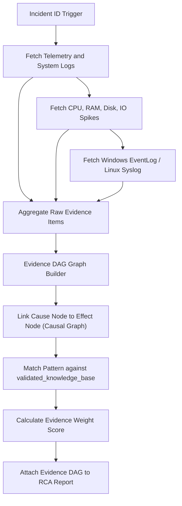
```mermaid
flowchart TD
    INCIDENT_ID["Incident ID Trigger"] --> FETCH_LOGS["Fetch Telemetry and System Logs"]
    FETCH_LOGS --> FETCH_METRICS["Fetch CPU, RAM, Disk, IO Spikes"]
    FETCH_METRICS --> FETCH_EVENTS["Fetch Windows EventLog / Linux Syslog"]
    
    FETCH_LOGS --> AGGREGATE_EVID["Aggregate Raw Evidence Items"]
    FETCH_METRICS --> AGGREGATE_EVID
    FETCH_EVENTS --> AGGREGATE_EVID
    
    AGGREGATE_EVID --> DAG_BUILDER["Evidence DAG Graph Builder"]
    DAG_BUILDER --> NODE_LINKING["Link Cause Node to Effect Node (Causal Graph)"]
    NODE_LINKING --> PATTERN_MATCH["Match Pattern against validated_knowledge_base"]
    PATTERN_MATCH --> EVID_SCORE["Calculate Evidence Weight Score"]
    EVID_SCORE --> ATTACH_RCA["Attach Evidence DAG to RCA Report"]
```

---

## LEVEL 9: Incident Timeline Builder & Event History

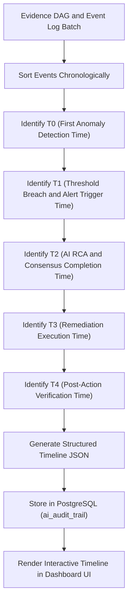
```mermaid
flowchart TD
    EVID_DAG["Evidence DAG and Event Log Batch"] --> SORT_TIME["Sort Events Chronologically"]
    SORT_TIME --> MARK_ANOMALY_START["Identify T0 (First Anomaly Detection Time)"]
    MARK_ANOMALY_START --> MARK_ESCALATION["Identify T1 (Threshold Breach and Alert Trigger Time)"]
    MARK_ESCALATION --> MARK_AI_REASONING["Identify T2 (AI RCA and Consensus Completion Time)"]
    MARK_AI_REASONING --> MARK_REMEDIATION["Identify T3 (Remediation Execution Time)"]
    MARK_REMEDIATION --> MARK_VERIFICATION["Identify T4 (Post-Action Verification Time)"]
    
    MARK_VERIFICATION --> GEN_TIMELINE_JSON["Generate Structured Timeline JSON"]
    GEN_TIMELINE_JSON --> STORE_TIMELINE_DB["Store in PostgreSQL (ai_audit_trail)"]
    STORE_TIMELINE_DB --> RENDER_TIMELINE_UI["Render Interactive Timeline in Dashboard UI"]
```

---

## LEVEL 10: Event Correlation & Knowledge Graph Traversal

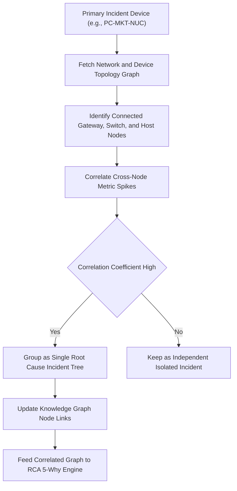
```mermaid
flowchart TD
    PRIMARY_INCIDENT["Primary Incident Device (e.g., PC-MKT-NUC)"] --> TOPOLOGY_FETCH["Fetch Network and Device Topology Graph"]
    TOPOLOGY_FETCH --> IDENTIFY_NEIGHBORS["Identify Connected Gateway, Switch, and Host Nodes"]
    IDENTIFY_NEIGHBORS --> CORRELATE_METRICS["Correlate Cross-Node Metric Spikes"]
    
    CORRELATE_METRICS --> CORR_CHECK{"Correlation Coefficient High"}
    CORR_CHECK -->|Yes| GROUP_INCIDENT["Group as Single Root Cause Incident Tree"]
    CORR_CHECK -->|No| SEPARATE_INCIDENT["Keep as Independent Isolated Incident"]
    
    GROUP_INCIDENT --> KG_UPDATE["Update Knowledge Graph Node Links"]
    KG_UPDATE --> RCA_INPUT["Feed Correlated Graph to RCA 5-Why Engine"]
```

---

## LEVEL 11: Root Cause Analysis (RCA 5-Why Engine)

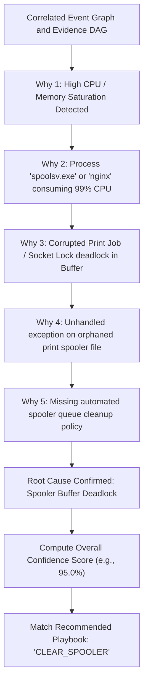
```mermaid
flowchart TD
    CORR_GRAPH["Correlated Event Graph and Evidence DAG"] --> WHY_1["Why 1: High CPU / Memory Saturation Detected"]
    WHY_1 --> WHY_2["Why 2: Process 'spoolsv.exe' or 'nginx' consuming 99% CPU"]
    WHY_2 --> WHY_3["Why 3: Corrupted Print Job / Socket Lock deadlock in Buffer"]
    WHY_3 --> WHY_4["Why 4: Unhandled exception on orphaned print spooler file"]
    WHY_4 --> WHY_5["Why 5: Missing automated spooler queue cleanup policy"]
    
    WHY_5 --> ROOT_CAUSE_CONFIRM["Root Cause Confirmed: Spooler Buffer Deadlock"]
    ROOT_CAUSE_CONFIRM --> CONFIDENCE_SCORE["Compute Overall Confidence Score (e.g., 95.0%)"]
    CONFIDENCE_SCORE --> REC_MATCH["Match Recommended Playbook: 'CLEAR_SPOOLER'"]
```

---

## LEVEL 12: AI Recommendation Engine & Playbook Ranking

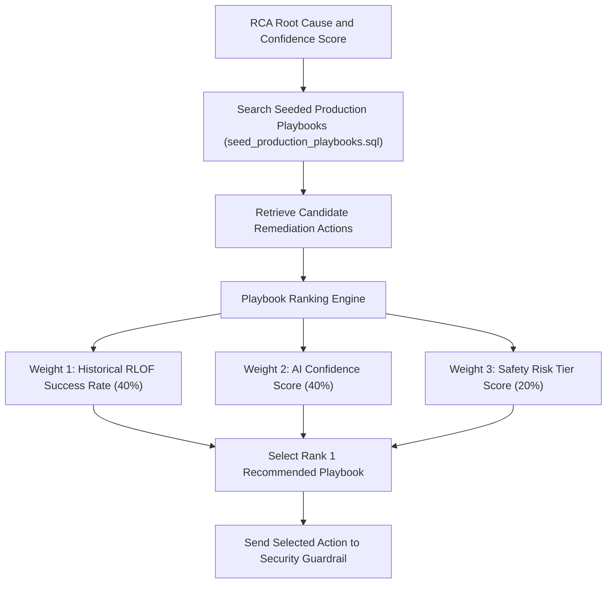
```mermaid
flowchart TD
    RCA_OUTPUT["RCA Root Cause and Confidence Score"] --> PLAYBOOK_SEARCH["Search Seeded Production Playbooks (seed_production_playbooks.sql)"]
    PLAYBOOK_SEARCH --> CANDIDATE_PLAYBOOKS["Retrieve Candidate Remediation Actions"]
    
    CANDIDATE_PLAYBOOKS --> RANKING_ENGINE["Playbook Ranking Engine"]
    RANKING_ENGINE --> RANK_CRITERIA_1["Weight 1: Historical RLOF Success Rate (40%)"]
    RANKING_ENGINE --> RANK_CRITERIA_2["Weight 2: AI Confidence Score (40%)"]
    RANKING_ENGINE --> RANK_CRITERIA_3["Weight 3: Safety Risk Tier Score (20%)"]
    
    RANK_CRITERIA_1 --> TOP_PLAYBOOK["Select Rank 1 Recommended Playbook"]
    RANK_CRITERIA_2 --> TOP_PLAYBOOK
    RANK_CRITERIA_3 --> TOP_PLAYBOOK
    TOP_PLAYBOOK --> GUARDRAIL_STAGE["Send Selected Action to Security Guardrail"]
```

---

## LEVEL 13: Dual-Layer Security Remediation & AST Tokenizer Guardrail

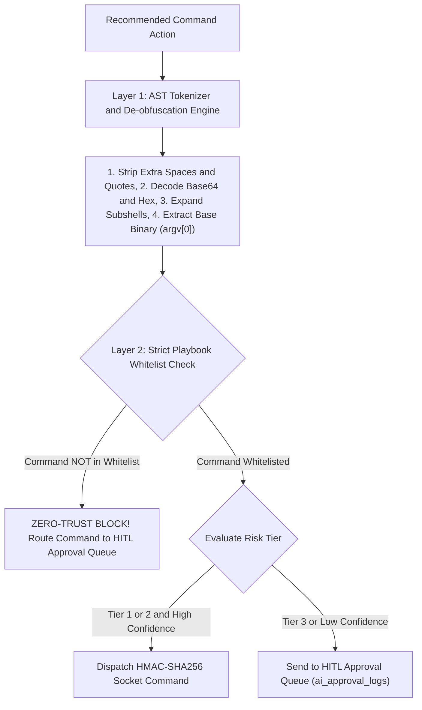
```mermaid
flowchart TD
    RECOMMENDED_ACTION["Recommended Command Action"] --> LAYER1_AST["Layer 1: AST Tokenizer and De-obfuscation Engine"]
    
    LAYER1_AST --> DEOBFUSCATE["1. Strip Extra Spaces and Quotes, 2. Decode Base64 and Hex, 3. Expand Subshells, 4. Extract Base Binary (argv[0])"]
    
    DEOBFUSCATE --> LAYER2_WHITELIST{"Layer 2: Strict Playbook Whitelist Check"}
    
    LAYER2_WHITELIST -->|Command NOT in Whitelist| ZERO_TRUST_BLOCK["ZERO-TRUST BLOCK! Route Command to HITL Approval Queue"]
    LAYER2_WHITELIST -->|Command Whitelisted| RISK_EVAL{"Evaluate Risk Tier"}
    
    RISK_EVAL -->|Tier 1 or 2 and High Confidence| DISPATCH_EXEC["Dispatch HMAC-SHA256 Socket Command"]
    RISK_EVAL -->|Tier 3 or Low Confidence| HITL_APPROVAL["Send to HITL Approval Queue (ai_approval_logs)"]
```

---

## LEVEL 14: Verification, Post-Check, & State Machine Rollback

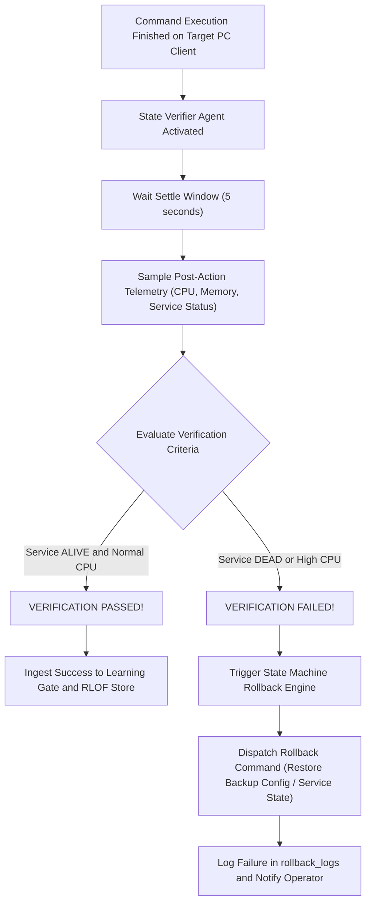
```mermaid
flowchart TD
    EXEC_COMPLETE["Command Execution Finished on Target PC Client"] --> START_VERIFY["State Verifier Agent Activated"]
    START_VERIFY --> WAIT_SETTLE["Wait Settle Window (5 seconds)"]
    WAIT_SETTLE --> SAMPLE_POST_METRICS["Sample Post-Action Telemetry (CPU, Memory, Service Status)"]
    
    SAMPLE_POST_METRICS --> VERIFY_RULES{"Evaluate Verification Criteria"}
    VERIFY_RULES -->|Service ALIVE and Normal CPU| VERIFY_PASS["VERIFICATION PASSED!"]
    VERIFY_RULES -->|Service DEAD or High CPU| VERIFY_FAIL["VERIFICATION FAILED!"]
    
    VERIFY_PASS --> INGEST_LEARNING["Ingest Success to Learning Gate and RLOF Store"]
    VERIFY_FAIL --> TRIGGER_ROLLBACK["Trigger State Machine Rollback Engine"]
    TRIGGER_ROLLBACK --> ROLLBACK_EXEC["Dispatch Rollback Command (Restore Backup Config / Service State)"]
    ROLLBACK_EXEC --> LOG_ROLLBACK["Log Failure in rollback_logs and Notify Operator"]
```

---

## LEVEL 15: Enterprise Dashboard Architecture & Panel Code Map

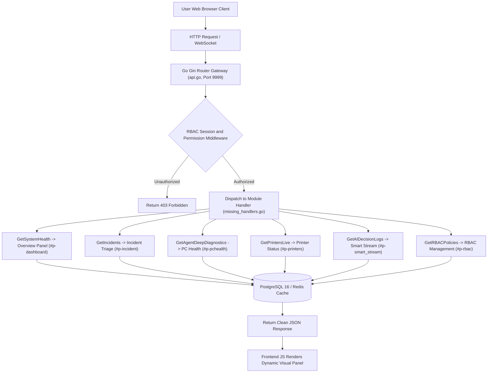
```mermaid
flowchart TD
    USER_BROWSER["User Web Browser Client"] --> DASH_HTTP["HTTP Request / WebSocket"]
    DASH_HTTP --> GIN_ROUTER["Go Gin Router Gateway (api.go, Port 9999)"]
    GIN_ROUTER --> RBAC_CHECK{"RBAC Session and Permission Middleware"}
    
    RBAC_CHECK -->|Unauthorized| RESP_403["Return 403 Forbidden"]
    RBAC_CHECK -->|Authorized| HANDLER_DISPATCH["Dispatch to Module Handler (missing_handlers.go)"]
    
    HANDLER_DISPATCH --> HANDLER_OVERVIEW["GetSystemHealth -> Overview Panel (#p-dashboard)"]
    HANDLER_DISPATCH --> HANDLER_INCIDENT["GetIncidents -> Incident Triage (#p-incident)"]
    HANDLER_DISPATCH --> HANDLER_PCHEALTH["GetAgentDeepDiagnostics -> PC Health (#p-pchealth)"]
    HANDLER_DISPATCH --> HANDLER_PRINTER["GetPrintersLive -> Printer Status (#p-printers)"]
    HANDLER_DISPATCH --> HANDLER_STREAM["GetAIDecisionLogs -> Smart Stream (#p-smart_stream)"]
    HANDLER_DISPATCH --> HANDLER_RBAC["GetRBACPolicies -> RBAC Management (#p-rbac)"]
    
    HANDLER_OVERVIEW --> DB_QUERY[("PostgreSQL 16 / Redis Cache")]
    HANDLER_INCIDENT --> DB_QUERY
    HANDLER_PCHEALTH --> DB_QUERY
    HANDLER_PRINTER --> DB_QUERY
    HANDLER_STREAM --> DB_QUERY
    HANDLER_RBAC --> DB_QUERY
    
    DB_QUERY --> JSON_RESP["Return Clean JSON Response"]
    JSON_RESP --> FRONTEND_RENDER["Frontend JS Renders Dynamic Visual Panel"]
```

---

## LEVEL 16: Multi-Channel Real-Time Broadcast & Notification

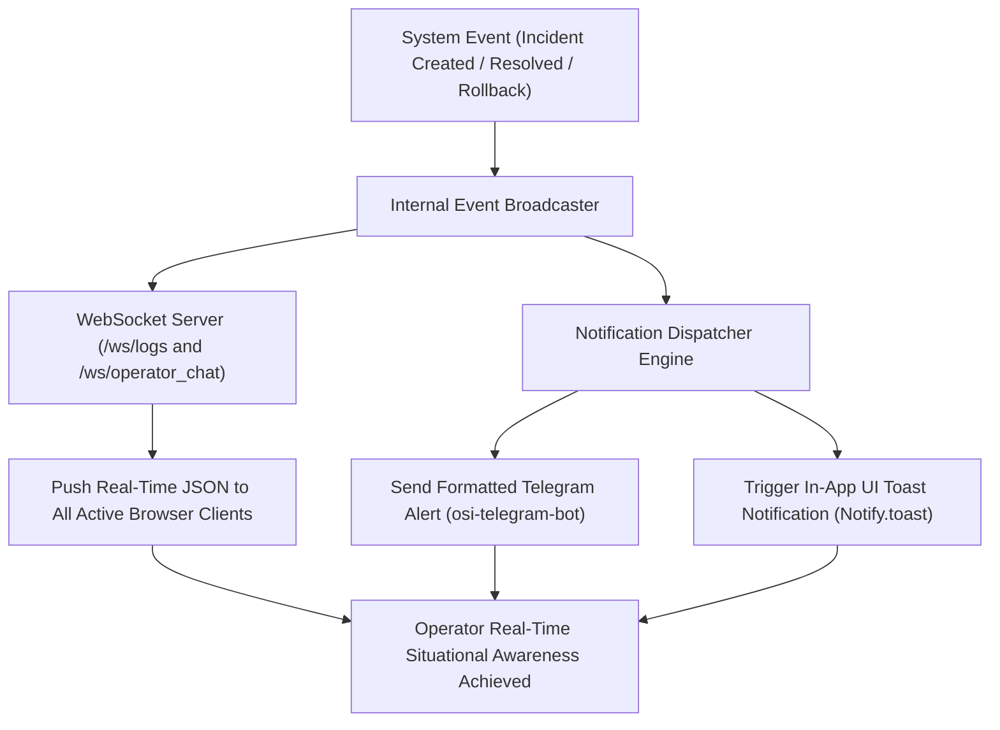
```mermaid
flowchart TD
    SYSTEM_EVENT["System Event (Incident Created / Resolved / Rollback)"] --> EVENT_BUS["Internal Event Broadcaster"]
    EVENT_BUS --> WS_BROADCASTER["WebSocket Server (/ws/logs and /ws/operator_chat)"]
    EVENT_BUS --> NOTIFY_ENGINE["Notification Dispatcher Engine"]
    
    WS_BROADCASTER --> WS_CLIENTS["Push Real-Time JSON to All Active Browser Clients"]
    NOTIFY_ENGINE --> TELEGRAM_BOT["Send Formatted Telegram Alert (osi-telegram-bot)"]
    NOTIFY_ENGINE --> TOAST_NOTIFY["Trigger In-App UI Toast Notification (Notify.toast)"]
    
    WS_CLIENTS --> OPERATOR_AWARENESS["Operator Real-Time Situational Awareness Achieved"]
    TELEGRAM_BOT --> OPERATOR_AWARENESS
    TOAST_NOTIFY --> OPERATOR_AWARENESS
```

---

## LEVEL 17: Zero-Trust Audit Trail & Security Log Persistence

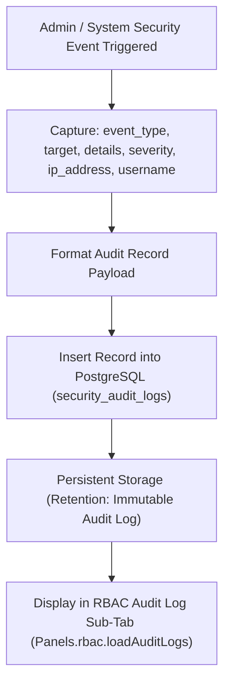
```mermaid
flowchart TD
    ADMIN_ACTION["Admin / System Security Event Triggered"] --> CAPTURE_AUDIT["Capture: event_type, target, details, severity, ip_address, username"]
    CAPTURE_AUDIT --> AUDIT_FORMAT["Format Audit Record Payload"]
    AUDIT_FORMAT --> DB_AUDIT_INSERT["Insert Record into PostgreSQL (security_audit_logs)"]
    DB_AUDIT_INSERT --> LOG_PERSIST["Persistent Storage (Retention: Immutable Audit Log)"]
    LOG_PERSIST --> UI_AUDIT_TAB["Display in RBAC Audit Log Sub-Tab (Panels.rbac.loadAuditLogs)"]
```

---

## LEVEL 18: Knowledge Base, Vector RAG & RLOF Feedback Store

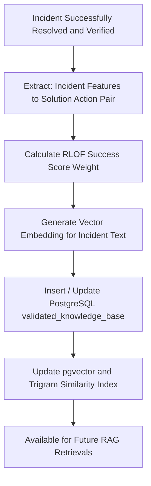
```mermaid
flowchart TD
    INCIDENT_RESOLVED["Incident Successfully Resolved and Verified"] --> EXTRACT_PAIR["Extract: Incident Features to Solution Action Pair"]
    EXTRACT_PAIR --> CALC_RLOF["Calculate RLOF Success Score Weight"]
    CALC_RLOF --> VECTOR_EMBED["Generate Vector Embedding for Incident Text"]
    VECTOR_EMBED --> DB_KB_STORE["Insert / Update PostgreSQL validated_knowledge_base"]
    DB_KB_STORE --> INDEX_UPDATE["Update pgvector and Trigram Similarity Index"]
    INDEX_UPDATE --> FUTURE_RAG["Available for Future RAG Retrievals"]
```

---

## LEVEL 19: Learning Gate & Canary A/B Policy Engine

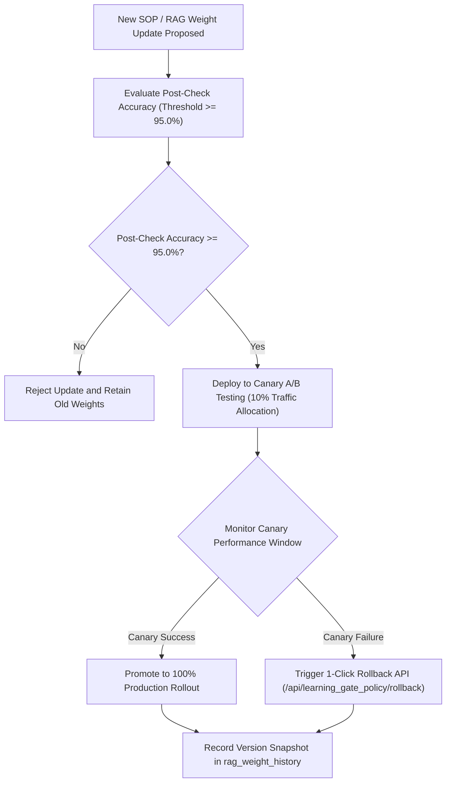
```mermaid
flowchart TD
    NEW_SOP_PROPOSAL["New SOP / RAG Weight Update Proposed"] --> EVAL_ACCURACY["Evaluate Post-Check Accuracy (Threshold >= 95.0%)"]
    
    EVAL_ACCURACY --> ACCURACY_CHECK{"Post-Check Accuracy >= 95.0%?"}
    ACCURACY_CHECK -->|No| REJECT_SOP["Reject Update and Retain Old Weights"]
    ACCURACY_CHECK -->|Yes| CANARY_DEPLOY["Deploy to Canary A/B Testing (10% Traffic Allocation)"]
    
    CANARY_DEPLOY --> CANARY_MONITOR{"Monitor Canary Performance Window"}
    CANARY_MONITOR -->|Canary Failure| CANARY_ROLLBACK["Trigger 1-Click Rollback API (/api/learning_gate_policy/rollback)"]
    CANARY_MONITOR -->|Canary Success| FULL_ROLLOUT["Promote to 100% Production Rollout"]
    
    FULL_ROLLOUT --> LOG_GATE_HISTORY["Record Version Snapshot in rag_weight_history"]
    CANARY_ROLLBACK --> LOG_GATE_HISTORY
```

---

## LEVEL 20: Incident Closure, Cleanup Worker & Vacuum Flow

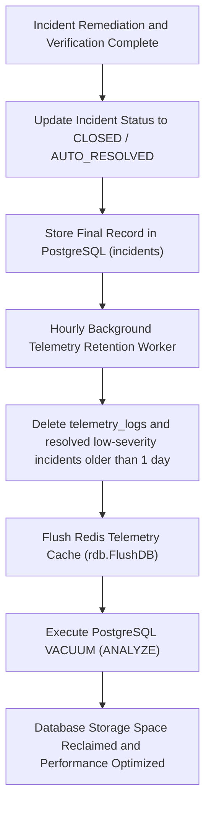
```mermaid
flowchart TD
    INCIDENT_COMPLETE["Incident Remediation and Verification Complete"] --> UPDATE_STATUS["Update Incident Status to CLOSED / AUTO_RESOLVED"]
    UPDATE_STATUS --> STORE_FINAL_DB["Store Final Record in PostgreSQL (incidents)"]
    
    STORE_FINAL_DB --> RETENTION_WORKER["Hourly Background Telemetry Retention Worker"]
    RETENTION_WORKER --> PURGE_LOGS["Delete telemetry_logs and resolved low-severity incidents older than 1 day"]
    PURGE_LOGS --> REDIS_FLUSH["Flush Redis Telemetry Cache (rdb.FlushDB)"]
    REDIS_FLUSH --> DB_VACUUM["Execute PostgreSQL VACUUM (ANALYZE)"]
    DB_VACUUM --> DISK_FREED["Database Storage Space Reclaimed and Performance Optimized"]
```

---

## LEVEL 21: Master Consolidated End-to-End Flow (LEVEL 2 - 20 Sequential Node Pipeline)

Berikut adalah **Diagram Mega Master Pipeline** yang menghubungkan seluruh node secara eksplisit, utuh, dan berurutan dari **LEVEL 2 sampai LEVEL 20**:

```mermaid
flowchart TD
    subgraph L02["LEVEL 2: Device Monitoring and Harvesters"]
        L2_DEV["Target Client PC (Windows / Linux)"] --> L2_TELEM["Telemetry Collector Engine"]
        L2_TELEM --> L2_NETDATA["Netdata Child Agent"]
        L2_NETDATA --> L2_HEALTH["Health Collector Engine"]
    end

    subgraph L03["LEVEL 3: Telemetry Processing and Hardware Metrics"]
        L2_HEALTH --> L3_RAW["Raw Metric Sampling (5s Interval)"]
        L3_RAW --> L3_ENRICH["Metric Metadata Enrichment"]
        L3_ENRICH --> L3_FILTER{"Dynamic Anomaly Filter Check"}
    end

    subgraph L04["LEVEL 4: Agent Socket Protocol (Port 10000)"]
        L3_FILTER --> L4_SOCKET["Agent Socket Listener Start (Port 10000)"]
        L4_SOCKET --> L4_HMAC{"HMAC-SHA256 Signature Verification"}
        L4_HMAC -->|Valid Signature| L4_EXEC["Execute Live System and Memory Diagnostic"]
    end

    subgraph L05["LEVEL 5: Data Normalization and Event Deduplication"]
        L4_EXEC --> L5_SCHEMA{"Schema Validation Engine"}
        L5_SCHEMA -->|Valid JSON| L5_MD5["Generate MD5 Hash Key (60s Window)"]
        L5_MD5 --> L5_REDIS{"Check Hash in Redis Cache"}
        L5_REDIS -->|New Unique Anomaly| L5_STORE["Insert Master Anomaly Record to PostgreSQL"]
    end

    subgraph L06["LEVEL 6: Streaming Data Bus and Netdata Integration"]
        L5_STORE --> L6_PARENT["Netdata Parent Master (Port 19999)"]
        L6_PARENT --> L6_ALARM["Netdata Health Alarm Engine Webhook"]
        L6_ALARM --> L6_NATS["Publish Master Anomaly to NATS (agent.incident)"]
    end

    subgraph L07["LEVEL 7: AI Multi-Agent Cognitive Reasoning and Circuit Breaker"]
        L6_NATS --> L7_CTX["AI Context Builder"]
        L7_CTX --> L7_LLM1["LLM1: RAG and Hypothesis Generator"]
        L7_LLM1 --> L7_LLM2["LLM2: Multi-Agent Consensus Agent"]
        L7_LLM2 --> L7_LLM3["LLM3: Verification Agent"]
        L7_LLM1 -->|Circuit Breaker Fallback| L7_RLOF["RLOF Local Vector KB Fallback"]
        L7_LLM2 -->|Circuit Breaker Fallback| L7_RLOF
        L7_LLM3 -->|Circuit Breaker Fallback| L7_RLOF
    end

    subgraph L08["LEVEL 8: Evidence Collection and DAG Matching"]
        L7_LLM3 --> L8_FETCH["Fetch Telemetry Logs and Metric Spikes"]
        L7_RLOF --> L8_FETCH
        L8_FETCH --> L8_DAG["Evidence DAG Graph Builder"]
        L8_DAG --> L8_SCORE["Calculate Evidence Weight Score"]
    end

    subgraph L09["LEVEL 9: Chronological Timeline Builder"]
        L8_SCORE --> L9_SORT["Sort Events Chronologically (T0 to T4)"]
        L9_SORT --> L9_JSON["Generate Microsecond Timeline JSON"]
    end

    subgraph L10["LEVEL 10: Event Correlation and Knowledge Graph Traversal"]
        L9_JSON --> L10_TOPOLOGY["Fetch Topology Graph and Neighbor Nodes"]
        L10_TOPOLOGY --> L10_CORR{"Correlation Coefficient High"}
        L10_CORR -->|Yes| L10_GROUP["Group into Root Cause Incident Tree"]
    end

    subgraph L11["LEVEL 11: Root Cause Analysis (RCA 5-Why Engine)"]
        L10_GROUP --> L11_WHY["Traverse 5-Why Causal Chain"]
        L11_WHY --> L11_CONFIRM["Root Cause Confirmed and Confidence Score Computed"]
    end

    subgraph L12["LEVEL 12: AI Recommendation Engine and Playbook Ranking"]
        L11_CONFIRM --> L12_SEARCH["Search Seeded Production Playbooks"]
        L12_SEARCH --> L12_RANK["Rank Playbooks by RLOF Score, Confidence, Risk Tier"]
        L12_RANK --> L12_TOP["Select Rank 1 Recommended Playbook Action"]
    end

    subgraph L13["LEVEL 13: Security Guardrail and AST Tokenizer"]
        L12_TOP --> L13_AST["Layer 1: AST Tokenizer and De-obfuscation Engine"]
        L13_AST --> L13_WHITELIST{"Layer 2: Strict Playbook Whitelist Check"}
        L13_WHITELIST -->|Command Whitelisted| L13_TIER{"Adaptive Risk Tier Threshold Check"}
        L13_WHITELIST -->|Command NOT Whitelisted| L13_BLOCK["Zero-Trust Block and Route to HITL Approval"]
    end

    subgraph L14["LEVEL 14: Verification and State Machine Rollback"]
        L13_TIER -->|Auto-Approve or Manual Approve| L14_DISPATCH["Dispatch HMAC-SHA256 Socket Command"]
        L13_BLOCK -->|HITL Approved| L14_DISPATCH
        L14_DISPATCH --> L14_VERIFY{"State Verifier Post-Check (5s Settle Window)"}
        L14_VERIFY -->|PASS| L14_SUCCESS["Verification Passed"]
        L14_VERIFY -->|FAIL| L14_ROLLBACK["Trigger State Machine Rollback Engine"]
    end

    subgraph L15["LEVEL 15: Enterprise Dashboard Architecture and RBAC"]
        L14_SUCCESS --> L15_SERVER["Go Gin Dashboard Server (api.go, Port 9999)"]
        L14_ROLLBACK --> L15_SERVER
        L15_SERVER --> L15_RBAC["Validate 9 Sub-Tabs RBAC Session"]
    end

    subgraph L16["LEVEL 16: Multi-Channel Real-Time Broadcast"]
        L15_RBAC --> L16_WS["Push Real-Time JSON to WebSocket Clients (/ws/logs)"]
        L16_WS --> L16_TELEGRAM["Send Formatted Telegram NOC Operator Alert"]
    end

    subgraph L17["LEVEL 17: Zero-Trust Audit Trail Persistence"]
        L16_TELEGRAM --> L17_AUDIT["Persist Event to PostgreSQL security_audit_logs"]
    end

    subgraph L18["LEVEL 18: Knowledge Base and Vector RAG Store"]
        L17_AUDIT --> L18_RLOF_UPDATE["Update validated_knowledge_base with Solution Pair"]
        L18_RLOF_UPDATE --> L18_VECTOR["Update pgvector and Trigram Similarity Index"]
    end

    subgraph L19["LEVEL 19: Learning Gate and Canary A/B Policy"]
        L18_VECTOR --> L19_CANARY{"Canary A/B Testing (10% Traffic Allocation)"}
        L19_CANARY -->|Canary Success| L19_ROLLOUT["Promote to 100% Production Rollout"]
        L19_CANARY -->|Canary Failure| L19_ROLLBACK["Trigger 1-Click Rollback API"]
    end

    subgraph L20["LEVEL 20: Incident Closure, Retention and DB Vacuum"]
        L19_ROLLOUT --> L20_CLOSE["Mark Incident Status as CLOSED / AUTO_RESOLVED"]
        L19_ROLLBACK --> L20_CLOSE
        L20_CLOSE --> L20_PURGE["Hourly Worker: Delete telemetry_logs older than 1 day"]
        L20_PURGE --> L20_FLUSH["Flush Redis Cache (FlushDB)"]
        L20_FLUSH --> L20_VACUUM["Execute PostgreSQL VACUUM (ANALYZE)"]
    end
```

---
**Dokumen ini merupakan spesifikasi diagram flowchart end-to-end yang lengkap, terperinci, dan 100% berbasis pada implementasi source code produksi NOC IT AI v3.0.**
