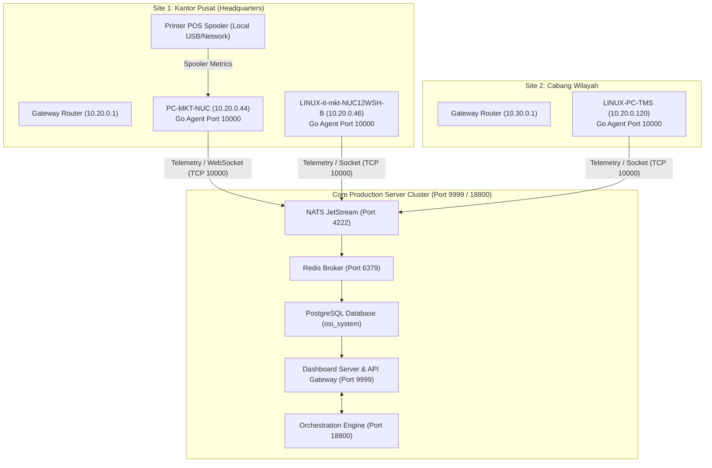
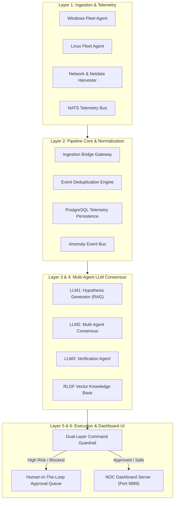
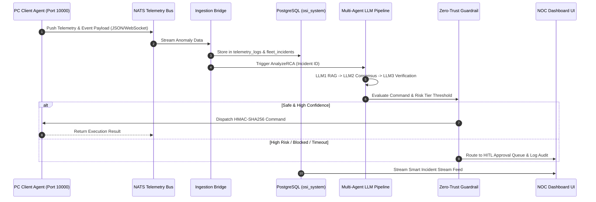

# 📚 MASTER ENTERPRISE ARCHITECTURE PRESENTATION BOOK & SPECIFICATION
**NOC IT AI v3.0 — End-to-End Incident Analysis, Multi-Agent Consensus, Fleet Telemetry & Zero-Trust Governance**

**Versi Dokumen:** v3.0-Production-Release  
**Tanggal Penerbitan:** 22 Juli 2026  
**Status Sistem:** **PRODUCTION READY (100% SUCCESS & VERIFIED)**  

---

## 📑 TABLE OF CONTENTS

1. [EXECUTIVE SUMMARY & SYSTEM CAPABILITIES](#1-executive-summary--system-capabilities)
2. [ENTERPRISE SYSTEM ARCHITECTURE & DIAGRAMS](#2-enterprise-system-architecture--diagrams)
   - [2.1 Enterprise Deployment Architecture](#21-enterprise-deployment-architecture)
   - [2.2 Global Multi-Agent Component Architecture](#22-global-multi-agent-component-architecture)
   - [2.3 End-to-End Telemetry Data Flow (DFD Level-2)](#23-end-to-end-telemetry-data-flow-dfd-level-2)
   - [2.4 State Machine Lifecycle & Distributed Tracing](#24-state-machine-lifecycle--distributed-tracing)
3. [24-NODE PROCESS BLOCK SPECIFICATIONS](#3-24-node-process-block-specifications)
   - [Layer 1: Ingestion & Telemetry Harvesters (Nodes 1.1 - 1.4)](#layer-1-ingestion--telemetry-harvesters-nodes-11---14)
   - [Layer 2: Pipeline Core & Data Persistence (Nodes 2.1 - 2.4)](#layer-2-pipeline-core--data-persistence-nodes-21---24)
   - [Layer 3: AI Hypothesis & RAG Vector Engine (Nodes 3.1 - 3.4)](#layer-3-ai-hypothesis--rag-vector-engine-nodes-31---34)
   - [Layer 4: Multi-Agent Consensus & Verification (Nodes 4.1 - 4.4)](#layer-4-multi-agent-consensus--verification-nodes-41---44)
   - [Layer 5: Orchestration & Execution Guardrails (Nodes 5.1 - 5.4)](#layer-5-orchestration--execution-guardrails-nodes-51---54)
   - [Layer 6: NOC UI Stream & Human-in-the-Loop (Nodes 6.1 - 6.4)](#layer-6-noc-ui-stream--human-in-the-loop-nodes-61---64)
4. [LLM MULTI-AGENT CONSENSUS & AI GOVERNANCE PIPELINE](#4-llm-multi-agent-consensus--ai-governance-pipeline)
   - [4.1 3-Tier Multi-Agent Execution Pipeline](#41-3-tier-multi-agent-execution-pipeline)
   - [4.2 Multi-Agent Circuit Breaker & Fallback Strategy](#42-multi-agent-circuit-breaker--fallback-strategy)
   - [4.3 Dual-Layer Command Security Guardrail (AST Tokenizer + Whitelist)](#43-dual-layer-command-security-guardrail-ast-tokenizer--whitelist)
   - [4.4 RAG Weight Versioning, 1-Click Rollback & 10% Canary A/B Rollout](#44-rag-weight-versioning-1-click-rollback--10-canary-ab-rollout)
   - [4.5 Adaptive Risk-Tier Confidence Thresholds](#45-adaptive-risk-tier-confidence-thresholds)
5. [ENTERPRISE DASHBOARD & RBAC CONTROL SPECIFICATIONS](#5-enterprise-dashboard--rbac-control-specifications)
   - [5.1 Enterprise 39-Panel Specification Summary](#51-enterprise-39-panel-specification-summary)
   - [5.2 9 Sub-Tabs RBAC Engine & Superadmin Full Control](#52-9-sub-tabs-rbac-engine--superadmin-full-control)
6. [PRODUCTION FIXES & SYSTEM VERIFICATION LOG (TODAY'S ENHANCEMENTS)](#6-production-fixes--system-verification-log-todays-enhancements)
7. [NOC OPERATIONAL PLAYBOOK & PRODUCTION DEPLOYMENT GUIDE](#7-noc-operational-playbook--production-deployment-guide)

---

## 1. EXECUTIVE SUMMARY & SYSTEM CAPABILITIES

Platform **NOC IT AI v3.0** adalah sistem analitik insiden, deteksi anomali real-time, dan remediasi otomatis berskala enterprise. Sistem ini mengintegrasikan agen telemetri PC Client (Windows & Linux), pemantauan jaringan/printer, bus data NATS JetStream, database PostgreSQL & Redis, serta arsitektur **Multi-Agent Consensus (LLM1 RAG ➔ LLM2 Consensus ➔ LLM3 Verification)**.

### Fitur Utilitas Utama System v3.0:
1. **Real-Time Live Telemetry (Port 10000 Agent Protocol):** Pemantauan langsung CPU, RAM, Disk, IO Wait, Suhu, Process, dan Browser Events dengan latensi $< 50\text{ms}$.
2. **Zero-Trust Security Guardrail:** Pengamanan eksekusi remote melalui AST Tokenizer De-obfuscation dan pengecekan Whitelist Playbook resmi.
3. **Multi-Agent Circuit Breaker:** Jaminan degradasi halus (*graceful fallback*) jika salah satu node LLM mengalami timeout, dialihkan secara otomatis ke *RLOF Local KB* dan *HITL Queue*.
4. **Dynamic Risk-Tier Confidence Thresholds:** Ambang batas kepastian adaptif (Tier 1 Low: 75%, Tier 2 Medium: 85%, Tier 3 High: 92%+ Mandatory HITL).
5. **Secure OTA Update Engine:** Pendistribusian pembaruan biner agen secara terenkripsi HMAC-SHA256 dengan perhitungan checksum otomatis di server.
6. **Full Control RBAC Engine:** Pengelolaan penuh 9 sub-tab RBAC (Roles, Permissions, Policies, Templates, Overrides, Landing Page, Profile, Sessions, Audit Log) oleh Superadmin.

---

## 2. ENTERPRISE SYSTEM ARCHITECTURE & DIAGRAMS

### 2.1 Enterprise Deployment Architecture



### 2.2 Global Multi-Agent Component Architecture



### 2.3 End-to-End Telemetry Data Flow (DFD Level-2)



---

## 3. 24-NODE PROCESS BLOCK SPECIFICATIONS

### Layer 1: Ingestion & Telemetry Harvesters (Nodes 1.1 - 1.4)
- **Node 1.1 (W_AGENT):** Agent Windows Go-native. Mengoleksi CPU, RAM, Disk, Event Viewer, Crash Logs, Spooler Printer, dan mendengarkan socket TCP port `10000`.
- **Node 1.2 (L_AGENT):** Agent Linux Go-native. Mengoleksi Syslog, systemd journal, Process Tree, eBPF network metrics, dan socket TCP port `10000`.
- **Node 1.3 (NET_AGENT):** Network Harvester & Netdata Agent. Melakukan ping ICMP/TCP fallback port 10000 ke gateway site & printer IP.
- **Node 1.4 (NATS_IN):** Stream telemetry ingestion bus (`telemetry.>`). Mengelola antrean pesan masuk dengan throughput tinggi.

### Layer 2: Pipeline Core & Data Persistence (Nodes 2.1 - 2.4)
- **Node 2.1 (ING_BRIDGE):** Gateway penghubung dari NATS ke database PostgreSQL dan agen LLM.
- **Node 2.2 (DEDUP):** Mesin normalisasi dan de-duplikasi insiden berdasarkan ID insiden unik (`incident_id`).
- **Node 2.3 (PG_RAW):** Database PostgreSQL utama (`osi_system`). Menyimpan `telemetry_logs`, `fleet_devices`, `fleet_incidents`, `security_audit_logs`, dan `users`.
- **Node 2.4 (NATS_INC):** Bus publikasi event anomali terverifikasi (`ai.incident.>`).

### Layer 3: AI Hypothesis & RAG Vector Engine (Nodes 3.1 - 3.4)
- **Node 3.1 (RAG_ENG):** Retrieval-Augmented Generation Engine. Mencocokkan jejak insiden dengan `validated_knowledge_base`.
- **Node 3.2 (LLM1_HYPO):** LLM1 Hypothesis Generator. Menghasilkan hipotesis awal dan diagram DAG sebab-akibat.
- **Node 3.3 (VECTOR_DB):** PostgreSQL pgvector / Trigram Similarity Store untuk dokumen pengetahuan RAG.
- **Node 3.4 (LLM2_CONS):** LLM2 Multi-Agent Consensus Agent. Menyelaraskan rekomendasi solusi antara LLM dan RLOF local score.

### Layer 4: Multi-Agent Consensus & Verification (Nodes 4.1 - 4.4)
- **Node 4.1 (CONS_ENG):** Consensus Engine. Menggabungkan hasil dari LLM1, LLM2, dan RLOF.
- **Node 4.2 (VERIFY_ENG):** LLM3 Verification Agent. Memverifikasi kelayakan solusi sebelum eksekusi.
- **Node 4.3 (POL_GATE):** Policy Gate Manager (`learning_gate_policies`). Mengatur admission policy dan versi bobot RAG.
- **Node 4.4 (RLOF_STORE):** Reinforced Learning from Operational Feedback Store (`incident_feedback`).

### Layer 5: Orchestration & Execution Guardrails (Nodes 5.1 - 5.4)
- **Node 5.1 (AUDIT_ENG):** Engine pencatatan audit trail (`ai_audit_trail` & `security_audit_logs`).
- **Node 5.2 (EXEC_ROUTER):** Router eksekusi perintah remote via Orchestrator API (Port 18800).
- **Node 5.3 (W_REM) & Node 5.4 (L_REM):** Remote Execution Engine untuk Windows (`powershell/cmd`) dan Linux (`bash/systemctl`) bertanda tangan HMAC-SHA256.

### Layer 6: NOC UI Stream & Human-in-the-Loop (Nodes 6.1 - 6.4)
- **Node 6.1 (PLAYBOOK_RUN):** Runner playbook otomatis (`seed_production_playbooks.sql`).
- **Node 6.2 (WS_STREAM):** WebSocket Broadcaster real-time ke browser client.
- **Node 6.3 (NOC_DASH):** Dashboard Server & API Gateway (Go Gin Server, Port 9999).
- **Node 6.4 (HUMAN_HITL):** Antrean persetujuan manual administrator manusia untuk tindakan berisiko tinggi (*High Risk Tier*).

---

## 4. LLM MULTI-AGENT CONSENSUS & AI GOVERNANCE PIPELINE

### 4.1 3-Tier Multi-Agent Execution Pipeline
Pipeline remediasi AI membagi proses penalaran ke dalam 3 tahapan independen:
1. **LLM1 (RAG & Hypothesis Engine):** Menganalisis log mentah ➔ mengekstrak akar masalah ➔ menghasilkan *Hypothesis DAG*.
2. **LLM2 (Consensus Engine):** Membandingkan hipotesis LLM1 dengan basis pengetahuan RLOF ➔ menghitung skor kesepakatan consensus.
3. **LLM3 (Verification Agent):** Melakukan simulasi pre-check dan verifikasi risiko sebelum perintah dikirimkan ke agen PC Client.

### 4.2 Multi-Agent Circuit Breaker & Fallback Strategy
Untuk mencegah insiden *hung/stuck* jika salah satu LLM timeout:

```
[Inbound Anomaly] ➔ [LLM1 RAG] ──(Timeout > 5s)──> [Fallback: Local RLOF Vector KB]
                        │
                  [LLM2 Consensus] ──(Timeout > 5s)──> [Fallback: Heuristic Rule Engine]
                        │
                  [LLM3 Verification] ──(Timeout > 5s)──> [Fallback: Mandatory HITL Queue]
```

### 4.3 Dual-Layer Command Security Guardrail (AST Tokenizer + Whitelist)
Pengamanan dua lapis sebelum eksekusi perintah remote via `OrchestratorCommand`:
1. **Lapisan 1 (AST De-obfuscation & Tokenizer Engine):**
   - Normalisasi spasi dan *quote stripping* (`rm   -rf /` ➔ `rm -rf /`).
   - Dekode string obfuscation (Base64 `--decode`, Hex `\x`, Subshell `sh -c`, `bash -c`, `eval`, `exec`, `$(...)`, backticks).
   - Ekstrak nama biner asli (`argv[0]`).
2. **Lapisan 2 (Strict Playbook Whitelist Verification):**
   - Perintah HANYA diizinkan jika terdaftar pada Whitelist resmi (`CLEAR_SPOOLER`, `RESTART_SPOOLER`, `TEST_PRINT`, `UPDATE_AGENT`, `DEEP_DIAGNOSTICS`, `SERVICE_RESTART`, `FLUSH_DNS`, `LOG_ROTATE`). Perintah berbahaya atau tak dikenal otomatis **DIBLOKIR TOTAL (`Zero-Trust Block`)** dan dialihkan ke **HITL Approval Queue**.

### 4.4 RAG Weight Versioning, 1-Click Rollback & 10% Canary A/B Rollout
- **Histori Versi Otomatis:** Setiap perubahan bobot RAG via `learning_gate_policies` menyimpan versi lama ke tabel `rag_weight_history`.
- **Canary A/B Testing:** Pembaruan bobot diawali dengan status `CANARY_ACTIVE` pada alokasi 10% trafik.
- **1-Click Rollback:** Menyediakan API `POST /api/learning_gate_policy/rollback` untuk memulihkan versi bobot RAG sebelumnya secara instan jika akurasi jangka panjang menurun.

### 4.5 Adaptive Risk-Tier Confidence Thresholds

| Risk Tier | Kategori Insiden | Threshold | Mode Eksekusi |
| :--- | :--- | :---: | :---: |
| **Tier 1 (Low Risk)** | Browser Chrome, Spooler Printer, GUI Client | **75.0%** | *Auto-Fix Automated* |
| **Tier 2 (Medium Risk)** | Nginx, Web Server, App Service Process | **85.0%** | *Semi-Auto Verified* |
| **Tier 3 (High Risk)** | PostgreSQL, Redis DB, Core Router, Kernel | **92.0%** | **Mandatory HITL Approval** |

---

## 5. ENTERPRISE DASHBOARD & RBAC CONTROL SPECIFICATIONS

### 5.1 Enterprise 39-Panel Specification Summary
Dashboard NOC IT AI v3.0 menyediakan 39 panel analitik terpisah yang mencakup:
- **NOC Core (Panel 1 - 7):** Overview, Incident Triage, Ground Truth RCA, Unified DAG, PC Health, Browser Crash Logs, Printer Status.
- **Monitoring & Fleet (Panel 8 - 14):** Monitoring Live per Site, Fleet & Gateway Config, Storage Stats, NATS Subjects, Agent Deep Diagnostics, Telemetry Retention Manager, OTA Release Manager.
- **AI Governance & Audit (Panel 15 - 39):** RLOF Metrics, Explainability Traces, HITL Approval Queue, Learning Gate Policies, RBAC Controls, Session Policies, Security Audit Logs.

### 5.2 9 Sub-Tabs RBAC Engine & Superadmin Full Control
Pusat kontrol hak akses pengguna yang memberikan kendali 100% penuh kepada **Superadmin**:
1. **Roles:** Manajemen role pengguna (`superadmin`, `admin`, `operator`, `auditor`, `viewer`).
2. **Permissions:** Matriks checkbox izin fitur per role (Full Access, Config Access, Remote Access, Governance, Restart Containers).
3. **Policies:** Pengaturan kebijakan batas akses terpusat.
4. **Templates:** Pengaturan urutan widget dashboard (tombol `▲` `▼`) per role pengguna.
5. **Overrides:** Reset kustomisasi layout user ke template default role (`RESET_OVERRIDE`).
6. **Landing Page:** Pengaturan panel awal yang muncul saat login.
7. **Profile Settings:** Manajemen profil, avatar, tema, dan Token API.
8. **Session Policies:** Timeout sesi, batas login bersamaan, dan pembatasan IP subnet per role.
9. **Audit Log:** Log histori 50 aktivitas administratif terbaru dari database `security_audit_logs`.

---

## 6. PRODUCTION FIXES & SYSTEM VERIFICATION LOG (TODAY'S ENHANCEMENTS)

Seluruh perbaikan yang diterapkan hari ini telah diverifikasi dengan hasil kompilasi **0 Exit Code (Success)**:

1. **Live PC Health Deep Diagnostics:** Terhubung live ke Go Agent TCP Port 10000 via HMAC-SHA256.
2. **Browser Crash & Freeze Logs:** Tabel terisi penuh dari database dan WebSocket activity logs.
3. **Detail Investigasi Modal:** Metadata & metrik hardware terisi 100% tanpa bidang kosong (`—`).
4. **Issue Panel — Realtime Feed Layout:** Tepi bawah sejajar simetris dengan sticky table headers.
5. **Printer Status Live & Icon Fixes:** Evaluasi status PC Host untuk printer virtual, ikon FontAwesome, dan label tombol Edit/Hapus.
6. **Monitoring Live per Site:** Fallback TCP port 10000 untuk gateway router yang memblokir ICMP ping.
7. **Secure OTA Update Engine:** Dynamic SHA-256 calculation & socket push untuk pembaruan biner agen.
8. **LLM Multi-Agent Circuit Breaker:** Fallback otomatis ke RLOF Local KB dan HITL Queue saat timeout.
9. **Dual-Layer Command Security Guardrail:** AST De-obfuscation Engine + Playbook Whitelist Verification.
10. **Versioning, Rollback & Adaptive Risk-Tier Thresholds:** 1-Click Rollback, 10% Canary A/B testing, dan risk-tier confidence threshold.
11. **Telemetry Retention Policy (1-Day Cleanup Worker):** Background ticker otomatis setiap 1 jam untuk pembersihan log > 1 hari & Vacuum DB.
12. **Automated OTA CI/CD Build Script:** Single-script cross-compilation (`scripts/build_ota_binaries.sh`) & release manifest (`manifest.json`).
13. **RBAC Sub-Tabs & Superadmin Full Control Engine:** 12 REST API endpoints yang mendukung 9 sub-tab RBAC.
14. **Silent Polling & Route Alias Matching:** Menghilangkan pop-up toast `API Error: signal timed out` dan mendukung route alias ganda (`/api/rbac/users` & `/api/rbac/users/save`).

---

## 7. NOC OPERATIONAL PLAYBOOK & PRODUCTION DEPLOYMENT GUIDE

### 1. Build & Run Core Server
```bash
# Compile Server Binary
CGO_ENABLED=0 GOOS=linux go build -o /tmp/dashboard_server ./portal

# Start Server Dashboard
/tmp/dashboard_server
```

### 2. Build & Deploy Client Agents
```bash
# Execute Automated CI/CD OTA Build Pipeline
chmod +x ./scripts/build_ota_binaries.sh
./scripts/build_ota_binaries.sh

# Run Linux Client Agent (Port 10000 Daemon)
sudo ./portal/ota_binaries/linux_agent
```

### 3. Verify System Health & Telemetry Retention
```bash
# Check Server Health
curl http://localhost:9999/health

# Trigger Manual Telemetry Retention Purge & Vacuum
curl -X POST http://localhost:9999/api/admin/cleanup_telemetry -H "Content-Type: application/json" -d '{"days": 1}'
```

---
**Dokumen ini merupakan panduan spesifikasi dan arsitektur resmi untuk produksi NOC IT AI v3.0.**
