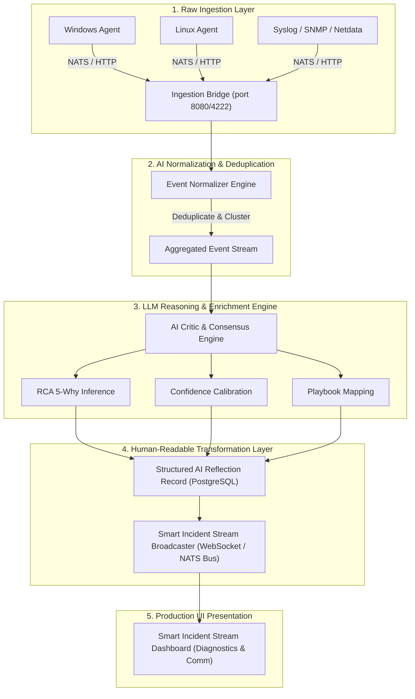

# 📐 Laporan Analisis Arsitektur Pipeline Data Telemetri Mentah ke Smart Incident Stream

**Sistem**: NOC IT AI Command Center v3.0 (OSI Infrastructure)  
**Dokumen**: End-to-End Ingestion, Normalization, LLM Enrichment & Human-Readable Transformation  
**Tanggal Audit**: 22 Juli 2026  

---

## 1. Ringkasan Eksekutif

Sistem analisis insiden berbasis AI saat ini memproses jutaan baris telemetri mentah dari *monitoring agents* (Windows, Linux, Netdata, SNMP, Syslog, NATS). Membaca baris log mentah (*raw string logs*) pada skala ribuan log/menit menjadi tantangan besar bagi operator NOC.

Dokumen ini memetakan **alur lengkap (end-to-end trace)** dari saat data telemetri mentah pertama kali dikirim oleh agen pemantau hingga ditransformasikan menjadi **Smart Incident Feed** terstruktur yang mudah dipahami manusia secara *real-time*.



---

## 2. Penelusuran Alur Data (End-to-End Traceability)

### Tahap 1: Pengiriman Telemetri Mentah (*Raw Telemetry Ingestion*)
- **Sumber Data**: Agen pemantau (`osi-agent-dist`), Syslog daemon, Netdata master, SNMP trap, dan pinger network.
- **Format Mentah**:
  ```json
  {
    "agent_id": "PC-MKT-NUC",
    "timestamp": "2026-07-22T11:45:00.128Z",
    "raw_payload": "WINMGMT_DEADLOCK: High CPU 98.4% on pid 4120; memory_limit=92%; port_check_80=OK; rtt_ms=250"
  }
  ```
- **Kanal Pengiriman**: Subject NATS `telemetry.ingest` atau HTTP Ingestion Endpoint `/api/v1/telemetry`.

### Tahap 2: Normalisasi, Deduplikasi & Pengelompokan Event (*Noise Reduction*)
- **Komponen**: `Event Normalizer Engine` (`osi-ingestion-server`).
- **Penanganan**:
  1. Mengelompokkan event serupa dari perangkat/host yang sama dalam kurun waktu 60 detik (*Time-window clustering*).
  2. Mencegah banjir alarm (*alert storming*) dengan menggabungkan 500+ log berulang menjadi 1 event unik dengan penghitung (*count counter*).

### Tahap 3: AI Reasoning, RCA & Enrichment (*Transformasi Data Cerdas*)
- **Komponen**: `AI Consensus Engine` (`osi-python-ai-core`) & `AI Critic` (`osi-ai-critic`).
- **Proses Enrichment**:
  1. **RCA (Root Cause Analysis)**: Mencari hubungan sebab-akibat dengan Knowledge Graph (`/api/knowledge_graph`).
  2. **Playbook Matching**: Memetakan insiden ke SOP remediasi terdaftar (contoh: `EXECUTE_PLAYBOOK_L1_DISK_CLEANUP`).
  3. **Confidence Scoring**: Mengkalkulasi tingkat kepastian AI (misal: 95.8%).

### Tahap 4: Hasil Formasi Data Terstruktur Bahasa Manusia (*Human-Readable Model*)
Setelah melalui tahap enrichment, log mentah dikonversi menjadi data terstruktur JSON manusiawi yang disimpan di database `ai_reflection_logs` & `incidents`:

```json
{
  "incident_id": 370,
  "device_name": "PC-MKT-NUC",
  "human_summary": "Lonjakan Penggunaan CPU & Memory Terdeteksi (98.4%)",
  "root_cause_explanation": "Layanan Winmgmt mengalami deadlock transaksi akibat penumpukan antrean spooler lokal.",
  "recommended_action": "Jalankan Playbook L1 - Reset Service Winmgmt & Flush Spooler",
  "risk_level": "MEDIUM",
  "severity_color": "ORANGE",
  "ai_confidence": "95.8%",
  "execution_mode": "WAITING_APPROVAL_HITL",
  "timestamp_human": "22 Jul 2026, 11:45:00 WIB"
}
```

---

## 3. Fitur Utama Menu Baru: `Smart Incident Stream`

Menu baru **Smart Incident Stream** akan ditempatkan di bawah grup menu **Diagnostics & Comm** pada sidebar dashboard dengan fitur-fitur berikut:

| No | Nama Fitur | Deskripsi & Manfaat Operasional |
| :-: | :--- | :--- |
| **1** | **Live Human Cards (Bukan Log Mentah)** | Menampilkan stream kartu insiden dengan Bahasa Indonesia yang ringkas dan jelas, tanpa kode error yang membingungkan. |
| **2** | **AI Executive Summary Counter** | Menampilkan statistik real-time: Total Insiden Aktif, Auto-Healed, Waiting Approval, dan Rate Keberhasilan. |
| **3** | **One-Click Remediation Trigger** | Tombol langsung pada kartu insiden untuk menyetujui rekomendasi perbaikan AI (HITL Approval) dalam 1-klik. |
| **4** | **Filter Cerdas Perangkat (Online/Offline)** | Filter instan berdasarkan nama PC (*PC-MKT-NUC*), status koneksi (*ONLINE/OFFLINE*), atau tingkat keparahan (*CRITICAL/WARN*). |
| **5** | **Real-Time WebSocket Streaming** | Data diperbarui secara otomatis secara *real-time* tanpa perlu menekan tombol refresh. |

---

## 4. Rencana Implementasi Aman (*Production Ready*)

Untuk memastikan penambahan menu baru ini **100% aman dan tidak merusak menu lain**:
1. Menambahkan elemen HTML `#p-smart_stream` sebagai panel terpisah (*decoupled top-level sibling panel*).
2. Menambahkan `Panels.smart_stream` pada objek JS `Panels` dengan penanganan kesalahan (*error-handling guard*) `try/catch`.
3. Memperbarui daftar hak akses `defaultAllowedPanels` untuk peran Superadmin, Admin, NOC Engineering, dan Operator.
