# 📊 Diagram Visual Flowchart & Penjelasan Detail Pipeline Telemetri Agen

**Sistem**: NOC IT AI Command Center v3.0 (OSI Infrastructure)  
**Dokumen**: Visual Flowchart & Comprehensive Box-by-Box Technical Explanation  
**Tanggal**: 22 Juli 2026  

---

## 1. 🖼️ Diagram Visual Flowchart (End-to-End System Pipeline)

```mermaid
flowchart TD
    subgraph STAGE1["STAGE 1: AGENT TELEMETRY GENERATION"]
        W_AGENT["Windows Fleet Agent (WMI, Spooler, EventLog, VNC)"]
        L_AGENT["Linux Fleet Agent (Systemd, CPU, RAM, Disk, Syslog)"]
        NET_AGENT["SNMP, Netdata, and Syslog Harvester"]
        NATS_IN["NATS Subject: telemetry.ingest (port 4222)"]

        W_AGENT -->|NATS pub sub| NATS_IN
        L_AGENT -->|NATS pub sub| NATS_IN
        NET_AGENT -->|NATS pub sub| NATS_IN
    end

    subgraph STAGE2["STAGE 2: INGESTION, NORMALIZATION AND DEDUPLICATION"]
        ING_BRIDGE["osi-ingestion-server (Token Auth and Rate Limiter)"]
        DEDUP["Event Normalizer Engine (60s Time Window Deduplication)"]
        PG_RAW[("PostgreSQL: incidents and telemetry_logs")]
        NATS_INC["NATS Subject: agent.incident"]

        NATS_IN --> ING_BRIDGE
        ING_BRIDGE --> DEDUP
        DEDUP -->|Insert Raw| PG_RAW
        DEDUP -->|Publish Anomaly| NATS_INC
    end

    subgraph STAGE3["STAGE 3: AI COGNITIVE REASONING AND CONSENSUS CLUSTER"]
        AI_CORE["osi-python-ai-core (Cognitive Reasoning Controller)"]
        AI_RAG["osi-ai-rag Engine (SOP DB: KB-SOP-001/002/003)"]
        KG_GRAPH["Knowledge Graph Engine (Causal Topology)"]
        AI_CRITIC["osi-ai-critic and osi-ai-policy (Schema and Risk Enforcer)"]
        RCA_ENGINE["RCA 5-Why and Confidence Calibration (Score: 0.0 - 100%)"]

        NATS_INC --> AI_CORE
        AI_CORE <-->|Vector Search| AI_RAG
        AI_CORE <-->|Dependency Check| KG_GRAPH
        AI_CORE <-->|Safety Validation| AI_CRITIC
        AI_RAG --> RCA_ENGINE
        KG_GRAPH --> RCA_ENGINE
        AI_CRITIC --> RCA_ENGINE
    end

    subgraph STAGE4["STAGE 4: DECISION ROUTING AND HUMAN-IN-THE-LOOP GATE"]
        RISK_DECISION{"Evaluasi Risiko and Confidence AI"}
        AUTO_EXEC["Auto-Approve Remediation"]
        HITL_QUEUE["Approval Queue (HITL Gate) (PostgreSQL: ai_approval_logs)"]
        MANUAL_APPROVE["Dispatched Action"]
        OPERATOR_REJECT["Log Memory Feedback and Abort"]

        RCA_ENGINE --> RISK_DECISION
        RISK_DECISION -->|High Conf >= 85% and Low Risk| AUTO_EXEC
        RISK_DECISION -->|High Risk or Conf < 85%| HITL_QUEUE
        HITL_QUEUE -->|Operator 1-Click Approve| MANUAL_APPROVE
        HITL_QUEUE -->|Operator Reject| OPERATOR_REJECT
    end

    subgraph STAGE5["STAGE 5: COMMAND RELAY EXECUTION AND STATE VERIFICATION"]
        SECURE_RELAY["osi-secure-relay (Encrypted Command Dispatcher)"]
        TARGET_AGENT["Perangkat Target (Windows / Linux)"]
        VERIFY_AGENT["State Verifier Agent (NATS Subject: agent.verify)"]
        VERIFY_CHECK{"Post-Action Telemetry Check"}
        LEARNING_GATE["Ingest to Learning Gate (PostgreSQL: learning_gate_logs)"]
        ROLLBACK_ENGINE["State Machine Rollback Triggered (PostgreSQL: rollback_logs)"]

        AUTO_EXEC --> SECURE_RELAY
        MANUAL_APPROVE --> SECURE_RELAY
        SECURE_RELAY -->|Execute Script / Service Restart| TARGET_AGENT
        TARGET_AGENT --> VERIFY_AGENT
        VERIFY_AGENT --> VERIFY_CHECK
        VERIFY_CHECK -->|PASS| LEARNING_GATE
        VERIFY_CHECK -->|FAIL| ROLLBACK_ENGINE
        ROLLBACK_ENGINE -->|Restore Backup Config| SECURE_RELAY
    end

    subgraph STAGE6["STAGE 6: MULTI-CHANNEL PRESENTATION AND BROADCAST"]
        DASH_SERVER["osi-dashboard-server (Go Engine)"]
        WS_BROADCAST["WebSocket Real-Time Broadcast"]
        TELEGRAM_BOT["osi-telegram-bot (NOC Operator Alert)"]
        UI_SMART["Smart Incident Stream (/smart_stream)"]
        UI_LOGS["Live Logs (/logs)"]
        UI_INCIDENT["Incident Triage (/incidents)"]
        UI_OVERVIEW["Dashboard Overview (/overview)"]

        LEARNING_GATE --> DASH_SERVER
        ROLLBACK_ENGINE --> DASH_SERVER
        DEDUP --> DASH_SERVER
        DASH_SERVER -->|WebSocket /ws/logs| WS_BROADCAST
        DASH_SERVER -->|Alert Push| TELEGRAM_BOT
        WS_BROADCAST --> UI_SMART
        WS_BROADCAST --> UI_LOGS
        WS_BROADCAST --> UI_INCIDENT
        WS_BROADCAST --> UI_OVERVIEW
    end
```

---

## 2. 📝 Penjelasan Detail per Tahap & Kotak Sistem

---

### 🟢 STAGE 1: AGENT TELEMETRY GENERATION (Pengumpulan Telemetri Agen)

#### 1. `W_AGENT` — Windows Fleet Agent
* **Fungsi**: Agen pemantau berbasis Go di peranti Windows target (`PC-MKT-NUC`, `PC-TEST-001`).
* **Mekanisme**: Membaca utilisasi CPU/RAM/Disk via WMI, memantau Windows Service (`Winmgmt`, `Spooler`, `W3SVC`), dan memanen Windows Event Log (ID 7034 Crash, ID 1000 App Error).
* **Output**: Mengirim payload JSON mentah ke broker NATS setiap 5-15 detik.

#### 2. `L_AGENT` — Linux Fleet Agent
* **Fungsi**: Agen pemantau daemon di peranti Linux target (`LINUX-PC-TMS`, `LINUX-it-mkt-NUC12WSH-B`).
* **Mekanisme**: Membaca kernel `/proc/stat`, `/proc/meminfo`, dan status unit `systemctl` via DBus API tanpa membebani CPU.
* **Output**: Payload JSON telemetri Linux real-time.

#### 3. `NET_AGENT` — SNMP / Netdata / Syslog Harvester
* **Fungsi**: Kolektor jaringan untuk perangkat infrastruktur (Switch Cisco/Nexus, Router, Firewall).
* **Mekanisme**: Membaca SNMP OID dan menerimaSyslog UDP port 514 dari perangkat jaringan.

#### 4. `NATS_IN` — NATS Ingestion Bus (`telemetry.ingest`)
* **Fungsi**: Bus pesan broker NATS terpusat (port `4222`).
* **Mekanisme**: Menampung aliran pesan telemetri berkecepatan tinggi dengan latensi sub-milidetik (< 1.0 ms).

---

### 🟡 STAGE 2: INGESTION, NORMALIZATION & DEDUPLICATION (Pembersihan & Pengelompokan)

#### 5. `ING_BRIDGE` — Ingestion Bridge (`osi-ingestion-server`)
* **Fungsi**: Pintu gerbang ingest data Go microservice.
* **Mekanisme**: Memvalidasi token otentikasi API agen dan menerapkan *Rate Limiter* (maks 500 req/detik per IP) untuk mencegah DoS.

#### 6. `DEDUP` — Event Normalizer Engine (Time-Window Deduplication)
* **Fungsi**: Mesin normalisasi dan pengelompokan pesan untuk mencegah *alert storming*.
* **Mekanisme**: Menggunakan Slide-Window Hash Table (60 detik). Jika 500+ log error serupa masuk dalam 60 detik, sistem **TIDAK membuat 500 log baru**, melainkan memadatkannya menjadi **1 Master Anomaly Event** ber-badge `Grouped Count: N`.

#### 7. `PG_RAW` — PostgreSQL Data Persistence
* **Fungsi**: Basis data terpusat PostgreSQL (`osi_system`).
* **Mekanisme**: Menyimpan Master Anomaly Event ke tabel `incidents` dan memposting status perangkat di tabel `devices`.

#### 8. `NATS_INC` — NATS Anomaly Publisher (`agent.incident`)
* **Fungsi**: Menerbitkan event anomali hasil deduplikasi ke saluran NATS `agent.incident` untuk memicu analisis AI.

---

### 🔵 STAGE 3: AI COGNITIVE REASONING & CONSENSUS CLUSTER (Penalaran AI)

#### 9. `AI_CORE` — AI Cognitive Controller (`osi-python-ai-core`)
* **Fungsi**: Pengendali utama penalaran AI berbasis Python FastAPI.
* **Mekanisme**: Mengoordinasikan pencarian RAG, analisis Knowledge Graph, dan verifikasi AI Critic secara multithreaded.

#### 10. `AI_RAG` — Vector SOP RAG Engine (`osi-ai-rag`)
* **Fungsi**: Mesin pencarian basis pengetahuan SOP (`KB-SOP-001`, `KB-SOP-002`, `KB-SOP-003`).
* **Mekanisme**: Mengonversi teks error menjadi Vector Embedding, lalu menghitung *Similarity Search (Cosine Distance)* untuk menemukan 3 rekomendasi perbaikan SOP terbaik.

#### 11. `KG_GRAPH` — Knowledge Graph Engine (`/api/knowledge_graph`)
* **Fungsi**: Analisis topologi dependensi jaringan dan sistem enterprise.
* **Mekanisme**: Menelusuri ketergantungan *upstream/downstream* (cth: `App-Web-01` → `DB-Prod-01` → `Core Switch Nexus`) untuk menentukan **Akar Masalah Utama (Root Cause Node)**.

#### 12. `AI_CRITIC` — AI Critic & Policy Enforcer (`osi-ai-critic` & `osi-ai-policy`)
* **Fungsi**: Guardrail keamanan AI untuk mencegah *hallucination* atau perintah berbahaya.
* **Mekanisme**: Memvalidasi skema JSON respons LLM (*Validation Pass Rate 99.2%*) dan melarang perintah berbahaya (seperti `rm -rf /` atau `DROP DATABASE`).

#### 13. `RCA_ENGINE` — RCA 5-Why & Confidence Calibration Engine
* **Fungsi**: Mesin penyusun analisis akar masalah dan pengkalkulasi persentase kepastian.
* **Mekanisme**: Menyusun 5 tahapan penalaran 5-Why dan menghitung skor confidence akhir (0.0% – 100.0%).

---

### 🔴 STAGE 4: DECISION ROUTING & HITL GATE (Persetujuan & Keamanan)

#### 14. `RISK_DECISION` — Evaluator Risiko & Confidence
* **Mekanisme**: 
  - Jika Confidence ≥ 85% & Risiko Rendah → Diarahkan ke remediasi otomatis (`AUTO_EXEC`).
  - Jika Confidence < 85% atau Risiko Tinggi → Diarahkan ke Antrean Persetujuan Manusia (`HITL_QUEUE`).

#### 15. `AUTO_EXEC` — Auto-Approve Remediation Dispatcher
* **Mekanisme**: Mendispatch perintah perbaikan langsung tanpa menunggu persetujuan manual jika dipastikan aman.

#### 16. `HITL_QUEUE` — Approval Queue (HITL Gate)
* **Fungsi**: Gerbang persetujuan manusia (*Human-in-the-Loop*).
* **Mekanisme**: Mengunci aksi remediasi berisiko tinggi dan menampilkannya di menu **Approval Queue** dashboard hingga disetujui operator.

#### 17. `MANUAL_APPROVE` / `OPERATOR_REJECT` — Response Handler
* **Mekanisme**: 
  - Operator klik **Approve** → Perintah dikirim ke Command Relay.
  - Operator klik **Reject** → Alasan penolakan disimpan sebagai memori pembelajaran AI (*feedback loop*), dan perbaikan dibatalkan.

---

### 🟣 STAGE 5: COMMAND RELAY & VERIFICATION (Eksekusi & Verifikasi)

#### 18. `SECURE_RELAY` — Encrypted Command Relay (`osi-secure-relay`)
* **Fungsi**: Pengirim perintah terenkripsi AES-256.
* **Mekanisme**: Mengirimkan perintah perbaikan ke peranti target via NATS, SSH, atau WinRM.

#### 19. `TARGET_AGENT` — Perangkat Target (Windows / Linux)
* **Mekanisme**: Agen target mengeksekusi skrip remediasi (cth: `net stop winmgmt && net start winmgmt` atau `systemctl restart nginx`).

#### 20. `VERIFY_AGENT` & `VERIFY_CHECK` — State Verifier Agent (`agent.verify`)
* **Fungsi**: Penguji kesehatan pasca-tindakan.
* **Mekanisme**: Mengecek 5 parameter: `service_alive`, `port_open`, `response_latency_ms`, `cpu_normalized`, `memory_normalized`.

#### 21. `LEARNING_GATE` — Ingest to Learning Gate & SOP Update
* **Mekanisme**: Jika verifikasi **SUKSES (PASS)**, catat hasil ke `learning_gate_logs` dan tingkatkan bobot rekomendasi SOP RAG DB.

#### 22. `ROLLBACK_ENGINE` — State Machine Rollback Triggered
* **Mekanisme**: Jika verifikasi **GAGAL (FAIL)**, jalankan perintah *rollback* otomatis untuk memulihkan konfigurasi awal.

---

### 🔵 STAGE 6: PRESENTATION & BROADCAST (Tampilan Dashboard)

#### 23. `DASH_SERVER` & `WS_BROADCAST` — Go Server Engine & WebSocket
* **Fungsi**: Mesin server Go (`osi-dashboard-server`) dan penyiar WebSocket (`/ws/logs`).
* **Mekanisme**: Menyiarkan data terstruktur yang telah ter-enrich ke browser operator secara real-time tanpa polling.

#### 24. `UI_SMART` — Smart Incident Stream UI (`/smart_stream`)
* **Fungsi**: Menu baru di bawah **Diagnostics & Comm**.
* **Mekanisme**: Menampilkan kartu insiden visual terstruktur Bahasa Indonesia yang mudah dipahami manusia secara real-time.
