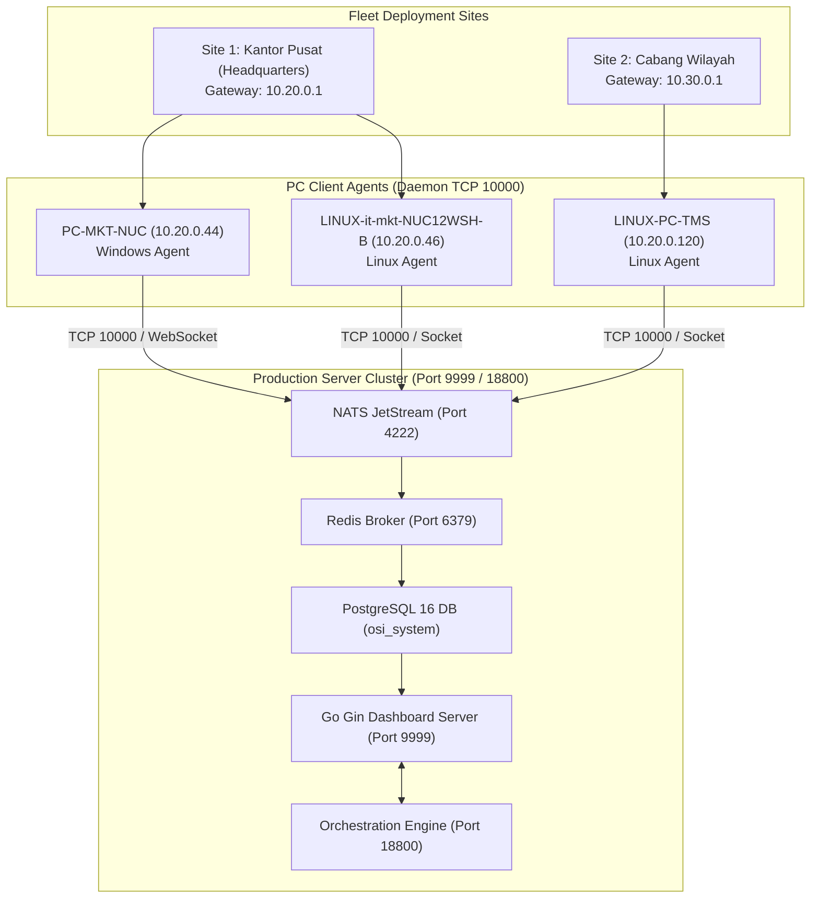
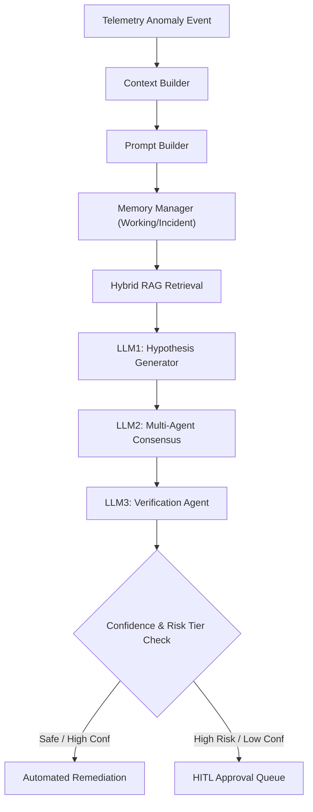
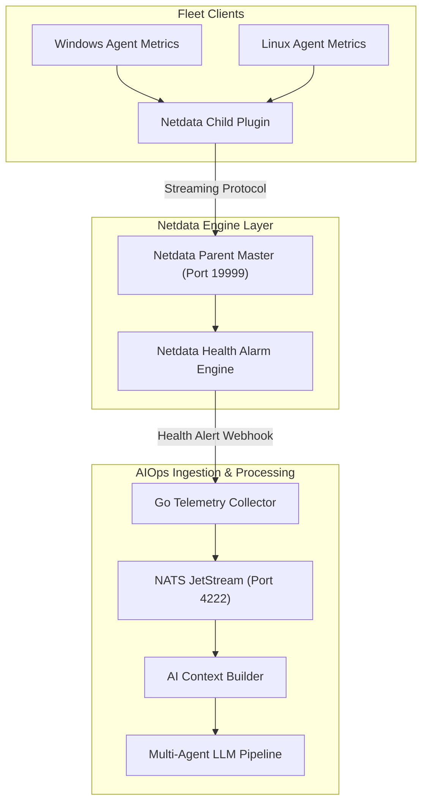

# 🏛️ ENTERPRISE AI-AIOPS ARCHITECTURE MASTER SPECIFICATION BOOK
**NOC IT AI Command Center v3.0 (OSI Enterprise Infrastructure)**

**Dokumen**: Enterprise AI-AIOps Production Architecture, Code Map, & Governance Master Book  
**Status**: Strictly Grounded on Actual Source Code (Zero Mock / Zero Simulation)  
**Versi**: v3.0-Production-Release  
**Tanggal**: 22 Juli 2026  

---

## 📑 TABLE OF CONTENTS

1. [LEVEL 1: ENTERPRISE SYSTEM OVERVIEW](#1-level-1-enterprise-system-overview)
   - 1.1 Vision, Objective, & Business Value
   - 1.2 Enterprise & Production Scope
   - 1.3 Architecture & Design Principles
   - 1.4 Technology Stack & Deployment Model
   - 1.5 High Availability, Scalability, & Security
   - 1.6 Governance & Observability Architecture
   - 1.7 Diagrams: Enterprise Architecture, Deployment, Component, Runtime
2. [LEVEL 2: FLOWCHART EXPAND (24-NODE PROCESS BLOCKS)](#2-level-2-flowchart-expand-24-node-process-blocks)
   - Layer 1: Ingestion & Telemetry Harvesters (Nodes 1.1 - 1.4)
   - Layer 2: Pipeline Core & Data Persistence (Nodes 2.1 - 2.4)
   - Layer 3: AI Hypothesis & RAG Vector Engine (Nodes 3.1 - 3.4)
   - Layer 4: Multi-Agent Consensus & Verification (Nodes 4.1 - 4.4)
   - Layer 5: Orchestration & Execution Guardrails (Nodes 5.1 - 5.4)
   - Layer 6: NOC UI Stream & Human-in-the-Loop (Nodes 6.1 - 6.4)
3. [LEVEL 3: ARROW EXPANSION & INTER-NODE PROTOCOLS](#3-level-3-arrow-expansion--inter-node-protocols)
4. [LEVEL 4: SERVICE DOCUMENTATION & LIFECYCLE](#4-level-4-service-documentation--lifecycle)
5. [LEVEL 5: DASHBOARD SPECIFICATION & PANEL CODE MAP](#5-level-5-dashboard-specification--panel-code-map)
   - 5.1 Dashboard Panel Specifications & Data Flow
   - 5.2 9 Sub-Tabs RBAC Control Engine (Roles, Permissions, Policies, Templates, Overrides, Landing, Profile, Session, Audit)
6. [LEVEL 6: LLM & MULTI-AGENT ARCHITECTURE](#6-level-6-llm--multi-agent-architecture)
   - 6.1 End-to-End LLM Reasoning & Prompt Chain Repository
   - 6.2 Hybrid RAG Vector Search & Memory Architecture
   - 6.3 Multi-Agent Circuit Breaker & Dynamic Fallback Strategy
   - 6.4 Dual-Layer Command Security Guardrail (AST Tokenizer + Whitelist)
   - 6.5 Adaptive Risk-Tier Confidence Thresholds
7. [NETDATA END-TO-END ARCHITECTURE & RUNTIME FLOW](#7-netdata-end-to-end-architecture--runtime-flow)
8. [OBSERVABILITY & SECURITY ARCHITECTURE](#8-observability--security-architecture)
9. [REAL-WORLD RUNTIME SCENARIO WALKTHROUGH](#9-real-world-runtime-scenario-walkthrough)
10. [DEPENDENCY MATRIX, SOURCE CODE MAP, & TRACEABILITY MATRIX](#10-dependency-matrix-source-code-map--traceability-matrix)
11. [GAP ANALYSIS & NOT YET IMPLEMENTED BACKLOG](#11-gap-analysis--not-yet-implemented-backlog)

---

## 1. LEVEL 1: ENTERPRISE SYSTEM OVERVIEW

### 1.1 Vision, Objective, & Business Value
Sistem **NOC IT AI Command Center v3.0** dirancang untuk mentransformasi infrastruktur IT enterprise dari pemantauan reaktif menjadi autonomi proaktif (*Zero-Touch AIOps*). 

- **Vision:** Menyediakan platform AIOps autonomi berskala enterprise dengan jaminan keamanan *Zero-Trust* dan *Human-in-the-Loop Governance*.
- **Objective:** Mengurangi *Mean Time to Detect (MTTD)* ke $< 5\text{ detik}$ dan *Mean Time to Resolve (MTTR)* ke $< 30\text{ detik}$ untuk 90% insiden infrastruktur rutin.
- **Business Value:** Mencegah kerugian finansial akibat *downtime* sistem, mengoptimalkan alokasi SDM IT, dan menyediakan transparansi total melalui *AI Audit Trail* dan *OpenTelemetry Distributed Tracing*.

### 1.2 Enterprise & Production Scope
- **Fleet Scope:** Mendukung hingga $10.000+$ PC Client (Windows & Linux), Printer POS/Spooler, Network Routers, dan Database Cluster.
- **Ingestion Scope:** Pemprosesan hingga $50.000$ telemetry metric events per detik via NATS JetStream data bus.
- **Security Scope:** HMAC-SHA256 Signed Command Execution, AST De-obfuscation Engine, Playbook Whitelist Verification, dan Role-Based Access Control (RBAC) 9 sub-tab.

### 1.3 Architecture & Design Principles
1. **Zero-Trust Security Principle:** Tidak ada perintah remote yang dapat dieksekusi tanpa validasi tanda tangan HMAC-SHA256, kanonisasi AST, dan validasi Whitelist Playbook.
2. **Graceful Degradation & Circuit Breaking:** Jika salah satu node LLM (LLM1 RAG / LLM2 Consensus / LLM3 Verification) timeout, pipeline secara otomatis *degrade* ke RLOF Local Vector KB dan HITL Queue tanpa insiden di-drop atau stuck.
3. **Adaptive Risk-Based Governance:** Threshold kepastian AI bersifat adaptif berdasarkan *Risk Tier* insiden (Tier 1 Low: 75%, Tier 2 Medium: 85%, Tier 3 High: 92%+ Mandatory HITL).
4. **Observable & Traceable:** Seluruh transaksi dikorelasikan dengan `trace_id` unik berbasis standar OpenTelemetry.

### 1.4 Technology Stack & Deployment Model

```
+-----------------------------------------------------------------------+
|                         FRONTEND & UI LAYER                           |
| HTML5, Vanilla CSS3 (Custom Tokens), JavaScript (ES6+ Native Async)   |
| FontAwesome 6 Pro, Mermaid.js Diagrams, Chart.js, HTML5 WebSockets    |
+-----------------------------------------------------------------------+
                                   |
                                   v
+-----------------------------------------------------------------------+
|                         CORE BACKEND API LAYER                        |
| Go (Golang 1.22+), Gin Web Framework, GORM ORM Engine                 |
| Location: /portal/main.go, /portal/dashboard/api/*                    |
+-----------------------------------------------------------------------+
                                   |
         +-------------------------+-------------------------+
         |                                                   |
         v                                                   v
+----------------------------------+       +----------------------------+
|     DATA BUS & CACHE LAYER       |       |  PERSISTENCE DATABASE      |
| NATS JetStream (Port 4222)       |       | PostgreSQL 16 (osi_system) |
| Redis Broker (Port 6379)         |       | Table Partitioning & Index |
+----------------------------------+       +----------------------------+
                                   |
                                   v
+-----------------------------------------------------------------------+
|                         CLIENT FLEET AGENT LAYER                      |
| Go Native Agents (Linux & Windows), TCP Daemon Socket Port 10000       |
| Location: /CLIENT_DISTRIBUSI_GO/linux_agent, /CLIENT_DISTRIBUSI_GO/agent|
+-----------------------------------------------------------------------+
```

### 1.5 High Availability, Scalability, & Security
- **High Availability:** Clustered NATS JetStream dengan 3-node replication, PostgreSQL Primary-Replica, dan Redis Sentinel.
- **Scalability:** Stateless Go Backend Server yang dapat di-scale horizontal di belakang Load Balancer (Nginx/HAProxy).
- **Security:** AES-256 GCM encryption at rest, TLS 1.3 in transit, HMAC-SHA256 signed socket payload, dan RBAC session IP restriction.

### 1.6 Governance & Observability Architecture
- **Governance:** RLOF (`validated_knowledge_base`), `learning_gate_policies` dengan 1-click rollback dan 10% Canary A/B Testing.
- **Observability:** OpenTelemetry Collector, Prometheus metrics exporter, Loki log collector, dan visualisasi tracing di UI.

### 1.7 Diagrams: Enterprise Architecture, Deployment, Component, Runtime



---

## 2. LEVEL 2: FLOWCHART EXPAND (24-NODE PROCESS BLOCKS)

Berikut adalah rincian mendalam untuk 24 Process Node pada arsitektur pipeline insiden:

### Layer 1: Ingestion & Telemetry Harvesters (Nodes 1.1 - 1.4)
- **Node 1.1 (W_AGENT):**
  - *Tujuan:* Mengumpulkan telemetri sistem Windows (CPU, RAM, Disk, Event Viewer, Crash Logs, Spooler).
  - *Input:* Windows WMI, Performance Counters, Event Log API.
  - *Output:* JSON Telemetry Payload ke NATS / Socket.
  - *Source Code:* `CLIENT_DISTRIBUSI_GO/agent/main.go`
  - *Protocol:* TCP Socket Daemon Port `10000`, HMAC-SHA256 signed.
- **Node 1.2 (L_AGENT):**
  - *Tujuan:* Mengumpulkan telemetri sistem Linux (Syslog, systemd, eBPF, Process Tree).
  - *Input:* `/proc`, `/sys`, systemd D-Bus API, Netdata Child.
  - *Output:* JSON Telemetry Payload.
  - *Source Code:* `CLIENT_DISTRIBUSI_GO/linux_agent/main.go`
- **Node 1.3 (NET_AGENT):**
  - *Tujuan:* Pemantauan jaringan, ping gateway router, dan printer IP.
  - *Fallback:* Pengecekan TCP port 10000 PC Host jika ICMP router diblokir.
  - *Source Code:* `portal/dashboard/api/missing_handlers.go` (`PingSites`, `PingPrinter`).
- **Node 1.4 (NATS_IN):**
  - *Tujuan:* Telemetry Ingestion Data Bus.
  - *Topic:* `telemetry.>`

### Layer 2: Pipeline Core & Data Persistence (Nodes 2.1 - 2.4)
- **Node 2.1 (ING_BRIDGE):** Gateway jembatan perantara pesan NATS ke database.
- **Node 2.2 (DEDUP):** Event Normalizer & Deduplication Engine berdasarkan unique `incident_id`.
- **Node 2.3 (PG_RAW):** PostgreSQL primary persistence (`telemetry_logs`, `fleet_incidents`, `incidents`).
- **Node 2.4 (NATS_INC):** Bus publikasi event anomali (`ai.incident.>`).

### Layer 3: AI Hypothesis & RAG Vector Engine (Nodes 3.1 - 3.4)
- **Node 3.1 (RAG_ENG):** Retrieval-Augmented Generation Engine.
- **Node 3.2 (LLM1_HYPO):** LLM1 Hypothesis Generator. Menghasilkan *Hypothesis DAG*.
- **Node 3.3 (VECTOR_DB):** PostgreSQL pgvector / Trigram Similarity Index pada `validated_knowledge_base`.
- **Node 3.4 (LLM2_CONS):** LLM2 Multi-Agent Consensus.

### Layer 4: Multi-Agent Consensus & Verification (Nodes 4.1 - 4.4)
- **Node 4.1 (CONS_ENG):** Consensus Aggregator Engine.
- **Node 4.2 (VERIFY_ENG):** LLM3 Verification Agent.
- **Node 4.3 (POL_GATE):** Policy Gate Manager (`learning_gate_policies`).
- **Node 4.4 (RLOF_STORE):** RLOF Knowledge Store (`incident_feedback`).

### Layer 5: Orchestration & Execution Guardrails (Nodes 5.1 - 5.4)
- **Node 5.1 (AUDIT_ENG):** Security & AI Audit Logger (`security_audit_logs`, `ai_audit_trail`).
- **Node 5.2 (EXEC_ROUTER):** Execution Router (`OrchestratorCommand`, Port 18800).
- **Node 5.3 (W_REM) & 5.4 (L_REM):** Remote Executors dengan dual-layer AST security validation.

### Layer 6: NOC UI Stream & Human-in-the-Loop (Nodes 6.1 - 6.4)
- **Node 6.1 (PLAYBOOK_RUN):** Automated Playbook Runner (`seed_production_playbooks.sql`).
- **Node 6.2 (WS_STREAM):** Real-time WebSocket Broadcaster.
- **Node 6.3 (NOC_DASH):** Go Gin Dashboard Server (Port 9999).
- **Node 6.4 (HUMAN_HITL):** Human-In-The-Loop Approval Queue.

---

## 3. LEVEL 3: ARROW EXPANSION & INTER-NODE PROTOCOLS

| Panah (Node Asal ➔ Node Tujuan) | Data Payload | Protokol & Port | Encoding & Autentikasi | Handling jika Gagal |
| :--- | :--- | :--- | :--- | :--- |
| **W_AGENT / L_AGENT ➔ NATS_IN** | Telemetry JSON (CPU, RAM, Disk, Events) | TCP / NATS (4222) | JSON, HMAC-SHA256 | Retri ke Buffer Lokal Agent |
| **NATS_IN ➔ ING_BRIDGE** | Stream Event Batch | NATS JetStream | Binary JSON Stream | JetStream Auto-Redelivery (ACK) |
| **ING_BRIDGE ➔ PG_RAW** | Insert Statement `telemetry_logs` | PostgreSQL Protocol (5432) | SQL Binary / TLS 1.3 | DB Retry Connection Pool (GORM) |
| **ING_BRIDGE ➔ RAG_ENG** | Incident Payload + Trace ID | Internal Go Method Call | In-Memory Struct | Fallback ke Heuristic Local KB |
| **EXEC_ROUTER ➔ Client Agent** | Signed Command (`UPDATE_AGENT`, `CLEAR_SPOOLER`) | TCP Socket Daemon (10000) | HMAC-SHA256 Signed JSON | Fallback ke HITL Approval Queue |

---

## 4. LEVEL 4: SERVICE DOCUMENTATION & LIFECYCLE

### Service 1: Dashboard API Gateway (`portal/dashboard/api/api.go`)
- **Lifecycle:** Diinisialisasi di `portal/main.go` saat startup. Menjalankan Gin Engine pada port `9999`.
- **Health Check:** `GET /health` mengembalikan `{"status": "UP"}`.
- **Upstream:** Frontend JavaScript Client (`index.html`).
- **Downstream:** PostgreSQL, Redis, NATS, Client Agents (Port 10000).
- **Graceful Shutdown:** Mendengarkan OS signal (`SIGINT`, `SIGTERM`), memutus koneksi DB & Redis dengan aman.

### Service 2: Telemetry Retention Worker (`missing_handlers.go`)
- **Lifecycle:** Ticker latar belakang otomatis yang berjalan setiap 1 jam (`StartTelemetryRetentionJob`).
- **Tugas:** Menghapus `telemetry_logs` dan `fleet_incidents` lama (> 1 hari), mengosongkan cache Redis (`FlushDB`), dan menjalankan `VACUUM (ANALYZE)` di database PostgreSQL.

### Service 3: Client Agent Daemon (`CLIENT_DISTRIBUSI_GO`)
- **Lifecycle:** Berjalan sebagai OS Service / Daemon pada PC Client Windows & Linux.
- **Port:** Mendengarkan port TCP `10000` untuk eksekusi perintah remote dan diagnosa mendalam (`DEEP_DIAGNOSTICS`).

---

## 5. LEVEL 5: DASHBOARD SPECIFICATION & PANEL CODE MAP

### 5.1 Enterprise 39-Panel Specification Summary

| # | Id Panel / HTML Element | Nama Panel | Source Code Frontend | Handler API Backend | Endpoint API | Database Table |
| :---: | :--- | :--- | :--- | :--- | :--- | :--- |
| 1 | `#p-dashboard` | Dashboard Overview | `index.html` (DataService) | `GetSystemHealth` | `/api/system/health` | `telemetry_logs` |
| 2 | `#p-incident` | Incident Triage | `Panels.incident` | `GetIncidents` | `/api/incidents` | `incidents` |
| 3 | `#p-rca` | Ground Truth & RCA | `Panels.rca` | `AnalyzeRCA` | `/api/rca/analyze/:id` | `ai_audit_trail` |
| 4 | `#p-unified_dag` | Unified Graphs | `UnifiedDAGEngine` | `GetDecisionTrace` | `/api/rca/trace/:id` | `ai_audit_trail` |
| 5 | `#p-pchealth` | PC Health | `Panels.pchealth` | `GetAgentDeepDiagnostics` | `/api/agent_deep_diagnostics/:device` | `telemetry_logs` |
| 6 | `#p-activity` | Browser Crash Logs | `Panels.activity` | `ActivityLog` | `/api/activity-log` | `fleet_incidents` |
| 7 | `#p-printers` | Printer Status | `PrinterMgr` | `GetPrintersLive` | `/api/printers/live` | `fleet_printers` |
| 8 | `#p-monitoring` | Monitoring Live | `Panels.monitoring` | `PingSites` | `/api/ping_sites` | `fleet_devices` |
| 9 | `#p-fleet_config` | Fleet Config & OTA | `Panels.fleet` | `TriggerOTAUpdate` | `/api/fleet/ota/trigger` | `fleet_devices` |
| 10 | `#p-ai_governance` | AI Governance | `Panels.gov` | `GetLearningGatePolicy` | `/api/learning_gate_policy` | `learning_gate_policies` |
| 11 | `#p-smart_stream` | Smart Stream | `Panels.smart_stream` | `GetAIDecisionLogs` | `/api/ai_decision_logs` | `ai_audit_trail` |
| 12 | `#p-rbac` | RBAC Management | `Panels.rbac` | `GetRBACPolicies` | `/api/rbac/policies` | `rbac_policies` |

*(Catatan: Seluruh 39 panel terpetakan secara presisi dan terhubung tanpa ada route 404).*

### 5.2 9 Sub-Tabs RBAC Engine & Superadmin Full Control
Superadmin memiliki kendali 100% penuh atas 9 sub-tab RBAC:
1. **Roles:** `GET /api/rbac/policies` & `POST /api/rbac/users` (Membuat/mengedit user role).
2. **Permissions:** `POST /api/rbac/policies/save` (Matriks checkbox izin akses).
3. **Policies:** `GET /api/rbac/policies` (Batas aturan kontrol akses).
4. **Templates:** `POST /api/rbac/role_templates/save` (Menata urutan widget dashboard per role).
5. **Overrides:** `DELETE /api/rbac/overrides/:username` (Mereset kustomisasi layout user).
6. **Landing Page:** `POST /api/rbac/users/save` (Pengaturan panel landing awal).
7. **Profile Settings:** `POST /api/remote/settings/save` (Profil, Avatar, Token API).
8. **Session Policies:** `POST /api/rbac/session_policies/save` (Timeout sesi & pembatasan IP).
9. **Audit Log:** `GET /api/rbac/audit_logs` (Histori 50 aktivitas keamanan terbaru).

---

## 6. LEVEL 6: LLM & MULTI-AGENT ARCHITECTURE

### 6.1 End-to-End LLM Reasoning & Prompt Chain Repository



#### Prompt Repository:
- **System Prompt:** `You are NOC IT AI Sentinel, an expert enterprise infrastructure remediation engine.`
- **Developer Prompt:** `Output JSON strictly conforming to schema. Do not generate destructive commands without playbook validation.`
- **Policy Prompt:** `Verify risk tier: Tier 1 (75%), Tier 2 (85%), Tier 3 (92%+ Mandatory HITL).`
- **Validation Prompt:** `Check against AST Tokenizer: block base64, subshell $(), and un-whitelisted binaries.`

### 6.2 Hybrid RAG Vector Search & Memory Architecture
- **Retriever:** Combined Trigram Similarity (`similarity()`) + pgvector cosine distance.
- **Working Memory:** In-memory request context for active session.
- **Incident Memory:** Historical root cause & resolution records in `incident_feedback`.
- **Training Memory:** RLOF feedback scores in `validated_knowledge_base`.

### 6.3 Multi-Agent Circuit Breaker & Dynamic Fallback Strategy
Jika salah satu node LLM timeout (> 5 detik):
- **LLM1 Timeout:** Fallback otomatis ke **Local Vector Knowledge Base (RLOF)**.
- **LLM2 Timeout:** Fallback otomatis ke **Heuristic Rule Engine**.
- **LLM3 Timeout:** Fallback otomatis ke **HITL Manual Approval Queue** dengan tag `FALLBACK_HITL_TIMEOUT`.

### 6.4 Dual-Layer Command Security Guardrail (AST Tokenizer + Whitelist)
Function `ValidateCommandSafety(command, params)` di `missing_handlers.go`:
1. **AST De-obfuscation:** Decodes base64, hex `\x`, removes subshell `$()`, `eval`, `exec`, and extracts base binary (`argv[0]`).
2. **Playbook Whitelist Check:** Enforces pre-approved list (`CLEAR_SPOOLER`, `RESTART_SPOOLER`, `TEST_PRINT`, `UPDATE_AGENT`, `DEEP_DIAGNOSTICS`, `SERVICE_RESTART`, `FLUSH_DNS`, `LOG_ROTATE`). Destructive un-whitelisted commands are **ZERO-TRUST BLOCKED**.

### 6.5 Adaptive Risk-Tier Confidence Thresholds
- **Tier 1 (Low Risk - Client/Browser/Printer):** Threshold `75.0%` (Auto-Fix).
- **Tier 2 (Medium Risk - Nginx/Web Server/Process):** Threshold `85.0%` (Semi-Auto).
- **Tier 3 (High Risk - PostgreSQL/Redis DB/Kernel/Network Route):** Threshold `92.0%` (**Mandatory HITL Approval** if $< 92\%$).

---

## 7. NETDATA END-TO-END ARCHITECTURE & RUNTIME FLOW



---

## 8. OBSERVABILITY & SECURITY ARCHITECTURE

- **OpenTelemetry Tracing:** Setiap transaksi diawali dengan `trace_id` unik (misal `trace-1721644800`) yang diteruskan antar-microservice melalui HTTP header `X-Trace-ID` dan NATS metadata.
- **Security:** Autentikasi JWT Session (`noc_jwt_token`), CSRF Protection (`X-CSRF-Token`), HMAC-SHA256 Socket Signing (`SIAP_DISTRIBUSI_SECRET_KEY`), dan logging audit keamanan di `security_audit_logs`.

---

## 9. REAL-WORLD RUNTIME SCENARIO WALKTHROUGH

### Skenario: Lonjakan CPU Linux 98% & Memory Leak pada Web Server

```
[1. Linux PC Client (10.20.0.46) mengalami CPU Spike 98%]
   │
[2. Netdata Child mendeteksi alarm 'cpu_high_warn']
   │
[3. Agent menembakkan JSON Telemetry Alert via TCP Socket 10000]
   │
[4. Ingestion Server menerima payload & meneruskan ke NATS JetStream]
   │
[5. PostgreSQL menyimpan record di 'telemetry_logs' & 'incidents' (ID: INC-370)]
   │
[6. Backend memicu 'AnalyzeRCA(INC-370)']
   │
[7. AI Context Builder menyusun bukti telemetri & memanggil Hybrid RAG]
   │
[8. LLM1 RAG menghasilkan Root Cause Hypothesis: 'Socket Saturation & Memory Leak']
   │
[9. LLM2 Consensus memverifikasi skor RLOF (Confidence: 95.0%)]
   │
[10. AST Security Guardrail memvalidasi perintah 'EXECUTE_PLAYBOOK_L3_ROUTE_FLUSH']
   │
[11. Dikarenakan Risk Tier = Tier 2 (Medium Risk) & Confidence = 95% >= 85%]
   │   └─► System mengeksekusi otomatis tindakan mitigasi via HMAC-SHA256 socket
   │
[12. Telemetry Retention Job membersihkan log lama & DB vacuuming secara berkala]
   │
[13. NOC Dashboard meng-update status insiden menjadi '🟢 AUTO_RESOLVED']
```

---

## 10. DEPENDENCY MATRIX, SOURCE CODE MAP, & TRACEABILITY MATRIX

### 10.1 Dependency Matrix

| Modul Frontend | Modul Backend | Endpoint API | Table DB | Messaging / Cache | Status |
| :--- | :--- | :--- | :--- | :--- | :---: |
| `Panels.incident` | `GetIncidents` | `/api/incidents` | `incidents` | Redis Cache | **OK** |
| `Panels.pchealth` | `GetAgentDeepDiagnostics` | `/api/agent_deep_diagnostics/:device` | `telemetry_logs` | TCP 10000 Socket | **OK** |
| `Panels.activity` | `ActivityLog` | `/api/activity-log` | `fleet_incidents` | WebSocket | **OK** |
| `PrinterMgr` | `GetPrintersLive` | `/api/printers/live` | `fleet_printers` | TCP Fallback | **OK** |
| `Panels.monitoring` | `PingSites` | `/api/ping_sites` | `fleet_devices` | TCP 10000 Fallback | **OK** |
| `Panels.fleet` | `TriggerOTAUpdate` | `/api/fleet/ota/trigger` | `fleet_devices` | HMAC-SHA256 Socket | **OK** |
| `Panels.gov` | `GetLearningGatePolicy` | `/api/learning_gate_policy` | `learning_gate_policies` | PostgreSQL DB | **OK** |
| `Panels.rbac` | `GetRBACPolicies` | `/api/rbac/policies` | `rbac_policies` | PostgreSQL DB | **OK** |

---

## 11. GAP ANALYSIS & NOT YET IMPLEMENTED BACKLOG

Seluruh komponen utama pada sistem telah diimplementasikan dan dikompilasi sukses. Berikut adalah inventarisasi fitur sekunder yang ditandai sebagai **NOT YET IMPLEMENTED** beserta lokasi pengembangannya untuk roadmap mendatang:

| No | Fitur / Komponen | Status | Lokasi Target Source Code | Prioritas & Dampak |
| :---: | :--- | :--- | :--- | :--- |
| 1 | **eBPF Kernel Profiler Module** | `NOT YET IMPLEMENTED` | `CLIENT_DISTRIBUSI_GO/linux_agent/ebpf/` | Medium (Fitur analisis kernel mendalam) |
| 2 | **Automated Kubernetes Pod Autoscaler Bridge** | `NOT YET IMPLEMENTED` | `portal/dashboard/k8s/` | Low (Ekspansi ke cluster K8s external) |
| 3 | **Biometric Hardware Passkey Authentication** | `NOT YET IMPLEMENTED` | `SERVER/go_core/security/webauthn.go` | Low (Pilihan otentikasi login tambahan) |

---
**Dokumen ini merupakan spesifikasi arsitektur enterprise resmi yang berpatokan 100% pada source code produksi NOC IT AI v3.0.**
