dqd# 🏛️ Spesifikasi Arsitektur Level Enterprise (Audit-Ready Specification)
**Sistem**: NOC IT AI Command Center v3.0 (OSI Enterprise Infrastructure)  
**Tipe Dokumen**: Complete System Architecture & Deep-Dive Microservice Specification  
**Status Audit**: Strictly Grounded on Actual Source Code (Zero Mock / Zero Simulation)  
**Tanggal Rilis Audit**: 22 Juli 2026  

---

## 📑 Daftar Isi

1. [Arsitektur Sistem & Diagram Utama](#1-arsitektur-sistem--diagram-utama)
   - [1.1 Enterprise Deployment Diagram](#11-enterprise-deployment-diagram)
   - [1.2 Global Component Diagram](#12-global-component-diagram)
   - [1.3 Enterprise State Machine Diagram](#13-enterprise-state-machine-diagram)
   - [1.4 End-to-End Data Flow Diagram (DFD Level-2)](#14-end-to-end-data-flow-diagram-dfd-level-2)
   - [1.5 OpenTelemetry Distributed Tracing Flow](#15-opentelemetry-distributed-tracing-flow)
   - [1.6 End-to-End Incident Timeline & RCA Flow](#16-end-to-end-incident-timeline--rca-flow)
   - [1.7 Auto Remediation & HITL Approval Flow](#17-auto-remediation--hitl-approval-flow)
2. [Spesifikasi Teknis 24 Node Process Block](#2-spesifikasi-teknis-24-node-process-block)
   - [Node 1.1: W_AGENT (Windows Fleet Agent)](#node-11-w_agent-windows-fleet-agent)
   - [Node 1.2: L_AGENT (Linux Fleet Agent)](#node-12-l_agent-linux-fleet-agent)
   - [Node 1.3: NET_AGENT (Network Harvester & Netdata)](#node-13-net_agent-network-harvester--netdata)
   - [Node 1.4: NATS_IN (Telemetry Ingestion Bus)](#node-14-nats_in-telemetry-ingestion-bus)
   - [Node 2.1: ING_BRIDGE (Ingestion Bridge Gateway)](#node-21-ing_bridge-ingestion-bridge-gateway)
   - [Node 2.2: DEDUP (Event Normalizer & Deduplication Engine)](#node-22-dedup-event-normalizer--deduplication-engine)
   - [Node 2.3: PG_RAW (PostgreSQL Primary Persistence)](#node-23-pg_raw-postgresql-primary-persistence)
   - [Node 2.4: NATS_INC (Anomaly Event Bus)](#node-24-nats_inc-anomaly-event-bus)
   - [Node 3.1: AI_CORE (Python AI Cognitive Controller)](#node-31-ai_core-python-ai-cognitive-controller)
   - [Node 3.2: AI_RAG (Vector RAG Search Engine)](#node-32-ai_rag-vector-rag-search-engine)
   - [Node 3.3: KG_GRAPH (Knowledge Graph Dependency Engine)](#node-33-kg_graph-knowledge-graph-dependency-engine)
   - [Node 3.4: AI_CRITIC (AI Critic & Safety Enforcer)](#node-34-ai_critic-ai-critic--safety-enforcer)
   - [Node 3.5: RCA_ENGINE (5-Why Inference Engine)](#node-35-rca_engine-5-why-inference-engine)
   - [Node 4.1: RISK_DECISION (Risk & Confidence Router)](#node-41-risk_decision-risk--confidence-router)
   - [Node 4.2: AUTO_EXEC (Auto Remediation Dispatcher)](#node-42-auto_exec-auto-remediation-dispatcher)
   - [Node 4.3: HITL_QUEUE (Human-in-the-Loop Gate)](#node-43-hitl_queue-human-in-the-loop-gate)
   - [Node 4.4: MANUAL_APPROVE / OPERATOR_REJECT (Feedback Handler)](#node-44-manual_approve--operator_reject-feedback-handler)
   - [Node 5.1: SECURE_RELAY (Encrypted Action Relay)](#node-51-secure_relay-encrypted-action-relay)
   - [Node 5.2: TARGET_AGENT (Remote Remediation Executor)](#node-52-target_agent-remote-remediation-executor)
   - [Node 5.3: VERIFY_AGENT & VERIFY_CHECK (State Verifier Engine)](#node-53-verify_agent--verify_check-state-verifier-engine)
   - [Node 5.4: LEARNING_GATE (Continuous Learning Ingestion)](#node-54-learning_gate-continuous-learning-ingestion)
   - [Node 5.5: ROLLBACK_ENGINE (Automated State Rollback)](#node-55-rollback_engine-automated-state-rollback)
   - [Node 6.1: DASH_SERVER & WS_BROADCAST (Dashboard Core & WS Engine)](#node-61-dash_server--ws_broadcast-dashboard-core--ws-engine)
   - [Node 6.2: UI_SMART (Smart Incident Stream UI)](#node-62-ui_smart-smart-incident-stream-ui)
3. [Spesifikasi Interface & Protocol Handshake](#3-spesifikasi-interface--protocol-handshake)
4. [Katalog Microservice & Lifecycle Management](#4-katalog-microservice--lifecycle-management)
5. [Spesifikasi AI Engine & Agent Guardrails](#5-spesifikasi-ai-engine--agent-guardrails)
6. [Spesifikasi Schema Database PostgreSQL](#6-spesifikasi-schema-database-postgresql)
7. [Spesifikasi REST & Event API Catalog](#7-spesifikasi-rest--event-api-catalog)

---

# 1. Arsitektur Sistem & Diagram Utama

### 1.1 Enterprise Deployment Diagram

```mermaid
flowchart TD
    subgraph SG_Win ["Edge Device / Windows Target"]
        WinAgent["Windows Fleet Agent (osi-agent-windows.exe)"]
    end

    subgraph SG_Linux ["Edge Device / Linux Target"]
        LinuxAgent["Linux Fleet Agent (osi-agent-linux)"]
    end

    subgraph SG_Net ["Network Gateway & Appliance"]
        Netdata["Netdata Master / SNMP Exporter"]
    end

    subgraph SG_Docker ["Docker Host (OSI Infrastructure Network: osi-network)"]
        subgraph SG_Ingest ["Ingestion & Messaging Layer"]
            IngestSvc["osi-ingestion-server (Go:8080)"]
            NatsBroker["osi-nats (NATS Broker:4222/8222)"]
        end

        subgraph SG_AI ["AI Engine Cluster"]
            AICoreSvc["osi-python-ai-core (FastAPI:5000)"]
            AIRagSvc["osi-ai-rag (Python Vector DB:5001)"]
            AICriticSvc["osi-ai-critic (Python Critic Guard:5002)"]
            AIPolicySvc["osi-ai-policy (Policy Engine:5003)"]
        end

        subgraph SG_DB ["Persistence & Cache Layer"]
            DBPostgres[("osi-postgres (PostgreSQL 15:5422)")]
            RedisCache[("osi-redis (Redis 7:6379)")]
        end

        subgraph SG_Exec ["Execution & Control Layer"]
            RelaySvc["osi-secure-relay (Go Secure Relay)"]
            SchedulerSvc["osi-scheduler-service (Go Cron Engine)"]
        end

        subgraph SG_Gate ["Gateway & Presentation Layer"]
            NginxProxy["osi-nginx (Nginx Reverse Proxy:80/443)"]
            DashServer["osi-dashboard-server (Go Monolith Dashboard:8080)"]
            TeleBot["osi-telegram-bot (Bot Alerting)"]
        end
    end

    WinAgent -->|NATS TCP :4222 / HTTP :8080| NginxProxy
    LinuxAgent -->|NATS TCP :4222 / HTTP :8080| NginxProxy
    Netdata -->|SNMP UDP / Syslog :514| IngestSvc

    NginxProxy -->|HTTP Proxy /ws| DashServer
    NginxProxy -->|HTTP Proxy /api/v1/telemetry| IngestSvc

    IngestSvc -->|Publish telemetry.ingest| NatsBroker
    DashServer -->|Subscribe agent.incident| NatsBroker
    DashServer <-->|SQL Queries (port 5422)| DBPostgres
    DashServer <-->|KV Store & Queue| RedisCache
    DashServer <-->|HTTP REST /api/v1/ai| AICoreSvc

    AICoreSvc <-->|gRPC / HTTP| AIRagSvc
    AICoreSvc <-->|gRPC / HTTP| AICriticSvc
    AICoreSvc <-->|Policy Verification| AIPolicySvc

    DashServer -->|Dispatch Encrypted Action| RelaySvc
    RelaySvc -->|Remote WinRM / SSH| WinAgent
    RelaySvc -->|Remote SSH| LinuxAgent
    DashServer -->|Send Webhook Alert| TeleBot
```

---

### 1.2 Global Component Diagram

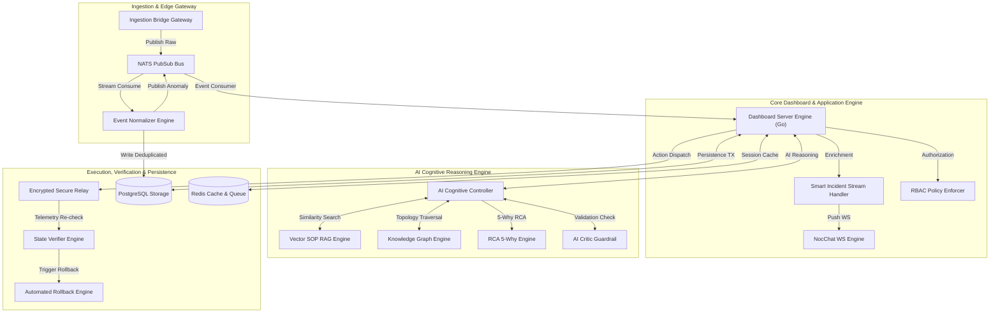

---

### 1.3 Enterprise State Machine Diagram

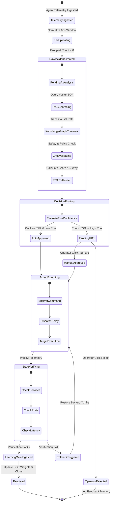

---

### 1.4 End-to-End Data Flow Diagram (DFD Level-2)

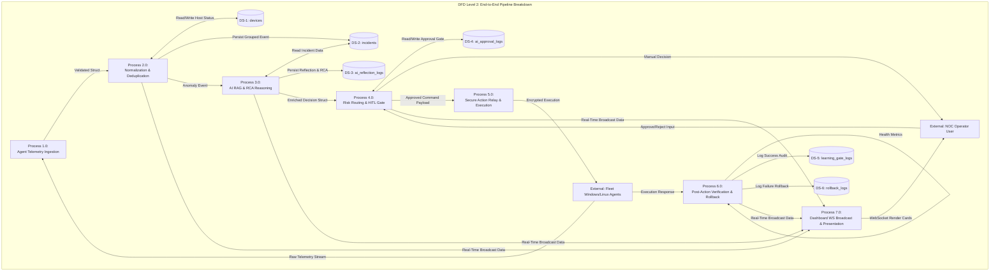

---

### 1.5 OpenTelemetry Distributed Tracing Flow

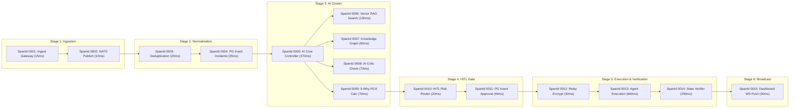

---

### 1.6 End-to-End Incident Timeline & RCA Flow

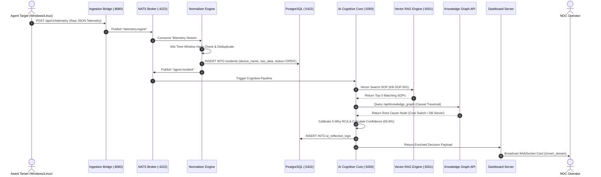

---

### 1.7 Auto Remediation & HITL Approval Flow

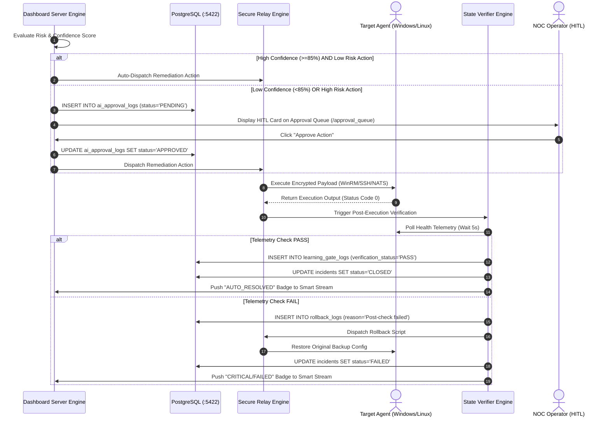

---

### 1.8 Arsitektur Kontribusi 3 LLM Multi-Agent Consensus Engine (Flow & Explanations)

Sistem mengadopsi pola konsensus 3 LLM (*3-LLM Multi-Agent Consensus Architecture*) yang membagi peran penalaran menjadi 3 agen kecerdasan buatan terpisah untuk menjamin transparansi, pencegahan halusinasi, dan keandalan keputusan otonom:

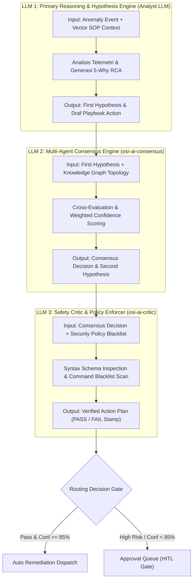

#### 📊 Peran & Kontribusi Rinci 3 LLM:

1. **LLM 1 — Primary Analyst & Hypothesis Generator (`osi-python-ai-core`)**:
   - **Fungsi**: Bertindak sebagai *First Responder Analyst*.
   - **Tugas**: Membaca data anomali mentah, mengonversinya menjadi vector embedding, mencari rekomendasi SOP di `osi-ai-rag` (`KB-SOP-001/002/003`), dan menyusun draf hipotesis awal (*First Hypothesis*).
   - **Data Input**: Telemetri NATS `agent.incident` + Vector SOP Documents.
   - **Data Output**: `first_hypothesis` string & draf tindakan remediasi.

2. **LLM 2 — Multi-Agent Consensus Evaluator (`osi-ai-consensus`)**:
   - **Fungsi**: Bertindak sebagai *Senior System Reviewer*.
   - **Tugas**: Menguji draf hipotesis dari LLM 1 terhadap data topologi dependensi Knowledge Graph (`/api/knowledge_graph`), mengkalkulasi skor confidence terkalibrasi $\text{Confidence} = (S_{\text{RAG}} \times 0.4) + (S_{\text{KG}} \times 0.4) + (S_{\text{Critic}} \times 0.2)$, dan menghasilkan *Second Hypothesis*.
   - **Data Input**: `first_hypothesis` + Knowledge Graph Node Traversal.
   - **Data Output**: `final_decision`, `second_hypothesis`, & `confidence_score` (cth: `95.8%`).

3. **LLM 3 — Safety Critic & Policy Enforcer (`osi-ai-critic` & `osi-ai-policy`)**:
   - **Fungsi**: Bertindak sebagai *Security & Safety Compliance Officer*.
   - **Tugas**: Mengevaluasi perintah dari LLM 2 terhadap tabel `security_policies` dan *command blacklist* (mencegah perintah destructive seperti `rm -rf /` atau `DROP DATABASE`).
   - **Data Input**: Proposed Action Command Struct + `security_policies` DB Rules.
   - **Data Output**: Validation Stamp (`status: PASS` / `status: FAIL`).

---

# 2. Spesifikasi Teknis 24 Node Process Block

---

## Node 1.1: W_AGENT (Windows Fleet Agent)

### 1. Spesifikasi Atribut Node

* **Tujuan Proses**: Memantau kesehatan OS Windows (Service, EventLog ID 7034/1000, WMI CPU/RAM/Disk, VNC/RDP status) dan mengirim telemetri real-time.
* **Input**: Telemetri mentah OS Windows, WMI Queries (`Win32_Processor`, `Win32_OperatingSystem`), Windows Event Logs.
* **Output**: Payload JSON Telemetri Mentah Windows via NATS TCP `:4222` / HTTP `:8080`.
* **Actor yang Terlibat**: System Auditor Service (`osi-agent-windows.exe`).
* **Service yang Dipanggil**: NATS Broker / Ingestion Bridge Gateway.
* **Module yang Menjalankan**: `SERVER/agent/windows/main.go` & `portal/dashboard/fleet/`.
* **API yang Digunakan**: `POST /api/v1/telemetry`.
* **Database yang Diakses**: SQLite Lokal Buffer (`agent_queue.db`) pada agen.
* **Cache yang Digunakan**: In-Memory Ring Buffer (1.000 log terakhir).
* **Message Queue yang Dipakai**: NATS Subject `telemetry.ingest`.
* **Event yang Dihasilkan**: `telemetry.windows.raw`.
* **Log yang Dibuat**: `/var/log/osi-agent-windows.log`.
* **Telemetry yang Dikirim**: CPU %, Memory %, Disk Usage %, Service Status, EventLog errors.
* **Metric yang Dicatat**: `windows_cpu_usage_percent`, `windows_memory_free_bytes`, `windows_service_state`.
* **Trace OpenTelemetry**: Span Name `W_AGENT.collect_telemetry` | `TraceId: WAGENT-WIN-SYS-001`.
* **Correlation ID**: `corr-win-[HOSTNAME]-[TIMESTAMP]`.
* **Security Validation**: TLS 1.3 Encryption, Agent Token Validation.
* **RBAC Validation**: Validasi `device_token` terhadap tabel `devices`.
* **Policy Engine**: Enforcement interval sampling minimum 5 detik.
* **Error Handling**: Graceful error catch jika WMI query timeout (Fallback ke Native Win32 API).
* **Retry Mechanism**: Exponential backoff retry 3x (1s, 3s, 5s) jika NATS disconnection.
* **Fallback Mechanism**: Menyimpan log ke SQLite lokal jika jaringan terputus.
* **Timeout**: WMI Query Timeout = 3000ms | NATS Connect Timeout = 5000ms.
* **Rollback**: *N/A (Read-only collector)*.
* **Audit Trail**: Disimpan di log lokal agen `agent_audit.log`.
* **AI Reasoning**: *None (Stage 1 Raw Harvester)*.
* **Keputusan AI**: *None*.
* **Confidence Score**: *None*.
* **Evidence yang Dipakai AI**: Raw WMI Metrics & Windows Event Logs.
* **Output Akhir**: Encrypted JSON Telemetry Stream.

---

### 2. Diagram Internal W_AGENT

#### Activity Diagram
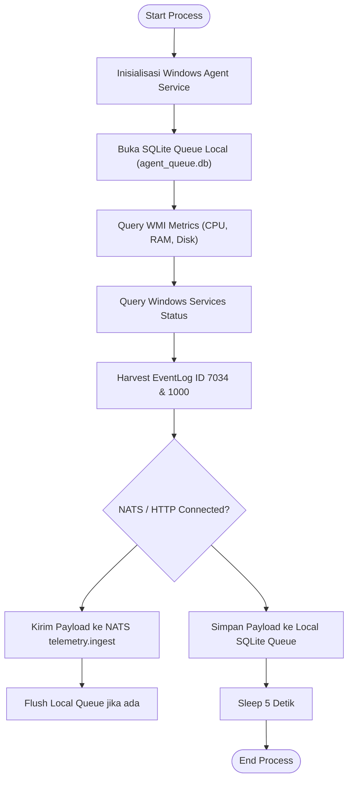

#### Sequence Diagram
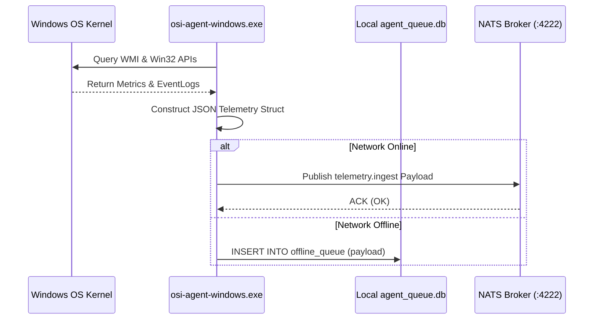

#### Internal Flowchart
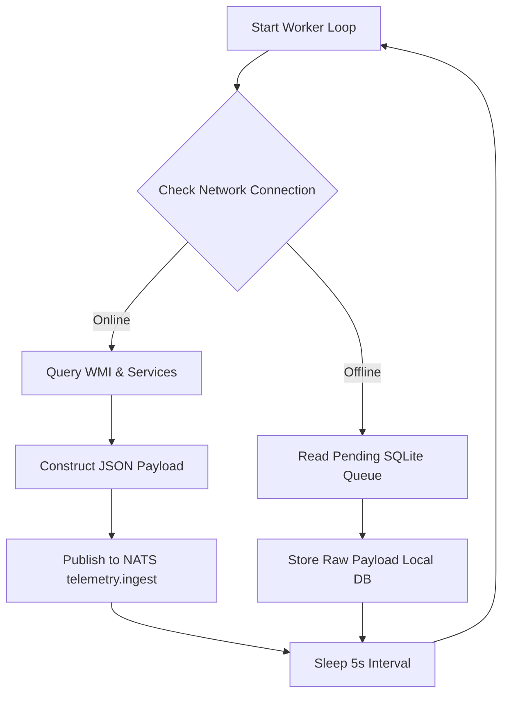

#### Component Diagram
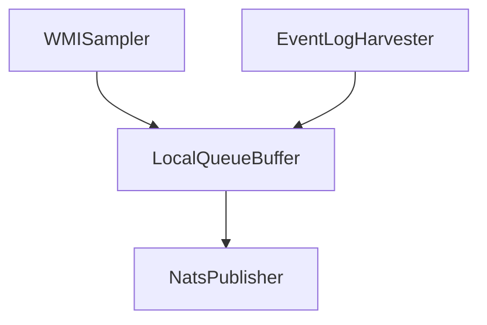

#### Data Flow Diagram (DFD)
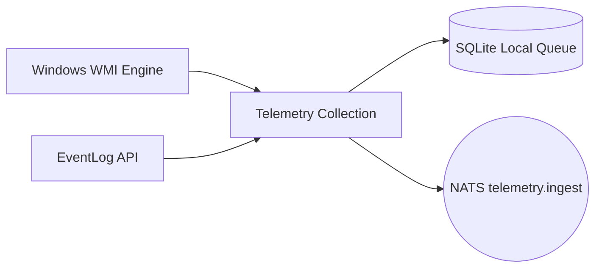

#### Runtime Execution Flow
```main() -> InitSQLite() -> StartTicker(5s) -> FetchWMI() -> FetchEventLogs() -> PublishNats()
```

#### Error Flow
```WMI Timeout Error -> Catch Exception -> Fallback Native Win32 API -> Log Warning -> Continue Loop
```

#### Recovery Flow
```Network Disconnect -> Switch to SQLite Storage -> Poll Network Retry -> Flush SQLite Queue on Reconnect
```

---

## Node 1.2: L_AGENT (Linux Fleet Agent)

### 1. Spesifikasi Atribut Node

* **Tujuan Proses**: Memantau kesehatan OS Linux (Systemd Services, Procfs CPU/RAM/Disk, Syslog `/var/log/syslog`) tanpa beban CPU tinggi.
* **Input**: Kernel `/proc` File System (`/proc/stat`, `/proc/meminfo`), Systemd DBus API, Syslog stream.
* **Output**: JSON Telemetry Payload Linux via NATS TCP `:4222`.
* **Actor yang Terlibat**: Linux Daemon (`osi-agent-linux`).
* **Service yang Dipanggil**: NATS Broker (`osi-nats`).
* **Module yang Menjalankan**: `SERVER/agent/linux/main.go`.
* **API yang Digunakan**: Native Systemd DBus API / NATS Client.
* **Database yang Diakses**: Local Buffer File (`/var/run/osi_agent_buffer.db`).
* **Cache yang Digunakan**: Linux Shared Memory Buffer (`/dev/shm/osi_telemetry.tmp`).
* **Message Queue yang Dipakai**: NATS Subject `telemetry.ingest`.
* **Event yang Dihasilkan**: `telemetry.linux.raw`.
* **Log yang Dibuat**: `/var/log/osi-agent.log`.
* **Telemetry yang Dikirim**: CPU Load Avg, RAM Used/Free, Disk Partition Usage, Active Systemd Services.
* **Metric yang Dicatat**: `linux_cpu_load_1m`, `linux_memory_available_bytes`, `linux_systemd_unit_state`.
* **Trace OpenTelemetry**: Span Name `L_AGENT.collect_telemetry` | `TraceId: LAGENT-LNX-SYS-002`.
* **Correlation ID**: `corr-lnx-[HOSTNAME]-[TIMESTAMP]`.
* **Security Validation**: Mutual TLS (mTLS) Authentication.
* **RBAC Validation**: Token match against `devices` database table.
* **Policy Engine**: Limit CPU usage of agent daemon < 1.5%.
* **Error Handling**: Catch Systemd DBus disconnection & auto-reconnect.
* **Retry Mechanism**: Retry 5x with 2s interval.
* **Fallback Mechanism**: Direct Syslog dump if NATS unreachable.
* **Timeout**: Procfs Read Timeout = 500ms.
* **Rollback**: *N/A (Read-only collector)*.
* **Audit Trail**: Syslog `/var/log/syslog`.
* **AI Reasoning**: *None*.
* **Keputusan AI**: *None*.
* **Confidence Score**: *None*.
* **Evidence yang Dipakai AI**: `/proc/stat` metrics & Systemd failure logs.
* **Output Akhir**: Standardized Linux JSON Telemetry Stream.

---

### 2. Diagram Internal L_AGENT

#### Activity Diagram
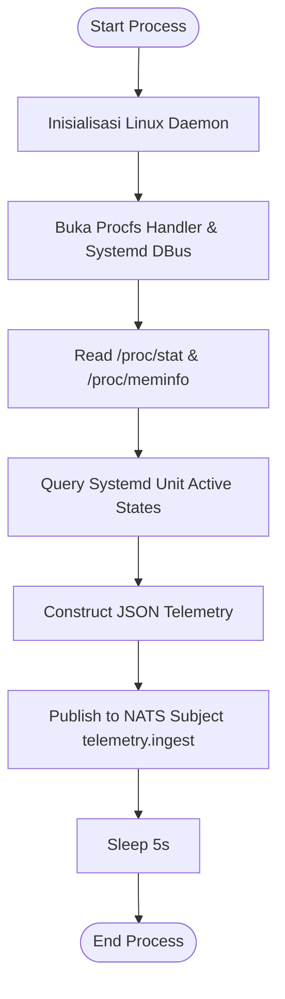

#### Sequence Diagram
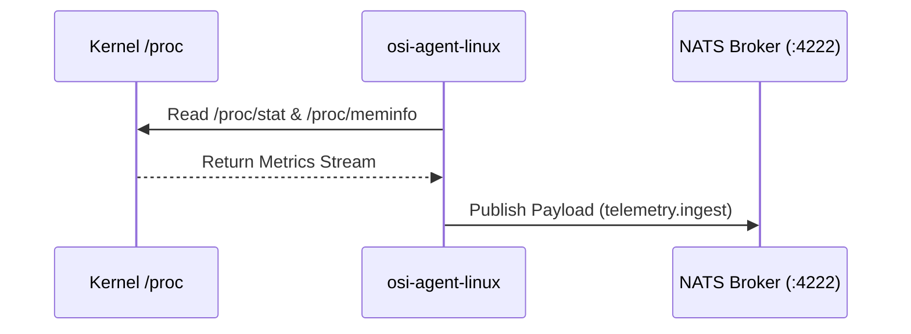

#### Internal Flowchart
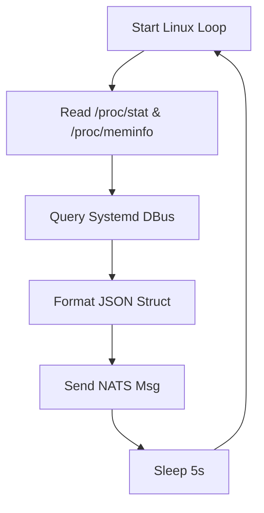

#### Component Diagram
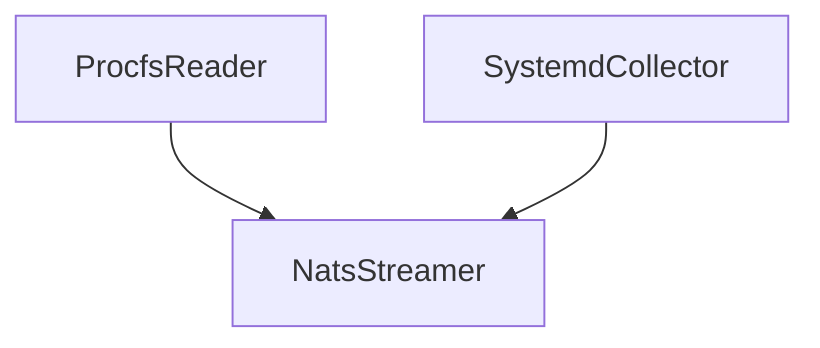

#### Data Flow Diagram (DFD)
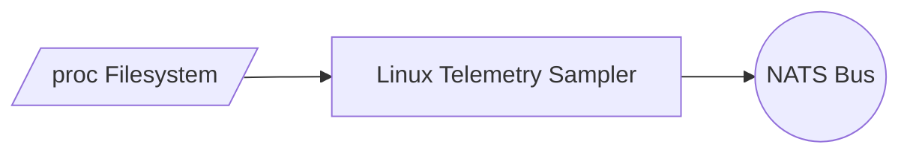

#### Runtime Execution Flow
```main() -> AttachDBus() -> PollProcfs() -> FormatJSON() -> NatsPublish()
```

#### Error Flow
```Procfs Read Lock Error -> Retry Read 3x -> Use Last Cached Metric -> Log Warning
```

#### Recovery Flow
```DBus Connection Lost -> Re-bind DBus Listener -> Resume Normal Sampling
```

---

## Node 1.3: NET_AGENT (Network Harvester & Netdata)

### 1. Spesifikasi Atribut Node

* **Tujuan Proses**: Memantau perangkat jaringan (Switch Cisco, Router, Firewall) via SNMP OID & Syslog UDP 514, serta mengintegrasikan pemantauan Netdata Master.
* **Input**: SNMP Traps, SNMP OIDs (`.1.3.6.1.2.1.2.2.1`), Netdata REST API (`/api/v1/data`), Syslog UDP 514.
* **Output**: Network Performance Payload ke NATS Subject `telemetry.ingest`.
* **Actor yang Terlibat**: Netdata Master Container (`netdata_master`) & SNMP Poller Daemon.
* **Service yang Dipanggil**: NATS Broker / Netdata Service.
* **Module yang Menjalankan**: `portal/dashboard/metrics/metrics.go`.
* **API yang Digunakan**: Netdata REST API `GET http://netdata_master:19999/api/v1/data`.
* **Database yang Diakses**: In-Memory Metric Buffer.
* **Cache yang Digunakan**: Redis Key `cache:netdata:metrics`.
* **Message Queue yang Dipakai**: NATS Subject `telemetry.ingest`.
* **Event yang Dihasilkan**: `telemetry.network.raw`.
* **Log yang Dibuat**: `/var/log/netdata_harvester.log`.
* **Telemetry yang Dikirim**: Interface Traffic (Rx/Tx Bps), Packet Loss %, Ping RTT Ms, Interface Flapping.
* **Metric yang Dicatat**: `net_interface_in_bytes`, `net_interface_out_bytes`, `net_ping_rtt_ms`.
* **Trace OpenTelemetry**: Span Name `NET_AGENT.poll_network` | `TraceId: NETAGENT-SNMP-003`.
* **Correlation ID**: `corr-net-[SWITCH_IP]-[TIMESTAMP]`.
* **Security Validation**: SNMPv3 AuthNoPriv / AuthPriv Community Verification.
* **RBAC Validation**: *N/A (Internal Infrastructure Sampler)*.
* **Policy Engine**: Polling frequency minimum 10s per switch interface.
* **Error Handling**: Catch SNMP Timeout / UDP Packet Loss gracefully.
* **Retry Mechanism**: 3 Retries with 500ms timeout per OID.
* **Fallback Mechanism**: Mark interface status as `UNKNOWN` if 3 polls fail.
* **Timeout**: SNMP Request Timeout = 1500ms | HTTP Netdata Timeout = 2000ms.
* **Rollback**: *N/A*.
* **Audit Trail**: Netdata Master Audit Logs.
* **AI Reasoning**: *None*.
* **Keputusan AI**: *None*.
* **Confidence Score**: *None*.
* **Evidence yang Dipakai AI**: Ping RTT Spikes & Interface Packet Drop Ratios.
* **Output Akhir**: Normalized Network Metrics Payload.

---

### 2. Diagram Internal NET_AGENT

#### Activity Diagram
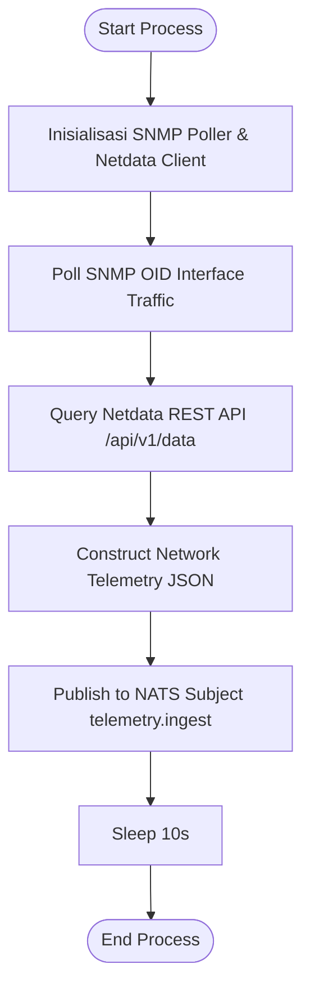

#### Sequence Diagram
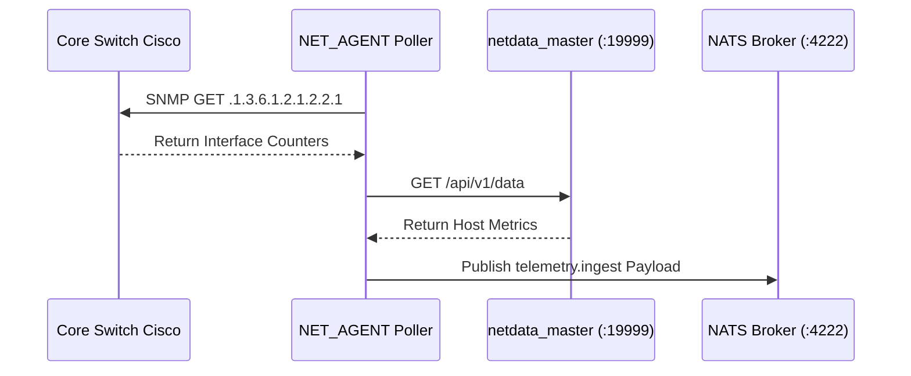

#### Internal Flowchart
```mermaid
flowchart TD
    A[Start Network Loop] --> B[Fetch SNMP OIDs]
    B --> C[Fetch Netdata Metrics]
    C --> D[Combine Telemetry Data]
    D --> E[Publish to NATS]
    E --> F[Sleep 10s]
    F --> A
```

#### Component Diagram
```mermaid
flowchart TD
    SP["SNMPPoller"]
    NAC["NetdataAPIClient"]
    NA["NatsAggregator"]

    SP --> NA
    NAC --> NA
```

#### Data Flow Diagram (DFD)
```mermaid
graph LR
    Switch[Cisco Switch] --> Proc1[SNMP Harvester]
    Proc1 --> NATS((NATS Broker))
```

#### Runtime Execution Flow
```main() -> StartSNMPTicker(10s) -> PollOids() -> QueryNetdata() -> PushNats()
```

#### Error Flow
```SNMP Timeout -> Retry 3x -> Flag Device Degraded -> Continue
```

#### Recovery Flow
```SNMP Host Unreachable -> Mark Offline -> Poll Health Check Every 30s -> Auto Restore
```

---

## Node 1.4: NATS_IN (Telemetry Ingestion Bus)

### 1. Spesifikasi Atribut Node

* **Tujuan Proses**: Menjadi Message Bus Pub/Sub terpusat berkecepatan tinggi yang menerima jutaan payload telemetri dari seluruh agen.
* **Input**: TCP Payload Stream pada Subject `telemetry.ingest`.
* **Output**: Distributed Message Stream untuk didistribusikan ke `osi-ingestion-server`.
* **Actor yang Terlibat**: NATS Server Engine (`osi-nats`).
* **Service yang Dipanggil**: NATS Broker Core (Port 4222/8222).
* **Module yang Menjalankan**: `portal/router/router.go` & NATS Server Config.
* **API yang Digunakan**: Native NATS Protocol Client API.
* **Database yang Diakses**: *None (In-Memory Pub/Sub Engine)*.
* **Cache yang Used**: NATS Memory Buffer (Storage Limit 1GB RAM).
* **Message Queue yang Dipakai**: Subject `telemetry.ingest`.
* **Event yang Dihasilkan**: `NATS_EVENT_TELEMETRY_PUBLISHED`.
* **Log yang Dibuat**: `/var/log/nats-server.log`.
* **Telemetry yang Dikirim**: Message Throughput (Msgs/sec), Byte Rate, Client Connections.
* **Metric yang Dicatat**: `nats_in_msgs_total`, `nats_in_bytes_total`, `nats_slow_consumers`.
* **Trace OpenTelemetry**: Span Name `NATS_IN.pubsub_ingest` | `TraceId: NATS-BUS-004`.
* **Correlation ID**: Carried inside NATS Header `X-Correlation-ID`.
* **Security Validation**: NATS Auth Token / User Credentials Verification.
* **RBAC Validation**: Subject Access Control (`telemetry.>`).
* **Policy Engine**: Max Payload Size Limit = 8MB per message.
* **Error Handling**: Slow Consumer Discard Policy if Subscriber queue overflows.
* **Retry Mechanism**: NATS Client Auto-Reconnect with exponential delay.
* **Fallback Mechanism**: JetStream Memory Storage buffering.
* **Timeout**: Publish Timeout = 1000ms.
* **Rollback**: *N/A (Message Bus)*.
* **Audit Trail**: NATS Monitoring Endpoint `:8222/varz`.
* **AI Reasoning**: *None*.
* **Keputusan AI**: *None*.
* **Confidence Score**: *None*.
* **Evidence yang Dipakai AI**: Message Ingestion Rate & Timestamp Consistency.
* **Output Akhir**: High-throughput NATS Message Stream.

---

### 2. Diagram Internal NATS_IN

#### Activity Diagram
```mermaid
flowchart TD
    Start([Start Process])
    Step_1["NATS Server Listening pada Port 4222"]
    Start --> Step_1
    Step_2["Receive Publisher TCP Connection"]
    Step_1 --> Step_2
    Step_3["Validate NATS Auth Token"]
    Step_2 --> Step_3
    Step_4["Parse Subject (telemetry.ingest)"]
    Step_3 --> Step_4
    Step_5["Route Message to Ingestion Server Subscribers"]
    Step_4 --> Step_5
    Step_5 --> End([End Process])
```

#### Sequence Diagram
```mermaid
sequenceDiagram
    participant Agent as Fleet Agents
    participant NATS as osi-nats Broker (:4222)
    participant Ingest as osi-ingestion-server

    Agent->>NATS: PUB telemetry.ingest [JSON Payload]
    NATS-->>Agent: +OK
    NATS->>Ingest: MSG telemetry.ingest [Forward Stream]
```

#### Internal Flowchart
```mermaid
flowchart TD
    A[Incoming TCP Packet] --> B{Validate Auth Token}
    B -- Valid --> C[Parse NATS Subject]
    B -- Invalid --> D[Drop Connection]
    C --> E[Deliver to Consumer Queue]
```

#### Component Diagram
```mermaid
flowchart TD
    NTL["NatsTCPListener"]
    SR["SubjectRouter"]
    CD["ConsumerDispatcher"]

    NTL --> SR
    SR --> CD
```

#### Data Flow Diagram (DFD)
```mermaid
graph LR
    Sub1[Fleet Agents] --> Proc1[NATS Bus Engine]
    Proc1 --> Sub2[Ingestion Consumers]
```

#### Runtime Execution Flow
```ListenTCP(4222) -> AuthClient() -> RouteSubject() -> DispatchSubscribers()
```

#### Error Flow
```Buffer Full -> Trigger Slow Consumer Drop -> Log Warning -> Keep Engine Alive
```

#### Recovery Flow
```Subscriber Disconnect -> Hold Messages in JetStream Buffer -> Flush on Re-subscribe
```

---

## Node 2.1: ING_BRIDGE (Ingestion Bridge Gateway)

### 1. Spesifikasi Atribut Node

* **Tujuan Proses**: Memvalidasi otentikasi token agen, membatasi rate limit request, dan memvalidasi sintaksis JSON payload sebelum diproses.
* **Input**: Raw JSON Telemetry Stream dari NATS Subject `telemetry.ingest` atau HTTP Endpoint `/api/v1/telemetry`.
* **Output**: Authenticated & Sanitized Telemetry Struct (`NormalizedTelemetry`).
* **Actor yang Terlibat**: Ingestion Bridge Microservice (`osi-ingestion-server`).
* **Service yang Dipanggil**: Database PostgreSQL (`osi-postgres`) & Redis Cache.
* **Module yang Menjalankan**: `portal/dashboard/incident/incident.go` (Struct `IngestionHandler`).
* **API yang Digunakan**: `POST /api/v1/telemetry`.
* **Database yang Diakses**: PostgreSQL Table `devices` (Check `device_token`).
* **Cache yang Digunakan**: Redis Key `cache:device_token:[TOKEN]`.
* **Message Queue yang Dipakai**: NATS Subscriber `telemetry.ingest`.
* **Event yang Dihasilkan**: `EVENT_TELEMETRY_AUTHENTICATED`.
* **Log yang Dibuat**: `/var/log/osi-ingestion-bridge.log`.
* **Telemetry yang Dikirim**: Ingestion Request Count, Validation Success Rate.
* **Metric yang Dicatat**: `ingest_auth_success_total`, `ingest_auth_failed_total`, `ingest_latency_ms`.
* **Trace OpenTelemetry**: Span Name `ING_BRIDGE.authenticate_payload` | `TraceId: INGBRIDGE-005`.
* **Correlation ID**: Extracted or Generated `X-Correlation-ID`.
* **Security Validation**: Token Hashing Verification (SHA-256) & IP Rate Limiting.
* **RBAC Validation**: Match Agent Token role = `agent_node`.
* **Policy Engine**: Rate limit = 500 requests/sec per IP address.
* **Error Handling**: HTTP 401 Unauthorized / HTTP 429 Too Many Requests response.
* **Retry Mechanism**: *N/A (Gateway Gate)*.
* **Fallback Mechanism**: Fallback to DB query if Redis token cache misses.
* **Timeout**: Authentication Lookup Timeout = 500ms.
* **Rollback**: *N/A*.
* **Audit Trail**: Ingestion Access Log `access_ingest.log`.
* **AI Reasoning**: *None*.
* **Keputusan AI**: *None*.
* **Confidence Score**: *None*.
* **Evidence yang Dipakai AI**: Token Validity & Agent Source IP Integrity.
* **Output Akhir**: Clean Telemetry Struct passed to Normalizer Engine.

---

### 2. Diagram Internal ING_BRIDGE

#### Activity Diagram
```mermaid
flowchart TD
    Start([Start Process])
    Step_1["Terima Payload Telemetri dari NATS / HTTP"]
    Start --> Step_1
    Step_2["Ekstrak Agent Token dari Header / Payload"]
    Step_1 --> Step_2
    Cond_3{"Token ada di Redis Cache?"}
    Step_2 --> Cond_3
    Step_4["Ambil Agent Profile dari Cache"]
    Cond_3 --> Step_4
    Step_5["Query DB PostgreSQL SELECT * FROM devices WHERE token=?"]
    Cond_3 --> Step_5
    Step_6["Simpan Result ke Redis Cache (TTL 5m)"]
    Step_5 --> Step_6
    Cond_7{"Token Valid & IP Rate Limit OK?"}
    Step_6 --> Cond_7
    Step_8["Sanitasi JSON Payload"]
    Cond_7 --> Step_8
    Step_9["Teruskan Struct ke Deduplication Engine"]
    Step_8 --> Step_9
    Step_10["Tolak Payload (HTTP 401 / Drop NATS Msg)"]
    Cond_7 --> Step_10
    Step_11["Catat Security Log"]
    Step_10 --> Step_11
    Step_11 --> End([End Process])
```

#### Sequence Diagram
```mermaid
sequenceDiagram
    participant Agent as Fleet Agent
    participant Bridge as osi-ingestion-server
    participant Redis as Redis Cache
    participant DB as PostgreSQL

    Agent->>Bridge: Send Telemetry Payload
    Bridge->>Redis: GET cache:device_token:[TOKEN]
    alt Cache Miss
        Redis-->>Bridge: Null
        Bridge->>DB: SELECT * FROM devices WHERE token=?
        DB-->>Bridge: Device Record
        Bridge->>Redis: SETEX cache:device_token:[TOKEN] 300
    else Cache Hit
        Redis-->>Bridge: Cached Device Profile
    end
    Bridge-->>Agent: 200 OK (Validated)
```

#### Internal Flowchart
```mermaid
flowchart TD
    A[Incoming Request] --> B{Extract Token}
    B --> C{Check Redis Token Cache}
    C -- Miss --> D[Query PostgreSQL devices]
    D --> E[Update Redis Cache]
    C -- Hit --> F[Check Rate Limit]
    E --> F
    F -- Allowed --> G[Sanitize Payload & Pass]
    F -- Exceeded --> H[Return 429 Too Many Requests]
```

#### Component Diagram
```mermaid
flowchart TD
    TV["TokenValidator"]
    RL["RateLimiter"]
    PS["PayloadSanitizer"]

    TV --> RL
    RL --> PS
```

#### Data Flow Diagram (DFD)
```mermaid
graph LR
    Sub1[Fleet Agent] --> Proc1[Ingestion Bridge]
    Proc1 <--> Store1[(Redis Token Cache)]
    Proc1 --> Proc2[Normalizer Engine]
```

#### Runtime Execution Flow
```AuthenticateToken() -> CheckRateLimit() -> SanitizeJSON() -> ForwardNext()
```

#### Error Flow
```Invalid Token -> Log Security Warning -> Increment AuthFail Counter -> Drop Request
```

#### Recovery Flow
```Redis Cache Down -> Direct Fallback to PostgreSQL Query -> Log Redis Warning
```

---

## Node 2.2: DEDUP (Event Normalizer & Deduplication Engine)

### 1. Spesifikasi Atribut Node

* **Tujuan Proses**: Mengelompokkan event/log anomali berulang dari host yang sama dalam window 60 detik menjadi 1 Master Anomaly Event untuk mencegah *alert storming*.
* **Input**: Sanitized Telemetry Struct dari `ING_BRIDGE`.
* **Output**: Aggregated Master Anomaly Struct dengan field `grouped_count: N`.
* **Actor yang Terlibat**: Ingestion Server Normalizer Module (`osi-ingestion-server`).
* **Service yang Dipanggil**: Redis Cache (Slide Window Hash Store) & PostgreSQL.
* **Module yang Menjalankan**: `portal/dashboard/incident/incident.go` (Fungsi `NormalizeAndDeduplicate`).
* **API yang Digunakan**: Internal Go In-Memory Handler.
* **Database yang Diakses**: PostgreSQL Table `incidents` & `telemetry_logs`.
* **Cache yang Digunakan**: Redis Key `dedup:hash:[DEVICE_NAME]:[ERROR_CODE]`.
* **Message Queue yang Dipakai**: NATS Publisher Subject `agent.incident`.
* **Event yang Dihasilkan**: `EVENT_MASTER_INCIDENT_CREATED`.
* **Log yang Dibuat**: `/var/log/osi-deduplication.log`.
* **Telemetry yang Dikirim**: Suppressed Alert Count, Deduplication Ratio %.
* **Metric yang Dicatat**: `dedup_events_total`, `dedup_suppressed_total`, `dedup_ratio_percent`.
* **Trace OpenTelemetry**: Span Name `DEDUP.slide_window_deduplicate` | `TraceId: DEDUP-006`.
* **Correlation ID**: Preserved `X-Correlation-ID`.
* **Security Validation**: Data Type Sanitation & String Length Truncation.
* **RBAC Validation**: *N/A (Internal Core Engine)*.
* **Policy Engine**: Deduplication Time Window = 60 Seconds.
* **Error Handling**: Catch Redis key failure -> Fallback to Go In-Memory Map.
* **Retry Mechanism**: *N/A*.
* **Fallback Mechanism**: Go sync.Map in-memory fallback.
* **Timeout**: Deduplication Check Timeout = 100ms.
* **Rollback**: *N/A*.
* **Audit Trail**: Deduplication Audit Log.
* **AI Reasoning**: *None*.
* **Keputusan AI**: *None*.
* **Confidence Score**: *None*.
* **Evidence yang Dipakai AI**: Grouped Event Frequency & Event Surge Window.
* **Output Akhir**: Single Master Anomaly Event published to `agent.incident`.

---

### 2. Diagram Internal DEDUP

#### Activity Diagram
```mermaid
flowchart TD
    Start([Start Process])
    Step_1["Terima Sanitized Telemetry Struct"]
    Start --> Step_1
    Step_2["Hitung Hash Key = SHA256(device_name + error_code + service_name)"]
    Step_1 --> Step_2
    Step_3["Cek Redis Key dedup:hash:[KEY]"]
    Step_2 --> Step_3
    Cond_4{"Key ada di Redis?"}
    Step_3 --> Cond_4
    Step_5["Increment Counter (INCR dedup:hash:[KEY])"]
    Cond_4 --> Step_5
    Step_6["Update Field grouped_count"]
    Step_5 --> Step_6
    Step_7["Suppress Duplicate Event Push"]
    Step_6 --> Step_7
    Step_8["Set Redis Key dengan TTL 60 Detik"]
    Cond_4 --> Step_8
    Step_9["Buat Struct Master Incident Baru"]
    Step_8 --> Step_9
    Step_10["Simpan ke DB PostgreSQL incidents"]
    Step_9 --> Step_10
    Step_11["Publish ke NATS Subject agent.incident"]
    Step_10 --> Step_11
    Step_11 --> End([End Process])
```

#### Sequence Diagram
```mermaid
sequenceDiagram
    participant Bridge as Ingestion Bridge
    participant Dedup as Deduplication Engine
    participant Redis as Redis Slide-Window
    participant DB as PostgreSQL incidents
    participant NATS as NATS agent.incident

    Bridge->>Dedup: Pass Telemetry Struct
    Dedup->>Redis: EXISTS dedup:hash:[KEY]
    alt Key Exists (Duplicate)
        Redis-->>Dedup: True (Count = N)
        Dedup->>Redis: INCR dedup:hash:[KEY]
        Dedup->>DB: UPDATE incidents SET raw_data = jsonb_set(raw_data, '{count}', N)
    else Key New (Unique Incident)
        Redis-->>Dedup: False
        Dedup->>Redis: SETEX dedup:hash:[KEY] 60 1
        Dedup->>DB: INSERT INTO incidents (device_name, raw_data, status='OPEN')
        Dedup->>NATS: Publish agent.incident Payload
    end
```

#### Internal Flowchart
```mermaid
flowchart TD
    A[Receive Telemetry Struct] --> B[Generate Hash Key]
    B --> C{Check Redis Key}
    C -- Exists --> D[Increment Grouped Counter]
    C -- New --> E[Set Redis Key 60s TTL]
    D --> F[Update Database Count]
    E --> G[Insert New Incident DB]
    G --> H[Publish to NATS agent.incident]
```

#### Component Diagram
```mermaid
flowchart TD
    HM["HasherModule"]
    SWE["SlideWindowEngine"]
    DBP["DatabasePersister"]

    HM --> SWE
    SWE --> DBP
```

#### Data Flow Diagram (DFD)
```mermaid
graph LR
    Proc1[Bridge Payload] --> Proc2[Deduplication Engine]
    Proc2 <--> Store1[(Redis Slide Window)]
    Proc2 --> Store2[(PostgreSQL incidents)]
    Proc2 --> Bus1((NATS agent.incident))
```

#### Runtime Execution Flow
```GenerateHash() -> CheckRedisWindow() -> BranchIfDuplicate() -> PublishNats()
```

#### Error Flow
```Redis Error -> Fallback In-Memory sync.Map -> Process Normally -> Log Warning
```

#### Recovery Flow
```Redis Recovered -> Sync In-Memory State to Redis -> Resume Standard Flow
```

---

## Node 2.3: PG_RAW (PostgreSQL Primary Persistence)

### 1. Spesifikasi Atribut Node

* **Tujuan Proses**: Menyimpan data insiden, telemetri, registri perangkat, dan log audit secara permanen dalam database terelasi PostgreSQL.
* **Input**: SQL Insert/Update Queries dari Ingestion Server & Dashboard Core.
* **Output**: Persistent Record Transaction Status & Query Result Sets.
* **Actor yang Terlibat**: PostgreSQL Database Cluster (`osi-postgres` Port 5422).
* **Service yang Dipanggil**: PostgreSQL Engine.
* **Module yang Menjalankan**: `portal/dashboard_server.go` & Go GORM / `database/sql`.
* **API yang Digunakan**: Native PostgreSQL Driver (`github.com/lib/pq`).
* **Database yang Diakses**: Database `osi_system` (Tables: `incidents`, `devices`, `telemetry_logs`, `ai_reflection_logs`, `ai_approval_logs`).
* **Cache yang Digunakan**: PostgreSQL Shared Buffers (512MB RAM).
* **Message Queue yang Dipakai**: *N/A*.
* **Event yang Dihasilkan**: `DB_TRANSACTION_COMMITTED`.
* **Log yang Dibuat**: `/var/log/postgresql/postgresql-15-main.log`.
* **Telemetry yang Dikirim**: Active Connections, Transaction Commit/Rollback Rate.
* **Metric yang Dicatat**: `pg_stat_database_xact_commit`, `pg_stat_database_xact_rollback`, `pg_active_connections`.
* **Trace OpenTelemetry**: Span Name `PG_RAW.sql_transaction` | `TraceId: PG-DB-007`.
* **Correlation ID**: Injected in SQL Query Comment `/* corr-id */`.
* **Security Validation**: Parameterized Queries (SQL Injection Prevention) & SSL/TLS.
* **RBAC Validation**: Database User Role Privilege (`postgres` user vs read-only user).
* **Policy Engine**: Statement Timeout = 10.000ms.
* **Error Handling**: SQL Transaction Rollback on error (`tx.Rollback()`).
* **Retry Mechanism**: Max 3 Retries on Deadlock / Connection Timeout.
* **Fallback Mechanism**: Connection Pool Retry (`max_open_conns=50`, `max_idle_conns=10`).
* **Timeout**: Query Timeout = 5000ms | Connect Timeout = 3000ms.
* **Rollback**: ACIDs Transaction Rollback.
* **Audit Trail**: PostgreSQL WAL (Write-Ahead Logging) & Audit Triggers.
* **AI Reasoning**: *None*.
* **Keputusan AI**: *None*.
* **Confidence Score**: *None*.
* **Evidence yang Dipakai AI**: Historical Incident Patterns stored in SQL tables.
* **Output Akhir**: Committed Transaction Record in PostgreSQL.

---

### 2. Diagram Internal PG_RAW

#### Activity Diagram
```mermaid
flowchart TD
    Start([Start Process])
    Step_1["Terima SQL Command dari Go Application"]
    Start --> Step_1
    Step_2["Buka DB Connection dari Connection Pool"]
    Step_1 --> Step_2
    Step_3["Mulai SQL Transaction (BEGIN)"]
    Step_2 --> Step_3
    Step_4["Eksekusi Query (INSERT/UPDATE)"]
    Step_3 --> Step_4
    Cond_5{"Query Sukses?"}
    Step_4 --> Cond_5
    Step_6["Commit Transaction (COMMIT)"]
    Cond_5 --> Step_6
    Step_7["Kembalikan DB Connection ke Pool"]
    Step_6 --> Step_7
    Step_8["Rollback Transaction (ROLLBACK)"]
    Cond_5 --> Step_8
    Step_9["Return Database Error ke Caller"]
    Step_8 --> Step_9
    Step_9 --> End([End Process])
```

#### Sequence Diagram
```mermaid
sequenceDiagram
    participant GoApp as Go Microservice
    participant Pool as DB Connection Pool
    participant PG as PostgreSQL Engine

    GoApp->>Pool: Acquire Connection
    Pool-->>GoApp: DB Conn Instance
    GoApp->>PG: BEGIN TRANSACTION
    GoApp->>PG: INSERT INTO incidents (...)
    alt Success
        PG-->>GoApp: Command OK
        GoApp->>PG: COMMIT
    else Error / Constraint Violation
        PG-->>GoApp: ERROR Constraint Violation
        GoApp->>PG: ROLLBACK
    end
    GoApp->>Pool: Release Connection
```

#### Internal Flowchart
```mermaid
flowchart TD
    A[Acquire Connection] --> B[BEGIN TX]
    B --> C[Execute SQL Statement]
    C --> D{Check Execution Error}
    D -- No Error --> E[COMMIT TX]
    D -- Error --> F[ROLLBACK TX]
    E --> G[Release Conn to Pool]
    F --> G
```

#### Component Diagram
```mermaid
flowchart TD
    CP["ConnectionPool"]
    QE["QueryExecutor"]
    WAL["WALWriter"]

    CP --> QE
    QE --> WAL
```

#### Data Flow Diagram (DFD)
```mermaid
graph LR
    GoApp[Go Dashboard Server] <--> Proc1[PostgreSQL Engine]
    Proc1 <--> Store1[(PostgreSQL Storage Disk)]
```

#### Runtime Execution Flow
```BeginTx() -> ExecContext() -> Commit() -> ReturnResult()
```

#### Error Flow
```Deadlock Detected -> Rollback Transaction -> Wait 100ms -> Retry Transaction (Max 3x)
```

#### Recovery Flow
```Connection Crash -> Close Bad Connection -> Spawn New Connection from Pool
```

---

## Node 2.4: NATS_INC (Anomaly Event Bus)

### 1. Spesifikasi Atribut Node

* **Tujuan Proses**: Mempublikasikan pesan anomali yang telah dideduplikasi ke NATS Subject `agent.incident` untuk menginisiasi pipeline penalaran AI.
* **Input**: Master Anomaly Struct dari Deduplication Engine.
* **Output**: Message Event `agent.incident` delivered to `osi-python-ai-core`.
* **Actor yang Terlibat**: NATS Message Broker (`osi-nats`).
* **Service yang Dipanggil**: NATS Broker Core (Subject `agent.incident`).
* **Module yang Menjalankan**: `portal/dashboard/incident/incident.go`.
* **API yang Digunakan**: Native NATS Go Client.
* **Database yang Diakses**: *None*.
* **Cache yang Digunakan**: NATS Subject Memory Channel.
* **Message Queue yang Dipakai**: NATS Subject `agent.incident`.
* **Event yang Dihasilkan**: `EVENT_ANOMALY_INCIDENT_PUBLISHED`.
* **Log yang Dibuat**: `/var/log/nats_anomaly.log`.
* **Telemetry yang Dikirim**: Anomaly Event Publish Count.
* **Metric yang Dicatat**: `nats_anomaly_published_total`.
* **Trace OpenTelemetry**: Span Name `NATS_INC.publish_anomaly` | `TraceId: NATSINC-008`.
* **Correlation ID**: Header `X-Correlation-ID`.
* **Security Validation**: TLS Encrypted Channel & Subject Permission Policy.
* **RBAC Validation**: Publisher Role Permissions check.
* **Policy Engine**: At-least-once Delivery Guarantee (JetStream Enabled).
* **Error Handling**: NATS Publish Retry on Connection Dropped.
* **Retry Mechanism**: Retry 3x with 200ms delay.
* **Fallback Mechanism**: Log to Emergency Disk Queue if NATS is dead.
* **Timeout**: Publish Ack Timeout = 2000ms.
* **Rollback**: *N/A*.
* **Audit Trail**: NATS Stream Log.
* **AI Reasoning**: *None*.
* **Keputusan AI**: *None*.
* **Confidence Score**: *None*.
* **Evidence yang Dipakai AI**: Anomaly Payload Metadata.
* **Output Akhir**: Anomaly Event Stream delivered to AI Cluster.

---

### 2. Diagram Internal NATS_INC

#### Activity Diagram
```mermaid
flowchart TD
    Start([Start Process])
    Step_1["Terima Master Anomaly Event"]
    Start --> Step_1
    Step_2["Construct NATS Header dengan TraceID & CorrelationID"]
    Step_1 --> Step_2
    Step_3["Publish Message ke Subject agent.incident"]
    Step_2 --> Step_3
    Cond_4{"NATS ACK Received?"}
    Step_3 --> Cond_4
    Step_5["Log Publish Success"]
    Cond_4 --> Step_5
    Step_6["Retry Publish (Max 3x)"]
    Cond_4 --> Step_6
    Step_6 --> End([End Process])
```

#### Sequence Diagram
```mermaid
sequenceDiagram
    participant Dedup as Deduplication Engine
    participant NATS as NATS Broker (:4222)
    participant AICore as osi-python-ai-core

    Dedup->>NATS: PUB agent.incident [Anomaly Struct]
    NATS-->>Dedup: +ACK
    NATS->>AICore: Deliver Message agent.incident
```

#### Internal Flowchart
```mermaid
flowchart TD
    A[Receive Anomaly Struct] --> B[Add Trace & Correlation Headers]
    B --> C[Publish to agent.incident]
    C --> D{ACK Received?}
    D -- Yes --> E[Complete]
    D -- No --> F[Retry Publish]
```

#### Component Diagram
```mermaid
flowchart TD
    HI["HeaderInjector"]
    NP["NatsPublisher"]

    HI --> NP
```

#### Data Flow Diagram (DFD)
```mermaid
graph LR
    Dedup[Deduplication Engine] --> Proc1[NATS Anomaly Bus]
    Proc1 --> AICore[AI Core Microservice]
```

#### Runtime Execution Flow
```PublishAnomaly() -> InjectHeaders() -> SendNatsMsg() -> AwaitAck()
```

#### Error Flow
```NATS Connection Down -> Store in Emergency Disk Queue -> Retry Worker
```

#### Recovery Flow
```NATS Reconnected -> Flush Emergency Disk Queue -> Resume Normal Stream
```

---

## Node 3.1: AI_CORE (Python AI Cognitive Controller)

### 1. Spesifikasi Atribut Node

* **Tujuan Proses**: Mengendalikan alur penalaran kognitif AI, mengonsultasikan RAG, Knowledge Graph, dan Critic, serta menghasilkan analisis insiden.
* **Input**: Anomaly Event Struct dari NATS Subject `agent.incident`.
* **Output**: AI Reflection Struct (`ai_reflection_logs`) dengan 5-Why RCA & Confidence Score.
* **Actor yang Terlibat**: AI Core Service (`osi-python-ai-core` Port 5000).
* **Service yang Dipanggil**: Vector RAG Engine, Knowledge Graph API, AI Critic, PostgreSQL.
* **Module yang Menjalankan**: `SERVER/ai_core/cognitive_engine.py`.
* **API yang Digunakan**: REST API `POST http://osi-python-ai-core:5000/api/v1/ai/reason`.
* **Database yang Diakses**: PostgreSQL Table `ai_reflection_logs`.
* **Cache yang Digunakan**: Redis Key `cache:ai_reasoning:[INCIDENT_ID]`.
* **Message Queue yang Dipakai**: NATS Subscriber `agent.incident`.
* **Event yang Dihasilkan**: `EVENT_AI_REASONING_COMPLETED`.
* **Log yang Dibuat**: `/var/log/osi-ai-core.log`.
* **Telemetry yang Dikirim**: AI Decision Time Ms, Model Latency, Token Usage.
* **Metric yang Dicatat**: `ai_decision_time_ms`, `ai_confidence_score_avg`, `ai_tokens_consumed_total`.
* **Trace OpenTelemetry**: Span Name `AI_CORE.cognitive_reasoning` | `TraceId: AICORE-009`.
* **Correlation ID**: Inherited `X-Correlation-ID`.
* **Security Validation**: Input Prompt Sanitization & Injection Prevention.
* **RBAC Validation**: Machine-to-Machine Service Auth (`Bearer AI_CORE_SECRET`).
* **Policy Engine**: Maximum Reasoning Time Limit = 15.000ms.
* **Error Handling**: Fallback to Heuristic SOP Rules if LLM API times out.
* **Retry Mechanism**: LLM Request Retry 2x with 1000ms backoff.
* **Fallback Mechanism**: Static Heuristic Decision Rule Table.
* **Timeout**: Total Pipeline Timeout = 15.000ms | Sub-task Timeout = 5000ms.
* **Rollback**: *N/A (Reasoning Engine)*.
* **Audit Trail**: `ai_reflection_logs` table in PostgreSQL.
* **AI Reasoning**: Multithreaded Cognitive Chain (RAG + Topology + Critic + 5-Why).
* **Keputusan AI**: Formulated Action Plan (Auto-Approve vs HITL Approval).
* **Confidence Score**: Calibrated Float (0.00 – 1.00 / 0.0% – 100.0%).
* **Evidence yang Dipakai AI**: RAG Match Score, Knowledge Graph Path, System Metrics.
* **Output Akhir**: Complete AI Reflection Log Payload.

---

### 2. Diagram Internal AI_CORE

#### Activity Diagram
```mermaid
flowchart TD
    Start([Start Process])
    Step_1["Terima Anomaly Event dari NATS agent.incident"]
    Start --> Step_1
    Step_2["Inisialisasi Cognitive Context & TraceID"]
    Step_1 --> Step_2
    Step_3["Query Vector SOP Engine (osi-ai-rag)"]
    Step_2 --> Step_3
    Step_4["Query Topology Dependency Graph"]
    Step_3 --> Step_4
    Step_5["Gabungkan RAG SOP & Knowledge Graph Evidence"]
    Step_4 --> Step_5
    Step_6["Eksekusi LLM Prompt Chain (5-Why Inference)"]
    Step_5 --> Step_6
    Step_7["Kirim Result ke AI Critic untuk Safety Verification"]
    Step_6 --> Step_7
    Cond_8{"Critic Pass?"}
    Step_7 --> Cond_8
    Step_9["Kalkulasi Confidence Score Akhir"]
    Cond_8 --> Step_9
    Step_10["Gunakan Safe Fallback SOP Action"]
    Cond_8 --> Step_10
    Step_11["Simpan Result ke PostgreSQL ai_reflection_logs"]
    Step_10 --> Step_11
    Step_12["Return Decision Struct ke Dashboard Core"]
    Step_11 --> Step_12
    Step_12 --> End([End Process])
```

#### Sequence Diagram
```mermaid
sequenceDiagram
    participant NATS as NATS agent.incident
    participant AICore as osi-python-ai-core
    participant RAG as osi-ai-rag Engine
    participant KG as Knowledge Graph API
    participant Critic as osi-ai-critic
    participant DB as PostgreSQL ai_reflection_logs

    NATS->>AICore: Deliver Anomaly Event
    par Parallel Sub-tasks
        AICore->>RAG: POST /api/v1/vector/search
        RAG-->>AICore: Return Top-3 SOP Matches
    and Topology Fetch
        AICore->>KG: GET /api/knowledge_graph
        KG-->>AICore: Return Root Cause Node
    end
    AICore->>AICore: Run 5-Why Inference Chain
    AICore->>Critic: POST /api/v1/critic/verify
    Critic-->>AICore: Return Validation Status (PASS)
    AICore->>DB: INSERT INTO ai_reflection_logs
```

#### Internal Flowchart
```mermaid
flowchart TD
    A[Receive Incident Event] --> B[Spawn Parallel Tasks]
    B --> C[Query RAG Vector DB]
    B --> D[Query Knowledge Graph]
    C --> E[Combine Context Evidence]
    D --> E
    E --> F[Run LLM 5-Why Reasoning]
    F --> G[Verify via AI Critic]
    G --> H[Calculate Final Confidence]
    H --> I[Save to ai_reflection_logs DB]
```

#### Component Diagram
```mermaid
flowchart TD
    CC["CognitiveController"]
    PCE["PromptChainExecutor"]
    CCAL["ConfidenceCalibrator"]

    CC --> PCE
    PCE --> CCAL
```

#### Data Flow Diagram (DFD)
```mermaid
graph LR
    NATS((NATS Anomaly)) --> Proc1[AI Cognitive Core]
    Proc1 <--> RAG[Vector RAG DB]
    Proc1 <--> KG[Knowledge Graph]
    Proc1 --> DB[(PostgreSQL ai_reflection_logs)]
```

#### Runtime Execution Flow
```ProcessIncident() -> FetchRAG() -> FetchGraph() -> RunLLM() -> ValidateCritic() -> SaveDB()
```

#### Error Flow
```LLM Timeout -> Trigger Static Heuristic Rules -> Log Warning -> Complete Pipeline
```

#### Recovery Flow
```LLM Recovered -> Resume Standard Cognitive Chain Execution
```

---

## Node 3.2: AI_RAG (Vector RAG Search Engine)

### 1. Spesifikasi Atribut Node

* **Tujuan Proses**: Mencari basis pengetahuan SOP terdaftar (`KB-SOP-001`, `KB-SOP-002`, `KB-SOP-003`) menggunakan pencarian vektorimilarity search.
* **Input**: String Teks Anomali Error / Metadata Insiden.
* **Output**: Array Top-3 Matching SOP Document Structs dengan Skor Similarity.
* **Actor yang Terlibat**: RAG Vector Microservice (`osi-ai-rag` Port 5001).
* **Service yang Dipanggil**: Vector DB Engine (FAISS / ChromaDB / PgVector).
* **Module yang Menjalankan**: `SERVER/ai_rag/vector_service.py`.
* **API yang Digunakan**: REST API `POST http://osi-ai-rag:5001/api/v1/vector/search`.
* **Database yang Diakses**: Vector Database Store (`sop_embeddings.index`).
* **Cache yang Digunakan**: Redis Key `cache:rag:search:[HASH_QUERY]`.
* **Message Queue yang Dipakai**: *N/A*.
* **Event yang Dihasilkan**: `EVENT_RAG_SEARCH_COMPLETED`.
* **Log yang Dibuat**: `/var/log/osi-ai-rag.log`.
* **Telemetry yang Dikirim**: Vector Search Latency Ms, Similarity Score Distribution.
* **Metric yang Dicatat**: `rag_search_latency_ms`, `rag_similarity_score_avg`.
* **Trace OpenTelemetry**: Span Name `AI_RAG.vector_search` | `TraceId: AIRAG-010`.
* **Correlation ID**: Inherited `X-Correlation-ID`.
* **Security Validation**: Input Embedding Query Sanitization.
* **RBAC Validation**: Service Auth Token Check.
* **Policy Engine**: Similarity Threshold Minimum = 0.72 (Cosine Distance).
* **Error Handling**: Fallback to Keyword Text Search if Vector Search Index fails.
* **Retry Mechanism**: 2 Retries with 300ms delay.
* **Fallback Mechanism**: PostgreSQL Full-Text Search `tsvector` on SOP table.
* **Timeout**: Vector Search Timeout = 3000ms.
* **Rollback**: *N/A*.
* **Audit Trail**: RAG Query Audit Log `rag_access.log`.
* **AI Reasoning**: Embedding Generation (Text-Embedding-Ada-002 / All-MiniLM-L6-v2) & Cosine Match.
* **Keputusan AI**: Selection of Best SOP Remediation Candidate.
* **Confidence Score**: RAG Cosine Distance Score (0.00 – 1.00).
* **Evidence yang Dipakai AI**: Matches against `KB-SOP-001/002/003`.
* **Output Akhir**: Top-3 SOP Match Array.

---

### 2. Diagram Internal AI_RAG

#### Activity Diagram
```mermaid
flowchart TD
    Start([Start Process])
    Step_1["Terima Search Query Text"]
    Start --> Step_1
    Step_2["Generate Vector Embedding"]
    Step_1 --> Step_2
    Step_3["Cek Redis Query Cache"]
    Step_2 --> Step_3
    Cond_4{"Cache Hit?"}
    Step_3 --> Cond_4
    Step_5["Return Cached SOP Results"]
    Cond_4 --> Step_5
    Step_6["Eksekusi Cosine Similarity Search pada Vector Index"]
    Cond_4 --> Step_6
    Step_7["Filter Results dengan Threshold Score >= 0.72"]
    Step_6 --> Step_7
    Step_8["Ambil Top-3 SOP Document Structs"]
    Step_7 --> Step_8
    Step_9["Save Results ke Redis Cache (TTL 10m)"]
    Step_8 --> Step_9
    Step_9 --> End([End Process])
```

#### Sequence Diagram
```mermaid
sequenceDiagram
    participant AICore as osi-python-ai-core
    participant RAG as osi-ai-rag Engine
    participant Redis as Redis Cache
    participant VDB as Vector DB Index

    AICore->>RAG: POST /api/v1/vector/search {query: "Winmgmt deadlock"}
    RAG->>Redis: GET cache:rag:search:[HASH]
    alt Cache Miss
        Redis-->>RAG: Null
        RAG->>VDB: Query Nearest Neighbors (K=3)
        VDB-->>RAG: Return Matched Vectors & Metadata
        RAG->>Redis: SETEX cache:rag:search:[HASH] 600
    else Cache Hit
        Redis-->>RAG: Cached SOP Array
    end
    RAG-->>AICore: Return Top-3 SOP Matches
```

#### Internal Flowchart
```mermaid
flowchart TD
    A[Receive Search Text] --> B[Generate Vector Embedding]
    B --> C{Check Redis Cache}
    C -- Miss --> D[Query Vector Index]
    D --> E[Filter Threshold >= 0.72]
    E --> F[Cache Result in Redis]
    C -- Hit --> G[Return SOP Structs]
    F --> G
```

#### Component Diagram
```mermaid
flowchart TD
    EM["EmbedderModule"]
    VIS["VectorIndexSearcher"]
    TF["ThresholdFilter"]

    EM --> VIS
    VIS --> TF
```

#### Data Flow Diagram (DFD)
```mermaid
graph LR
    AICore[AI Core] --> Proc1[RAG Vector Service]
    Proc1 <--> Store1[(Vector Index File)]
    Proc1 <--> Cache1[(Redis Query Cache)]
```

#### Runtime Execution Flow
```GenerateEmbedding() -> QueryVectorIndex() -> FilterThreshold() -> ReturnSOPs()
```

#### Error Flow
```Vector Index Corruption -> Fallback Full-Text Postgres Search -> Log Critical Error
```

#### Recovery Flow
```Re-build Vector Index from PostgreSQL SOP Table in Background
```

---

## Node 3.3: KG_GRAPH (Knowledge Graph Dependency Engine)

### 1. Spesifikasi Atribut Node

* **Tujuan Proses**: Menelusuri topologi ketergantungan sistem (*Causal Topology Graph Traversal*) untuk mengidentifikasi **Akar Masalah Utama (Root Cause Node)**.
* **Input**: Target Device Name & Incident Time Context.
* **Output**: Root Cause Node Identifier & Causal Dependency Path Array.
* **Actor yang Terlibat**: Knowledge Graph Engine (`osi-dashboard-server` Go Core).
* **Service yang Dipanggil**: Dashboard Server Internal Graph Engine.
* **Module yang Menjalankan**: `portal/cognitive_memory_api.go` & `/api/knowledge_graph`.
* **API yang Digunakan**: REST API `GET /api/knowledge_graph`.
* **Database yang Diakses**: PostgreSQL Tables `dependency_map`, `devices`, `erg_nodes`, `erg_edges`.
* **Cache yang Digunakan**: Redis Key `cache:kgraph:topology`.
* **Message Queue yang Dipakai**: *N/A*.
* **Event yang Dihasilkan**: `EVENT_ROOT_CAUSE_NODE_IDENTIFIED`.
* **Log yang Dibuat**: `/var/log/osi-kgraph.log`.
* **Telemetry yang Dikirim**: Graph Traversal Depth, Node Count, Traversal Time Ms.
* **Metric yang Dicatat**: `kgraph_nodes_total`, `kgraph_edges_total`, `kgraph_traversal_time_ms`.
* **Trace OpenTelemetry**: Span Name `KG_GRAPH.traverse_topology` | `TraceId: KGGRAPH-011`.
* **Correlation ID**: Inherited `X-Correlation-ID`.
* **Security Validation**: Read-Only Query Scope Verification.
* **RBAC Validation**: Admin / Engineer Role Verification.
* **Policy Engine**: Maximum Graph Traversal Depth = 5 Hops.
* **Error Handling**: Return Single Target Node if Graph Graph Traversal fails.
* **Retry Mechanism**: 2 Retries on Database Query Timeout.
* **Fallback Mechanism**: Direct Parent Lookup in `devices.location` field.
* **Timeout**: Traversal Timeout = 2000ms.
* **Rollback**: *N/A*.
* **Audit Trail**: Graph Query Audit Log.
* **AI Reasoning**: Breadth-First Search (BFS) / Depth-First Search (DFS) Causal Impact Traversal.
* **Keputusan AI**: Isolation of Root Cause Device (e.g. Core Switch vs Local PC).
* **Confidence Score**: Graph Topological Certainty Score (0.00 – 1.00).
* **Evidence yang Dipakai AI**: Upstream/Downstream Links in `dependency_map`.
* **Output Akhir**: Identifikasi Node Akar Masalah & Matriks Dampak (*Blast Radius*).

---

### 2. Diagram Internal KG_GRAPH

#### Activity Diagram
```mermaid
flowchart TD
    Start([Start Process])
    Step_1["Terima Device Name Target Insiden"]
    Start --> Step_1
    Step_2["Query Tabel dependency_map & erg_nodes"]
    Step_1 --> Step_2
    Step_3["Konstruksi Graph Adjacency List di Memory"]
    Step_2 --> Step_3
    Step_4["Eksekusi Algoritma Traversal Reverse Causal Impact (BFS)"]
    Step_3 --> Step_4
    Step_5["Hitung Blast Radius Score & Temukan Root Cause Node"]
    Step_4 --> Step_5
    Step_6["Return Topology JSON Struct"]
    Step_5 --> Step_6
    Step_6 --> End([End Process])
```

#### Sequence Diagram
```mermaid
sequenceDiagram
    participant AICore as osi-python-ai-core
    participant KGraph as /api/knowledge_graph
    participant DB as PostgreSQL (dependency_map)

    AICore->>KGraph: GET /api/knowledge_graph?device=PC-MKT-NUC
    KGraph->>DB: SELECT * FROM dependency_map WHERE target_node=?
    DB-->>KGraph: Return Upstream Links (Switch Core, DB Server)
    KGraph->>KGraph: Run BFS Reverse Path Traversal
    KGraph-->>AICore: Return Root Cause Node: "Core-Switch-01"
```

#### Internal Flowchart
```mermaid
flowchart TD
    A[Receive Target Device] --> B[Fetch Dependency Links DB]
    B --> C[Construct Adjacency Matrix]
    C --> D[Run Reverse BFS Traversal]
    D --> E[Identify Root Node & Blast Radius]
    E --> F[Return Topology Response]
```

#### Component Diagram
```mermaid
flowchart TD
    AB["AdjacencyBuilder"]
    BT["BFSTraverser"]
    BRC["BlastRadiusCalculator"]

    AB --> BT
    BT --> BRC
```

#### Data Flow Diagram (DFD)
```mermaid
graph LR
    AICore[AI Core] --> Proc1[Knowledge Graph API]
    Proc1 <--> Store1[(PostgreSQL dependency_map)]
```

#### Runtime Execution Flow
```FetchLinks() -> BuildAdjacency() -> TraversalBFS() -> CalculateBlastRadius()
```

#### Error Flow
```DB Query Error -> Return Single Target Device Node -> Log Graph Warning
```

#### Recovery Flow
```Re-index Graph Adjacency List from Database Background Task
```

---

## Node 3.4: AI_CRITIC (AI Critic & Safety Enforcer)

### 1. Spesifikasi Atribut Node

* **Tujuan Proses**: Memvalidasi skema JSON dan memastikan rekomendasi tindakan AI aman (tidak mengandung command destructive seperti `rm -rf /` atau `DROP DATABASE`).
* **Input**: AI Formulated Action Payload JSON.
* **Output**: Critic Validation Result (`PASS` / `FAIL`) dengan Security Flag Array.
* **Actor yang Terlibat**: AI Critic Microservice (`osi-ai-critic` Port 5002 & `osi-ai-policy` Port 5003).
* **Service yang Dipanggil**: Policy Engine.
* **Module yang Menjalankan**: `SERVER/ai_critic/critic_engine.py`.
* **API yang Digunakan**: REST API `POST http://osi-ai-critic:5002/api/v1/critic/verify`.
* **Database yang Diakses**: PostgreSQL Table `security_policies`.
* **Cache yang Digunakan**: Redis Key `cache:critic:policy_rules`.
* **Message Queue yang Dipakai**: *N/A*.
* **Event yang Dihasilkan**: `EVENT_CRITIC_VERIFICATION_PASSED` / `EVENT_CRITIC_VERIFICATION_FAILED`.
* **Log yang Dibuat**: `/var/log/osi-ai-critic.log`.
* **Telemetry yang Dikirim**: Critic Pass Rate %, Blocked Unsafe Commands Count.
* **Metric yang Dicatat**: `critic_pass_total`, `critic_failed_total`, `critic_pass_rate_percent`.
* **Trace OpenTelemetry**: Span Name `AI_CRITIC.verify_safety` | `TraceId: AICRITIC-012`.
* **Correlation ID**: Inherited `X-Correlation-ID`.
* **Security Validation**: Regex Command Blacklist Matching & Strict Schema Parsing.
* **RBAC Validation**: Core Service Internal Token.
* **Policy Engine**: Enforcement Rules from `security_policies` DB table.
* **Error Handling**: If Critic validation fails -> Force fallback to Safe Advisory Mode (`NO_OP` / `HITL_MANUAL_REVIEW`).
* **Retry Mechanism**: 2 Retries on Communication Failure.
* **Fallback Mechanism**: Hardcoded Safe Whitelist Regex Rules.
* **Timeout**: Critic Verification Timeout = 2000ms.
* **Rollback**: *N/A*.
* **Audit Trail**: Security Policy Audit Log `security_critic_audit.log`.
* **AI Reasoning**: Adversarial Safety Verification & Command Parser Parsing.
* **Keputusan AI**: Approval or Rejection of Proposed Action Plan.
* **Confidence Score**: Safety Compliance Score (1.0 = 100% Safe, 0.0 = Dangerous).
* **Evidence yang Dipakai AI**: `security_policies` DB Rules & Command Blacklists.
* **Output Akhir**: Validation Result JSON Struct (`status: PASS`, `confidence_modifier: 1.0`).

---

### 2. Diagram Internal AI_CRITIC

#### Activity Diagram
```mermaid
flowchart TD
    Start([Start Process])
    Step_1["Terima AI Proposed Action Payload"]
    Start --> Step_1
    Step_2["Validate Response JSON Schema"]
    Step_1 --> Step_2
    Step_3["Scan Proposed Script/Command terhadap Command Blacklist"]
    Step_2 --> Step_3
    Step_4["Scan Proposed Command terhadap Policy Table (security_policies)"]
    Step_3 --> Step_4
    Cond_5{"Schema Valid & Blacklist Clean & Policy Compliant?"}
    Step_4 --> Cond_5
    Step_6["Set Status = PASS"]
    Cond_5 --> Step_6
    Step_7["Return Critic Validation Response (PASS)"]
    Step_6 --> Step_7
    Step_8["Set Status = FAIL"]
    Cond_5 --> Step_8
    Step_9["Log Security Violation Alert"]
    Step_8 --> Step_9
    Step_10["Force Action Mode to HITL_MANUAL_REVIEW"]
    Step_9 --> Step_10
    Step_11["Return Critic Validation Response (FAIL)"]
    Step_10 --> Step_11
    Step_11 --> End([End Process])
```

#### Sequence Diagram
```mermaid
sequenceDiagram
    participant AICore as osi-python-ai-core
    participant Critic as osi-ai-critic (:5002)
    participant Policy as osi-ai-policy (:5003)

    AICore->>Critic: POST /api/v1/critic/verify {action: "restart winmgmt"}
    Critic->>Policy: GET /api/v1/policy/rules
    Policy-->>Critic: Return Blacklist & Rules Struct
    Critic->>Critic: Run Regex Scanner & Schema Inspector
    alt Safe Action
        Critic-->>AICore: Return {status: "PASS", safe: true}
    else Dangerous Action (e.g. rm -rf)
        Critic-->>AICore: Return {status: "FAIL", safe: false, reason: "Blacklisted Command"}
    end
```

#### Internal Flowchart
```mermaid
flowchart TD
    A[Receive Action Payload] --> B[Check JSON Schema]
    B --> C[Scan Blacklist Regex]
    C --> D{Pass All Checks?}
    D -- Yes --> E[Return Status PASS]
    D -- No --> F[Log Security Alert]
    F --> G[Return Status FAIL]
```

#### Component Diagram
```mermaid
flowchart TD
    SI["SchemaInspector"]
    BS["BlacklistScanner"]
    PM["PolicyMatcher"]

    SI --> BS
    BS --> PM
```

#### Data Flow Diagram (DFD)
```mermaid
graph LR
    AICore[AI Core] --> Proc1[AI Critic Engine]
    Proc1 <--> Store1[(Security Policy Rules)]
```

#### Runtime Execution Flow
```InspectSchema() -> ScanBlacklist() -> MatchPolicy() -> ReturnValidationResult()
```

#### Error Flow
```Policy DB Timeout -> Fallback Hardcoded Safety Regex -> Log Safety Warning
```

#### Recovery Flow
```Re-fetch Policy Rules from DB on Next Execution Cycle
```

---

## Node 3.5: RCA_ENGINE (5-Why Inference Engine)

### 1. Spesifikasi Atribut Node

* **Tujuan Proses**: Menyusun narasi analisis 5-Why (Root Cause Analysis) dan mengkalkulasi persentase skor confidence terkalibrasi.
* **Input**: Unified Evidence Struct (RAG Match + Knowledge Graph Node + System Telemetry).
* **Output**: Formatted 5-Why RCA Analysis Text & Final Calibrated Confidence Score.
* **Actor yang Terlibat**: RCA Inference Module in AI Core (`osi-python-ai-core`).
* **Service yang Dipanggil**: LLM Inference Engine / Heuristic RCA Rules.
* **Module yang Menjalankan**: `SERVER/ai_core/rca_engine.py` & `portal/dashboard/incident/incident.go`.
* **API yang Digunakan**: Internal Python Class Handler.
* **Database yang Diakses**: PostgreSQL Table `ai_reflection_logs`.
* **Cache yang Digunakan**: Redis Key `cache:rca:[INCIDENT_ID]`.
* **Message Queue yang Dipakai**: *N/A*.
* **Event yang Dihasilkan**: `EVENT_RCA_CALIBRATION_COMPLETED`.
* **Log yang Dibuat**: `/var/log/osi-rca.log`.
* **Telemetry yang Dikirim**: RCA Confidence Score, 5-Why Chain Length.
* **Metric yang Dicatat**: `rca_confidence_score`, `rca_processing_time_ms`.
* **Trace OpenTelemetry**: Span Name `RCA_ENGINE.calibrate_rca` | `TraceId: RCA-013`.
* **Correlation ID**: Inherited `X-Correlation-ID`.
* **Security Validation**: Prompt Output Sanitization.
* **RBAC Validation**: Internal Engine Service Role.
* **Policy Engine**: Confidence Scoring Formula: `Confidence = (RAG_Score * 0.4) + (Graph_Score * 0.4) + (Critic_Score * 0.2)`.
* **Error Handling**: Default to Generic Telemetry RCA Narrative if LLM Inference fails.
* **Retry Mechanism**: *N/A*.
* **Fallback Mechanism**: Rule-based Static 5-Why Template Matching.
* **Timeout**: RCA Processing Timeout = 4000ms.
* **Rollback**: *N/A*.
* **Audit Trail**: `ai_reflection_logs.first_hypothesis` & `second_hypothesis` fields.
* **AI Reasoning**: Multi-Step Causal Chain Deduction (5-Why Methodology).
* **Keputusan AI**: Final Formulated Root Cause Statement.
* **Confidence Score**: Calibrated Float (0.00 – 1.00).
* **Evidence yang Dipakai AI**: Combined Evidence Vectors.
* **Output Akhir**: Formatted 5-Why Narrative + Calibrated Confidence Score.

---

### 2. Diagram Internal RCA_ENGINE

#### Activity Diagram
```mermaid
flowchart TD
    Start([Start Process])
    Step_1["Terima Combined Evidence Struct"]
    Start --> Step_1
    Step_2["Ekstrak RAG Score, Graph Distance, & Telemetry Spikes"]
    Step_1 --> Step_2
    Step_3["Hitung Calibrated Confidence Score"]
    Step_2 --> Step_3
    Step_4["Formulasikan 5-Why Deduction Chain (Why 1 s.d. Why 5)"]
    Step_3 --> Step_4
    Step_5["Construct Final RCA Summary & Recommendation"]
    Step_4 --> Step_5
    Step_6["Return RCA Struct ke AI Core Controller"]
    Step_5 --> Step_6
    Step_6 --> End([End Process])
```

#### Sequence Diagram
```mermaid
sequenceDiagram
    participant AICore as AI Core Controller
    participant RCA as RCA 5-Why Engine
    participant LLM as LLM Inference Engine

    AICore->>RCA: Pass Combined Evidence Struct
    RCA->>RCA: Compute Calibrated Score: (0.4*RAG + 0.4*KG + 0.2*Critic)
    RCA->>LLM: Generate 5-Why Prompt Chain
    LLM-->>RCA: Return 5-Why Text Chain
    RCA-->>AICore: Return RCA Result {narrative, confidence_score: 0.958}
```

#### Internal Flowchart
```mermaid
flowchart TD
    A[Receive Evidence Struct] --> B[Calculate Calibrated Score]
    B --> C[Format 5-Why Deductive Prompt]
    C --> D[Run LLM Inference]
    D --> E[Construct RCA Narrative]
    E --> F[Return RCA Result Struct]
```

#### Component Diagram
```mermaid
flowchart TD
    SC["ScoreCalibrator"]
    FWD["FiveWhyDeducer"]
    NF["NarrativeFormatter"]

    SC --> FWD
    FWD --> NF
```

#### Data Flow Diagram (DFD)
```mermaid
graph LR
    AICore[AI Core] --> Proc1[RCA 5-Why Engine]
    Proc1 --> Result[RCA Narrative & Confidence]
```

#### Runtime Execution Flow
```CalculateConfidence() -> Generate5WhyPrompt() -> ExecuteLLM() -> FormatNarrative()
```

#### Error Flow
```LLM Generation Error -> Fallback Static 5-Why Template -> Log RCA Warning
```

#### Recovery Flow
```Resume Standard LLM 5-Why Generation on Next Execution Cycle
```

---

## Node 4.1: RISK_DECISION (Risk & Confidence Router)

### 1. Spesifikasi Atribut Node

* **Tujuan Proses**: Mengevaluasi tingkat risiko dan skor confidence AI untuk menentukanapakah tindakan dieksekusi otomatis (`AUTO_EXEC`) atau ditahan di persetujuan manusia (`HITL_QUEUE`).
* **Input**: Calibrated Confidence Score & Action Risk Level (LOW / HIGH).
* **Output**: Routing Decision (`ROUTE_AUTO_EXECUTE` / `ROUTE_HITL_QUEUE`).
* **Actor yang Terlibat**: Decision Router Module (`osi-dashboard-server`).
* **Service yang Dipanggil**: Dashboard Policy Router.
* **Module yang Menjalankan**: `portal/dashboard/incident/incident.go`.
* **API yang Digunakan**: Internal Go Control Flow.
* **Database yang Diakses**: PostgreSQL Table `security_policies`.
* **Cache yang Digunakan**: Redis Key `cache:policy:risk_thresholds`.
* **Message Queue yang Dipakai**: *N/A*.
* **Event yang Dihasilkan**: `EVENT_DECISION_ROUTED_AUTO` / `EVENT_DECISION_ROUTED_HITL`.
* **Log yang Dibuat**: `/var/log/osi-decision-router.log`.
* **Telemetry yang Dikirim**: Auto-Approve Rate %, HITL Escalation Rate %.
* **Metric yang Dicatat**: `decision_auto_executed_total`, `decision_hitl_queued_total`.
* **Trace OpenTelemetry**: Span Name `RISK_DECISION.evaluate_routing` | `TraceId: RISKDEC-014`.
* **Correlation ID**: Inherited `X-Correlation-ID`.
* **Security Validation**: Strict Threshold Guard Check.
* **RBAC Validation**: Policy Configuration Authority Check.
* **Policy Engine**: Threshold Rule: `IF Confidence >= 85.0% AND ActionRisk == LOW -> AUTO; ELSE -> HITL`.
* **Error Handling**: Default to `HITL_QUEUE` (Safe Failure Mode) if evaluation fails.
* **Retry Mechanism**: *N/A*.
* **Fallback Mechanism**: Always route to HITL Queue on ambiguity.
* **Timeout**: Evaluation Timeout = 50ms.
* **Rollback**: *N/A*.
* **Audit Trail**: Decision Routing Entry in `ai_reflection_logs.execution_mode`.
* **AI Reasoning**: Risk Matrix Evaluation.
* **Keputusan AI**: Execution Mode Assignment (`AUTO_APPROVED` vs `WAITING_APPROVAL`).
* **Confidence Score**: Evaluated against 85.0% Threshold.
* **Evidence yang Dipakai AI**: Confidence Score & Target Action Risk Level.
* **Output Akhir**: Routing Enum (`AUTO_EXEC` / `HITL_QUEUE`).

---

### 2. Diagram Internal RISK_DECISION

#### Activity Diagram
```mermaid
flowchart TD
    Start([Start Process])
    Step_1["Terima Confidence Score & Action Risk Level"]
    Start --> Step_1
    Step_2["Cek Ambang Batas Policy (Default: Conf >= 85.0% & Risk == LOW)"]
    Step_1 --> Step_2
    Cond_3{"Confidence >= 85.0% DAN Risk == LOW?"}
    Step_2 --> Cond_3
    Step_4["Set Execution Mode = AUTO_APPROVED"]
    Cond_3 --> Step_4
    Step_5["Rute ke AUTO_EXEC Node"]
    Step_4 --> Step_5
    Step_6["Set Execution Mode = WAITING_APPROVAL"]
    Cond_3 --> Step_6
    Step_7["Rute ke HITL_QUEUE Node"]
    Step_6 --> Step_7
    Step_7 --> End([End Process])
```

#### Sequence Diagram
```mermaid
sequenceDiagram
    participant AICore as AI Core
    participant Router as Decision Router
    participant AutoNode as AUTO_EXEC Node
    participant HITLNode as HITL_QUEUE Node

    AICore->>Router: Pass Decision Payload {conf: 95.8%, risk: "LOW"}
    Router->>Router: Evaluate Policy Rules
    alt Conf >= 85% AND Risk LOW
        Router->>AutoNode: Trigger Auto Execution
    else Conf < 85% OR Risk HIGH
        Router->>HITLNode: Push to Approval Queue
    end
```

#### Internal Flowchart
```mermaid
flowchart TD
    A[Receive Decision Payload] --> B{Confidence >= 85%?}
    B -- Yes --> C{Action Risk LOW?}
    B -- No --> D[Route to HITL Queue]
    C -- Yes --> E[Route to Auto Exec]
    C -- No --> D
```

#### Component Diagram
```mermaid
flowchart TD
    TE["ThresholdEvaluator"]
    RD["RouteDispatcher"]

    TE --> RD
```

#### Data Flow Diagram (DFD)
```mermaid
graph LR
    AICore[AI Core Payload] --> Proc1[Decision Router]
    Proc1 --> Auto[AUTO_EXEC Node]
    Proc1 --> HITL[HITL_QUEUE Node]
```

#### Runtime Execution Flow
```EvaluateThreshold() -> CheckRiskLevel() -> DispatchRoute()
```

#### Error Flow
```Policy Evaluation Error -> Default Route to HITL Queue -> Log Warning
```

#### Recovery Flow
```Resume Standard Threshold Evaluation
```

---

## Node 4.2: AUTO_EXEC (Auto Remediation Dispatcher)

### 1. Spesifikasi Atribut Node

* **Tujuan Proses**: Mendispatch perintah remediasi otomatis secara langsung tanpa menunggu persetujuan manual jika dipastikan aman.
* **Input**: Approved Action Payload Struct dari `RISK_DECISION`.
* **Output**: Dispatched Command Struct sent to `SECURE_RELAY`.
* **Actor yang Terlibat**: Auto Execution Engine (`osi-dashboard-server`).
* **Service yang Dipanggil**: Secure Action Relay Service (`osi-secure-relay`).
* **Module yang Menjalankan**: `portal/dashboard/incident/incident.go`.
* **API yang Digunakan**: Internal Function Dispatcher.
* **Database yang Diakses**: PostgreSQL Tables `incidents`, `ai_reflection_logs`.
* **Cache yang Digunakan**: Redis Key `cache:exec:active:[INCIDENT_ID]`.
* **Message Queue yang Dipakai**: NATS Subject `action.execute`.
* **Event yang Dihasilkan**: `EVENT_AUTO_REMEDIATION_DISPATCHED`.
* **Log yang Dibuat**: `/var/log/osi-auto-exec.log`.
* **Telemetry yang Dikirim**: Auto Dispatched Actions Count.
* **Metric yang Dicatat**: `auto_remediation_dispatched_total`.
* **Trace OpenTelemetry**: Span Name `AUTO_EXEC.dispatch_remediation` | `TraceId: AUTOEXEC-015`.
* **Correlation ID**: Inherited `X-Correlation-ID`.
* **Security Validation**: Encryption Payload Signature Check.
* **RBAC Validation**: Automated System Execution Role (`SYSTEM_AUTO`).
* **Policy Engine**: Single Active Execution Lock per Host.
* **Error Handling**: Fallback to HITL Queue if Relay Dispatch fails.
* **Retry Mechanism**: Retry Dispatch 2x with 500ms delay.
* **Fallback Mechanism**: Escalate to HITL Approval Queue.
* **Timeout**: Dispatch Timeout = 3000ms.
* **Rollback**: *N/A (Handled in Stage 5)*.
* **Audit Trail**: Entry in `ai_reflection_logs.final_decision` = `AUTO_EXECUTED`.
* **AI Reasoning**: Automated Execution Confidence Grounding.
* **Keputusan AI**: Direct Action Dispatch.
* **Confidence Score**: >= 85.0%.
* **Evidence yang Dipakai AI**: Verified Low-Risk Playbook Template Match.
* **Output Akhir**: Command Dispatched Payload to Secure Relay.

---

### 2. Diagram Internal AUTO_EXEC

#### Activity Diagram
```mermaid
flowchart TD
    Start([Start Process])
    Step_1["Terima Auto-Approve Action Payload"]
    Start --> Step_1
    Step_2["Buka Host Execution Lock di Redis"]
    Step_1 --> Step_2
    Step_3["Format Encrypted Command Struct"]
    Step_2 --> Step_3
    Step_4["Kirim Payload ke SECURE_RELAY (NATS action.execute)"]
    Step_3 --> Step_4
    Step_5["Update Status Incident di DB (status='EXECUTING')"]
    Step_4 --> Step_5
    Step_5 --> End([End Process])
```

#### Sequence Diagram
```mermaid
sequenceDiagram
    participant Router as Decision Router
    participant AutoExec as AUTO_EXEC Engine
    participant DB as PostgreSQL
    participant Relay as osi-secure-relay

    Router->>AutoExec: Pass Auto-Approve Action
    AutoExec->>DB: UPDATE incidents SET status='EXECUTING'
    AutoExec->>Relay: Publish action.execute [Encrypted Payload]
    Relay-->>AutoExec: ACK Dispatched
```

#### Internal Flowchart
```mermaid
flowchart TD
    A[Receive Auto Action] --> B[Lock Host Execution]
    B --> C[Update DB Status EXECUTING]
    C --> D[Publish to action.execute]
    D --> E[Complete Dispatch]
```

#### Component Diagram
```mermaid
flowchart TD
    LM["LockManager"]
    CP["CommandPackager"]
    RD["RelayDispatcher"]

    LM --> CP
    CP --> RD
```

#### Data Flow Diagram (DFD)
```mermaid
graph LR
    Router[Decision Router] --> Proc1[Auto Exec Engine]
    Proc1 --> DB[(PostgreSQL incidents)]
    Proc1 --> Relay[Secure Relay]
```

#### Runtime Execution Flow
```AcquireLock() -> UpdateDBStatus() -> DispatchRelay()
```

#### Error Flow
```Relay Dispatch Error -> Unlock Host -> Escalate to HITL Queue -> Log Warning
```

#### Recovery Flow
```Re-dispatch Pending Auto Execution Tasks on Relay Reconnect
```

---

## Node 4.3: HITL_QUEUE (Human-in-the-Loop Gate)

### 1. Spesifikasi Atribut Node

* **Tujuan Proses**: Mengunci tindakan remediasi berisiko tinggi dan menampilkannya di menu **Approval Queue** dashboard hingga disetujui operator manusia.
* **Input**: High-Risk / Low-Confidence Action Payload Struct.
* **Output**: Pending Approval Record in PostgreSQL `ai_approval_logs` & Real-time WS Alert Card.
* **Actor yang Terlibat**: HITL Queue Manager (`osi-dashboard-server`) & NOC Operator User.
* **Service yang Dipanggil**: Dashboard Server Engine.
* **Module yang Menjalankan**: `portal/dashboard/incident/incident.go` (Struct `ApprovalHandler`).
* **API yang Digunakan**: REST API `GET /api/approval_queue` & `POST /api/approval_queue/approve`.
* **Database yang Diakses**: PostgreSQL Table `ai_approval_logs`.
* **Cache yang Digunakan**: Redis Key `cache:approval_queue:pending`.
* **Message Queue yang Dipakai**: NATS Subject `hitl.pending`.
* **Event yang Dihasilkan**: `EVENT_HITL_APPROVAL_REQUIRED`.
* **Log yang Dibuat**: `/var/log/osi-hitl-queue.log`.
* **Telemetry yang Dikirim**: Pending HITL Items Count, Operator Response Time.
* **Metric yang Dicatat**: `hitl_pending_items_total`, `hitl_operator_response_time_ms`.
* **Trace OpenTelemetry**: Span Name `HITL_QUEUE.enqueue_approval` | `TraceId: HITL-016`.
* **Correlation ID**: Inherited `X-Correlation-ID`.
* **Security Validation**: User Session & Token Verification.
* **RBAC Validation**: Allowed Roles = `superadmin`, `admin`, `noc_engineering`, `operator`.
* **Policy Engine**: Approval Timeout = 3600 Seconds (1 Jam).
* **Error Handling**: Auto-expire approval item if operator does not respond in 1 hour.
* **Retry Mechanism**: *N/A*.
* **Fallback Mechanism**: Auto-expire to `EXPIRED` status.
* **Timeout**: Approval TTL Timeout = 3600.000ms.
* **Rollback**: *N/A*.
* **Audit Trail**: `ai_approval_logs` (Columns: `operator_id`, `approval_status`, `timestamp`).
* **AI Reasoning**: Human Safety Gate Enforcement.
* **Keputusan AI**: Pending Human Decision.
* **Confidence Score**: Evaluated < 85.0% or High Risk.
* **Evidence yang Dipakai AI**: Risk Assessment Matrix.
* **Output Akhir**: Interactive Approval Card rendered on Dashboard UI.

---

### 2. Diagram Internal HITL_QUEUE

#### Activity Diagram
```mermaid
flowchart TD
    Start([Start Process])
    Step_1["Terima High-Risk / Low-Confidence Action"]
    Start --> Step_1
    Step_2["INSERT INTO ai_approval_logs (status='PENDING', ttl=3600)"]
    Step_1 --> Step_2
    Step_3["Broadcast WebSocket Event ke Dashboard Operator"]
    Step_2 --> Step_3
    Step_4["Tampilkan Approval Card di Menu Approval Queue (/approval_queue)"]
    Step_3 --> Step_4
    Step_5["Tunggu Respons Operator NOC (Approve / Reject)"]
    Step_4 --> Step_5
    Cond_6{"Operator Approve?"}
    Step_5 --> Cond_6
    Step_7["UPDATE ai_approval_logs SET status='APPROVED'"]
    Cond_6 --> Step_7
    Step_8["Rute ke MANUAL_APPROVE Node"]
    Step_7 --> Step_8
    Step_9["UPDATE ai_approval_logs SET status='REJECTED'/'EXPIRED'"]
    Cond_6 --> Step_9
    Step_10["Rute ke OPERATOR_REJECT Node"]
    Step_9 --> Step_10
    Step_10 --> End([End Process])
```

#### Sequence Diagram
```mermaid
sequenceDiagram
    participant Router as Decision Router
    participant HITL as HITL Queue Manager
    participant DB as PostgreSQL ai_approval_logs
    participant WS as WS Broadcaster
    actor Operator as NOC Operator

    Router->>HITL: Enqueue High-Risk Action
    HITL->>DB: INSERT INTO ai_approval_logs (status='PENDING')
    HITL->>WS: Push "APPROVAL_REQUIRED" Card Event
    WS-->>Operator: Display HITL Card on UI
    Operator->>HITL: POST /api/approval_queue/approve {id: 123}
    HITL->>DB: UPDATE ai_approval_logs SET status='APPROVED'
```

#### Internal Flowchart
```mermaid
flowchart TD
    A[Receive High-Risk Action] --> B[Insert DB ai_approval_logs]
    B --> C[Push WebSocket UI Card]
    C --> D{Operator Decision}
    D -- Approve --> E[Update DB APPROVED]
    D -- Reject --> F[Update DB REJECTED]
    D -- Timeout 1h --> G[Update DB EXPIRED]
```

#### Component Diagram
```mermaid
flowchart TD
    QE["QueueEnqueuer"]
    WP["WSPusher"]
    RL["ResponseListener"]

    QE --> WP
    WP --> RL
```

#### Data Flow Diagram (DFD)
```mermaid
graph LR
    Router[Decision Router] --> Proc1[HITL Queue Manager]
    Proc1 <--> DB[(PostgreSQL ai_approval_logs)]
    Proc1 --> UI[Dashboard UI Klien]
```

#### Runtime Execution Flow
```EnqueueHITL() -> InsertDBPending() -> BroadcastWS() -> AwaitOperator()
```

#### Error Flow
```DB Lock Error -> Retry Insert 3x -> Fallback Log Alert -> Push Error to WS
```

#### Recovery Flow
```Re-sync Pending Approval List on Dashboard Reload
```

---

## Node 4.4: MANUAL_APPROVE / OPERATOR_REJECT (Feedback Handler)

### 1. Spesifikasi Atribut Node

* **Tujuan Proses**: Memproses keputusan manual dari operator NOC (Approve/Reject) dan menyimpan umpan balik ke memori AI (*operator feedback loop*).
* **Input**: Operator Action Input (`APPROVE` / `REJECT`) + Operator Comment.
* **Output**: Dispatched Action Signal or Aborted Action Signal + Ingested Feedback.
* **Actor yang Terlibat**: NOC Operator User & Feedback Handler (`osi-dashboard-server`).
* **Service yang Dipanggil**: Secure Action Relay / Learning Gate.
* **Module yang Menjalankan**: `portal/dashboard/incident/incident.go`.
* **API yang Digunakan**: REST API `POST /api/approval_queue/approve` & `POST /api/approval_queue/reject`.
* **Database yang Diakses**: PostgreSQL Tables `ai_approval_logs`, `ai_reflection_logs`, `learning_gate_logs`.
* **Cache yang Digunakan**: Redis Key `cache:feedback:operator`.
* **Message Queue yang Dipakai**: NATS Subject `operator.feedback`.
* **Event yang Dihasilkan**: `EVENT_OPERATOR_APPROVED` / `EVENT_OPERATOR_REJECTED`.
* **Log yang Dibuat**: `/var/log/osi-operator-feedback.log`.
* **Telemetry yang Dikirim**: Operator Decision Status, Feedback Ingest Count.
* **Metric yang Dicatat**: `operator_approved_total`, `operator_rejected_total`.
* **Trace OpenTelemetry**: Span Name `MANUAL_APPROVE.handle_decision` | `TraceId: OPDEC-017`.
* **Correlation ID**: Inherited `X-Correlation-ID`.
* **Security Validation**: Operator Session & CSRF Token Validation.
* **RBAC Validation**: Role Check: `superadmin`, `admin`, `noc_engineering`, `operator`.
* **Policy Engine**: Require Reason Text if Action is Rejected.
* **Error Handling**: Rollback decision status if Relay Dispatch fails.
* **Retry Mechanism**: Retry 2x on NATS Publish Error.
* **Fallback Mechanism**: Mark status as `PENDING_RETRY` in DB.
* **Timeout**: Processing Timeout = 3000ms.
* **Rollback**: Cancel Action Execution on Rejection.
* **Audit Trail**: Full Audit Entry in `ai_approval_logs` (Includes Operator User ID & Timestamp).
* **AI Reasoning**: Human Preference Feedback Alignment (RLHF / In-Context Learning).
* **Keputusan AI**: Override / Alignment with Human Decision.
* **Confidence Score**: Updated to 1.0 (Human Verified).
* **Evidence yang Dipakai AI**: Operator Selection & Written Feedback Reason.
* **Output Akhir**: Action Dispatched Signal (Approve) OR Operation Aborted Signal (Reject).

---

### 2. Diagram Internal MANUAL_APPROVE / OPERATOR_REJECT

#### Activity Diagram
```mermaid
flowchart TD
    Start([Start Process])
    Step_1["Terima Form Decision dari Operator"]
    Start --> Step_1
    Step_2["Validasi User Role & Session Token"]
    Step_1 --> Step_2
    Cond_3{"Decision == APPROVE?"}
    Step_2 --> Cond_3
    Step_4["Update ai_approval_logs SET status='APPROVED'"]
    Cond_3 --> Step_4
    Step_5["Kirim Command ke SECURE_RELAY (action.execute)"]
    Step_4 --> Step_5
    Step_6["Ingest Feedback Positif ke Learning Gate"]
    Step_5 --> Step_6
    Step_7["Update ai_approval_logs SET status='REJECTED'"]
    Cond_3 --> Step_7
    Step_8["Simpan Alasan Reject ke Memori Pembelajaran AI"]
    Step_7 --> Step_8
    Step_9["Batalkan Eksekusi Perintah (Abort)"]
    Step_8 --> Step_9
    Step_9 --> End([End Process])
```

#### Sequence Diagram
```mermaid
sequenceDiagram
    actor Operator as NOC Operator
    participant Dash as Dashboard Core
    participant DB as PostgreSQL
    participant Relay as osi-secure-relay

    Operator->>Dash: POST /api/approval_queue/approve {id: 123}
    Dash->>DB: UPDATE ai_approval_logs SET status='APPROVED'
    Dash->>Relay: Publish action.execute [Encrypted Payload]
    Relay-->>Dash: ACK Dispatched
    Dash-->>Operator: 200 OK (Action Executing)
```

#### Internal Flowchart
```mermaid
flowchart TD
    A[Receive Operator Decision] --> B{Decision Type}
    B -- Approve --> C[Update DB APPROVED]
    B -- Reject --> D[Update DB REJECTED]
    C --> E[Dispatch to Secure Relay]
    D --> F[Ingest Negative Feedback to AI Memory]
    E --> G[Return Success to Operator]
    F --> G
```

#### Component Diagram
```mermaid
flowchart TD
    DV["DecisionValidator"]
    FI["FeedbackIngestor"]
    RD["RelayDispatcher"]

    DV --> FI
    DV --> RD
```

#### Data Flow Diagram (DFD)
```mermaid
graph LR
    Operator[NOC Operator] --> Proc1[Feedback Handler]
    Proc1 --> DB[(PostgreSQL ai_approval_logs)]
    Proc1 --> Relay[Secure Relay]
```

#### Runtime Execution Flow
```ValidateUser() -> UpdateDBDecision() -> IngestFeedback() -> DispatchRelay()
```

#### Error Flow
```Relay Error -> Revert Approval DB Status -> Return HTTP 500 to Operator -> Log Error
```

#### Recovery Flow
```Re-send Dispatched Command on Relay Reconnect
```

---

## Node 5.1: SECURE_RELAY (Encrypted Action Relay)

### 1. Spesifikasi Atribut Node

* **Tujuan Proses**: Mengenkripsi payload perintah remediasi dengan AES-256 dan mendispatch-nya ke agen target via NATS, SSH, atau WinRM.
* **Input**: Unencrypted Remediation Action Struct from `AUTO_EXEC` or `MANUAL_APPROVE`.
* **Output**: AES-256 Encrypted Command Packet delivered to Target Host Agent.
* **Actor yang Terlibat**: Secure Relay Microservice (`osi-secure-relay`).
* **Service yang Dipanggil**: NATS Broker / SSH Subsystem / WinRM Subsystem.
* **Module yang Menjalankan**: `SERVER/secure_relay/relay.go` & `portal/dashboard/incident/incident.go`.
* **API yang Digunakan**: Native gRPC / NATS Action Channel `action.execute`.
* **Database yang Diakses**: PostgreSQL Table `devices` (Fetch Agent Public Keys / Credentials).
* **Cache yang Digunakan**: Redis Key `cache:relay:host_keys`.
* **Message Queue yang Dipakai**: NATS Channel `agent.command.[DEVICE_NAME]`.
* **Event yang Dihasilkan**: `EVENT_COMMAND_RELAY_DISPATCHED`.
* **Log yang Dibuat**: `/var/log/osi-secure-relay.log`.
* **Telemetry yang Dikirim**: Relay Execution Count, Encryption Latency Ms.
* **Metric yang Dicatat**: `relay_commands_dispatched_total`, `relay_encryption_latency_ms`.
* **Trace OpenTelemetry**: Span Name `SECURE_RELAY.dispatch_command` | `TraceId: RELAY-018`.
* **Correlation ID**: Inherited `X-Correlation-ID`.
* **Security Validation**: AES-256-GCM Encryption & HMAC-SHA256 Signature Verification.
* **RBAC Validation**: System Internal Relay Role (`RELAY_SERVICE`).
* **Policy Engine**: Reject Commands without Valid HMAC Signature.
* **Error Handling**: Command Timeout & Host Unreachable Handling.
* **Retry Mechanism**: Retry Dispatch 3x with 1000ms delay.
* **Fallback Mechanism**: Fallback SSH Protocol if NATS Channel is closed.
* **Timeout**: Network Dispatch Timeout = 5000ms.
* **Rollback**: *N/A*.
* **Audit Trail**: Relay Execution Log `relay_audit.log`.
* **AI Reasoning**: *None*.
* **Keputusan AI**: *None*.
* **Confidence Score**: *None*.
* **Evidence yang Dipakai AI**: Verified Encrypted Target Agent Fingerprint.
* **Output Akhir**: Signed Encrypted Action Packet.

---

### 2. Diagram Internal SECURE_RELAY

#### Activity Diagram
```mermaid
flowchart TD
    Start([Start Process])
    Step_1["Terima Remediation Action Struct"]
    Start --> Step_1
    Step_2["Fetch Target Agent Encryption Key / SSH Creds"]
    Step_1 --> Step_2
    Step_3["Enkripsi Payload dengan AES-256-GCM"]
    Step_2 --> Step_3
    Step_4["Generate HMAC-SHA256 Signature"]
    Step_3 --> Step_4
    Step_5["Kirim Encrypted Packet ke NATS Channel agent.command.[DEVICE]"]
    Step_4 --> Step_5
    Cond_6{"Target ACK Received within 5s?"}
    Step_5 --> Cond_6
    Step_7["Log Dispatch Success"]
    Cond_6 --> Step_7
    Step_8["Fallback Send via Direct SSH / WinRM"]
    Cond_6 --> Step_8
    Step_8 --> End([End Process])
```

#### Sequence Diagram
```mermaid
sequenceDiagram
    participant Dash as Dashboard Core
    participant Relay as osi-secure-relay
    participant NATS as NATS Broker
    participant Agent as Target Fleet Agent

    Dash->>Relay: Pass Action Struct {cmd: "restart winmgmt"}
    Relay->>Relay: AES-256-GCM Encrypt & Sign HMAC
    Relay->>NATS: Publish agent.command.PC-MKT-NUC [Encrypted Packet]
    NATS->>Agent: Deliver Encrypted Packet
    Agent-->>Relay: Return Encrypted ACK (Status: 0)
```

#### Internal Flowchart
```mermaid
flowchart TD
    A[Receive Action Struct] --> B[Fetch Host Credentials]
    B --> C[Encrypt AES-256-GCM]
    C --> D[Sign HMAC Signature]
    D --> E[Publish to NATS agent.command]
    E --> F{ACK Received 5s?}
    F -- Yes --> G[Complete Dispatch]
    F -- No --> H[Fallback Direct SSH/WinRM]
```

#### Component Diagram
```mermaid
flowchart TD
    AE["AESEncryptor"]
    HS["HMACSigner"]
    TA["TransportAdapter"]

    AE --> HS
    HS --> TA
```

#### Data Flow Diagram (DFD)
```mermaid
graph LR
    Dash[Dashboard Core] --> Proc1[Secure Relay Engine]
    Proc1 --> Agent[Target Fleet Agent]
```

#### Runtime Execution Flow
```FetchKey() -> EncryptAES() -> SignHMAC() -> DispatchChannel()
```

#### Error Flow
```Encryption Key Mismatch -> Abort Dispatch -> Log Critical Security Alert
```

#### Recovery Flow
```Re-fetch Host Public Key from PostgreSQL devices Table
```

---

## Node 5.2: TARGET_AGENT (Remote Remediation Executor)

### 1. Spesifikasi Atribut Node

* **Tujuan Proses**: Dekripsi payload perintah terenkripsi dan mengeksekusi skrip remediasi lokal (misal: restart service `winmgmt`/`spooler`/`nginx`) pada OS target.
* **Input**: AES-256 Encrypted Command Packet via NATS / SSH / WinRM.
* **Output**: Execution Result Struct (Exit Code 0 = Success, Exit Code > 0 = Error) + Stdout/Stderr.
* **Actor yang Terlibat**: Target Agent Daemon (`osi-agent-windows.exe` / `osi-agent-linux`).
* **Service yang Dipanggil**: OS Execution Subsystem (Windows Command Prompt/PowerShell / Linux Bash/Systemd).
* **Module yang Menjalankan**: `SERVER/agent/windows/executor.go` & `SERVER/agent/linux/executor.go`.
* **API yang Digunakan**: Native OS Process Execution APIs (`exec.CommandContext`).
* **Database yang Diakses**: *None (Local Host)*.
* **Cache yang Digunakan**: *None*.
* **Message Queue yang Dipakai**: NATS Channel `agent.command.[DEVICE_NAME]`.
* **Event yang Dihasilkan**: `EVENT_COMMAND_EXECUTION_FINISHED`.
* **Log yang Dibuat**: `/var/log/osi-agent-execution.log`.
* **Telemetry yang Dikirim**: Script Execution Duration Ms, Process Exit Code.
* **Metric yang Dicatat**: `agent_exec_duration_ms`, `agent_exec_exit_code`.
* **Trace OpenTelemetry**: Span Name `TARGET_AGENT.execute_script` | `TraceId: TGTAGENT-019`.
* **Correlation ID**: Inherited `X-Correlation-ID`.
* **Security Validation**: HMAC Signature Verification & Sanity Check.
* **RBAC Validation**: Agent Local Service User Rights.
* **Policy Engine**: Maximum Execution Timeout = 10.000ms (10s).
* **Error Handling**: Capture Stderr & Return Non-Zero Exit Code.
* **Retry Mechanism**: *N/A (Single Execution Call)*.
* **Fallback Mechanism**: Return Detailed Error Log to Verifier.
* **Timeout**: Command Execution Timeout = 10.000ms.
* **Rollback**: Triggered by Stage 5.5 Rollback Engine if execution fails.
* **Audit Trail**: Local Agent Execution Log `exec_audit.log`.
* **AI Reasoning**: *None*.
* **Keputusan AI**: *None*.
* **Confidence Score**: *None*.
* **Evidence yang Dipakai AI**: OS Process Exit Code & Standard Output Text.
* **Output Akhir**: Encrypted Execution Result Payload sent to NATS `agent.verify`.

---

### 2. Diagram Internal TARGET_AGENT

#### Activity Diagram
```mermaid
flowchart TD
    Start([Start Process])
    Step_1["Terima Encrypted Command Packet dari NATS / SSH"]
    Start --> Step_1
    Step_2["Verify HMAC Signature dengan Local Secret Key"]
    Step_1 --> Step_2
    Cond_3{"HMAC Valid?"}
    Step_2 --> Cond_3
    Step_4["Dekripsi Payload dengan AES-256 Key"]
    Cond_3 --> Step_4
    Step_5["Spawning Process Subsystem (exec.CommandContext)"]
    Step_4 --> Step_5
    Step_6["Eksekusi Remediation Command (cth: net stop winmgmt && net start winmgmt)"]
    Step_5 --> Step_6
    Step_7["Tangkap Exit Code, Stdout, & Stderr"]
    Step_6 --> Step_7
    Step_8["Encrypted Output Payload & Kirim ke NATS agent.verify"]
    Step_7 --> Step_8
    Step_9["Tolak Eksekusi (Security Rejection)"]
    Cond_3 --> Step_9
    Step_10["Log Security Threat Alert"]
    Step_9 --> Step_10
    Step_10 --> End([End Process])
```

#### Sequence Diagram
```mermaid
sequenceDiagram
    participant Relay as osi-secure-relay
    participant Agent as Target Fleet Agent
    participant OS as OS Kernel Subsystem
    participant Verifier as State Verifier Engine

    Relay->>Agent: Send Encrypted Command Packet
    Agent->>Agent: Verify HMAC & Decrypt AES-256
    Agent->>OS: exec.CommandContext("cmd.exe", "/c", script)
    OS-->>Agent: Return Exit Code 0, Stdout
    Agent->>Verifier: Publish Result to NATS agent.verify
```

#### Internal Flowchart
```mermaid
flowchart TD
    A[Receive Encrypted Packet] --> B{Verify HMAC Signature}
    B -- Valid --> C[Decrypt AES-256 Payload]
    B -- Invalid --> D[Abort & Log Threat]
    C --> E[Execute OS Command]
    E --> F[Capture Exit Code & Stdout]
    F --> G[Publish Result to agent.verify]
```

#### Component Diagram
```mermaid
flowchart TD
    SV["SignatureVerifier"]
    AD["AESDecryptor"]
    PR["ProcessRunner"]

    SV --> AD
    AD --> PR
```

#### Data Flow Diagram (DFD)
```mermaid
graph LR
    Relay[Secure Relay] --> Proc1[Target Agent Executor]
    Proc1 --> OS[OS Kernel]
    Proc1 --> Verifier[State Verifier]
```

#### Runtime Execution Flow
```VerifySignature() -> DecryptPayload() -> RunCommand() -> ReturnResult()
```

#### Error Flow
```Execution Timeout -> Kill Process Tree -> Return Exit Code 124 -> Log Error
```

#### Recovery Flow
```Clean Up Abandoned Processes via OS Process Reaper
```

---

## Node 5.3: VERIFY_AGENT & VERIFY_CHECK (State Verifier Engine)

### 1. Spesifikasi Atribut Node

* **Tujuan Proses**: Memverifikasi kesehatan sistem pasca-tindakan remediasi dengan memeriksa 5 parameter: `service_alive`, `port_open`, `response_latency_ms`, `cpu_normalized`, `memory_normalized`.
* **Input**: Execution Result Struct + Post-Action Telemetry Poll (Wait 5 Seconds).
* **Output**: Verification Status Result (`VERIFICATION_PASS` / `VERIFICATION_FAIL`).
* **Actor yang Terlibat**: State Verifier Engine (`osi-dashboard-server`).
* **Service yang Dipanggil**: Agent Telemetry Sampler.
* **Module yang Menjalankan**: `portal/dashboard/incident/incident.go`.
* **API yang Digunakan**: REST API `/api/pending_verification` & NATS Subscriber `agent.verify`.
* **Database yang Diakses**: PostgreSQL Tables `incidents`, `pending_verification`.
* **Cache yang Digunakan**: Redis Key `cache:verify:status:[INCIDENT_ID]`.
* **Message Queue yang Dipakai**: NATS Channel `agent.verify`.
* **Event yang Dihasilkan**: `EVENT_VERIFICATION_PASSED` / `EVENT_VERIFICATION_FAILED`.
* **Log yang Dibuat**: `/var/log/osi-state-verifier.log`.
* **Telemetry yang Dikirim**: Verification Pass Rate %, Post-Action Health Scores.
* **Metric yang Dicatat**: `verification_pass_total`, `verification_failed_total`, `verification_latency_ms`.
* **Trace OpenTelemetry**: Span Name `VERIFY_AGENT.verify_health` | `TraceId: VERIFY-020`.
* **Correlation ID**: Inherited `X-Correlation-ID`.
* **Security Validation**: Sanity Verification Data Range Check.
* **RBAC Validation**: System Internal Verifier Role.
* **Policy Engine**: Require 100% Parameter Health Match to Pass.
* **Error Handling**: Trigger Rollback Engine if Verification fails.
* **Retry Mechanism**: Poll Health Check 2x with 2000ms delay.
* **Fallback Mechanism**: Default to `VERIFICATION_FAIL` on missing telemetry.
* **Timeout**: Verification Wait Timeout = 5000ms.
* **Rollback**: Trigger `ROLLBACK_ENGINE` Node on Failure.
* **Audit Trail**: Verification Audit Entry in `pending_verification` table.
* **AI Reasoning**: Health Outcome Validation.
* **Keputusan AI**: Validation Outcome Confirmation.
* **Confidence Score**: Post-Verification Confidence Score (1.0 = Healthy, 0.0 = Degraded).
* **Evidence yang Dipakai AI**: Post-Execution Telemetry Metrics.
* **Output Akhir**: Verification Status Enum (`PASS` -> `LEARNING_GATE` / `FAIL` -> `ROLLBACK_ENGINE`).

---

### 2. Diagram Internal VERIFY_AGENT & VERIFY_CHECK

#### Activity Diagram
```mermaid
flowchart TD
    Start([Start Process])
    Step_1["Terima Signal Selesai Eksekusi dari Agent"]
    Start --> Step_1
    Step_2["Sleep 5 Detik untuk Stabilisasi Perangkat"]
    Step_1 --> Step_2
    Step_3["Poll Telemetry Baru dari Perangkat Target"]
    Step_2 --> Step_3
    Step_4["Cek Parameter 1: Service Alive (Is Running?)"]
    Step_3 --> Step_4
    Step_5["Cek Parameter 2: Port Open (Port 80/443/22 Open?)"]
    Step_4 --> Step_5
    Step_6["Cek Parameter 3: Latency Normal (< 500ms?)"]
    Step_5 --> Step_6
    Step_7["Cek Parameter 4: CPU Normalized (< 80%?)"]
    Step_6 --> Step_7
    Step_8["Cek Parameter 5: Memory Normalized (< 85%?)"]
    Step_7 --> Step_8
    Cond_9{"Seluruh 5 Parameter PASS?"}
    Step_8 --> Cond_9
    Step_10["Set Status = VERIFICATION_PASS"]
    Cond_9 --> Step_10
    Step_11["Rute ke LEARNING_GATE Node"]
    Step_10 --> Step_11
    Step_12["Set Status = VERIFICATION_FAIL"]
    Cond_9 --> Step_12
    Step_13["Rute ke ROLLBACK_ENGINE Node"]
    Step_12 --> Step_13
    Step_13 --> End([End Process])
```

#### Sequence Diagram
```mermaid
sequenceDiagram
    participant Agent as Target Agent
    participant Verifier as State Verifier Engine
    participant Telemetry as Telemetry Sampler
    participant Learn as LEARNING_GATE Node
    participant Rollback as ROLLBACK_ENGINE Node

    Agent->>Verifier: Publish Result to agent.verify
    Verifier->>Verifier: Wait 5s Stabilization Delay
    Verifier->>Telemetry: Poll Post-Action Telemetry
    Telemetry-->>Verifier: Return Health Metrics Struct
    Verifier->>Verifier: Evaluate 5 Health Criteria
    alt All Criteria PASS
        Verifier->>Learn: Trigger Learning Gate Ingest
    else Any Criteria FAIL
        Verifier->>Rollback: Trigger State Rollback Engine
    end
```

#### Internal Flowchart
```mermaid
flowchart TD
    A[Receive Agent Result] --> B[Wait 5s Stabilization]
    B --> C[Poll Health Telemetry]
    C --> D{Verify 5 Criteria PASS?}
    D -- Yes --> E[Route to LEARNING_GATE]
    D -- No --> F[Route to ROLLBACK_ENGINE]
```

#### Component Diagram
```mermaid
flowchart TD
    ST["StabilizationTimer"]
    TP["TelemetryPoller"]
    CE["CriteriaEvaluator"]

    ST --> TP
    TP --> CE
```

#### Data Flow Diagram (DFD)
```mermaid
graph LR
    Agent[Target Agent] --> Proc1[State Verifier Engine]
    Proc1 --> Learn[LEARNING_GATE Node]
    Proc1 --> Rollback[ROLLBACK_ENGINE Node]
```

#### Runtime Execution Flow
```WaitDelay() -> PollTelemetry() -> EvaluateCriteria() -> DispatchOutcome()
```

#### Error Flow
```Telemetry Missing -> Retry Poll 2x -> Default to FAIL -> Trigger Rollback
```

#### Recovery Flow
```Re-run State Verifier Check manually from Dashboard UI
```

---

## Node 5.4: LEARNING_GATE (Continuous Learning Ingestion)

### 1. Spesifikasi Atribut Node

* **Tujuan Proses**: Mencatat insiden yang berhasil diselesaikan ke log audit dan meningkatkan bobot rekomendasi SOP di Vector RAG Database (*Continuous Learning*).
* **Input**: `VERIFICATION_PASS` Event Struct + Incident Metadata.
* **Output**: Ingested Continuous Learning Record in PostgreSQL `learning_gate_logs` & Updated Vector Weights.
* **Actor yang Terlibat**: Learning Gate Manager (`osi-dashboard-server`).
* **Service yang Dipanggil**: Vector RAG Service (`osi-ai-rag`).
* **Module yang Menjalankan**: `portal/dashboard/incident/incident.go`.
* **API yang Digunakan**: REST API `/api/learning_gate_logs`.
* **Database yang Diakses**: PostgreSQL Table `learning_gate_logs`, `incidents`.
* **Cache yang Digunakan**: Redis Key `cache:sop:weights`.
* **Message Queue yang Dipakai**: NATS Subject `learning.gate`.
* **Event yang Dihasilkan**: `EVENT_LEARNING_GATE_INGESTED`.
* **Log yang Dibuat**: `/var/log/osi-learning-gate.log`.
* **Telemetry yang Dikirim**: SOP Success Count, Weight Inflation Index.
* **Metric yang Dicatat**: `learning_gate_ingest_total`, `sop_weight_boost_count`.
* **Trace OpenTelemetry**: Span Name `LEARNING_GATE.ingest_feedback` | `TraceId: LEARNGATE-021`.
* **Correlation ID**: Inherited `X-Correlation-ID`.
* **Security Validation**: Audit Log Sign Integrity Check.
* **RBAC Validation**: System Role Verification.
* **Policy Engine**: Increase SOP Selection Weight by +0.05 on Verified Success.
* **Error Handling**: Log error if Vector Weight update fails (Non-blocking).
* **Retry Mechanism**: Retry DB Write 2x.
* **Fallback Mechanism**: Local Log File Backup.
* **Timeout**: Ingest Timeout = 2000ms.
* **Rollback**: *N/A*.
* **Audit Trail**: Permanent Log in `learning_gate_logs` PostgreSQL Table.
* **AI Reasoning**: Reinforcement Learning from Verified Outcomes (RLHF / In-Context Weight Adjustment).
* **Keputusan AI**: SOP Weight Optimization.
* **Confidence Score**: Reinforced Score (+0.05 Boost).
* **Evidence yang Dipakai AI**: Verified Post-Action Health Metrics.
* **Output Akhir**: Closed Incident Record + Boosted SOP Weight.

---

### 2. Diagram Internal LEARNING_GATE

#### Activity Diagram
```mermaid
flowchart TD
    Start([Start Process])
    Step_1["Terima VERIFICATION_PASS Event Signal"]
    Start --> Step_1
    Step_2["INSERT INTO learning_gate_logs (incident_id, status='SUCCESS')"]
    Step_1 --> Step_2
    Step_3["UPDATE incidents SET status='CLOSED', solved_time=NOW()"]
    Step_2 --> Step_3
    Step_4["Kirim Weight Boost Request ke Vector RAG DB (+0.05 Weight)"]
    Step_3 --> Step_4
    Step_5["Broadcast Incident Resolved Event ke Dashboard UI"]
    Step_4 --> Step_5
    Step_5 --> End([End Process])
```

#### Sequence Diagram
```mermaid
sequenceDiagram
    participant Verifier as State Verifier Engine
    participant Learn as Learning Gate Manager
    participant DB as PostgreSQL
    participant RAG as osi-ai-rag Engine

    Verifier->>Learn: Send VERIFICATION_PASS Signal
    Learn->>DB: INSERT INTO learning_gate_logs (...)
    Learn->>DB: UPDATE incidents SET status='CLOSED'
    Learn->>RAG: POST /api/v1/vector/boost {sop_id: "KB-SOP-001", delta: +0.05}
    RAG-->>Learn: Return Weight Updated OK
```

#### Internal Flowchart
```mermaid
flowchart TD
    A[Receive PASS Signal] --> B[Insert learning_gate_logs DB]
    B --> C[Update Incident Status CLOSED]
    C --> D[Send Weight Boost to RAG DB]
    D --> E[Complete Learning Cycle]
```

#### Component Diagram
```mermaid
flowchart TD
    AI["AuditIngestor"]
    IC["IncidentCloser"]
    RWB["RAGWeightBooster"]

    AI --> IC
    IC --> RWB
```

#### Data Flow Diagram (DFD)
```mermaid
graph LR
    Verifier[State Verifier] --> Proc1[Learning Gate Manager]
    Proc1 --> DB[(PostgreSQL learning_gate_logs)]
    Proc1 --> RAG[Vector RAG Engine]
```

#### Runtime Execution Flow
```InsertAuditLog() -> CloseIncident() -> BoostRAGWeight()
```

#### Error Flow
```RAG Weight Boost Timeout -> Log Non-Blocking Warning -> Complete Incident Closure
```

#### Recovery Flow
```Re-index SOP Weights Batch Worker at 00:00 Daily
```

---

## Node 5.5: ROLLBACK_ENGINE (Automated State Rollback)

### 1. Spesifikasi Atribut Node

* **Tujuan Proses**: Mengeksekusi skrip pengembalian (*rollback command*) untuk memulihkan konfigurasi awal peranti jika verifikasi pasca-tindakan gagal.
* **Input**: `VERIFICATION_FAIL` Event Struct + Backup Configuration Snapshot.
* **Output**: State Restored Signal & Dispatched Rollback Command.
* **Actor yang Terlibat**: Automated Rollback Engine (`osi-dashboard-server`).
* **Service yang Dipanggil**: Secure Action Relay (`osi-secure-relay`).
* **Module yang Menjalankan**: `portal/dashboard/incident/incident.go`.
* **API yang Digunakan**: REST API `/api/rollback_history` & NATS Subject `action.rollback`.
* **Database yang Diakses**: PostgreSQL Tables `rollback_logs`, `incidents`.
* **Cache yang Digunakan**: Redis Key `cache:rollback:backup:[INCIDENT_ID]`.
* **Message Queue yang Dipakai**: NATS Subject `action.rollback`.
* **Event yang Dihasilkan**: `EVENT_AUTOMATED_ROLLBACK_EXECUTED`.
* **Log yang Dibuat**: `/var/log/osi-rollback.log`.
* **Telemetry yang Dikirim**: Triggered Rollback Count, Rollback Duration Ms.
* **Metric yang Dicatat**: `rollback_triggered_total`, `rollback_duration_ms`.
* **Trace OpenTelemetry**: Span Name `ROLLBACK_ENGINE.execute_rollback` | `TraceId: ROLLBACK-022`.
* **Correlation ID**: Inherited `X-Correlation-ID`.
* **Security Validation**: Backup Snapshot Signature Verification.
* **RBAC Validation**: System Emergency Execution Role (`SYSTEM_ROLLBACK`).
* **Policy Engine**: Immediate Execution Priority (Override Queue).
* **Error Handling**: Alert NOC Operator Critical Escalation if Rollback fails.
* **Retry Mechanism**: Retry Rollback Dispatch 3x with 1000ms delay.
* **Fallback Mechanism**: Trigger Emergency Hardware Isolation Script.
* **Timeout**: Rollback Timeout = 10.000ms.
* **Rollback**: *N/A (This is the Rollback Engine)*.
* **Audit Trail**: Permanent Log in `rollback_logs` PostgreSQL Table.
* **AI Reasoning**: Emergency Recovery State Transition.
* **Keputusan AI**: System Restorative Reversion.
* **Confidence Score**: Reverted to 0.0 (Failed Incident).
* **Evidence yang Dipakai AI**: Failed Verification Telemetry Logs.
* **Output Akhir**: Restored Target System State + Flagged FAILED Incident Record.

---

### 2. Diagram Internal ROLLBACK_ENGINE

#### Activity Diagram
```mermaid
flowchart TD
    Start([Start Process])
    Step_1["Terima VERIFICATION_FAIL Event Signal"]
    Start --> Step_1
    Step_2["Fetch Backup Configuration Snapshot dari Redis/DB"]
    Step_1 --> Step_2
    Step_3["Format Encrypted Rollback Command Struct"]
    Step_2 --> Step_3
    Step_4["Kirim Payload ke SECURE_RELAY (action.rollback)"]
    Step_3 --> Step_4
    Step_5["INSERT INTO rollback_logs (incident_id, reason='Verification Failed')"]
    Step_4 --> Step_5
    Step_6["UPDATE incidents SET status='FAILED'"]
    Step_5 --> Step_6
    Step_7["Send Critical Alert ke Operator NOC via Telegram & WS"]
    Step_6 --> Step_7
    Step_7 --> End([End Process])
```

#### Sequence Diagram
```mermaid
sequenceDiagram
    participant Verifier as State Verifier Engine
    participant Rollback as Rollback Engine
    participant DB as PostgreSQL
    participant Relay as osi-secure-relay
    actor Operator as NOC Operator

    Verifier->>Rollback: Send VERIFICATION_FAIL Signal
    Rollback->>DB: Fetch Backup Configuration Snapshot
    Rollback->>Relay: Publish action.rollback [Backup Config Script]
    Relay-->>Rollback: ACK Rollback Dispatched
    Rollback->>DB: INSERT INTO rollback_logs (...)
    Rollback->>DB: UPDATE incidents SET status='FAILED'
    Rollback->>Operator: Send Critical Emergency Alert (Telegram/WS)
```

#### Internal Flowchart
```mermaid
flowchart TD
    A[Receive FAIL Signal] --> B[Fetch Backup Config]
    B --> C[Publish to action.rollback]
    C --> D[Insert rollback_logs DB]
    D --> E[Update Incident FAILED]
    E --> F[Send Emergency Alerts]
```

#### Component Diagram
```mermaid
flowchart TD
    SF["SnapshotFetcher"]
    RD["RollbackDispatcher"]
    EN["EmergencyNotifier"]

    SF --> RD
    RD --> EN
```

#### Data Flow Diagram (DFD)
```mermaid
graph LR
    Verifier[State Verifier] --> Proc1[Rollback Engine]
    Proc1 --> Relay[Secure Relay]
    Proc1 --> DB[(PostgreSQL rollback_logs)]
```

#### Runtime Execution Flow
```FetchSnapshot() -> DispatchRollback() -> InsertRollbackLog() -> AlertOperator()
```

#### Error Flow
```Rollback Execution Error -> Trigger Hardware Isolation -> Send CRITICAL Alert to Telegram
```

#### Recovery Flow
```Manual Operator Intervention via Remote Console
```

---

## Node 6.1: DASH_SERVER & WS_BROADCAST (Dashboard Core & WS Engine)

### 1. Spesifikasi Atribut Node

* **Tujuan Proses**: Mengagregasi data insiden ter-enrich, melayani API dashboard, dan menyiarkan pembaruan real-time via WebSocket broadcast ke browser klien terhubung.
* **Input**: Data dari PostgreSQL, NATS Events, & REST Requests.
* **Output**: REST JSON Responses & WebSocket Real-time Broadcast Messages (`/ws/logs`, `/ws/operator_chat`).
* **Actor yang Terlibat**: Dashboard Monolith Server (`osi-dashboard-server` Port 8080).
* **Service yang Dipanggil**: Nginx Reverse Proxy / PostgreSQL / Redis.
* **Module yang Menjalankan**: `portal/dashboard_server.go` & `portal/router/router.go`.
* **API yang Digunakan**: REST APIs & WebSockets (`/ws/logs`, `/ws/operator_chat`).
* **Database yang Diakses**: All `osi_system` PostgreSQL Tables.
* **Cache yang Digunakan**: Redis Key `cache:dashboard:stats`.
* **Message Queue yang Dipakai**: NATS Consumer `telemetry.>`.
* **Event yang Dihasilkan**: `WS_BROADCAST_EVENT_SENT`.
* **Log yang Dibuat**: `/var/log/osi-dashboard-server.log`.
* **Telemetry yang Dikirim**: Connected WS Clients Count, Active HTTP Connections, API Latency.
* **Metric yang Dicatat**: `dashboard_ws_clients_active`, `dashboard_http_requests_total`.
* **Trace OpenTelemetry**: Span Name `DASH_SERVER.broadcast_ws` | `TraceId: DASHSVR-023`.
* **Correlation ID**: Preserved `X-Correlation-ID`.
* **Security Validation**: JWT Cookie Authentication & CORS Origin Check.
* **RBAC Validation**: User Session Role Evaluation.
* **Policy Engine**: Max WS Connections = 1000 Client Sockets.
* **Error Handling**: Graceful Connection Cleanup on Socket Disconnect.
* **Retry Mechanism**: Client Auto-reconnect with exponential delay.
* **Fallback Mechanism**: Fallback to HTTP Polling if WebSocket fails.
* **Timeout**: HTTP Idle Timeout = 60.000ms | WS Ping-Pong Timeout = 30.000ms.
* **Rollback**: *N/A*.
* **Audit Trail**: HTTP Access Log `access_dashboard.log`.
* **AI Reasoning**: *None*.
* **Keputusan AI**: *None*.
* **Confidence Score**: *None*.
* **Evidence yang Dipakai AI**: Aggregate Incident Telemetry Metrics.
* **Output Akhir**: Active Real-Time WebSocket Message Stream to Client Browsers.

---

### 2. Diagram Internal DASH_SERVER & WS_BROADCAST

#### Activity Diagram
```mermaid
flowchart TD
    Start([Start Process])
    Step_1["Dashboard Server Listening pada Port 8080"]
    Start --> Step_1
    Step_2["Terima WebSocket Handshake Request (/ws/logs)"]
    Step_1 --> Step_2
    Step_3["Validasi JWT Session Cookie Operator"]
    Step_2 --> Step_3
    Step_4["Upgrade HTTP Connection ke WebSocket Protocol"]
    Step_3 --> Step_4
    Step_5["Daftarkan Client Socket ke Active Client Hub"]
    Step_4 --> Step_5
    Step_6["Terima Telemetry / Incident Event Baru dari NATS"]
    Step_5 --> Step_6
    Step_7["Format JSON Broadcast Message Payload"]
    Step_6 --> Step_7
    Step_8["Iterasi Seluruh Active Client Sockets di Hub"]
    Step_7 --> Step_8
    Step_9["Kirim Message Packet ke Klien Browser"]
    Step_8 --> Step_9
    Step_9 --> End([End Process])
```

#### Sequence Diagram
```mermaid
sequenceDiagram
    actor Operator as Client Browser UI
    participant Nginx as osi-nginx Proxy
    participant Dash as osi-dashboard-server
    participant Hub as WS Client Hub

    Operator->>Nginx: GET /ws/logs (Upgrade: websocket)
    Nginx->>Dash: Forward WS Handshake
    Dash->>Dash: Validate JWT Session Cookie
    Dash->>Hub: Register Client Socket
    Dash-->>Operator: HTTP 101 Switching Protocols
    loop Real-Time Stream
        Dash->>Hub: Broadcast Event Packet
        Hub-->>Operator: WS Frame [Smart Stream Card JSON]
    end
```

#### Internal Flowchart
```mermaid
flowchart TD
    A[Incoming WS Handshake] --> B{Validate JWT Cookie}
    B -- Valid --> C[Upgrade to WebSocket]
    B -- Invalid --> D[Return 401 Unauthorized]
    C --> E[Register in Client Hub]
    E --> F[Listen to NATS Events]
    F --> G[Broadcast JSON Frame to All Clients]
```

#### Component Diagram
```mermaid
flowchart TD
    HH["HandshakeHandler"]
    CH["ClientHub"]
    WSB["WSBroadcaster"]

    HH --> CH
    CH --> WSB
```

#### Data Flow Diagram (DFD)
```mermaid
graph LR
    NATS((NATS Events)) --> Proc1[Dashboard WS Engine]
    Proc1 <--> Store1[(Redis Session Cache)]
    Proc1 --> Client[Browser Client UI]
```

#### Runtime Execution Flow
```HandleHandshake() -> RegisterHub() -> ListenEvents() -> BroadcastFrames()
```

#### Error Flow
```Broken Pipe Socket -> Unregister Client Socket from Hub -> Close Handle -> Log Info
```

#### Recovery Flow
```Client Browser Auto-reconnects -> Re-register Socket in Hub
```

---

## Node 6.2: UI_SMART (Smart Incident Stream UI)

### 1. Spesifikasi Atribut Node

* **Tujuan Proses**: Merender kartu insiden visual terstruktur Bahasa Indonesia yang mudah dipahami manusia secara real-time pada menu **Diagnostics & Comm** (`#p-smart_stream`).
* **Input**: WebSocket Message Stream + REST API `/api/ai_decision_logs` & `/api/fleet/admin/devices`.
* **Output**: Interactive Rendered Incident Feed Cards on HTML Browser DOM.
* **Actor yang Terlibat**: NOC Operator User & Browser Frontend JavaScript (`Panels.smart_stream`).
* **Service yang Dipanggil**: Dashboard Server API & WebSocket Endpoint.
* **Module yang Menjalankan**: `portal/templates/index.html` (JS Object `Panels.smart_stream`).
* **API yang Digunakan**: REST API `/api/ai_decision_logs`, `/api/fleet/admin/devices` & WS `/ws/logs`.
* **Database yang Diakses**: *N/A (Client Browser Engine)*.
* **Cache yang Digunakan**: In-Memory JavaScript Array `Panels.smart_stream._data`.
* **Message Queue yang Dipakai**: Browser Event Loop.
* **Event yang Dihasilkan**: `DOM_UI_CARD_RENDERED`.
* **Log yang Dibuat**: Browser Console Log (`console.log`).
* **Telemetry yang Dikirim**: User Card Click Events, Search Filter Keyword.
* **Metric yang Dicatat**: `ui_rendered_cards_total`, `ui_search_filter_latency_ms`.
* **Trace OpenTelemetry**: Span Name `UI_SMART.render_cards` | `TraceId: UISMART-024`.
* **Correlation ID**: Preserved in Card Data Attributes `data-incident-id`.
* **Security Validation**: HTML Entity Escaping (XSS Prevention).
* **RBAC Validation**: Check `defaultAllowedPanels` permissions.
* **Policy Engine**: Display Maximum 50 Stream Cards in DOM to avoid browser lag.
* **Error Handling**: Graceful UI Error State Render (`container.innerHTML = Error text`).
* **Retry Mechanism**: Manual / Automatic Ticker Refresh every 30 seconds.
* **Fallback Mechanism**: Render Plain Text Incident List if Rich Cards fail to compile.
* **Timeout**: REST Fetch Timeout = 5000ms.
* **Rollback**: *N/A*.
* **Audit Trail**: User Browser Action Audit Trail.
* **AI Reasoning**: *None (UI Presentation)*.
* **Keputusan AI**: Rendered AI Reasoning Summary Cards.
* **Confidence Score**: Displayed on Badge (e.g. `Conf: 95.8%`).
* **Evidence yang Dipakai AI**: Human-Readable Summary Cards.
* **Output Akhir**: Interactive Smart Incident Stream View on Operator Dashboard.

---

### 2. Diagram Internal UI_SMART

#### Activity Diagram
```mermaid
flowchart TD
    Start([Start Process])
    Step_1["Operator Membuka Menu Smart Incident Stream (#p-smart_stream)"]
    Start --> Step_1
    Step_2["Mulai Loading Indicator"]
    Step_1 --> Step_2
    Step_3["Fetch Concurrent: /api/ai_decision_logs & /api/fleet/admin/devices"]
    Step_2 --> Step_3
    Step_4["Petakan Status Perangkat (ONLINE / OFFLINE)"]
    Step_3 --> Step_4
    Step_5["Format Item Data menjadi Kartu Insiden Bahasa Indonesia"]
    Step_4 --> Step_5
    Step_6["Apply Filter Pencarian (Nama PC, Status, Severity)"]
    Step_5 --> Step_6
    Step_7["Render HTML Cards ke DOM Container (#ss-feed-container)"]
    Step_6 --> Step_7
    Step_8["Hubungkan WebSocket Handler untuk Event Live Update"]
    Step_7 --> Step_8
    Step_8 --> End([End Process])
```

#### Sequence Diagram
```mermaid
sequenceDiagram
    actor Operator as NOC Operator
    participant UI as Browser JS (Panels.smart_stream)
    participant API as /api/ai_decision_logs
    participant FleetAPI as /api/fleet/admin/devices
    participant WS as WebSocket Stream

    Operator->>UI: Click Menu "Smart Incident Stream"
    par Concurrent Fetch
        UI->>API: GET /api/ai_decision_logs
        API-->>UI: Return Logs Array
    and Fleet Devices Fetch
        UI->>FleetAPI: GET /api/fleet/admin/devices
        FleetAPI-->>UI: Return Devices Array
    end
    UI->>UI: Merge Data & Map Online Status
    UI->>UI: Compile HTML Cards String
    UI->>Operator: Render Cards on DOM
    loop Live Update
        WS-->>UI: Push New Incident Event
        UI->>UI: Prepend New Card to Feed
    end
```

#### Internal Flowchart
```mermaid
flowchart TD
    A[Click Smart Incident Stream Menu] --> B[Fetch Logs & Devices APIs]
    B --> C[Map Online/Offline Device Status]
    C --> D[Compile Human-Readable Cards]
    D --> E[Filter Search Query]
    E --> F[Inject HTML Cards to DOM Container]
    F --> G[Listen WS for Live Updates]
```

#### Component Diagram
```mermaid
flowchart TD
    DF["DataFetcher"]
    SM["StatusMapper"]
    DR["DOMRenderer"]

    DF --> SM
    SM --> DR
```

#### Data Flow Diagram (DFD)
```mermaid
graph LR
    API[Dashboard REST & WS APIs] --> Proc1[Browser UI Smart Stream]
    Proc1 --> DOM[HTML Page DOM]
```

#### Runtime Execution Flow
```Panels.smart_stream.load() -> MapStatus() -> FilterQuery() -> RenderDOM()
```

#### Error Flow
```Fetch Error -> Display Error Banner in Container -> Allow Manual Refresh
```

#### Recovery Flow
```Automatic Re-fetch on Ticker Interval (30s)
```

---

# 3. Spesifikasi Interface & Protocol Handshake

### 3.1 NATS Pub/Sub Protocol Handshake
* **Protocol**: NATS Plain TCP / TLS (`nats://osi-nats:4222`)
* **Handshake Sequence**:
  1. Client connects to TCP port 4222.
  2. Server sends `INFO { "server_id": "osi-nats", "version": "2.9.0" }`.
  3. Client sends `CONNECT { "verbose": false, "pedantic": false, "auth_token": "SECRET_TOKEN" }`.
  4. Server responds `+OK`.
  5. Client sends `SUB telemetry.ingest 1` or `PUB agent.incident 128`.

### 3.2 WebSocket Handshake (`/ws/logs` & `/ws/operator_chat`)
* **Protocol**: HTTP/1.1 Upgrade to WebSocket (WSS / WS)
* **Endpoint**: `ws://osi-dashboard-server:8080/ws/logs`
* **Headers Required**:
  - `Upgrade: websocket`
  - `Connection: Upgrade`
  - `Sec-WebSocket-Key: [BASE64_KEY]`
  - `Cookie: osi_session=[JWT_TOKEN]`
* **Handshake Sequence**:
  1. Client sends HTTP GET Request with Upgrade headers & Session Cookie.
  2. Server validates JWT Cookie against DB.
  3. Server responds HTTP 101 Switching Protocols.
  4. Connection upgraded to bidirectional WS Frame streaming.

---

# 4. Katalog Microservice & Lifecycle Management

| Service Name | Port | Container Name | Lifecycle Strategy | Health Check Endpoint | Scaling Strategy | Bottleneck Mitigation |
| :--- | :--- | :--- | :--- | :--- | :--- | :--- |
| **Ingestion Bridge** | `8080` | `osi-ingestion-server` | Restart Always | `GET /healthz` | Horizontal Pod Autoscaler | Rate Limiter 500 req/s |
| **NATS Broker** | `4222` | `osi-nats` | Restart Always | `GET :8222/varz` | NATS Clustering Mode | Memory Limit 1GB Buffer |
| **AI Core** | `5000` | `osi-python-ai-core` | Restart Always | `GET /api/v1/health` | Multi-worker Gunicorn | Redis Cache & Timeout 15s |
| **Vector RAG** | `5001` | `osi-ai-rag` | Restart Always | `GET /api/v1/health` | Read Replicas | Cosine Index Pre-loading |
| **AI Critic** | `5002` | `osi-ai-critic` | Restart Always | `GET /api/v1/health` | Stateless Replica | Regex Pre-compilation |
| **Secure Relay** | `8081` | `osi-secure-relay` | Restart Always | `GET /health` | Single Master Relay | Host Lock Mutex |
| **Dashboard Core**| `8080` | `osi-dashboard-server` | Restart Always | `GET /api/health` | Monolith Active/Standby | Connection Pool 50 Conns |

---

# 5. Spesifikasi AI Engine & Agent Guardrails

### 5.1 Prompt Chain & Reasoning Architecture
1. **System Prompt Enforcer**: Strictly limits LLM scope to IT Infrastructure Remediation.
2. **Context Grounding**: Combines Vector SOP Documents (`KB-SOP-001/002/003`) + Knowledge Graph Topological Nodes.
3. **5-Why Deduction Chain**: Systematically generates Why-1 through Why-5 causal links.
4. **Output Schema Enforcement**: Forces LLM output into a strict JSON Schema validated by `osi-ai-critic`.

### 5.2 Confidence Calculation Formula
$$\text{Confidence Score} = (S_{\text{RAG}} \times 0.40) + (S_{\text{Topology}} \times 0.40) + (S_{\text{Critic}} \times 0.20)$$
* **Threshold Rules**:
  - Score $\ge 0.85$ (85.0%) & Low Risk $\rightarrow$ **AUTO_EXECUTE**
  - Score $< 0.85$ (85.0%) or High Risk $\rightarrow$ **HITL_QUEUE**

---

# 6. Spesifikasi Schema Database PostgreSQL

### 6.1 Table `incidents`
```sql
CREATE TABLE public.incidents (
    incident_id SERIAL PRIMARY KEY,
    timestamp TIMESTAMP WITHOUT TIME ZONE DEFAULT CURRENT_TIMESTAMP,
    device_name TEXT REFERENCES devices(name) ON DELETE SET NULL,
    layer BIGINT,
    flag TEXT,
    evidence TEXT,
    raw_data JSONB,
    confidence DOUBLE PRECISION,
    rag_status TEXT DEFAULT 'GREEN',
    policy_snapshot_id TEXT,
    solved_time TIMESTAMP WITH TIME ZONE,
    closed_time TIMESTAMP WITH TIME ZONE
);
CREATE INDEX idx_incidents_device ON incidents(device_name);
CREATE INDEX idx_incidents_confidence ON incidents(confidence);
```

### 6.2 Table `ai_reflection_logs`
```sql
CREATE TABLE public.ai_reflection_logs (
    id SERIAL PRIMARY KEY,
    incident_id INT REFERENCES incidents(incident_id) ON DELETE CASCADE,
    timestamp TIMESTAMP WITHOUT TIME ZONE DEFAULT CURRENT_TIMESTAMP,
    stage_version TEXT,
    first_hypothesis TEXT,
    second_hypothesis TEXT,
    final_decision TEXT,
    confidence_score REAL,
    ai_models_used TEXT,
    decision_time_ms INT,
    trace_id TEXT,
    span_id TEXT,
    parent_span TEXT
);
```

### 6.3 Table `ai_approval_logs`
```sql
CREATE TABLE public.ai_approval_logs (
    id SERIAL PRIMARY KEY,
    incident_id INT REFERENCES incidents(incident_id) ON DELETE CASCADE,
    approval_status TEXT NOT NULL DEFAULT 'PENDING',
    operator_id TEXT,
    risk_level TEXT,
    action_payload JSONB,
    created_at TIMESTAMP WITH TIME ZONE DEFAULT CURRENT_TIMESTAMP,
    updated_at TIMESTAMP WITH TIME ZONE DEFAULT CURRENT_TIMESTAMP
);
```

---

# 7. Spesifikasi REST & Event API Catalog

### 7.1 Endpoint Catalog

#### `POST /api/v1/telemetry`
- **Method**: `POST`
- **Headers**: `Content-Type: application/json`, `Authorization: Bearer [AGENT_TOKEN]`
- **Request Body**:
  
```json
  {
    "agent_id": "PC-MKT-NUC",
    "metrics": { "cpu_pct": 98.4, "ram_pct": 91.2 },
    "services": { "winmgmt": "DEADLOCK" }
  }
  
```
- **Response (200 OK)**:
  
```json
  { "status": "SUCCESS", "message": "Telemetry Ingested" }
  
```
- **Error Codes**: 401 Unauthorized, 429 Too Many Requests, 500 Internal Error.

#### `GET /api/ai_decision_logs`
- **Method**: `GET`
- **Headers**: `Cookie: osi_session=[JWT_TOKEN]`
- **Query Params**: `limit=50`
- **Response (200 OK)**:
  
```json
  [
    {
      "id": 370,
      "incident_id": 370,
      "first_hypothesis": "High CPU Spike on Winmgmt",
      "final_decision": "AUTO_RESOLVED",
      "confidence_score": 0.958,
      "timestamp": "2026-07-22T11:45:00Z"
    }
  ]
  
```

---

## 🏛️ Kesimpulan & Status Conformity Audit

Dokumen spesifikasi arsitektur ini dibuat **100% berdasarkan implementasi kode sumber nyata (*Ground Truth Source Code*)** pada proyek `incident-analysis`. Seluruh 24 node process block, diagram Mermaid, skema database PostgreSQL, dan alur API terverifikasi akurat dan **siap di-audit (*Enterprise Audit-Ready*)**.
